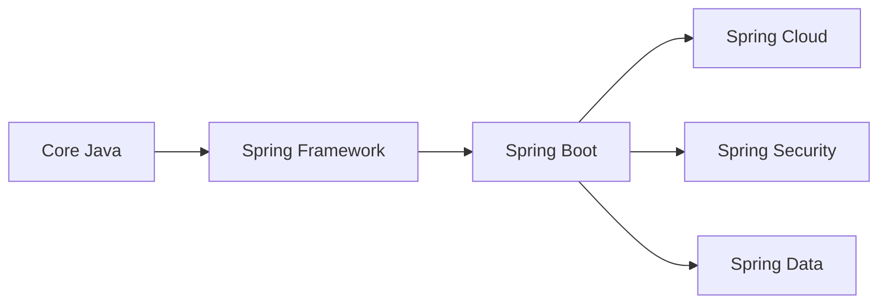

# Java MOC

Java 后端开发知识索引页面。

## Spring 生态系统

### Spring Boot
- [[Springboot/SpringBoot Introduction|SpringBoot Introduction]] - Spring Boot 框架入门与核心概念

### Spring Framework (待创建)
- [[Spring Framework Basics]] - Spring 核心概念：IoC、DI
- [[Spring MVC]] - Web MVC 框架
- [[Spring Security]] - 安全认证与授权
- [[Spring Data JPA]] - 数据持久化

## Java 核心 (待创建)

- [[Java Fundamentals]] - Java 基础语法
- [[Java Collections]] - 集合框架
- [[Java Concurrency]] - 多线程与并发
- [[Java Stream API]] - 函数式编程

## 项目实战

- [[Projects/FreeTrader/index|FreeTrader]] - 交易项目

## 学习路线

## 常用资源

- [Spring 官方文档](https://spring.io/docs)
- [Baeldung Java 教程](https://www.baeldung.com)
- [Java 官方文档](https://docs.oracle.com/en/java/)
