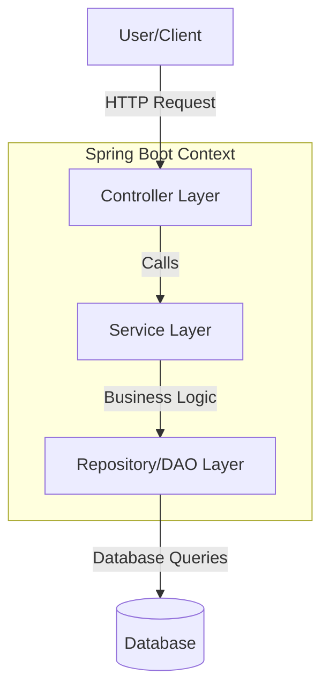

# Spring Boot Introduction

## Overview
**Spring Boot** makes it easy to create stand-alone, production-grade Spring based Applications that you can "just run". It takes an opinionated view of the Spring platform and third-party libraries so you can get started with minimum fuss.

> [!info] Core Philosophy
> Convention over Configuration. Spring Boot sets up defaults for you, so you don't have to define everything from scratch.

## Key Features

1.  **Stand-alone**: Create stand-alone Spring applications.
2.  **Embedded Server**: Embed Tomcat, Jetty or Undertow directly (no need to deploy WAR files).
3.  **Starter Dependencies**: Provide opinionated 'starter' dependencies to simplify your build configuration (e.g., `spring-boot-starter-web`).
4.  **Auto-Configuration**: Automatically configure Spring and 3rd party libraries whenever possible.
5.  **Production-ready**: Provide production-ready features such as metrics, health checks, and externalized configuration.
6.  **No XML**: Absolutely no code generation and no requirement for XML configuration.

## Quick Start Example

A simple "Hello World" web application.

**1. Dependency (Maven `pom.xml`)**
```xml
<parent>
    <groupId>org.springframework.boot</groupId>
    <artifactId>spring-boot-starter-parent</artifactId>
    <version>3.2.0</version>
</parent>
<dependencies>
    <dependency>
        <groupId>org.springframework.boot</groupId>
        <artifactId>spring-boot-starter-web</artifactId>
    </dependency>
</dependencies>
```

**2. Application Class (Java)**
```java
package com.example.demo;

import org.springframework.boot.SpringApplication;
import org.springframework.boot.autoconfigure.SpringBootApplication;
import org.springframework.web.bind.annotation.GetMapping;
import org.springframework.web.bind.annotation.RestController;

@SpringBootApplication
@RestController
public class DemoApplication {

    public static void main(String[] args) {
        SpringApplication.run(DemoApplication.class, args);
    }

    @GetMapping("/hello")
    public String hello() {
        return "Hello Spring Boot!";
    }
}
```

## Architecture Overview



## Why Choose Spring Boot?

| Feature | Benefit |
| :--- | :--- |
| **Speed** | Fast development with less boilerplate code. |
| **Community** | Huge ecosystem and community support. |
| **Integration** | Easy integration with other Spring modules (Security, Data, Cloud). |
| **Microservices** | Ideal for building microservices architectures. |

> [!tip] Learning Path
> If you are new to Java backend, start with **Core Java**, then understand the basics of **Spring Framework** (Dependency Injection, IoC), and finally move to **Spring Boot**.

## Common Starters

- `spring-boot-starter-web`: For building web, including RESTful, applications using Spring MVC. Uses Tomcat as the default embedded container.
- `spring-boot-starter-data-jpa`: For using Spring Data JPA with Hibernate.
- `spring-boot-starter-security`: For using Spring Security.
- `spring-boot-starter-test`: For testing Spring Boot applications with libraries including JUnit, Hamcrest and Mockito.

## Useful Links
- [Official Documentation](https://spring.io/projects/spring-boot)
- [[Java Development]]
- [[Spring Framework Basics]]
