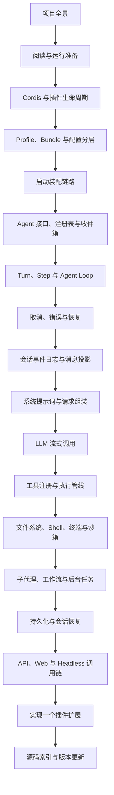

# DeepSeek Harness 学习路线

这套笔记面向熟悉 TypeScript 和 Node.js、但不了解 Cordis 与 DeepSeek Harness 的读者。目标不是记住包名，而是能够从启动入口追踪一次请求，理解每一层保存了什么状态、调用了什么接口、发出了什么事件，并最终能把新功能放到正确的扩展点上。

> [!info] 源码基准
> 全部代码路径、符号和调用关系基于 `master@47f943859bef60e4160492346772ded9b24f765a`。仓库根目录是 `/Users/robot/Documents/Projects/deepseek-harness`。

## 推荐顺序

## 六个学习单元

### 导读

- [[01-项目全景]]：先建立模块分层和运行时数据流。
- [[02-阅读与运行准备]]：准备不依赖 API Key 的源码阅读与运行方法。

### 运行基础

- [[03-Cordis与插件生命周期]]：理解插件、Context、Service、事件和可撤销注册。
- [[04-Profile、Bundle与配置分层]]：理解一棵实际运行的插件树从哪里来。
- [[05-启动装配链路]]：从 CLI 配置进入 `boot()`，直到 Loader 完成挂载。

### Agent 核心

- [[06-Agent接口、注册表与收件箱]]：理解 Agent 的公共操作、所有权和两级输入队列。
- [[07-Turn、Step与Agent Loop]]：追踪一次模型请求和工具续步的完整循环。
- [[08-取消、错误与恢复]]：理解取消信号、错误事件、重试和可恢复状态。

### 模型上下文

- [[09-会话事件日志与消息投影]]：理解为什么日志是模型上下文的唯一事实来源。
- [[10-系统提示词与请求组装]]：理解提示词、动态上下文、工具模式和模型参数如何汇合。
- [[11-LLM流式调用]]：理解适配器选择、SSE 翻译和增量消息组装。

### 能力执行

- [[12-工具注册与执行管线]]：理解工具定义、参数验证、拦截器、并发和结果记录。
- [[13-文件系统、Shell、终端与沙箱]]：理解一组能力如何共享执行环境和权限策略。
- [[14-子代理、工作流与后台任务]]：理解长任务、隔离执行和多 Agent 协作。

### 应用与实践

- [[15-持久化与会话恢复]]：理解写后缓冲、检查点、JSONL 和崩溃恢复。
- [[16-API、Web与Headless调用链]]：比较浏览器与单次命令两种入口如何复用同一核心。
- [[17-实现一个插件扩展]]：按真实项目结构实现服务、工具和配置接入。
- [[18-源码索引与版本更新]]：按主题定位源码，并在版本变化后核对笔记。

## 阅读方法

每篇笔记先回答一个架构问题，再列出生产代码入口。源码片段有两种形式：关键小文件完整展示；大文件只展示连续的关键逻辑段。源码后的解释重点放在输入、输出、状态变化、生命周期、事件顺序和失败路径，不逐行解释普通 TypeScript 语法。

遇到陌生包名时先看它在图中的角色，再打开对应源码。不要从 `packages/` 根目录随机阅读：这个仓库的包很多，但一次请求只沿少数几条稳定链路流动。

> [!tip] 最有效的验证方式
> 读完一篇后，回到源码搜索文中列出的符号，沿导入和调用继续向下一篇的入口移动。完成 [[16-API、Web与Headless调用链]] 后，再做 [[17-实现一个插件扩展]]。

