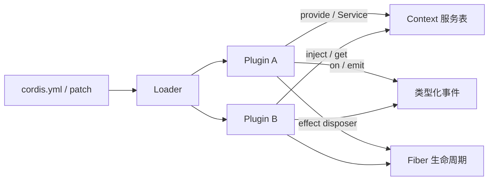
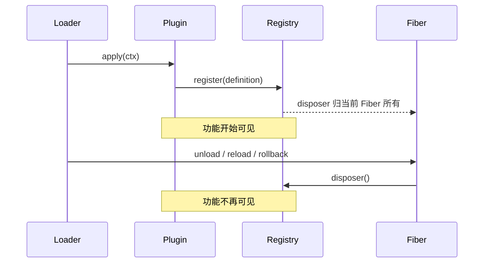

# Cordis 与插件生命周期

## Cordis 在项目中的位置

Cordis 是 DeepSeek Harness 的插件运行框架。它提供 Context、Service、依赖注入、类型化事件和 Fiber 生命周期。Harness 的核心规则“所有功能都是插件”不是口号：Agent Loop、会话仓库、模型运行时、工具注册表、持久化和界面连接都由普通插件挂载。



## 插件的最小结构

生产包通常导出稳定名称、依赖和 `apply()`。下面是 `packages/bundle/headless/src/startup.ts` 的核心结构：

```ts
export const name = 'headless-startup'
export const inject = ['cmdlineArgs']
export const HEADLESS_STARTUP_SERVICE = 'headlessStartup'

export function apply(ctx: Context): void {
  const program = headlessCommand()
  program.action(() => {
    const task = program.args.join(' ')
    if (task.trim() === '') program.error('error: a task is required, for example: dsh --profile headless "run the tests"')
    ctx.provide(HEADLESS_STARTUP_SERVICE, { task } satisfies HeadlessStartupValues)
  })
  parseCmdline(ctx, program)
}
```

`inject` 表示插件激活前必须存在 `cmdlineArgs`。`apply()` 读取命令行后，通过 `ctx.provide()` 发布 `headlessStartup`。Headless Runner 的配置表达式再读取这个服务。服务可用性决定激活时机，配置文件中的行顺序不等于运行顺序。

## Service 与 Context

长期存在的能力通常继承 `Service`，并在构造函数中声明 Context 键。以文件系统接口为例：

```ts
export abstract class FileSystem extends Service {
  constructor(ctx: Context) {
    super(ctx, 'fs')
  }

  abstract resolve(path: string, opts?: { cwd?: string; signal?: AbortSignal }): Promise<FsTarget>
  abstract readText(target: FsTarget, signal?: AbortSignal): Promise<string>
  abstract writeText(
    target: FsTarget,
    content: string,
    expected?: FsWriteIntent,
    signal?: AbortSignal,
    sandboxPolicy?: SandboxExecutionPolicy,
  ): Promise<FsWriteOutcome>
}
```

挂载具体实现后，其他插件通过 `ctx.fs` 使用它。抽象类定义行为，`fs-local` 或远程实现提供行为，工具包消费行为。这种拆分将在 [[13-文件系统、Shell、终端与沙箱]] 中继续展开。

## 依赖注入的两种用法

插件级 `inject` 适用于插件整体没有依赖就不能激活的情况。`ctx.inject([...], callback)` 适用于可选子功能：主服务可以先存在，依赖出现时再注册相关贡献，依赖卸载时自动撤销。

`packages/todo/tool-todo/src/index.ts` 使用后一种方式，仅在投影注册表存在时增加 UI 投影：

```ts
ctx.inject(['sessionProjections'], (projectionCtx) => {
  projectionCtx.sessionProjections.register<'todos', TodoItem[] | null>({
    key: 'todos',
    schema: todosProjectionSchema,
    init: () => null,
    apply: (state, event) => {
      if (event.type === 'todo/write') return event.data.todos
      if (event.type === 'turn/start') return null
      return state
    },
    view: state => state,
    stateVersion: 2,
  })
})
```

因此 Headless 组合可以没有 `sessionProjections`，工具本身仍能工作；Web 组合加载投影服务后，会自动得到 Todo 的可视状态。

## Effect：注册必须可撤销

Harness 中的注册不是一次性修改全局对象。工具注册、事件监听、提示词段和适配器注册都返回 disposer，并由当前 Fiber 所有。Fiber 卸载时，注册自动撤销。

```ts
section(section: PromptSection): () => void {
  if (!Number.isFinite(section.order)) {
    throw new TypeError(`prompt section "${section.name}" order must be a finite number`)
  }
  return this.layers.effect(
    this.ctx,
    layer => layer.sections.insert(section.name, section),
    { label: 'systemPrompt.section()' },
  )
}
```

这里的 `layers.effect()` 同时完成三件事：把条目放入正确的全局或 Agent 作用域；绑定调用者 Fiber；在 Fiber 卸载时删除条目并发布变更通知。



这个模型解释了为什么热重载不需要人工清理旧工具，也解释了为什么 Agent 专属插件能随 Agent 一起销毁。

## 事件：通知与拦截

普通 `emit` 事件用于通知；waterfall 事件用于逐层包装。Waterfall 监听器必须调用 `next()`，否则它会截断下游。

`session/event` 通知已经发生的事实。`agent/request`、`llm/stream`、`tools/execute` 则允许插件在明确位置修改或包裹操作。

```ts
ctx.on('llm/stream', (options, next): AsyncIterable<StreamChunk> => {
  if (options.sessionId === undefined) return next()
  const session = ctx.sessions.get(options.sessionId)
  return session === undefined ? next() : afterCheckpoint(ctx, session, next)
})
```

这个持久化检查点监听器没有实现模型请求。它先确保会话已落盘，再调用 `next()` 进入实际适配器。

## Scope：同一服务中的 Agent 专属视图

全局 Context 上可以注册工具和提示词；`agent.ctx` 则带有该 Agent 的 Scope。注册表在组装时合并全局层和匹配的作用域层，因此同一个 `ToolRuntime` 能为不同 Agent 提供不同工具集合。

这不是复制一套全局服务。作用域保留共享注册表，只改变某次查找和事件分发能看到哪些贡献。具体实现见 [[06-Agent接口、注册表与收件箱]] 和 [[10-系统提示词与请求组装]]。

## 下一步

Cordis 说明了插件“如何存在”，下一篇 [[04-Profile、Bundle与配置分层]] 说明“本次运行选择了哪些插件”。

