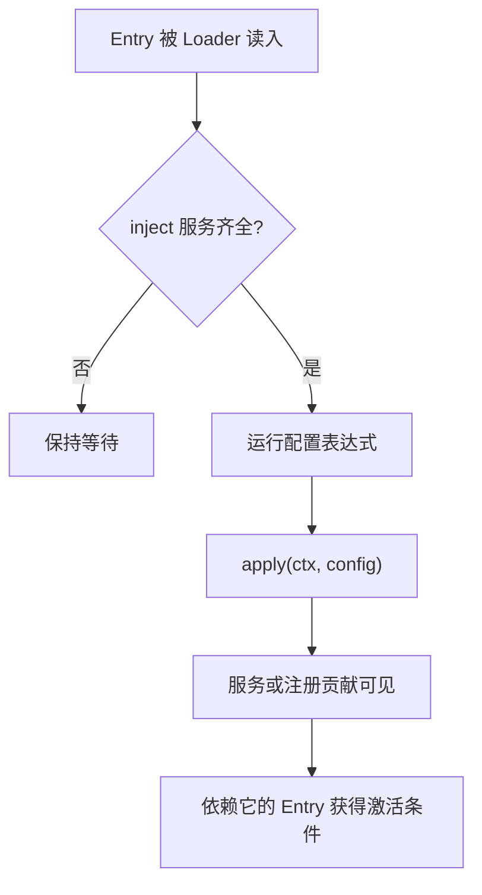

# Profile、Bundle 与配置分层

## 三个概念

Profile 是用户选择的运行组合，例如 `web` 或 `headless`。Bundle 是可分发的配置层，例如所有 Profile 共用的 `dsh-base`。Patch 是对插件条目的插入或替换。启动时以空条目列表为起点，依次应用 Bundle、Profile 用户补丁、Home 级补丁和命令行覆盖。


后面的层可以按 `id` 定位前面的条目。Patch 替换目标条目的完整 `config`，不是深度合并，因此覆盖层必须重述该条目需要保留的配置字段。

## Profile 的加载源码

源码：`packages/boot/app-boot/src/profile.ts`，`loadProfile()`。

```ts
export function loadProfile(
  binName: string, name: string, installAnchor: string, home: string = resolveDshHome(),
  options: { userLayer?: boolean } = {},
): Profile {
  const dir = resolveProfileDir(name, home)
  if (!existsSync(join(dir, 'package.json'))) {
    const template = PROFILE_TEMPLATES[name]
    if (template === undefined) {
      throw new Error(
        `${binName}: profile ${JSON.stringify(name)} does not exist; create it with 'dsh plugin --profile ${name} add <package>'`,
      )
    }
    initProfile(dir, template)
  }
  const manifest = normalizeShippedProfile(name, dir, readProfileManifest(binName, dir))
  const bundles = manifest.dsh?.profile?.bundles ?? []
  const layers = bundles.map((packageName): ProfileLayer => {
    const packageDir = resolveBundleDir(binName, packageName, installAnchor, dir)
    const bundleManifest = JSON.parse(readFileSync(join(packageDir, 'package.json'), 'utf8')) as ProfileManifest
    const declared = bundleManifest.dsh?.bundle?.patch
    if (declared === undefined) {
      throw new Error(`${binName}: profile bundle ${JSON.stringify(packageName)} declares no dsh.bundle in its package.json`)
    }
    const patchPath = join(packageDir, declared)
    return { packageName, packageDir, patchPath, patches: loadOverlayPatches(binName, patchPath) }
  })
  const patchPath = join(dir, PROFILE_PATCH_FILENAME)
  const patches = options.userLayer !== false && existsSync(patchPath)
    ? loadOverlayPatches(binName, patchPath)
    : []
  return { name, dir, layers, patchPath, patches }
}
```

函数先定位 Profile 目录，不存在时只允许从内置模板初始化。随后读取 Profile manifest 中列出的 Bundle，为每个 Bundle 解析 `package.json` 里的 `dsh.bundle.patch`，最后读取用户自己的 `cordis.patch.yml`。Bundle 未声明 Patch 会立即失败，不会静默得到空层。

## 合成算法

同文件的 `composeEntries()` 很短，完整逻辑如下：

```ts
export function composeEntries(
  layers: readonly PatchOptions[][], warn: (message: string) => void = () => {},
): EntryOptions[] {
  return applyEntryPatches([], structuredClone(layers.flat()), (message: string, ...args: unknown[]) => {
    let index = 0
    warn(message.replace(/%C/g, () => JSON.stringify(args[index++])))
  })
}
```

合成从空数组开始。所有层先按顺序展开，再一次性交给 `applyEntryPatches()`。`structuredClone()` 防止 Loader 后续处理修改调用者持有的 Patch 数据。配置导出与真实启动使用同一套合成函数，所以 `--dump-config` 能代表实际挂载内容。

## Base Bundle 与模式 Bundle

`packages/bundle/base/cordis.patch.yml` 插入共享能力，包括 LLM、Session、Agent、工具、持久化、文件系统、Shell、权限和遥测。它是所有 Profile 的第一层。

Headless Bundle 只增加命令行任务提供者和单次 Runner：

```yaml
- insert:
    - id: headless-startup
      name: '@deepseek-ai/dsh-headless/startup'

    - id: headless-runner
      name: '@deepseek-ai/dsh-headless'
      inject: [headlessStartup]
      config:
        task: !!js ctx.headlessStartup.task
```

`!!js` 表达式在注入准备完成的 Context 上执行，因此 Runner 的 `task` 来源不是 Loader 特例，而是普通服务 `ctx.headlessStartup`。

Web Bundle 增加 WebServer、连接、Typert Remote、客户端模块和界面插件。同时它会禁用 Base 中的部分全局 Agent 工具，让这些工具改由 Agent Preset 在每个会话的作用域内挂载。

## 配置行顺序不表示依赖顺序

条目 `inject` 和插件导出的依赖决定何时激活。配置中的分组和顺序主要服务于阅读与 Patch 定位。一个后写的行可以先激活，只要它的依赖已经存在；一个先写的行也会等待缺失服务。



## 如何定位配置来源

看到一个运行时服务时，先在 Bundle Patch 中按包名或条目 `id` 搜索，再检查后续模式层是否覆盖同一 `id`。若 `--dump-config` 与 Base 文件不同，差异通常来自模式 Bundle、Profile 用户补丁或命令行 Overlay。

下一篇 [[05-启动装配链路]] 从有效配置继续进入真正的 Context 和 Loader。

