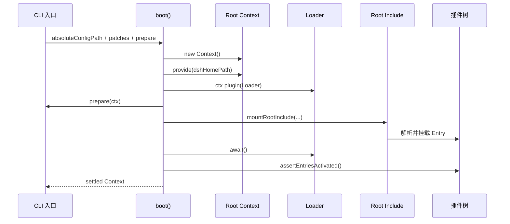
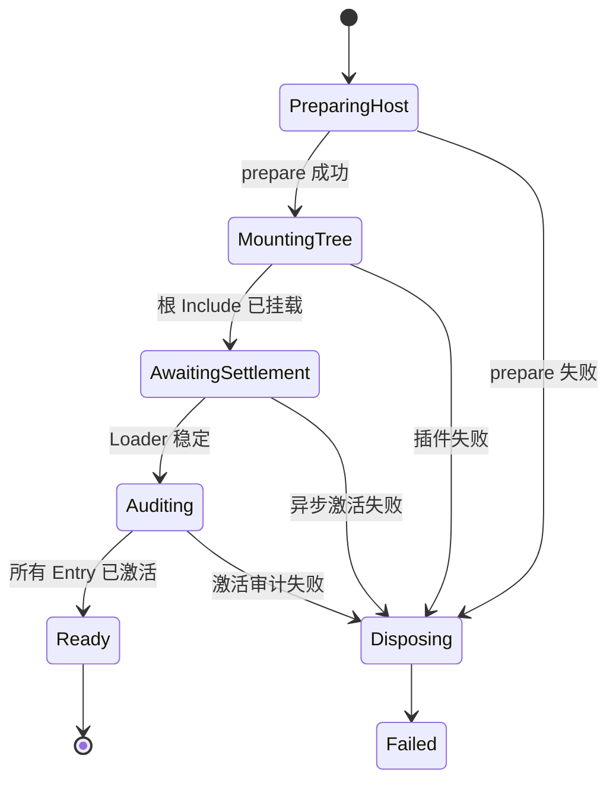

# 启动装配链路

## 从配置路径到稳定插件树

启动的核心实现位于 `packages/boot/app-boot/src/index.ts`。入口程序先解析配置路径、环境与 Profile 层，再调用 `boot()`。`boot()` 创建根 Context、安装 Loader、执行宿主准备、挂载根 Include，等待全部 Entry 稳定，并审计是否存在激活失败。



## `boot()` 源码

下面是主逻辑的连续源码段：

```ts
export async function boot(
  binName: string,
  absoluteConfigPath: string,
  patches?: PatchOptions[],
  prepare?: (ctx: Context) => Promise<void> | void,
  bareModuleBaseUrl?: string,
): Promise<Context> {
  const ctx = new Context()
  let stage = 'host preparation failed'
  try {
    ctx.baseUrl = pathToFileURL(dirname(absoluteConfigPath)).href + '/'
    ctx.provide('dshHomePath', dshHomePath)
    await ctx.plugin(Loader)
    await prepare?.(ctx)
    stage = 'plugin tree failed to load'
    await mountRootInclude(ctx, absoluteConfigPath, patches, bareModuleBaseUrl)
    await ctx.get('loader')?.await()
    if (ctx.get('loader') === undefined) return ctx
    await assertEntriesActivated(ctx, binName)
    return ctx
  } catch (cause) {
    await ctx.fiber.dispose()
    const detail = cause instanceof Error ? cause.message : String(cause)
    let deepest: unknown = cause
    while (deepest instanceof Error && deepest.cause !== undefined) deepest = deepest.cause
    const stack = deepest instanceof Error && deepest !== cause ? `\n${deepest.stack ?? deepest.message}` : ''
    throw new Error(`${binName}: ${stage}: ${detail}${stack}`, { cause })
  }
}
```

### Context 的基准目录

`ctx.baseUrl` 指向配置文件所在目录。相对插件路径以此解析；裸包名通常也从配置项目解析。打包后的封闭运行时可以传入 `bareModuleBaseUrl`，明确由宿主安装位置解析裸包。

### 宿主准备早于插件树

`prepare(ctx)` 在任何配置 Entry 挂载前运行。启动器在这里提供只有宿主知道的值，例如退出函数、命令行参数或预先确定的 Agent 身份。这些值不是普通 YAML 静态配置能可靠表达的。

### Loader settlement

`mountRootInclude()` 返回表示根 Include 已挂载，但兄弟 Entry 仍可能异步激活。`ctx.loader.await()` 等待整棵树稳定。随后 `assertEntriesActivated()` 检查启用的 Entry 是否真正进入 Active 状态，避免“配置读取成功但插件实际失败”被误报为启动成功。

### 提前退出

Headless Runner 可能在启动收尾时完成任务并销毁根树。此时 Loader 服务已经随树卸载，`ctx.get('loader')` 返回 `undefined`。`boot()` 把它视为应用按要求退出，而不是访问已经销毁的服务并制造新错误。

## 失败回滚

错误处理先 `await ctx.fiber.dispose()`，撤销已挂载的服务、监听器和注册，再包装原始错误。错误标签区分宿主准备失败和插件树失败，最深层 cause 的堆栈也被保留。



回滚依赖上一章的 Effect 规则：如果插件注册工具、事件或服务时没有绑定 Fiber，`ctx.fiber.dispose()` 就无法完整清理。因此“注册是 effect”是启动事务能够可靠失败的前提。

## Headless 如何等待装配完成

`packages/bundle/headless/src/index.ts` 的 `run()` 在创建 Agent 前再次等待 Loader：

```ts
async function run(ctx: Context, task: string, io: HeadlessIo): Promise<void> {
  await ctx.get('loader')?.await()
  const agents = ctx.get('agents')
  const defaultModel = ctx.get('agentDefaultModel')
  const sessions = ctx.get('sessions')
  if (agents === undefined || defaultModel === undefined || sessions === undefined) return
  // 创建 Agent、发送任务、等待空闲、刷新会话并退出……
}
```

原因是 Loader 会并发挂载兄弟 Entry。Runner 自己被激活并不代表所有工具和适配器都已完成注册；等待整棵树后再创建 Agent，才能保证 Agent 的作用域组装看到完整能力集合。

## 下一步

根插件树稳定后，入口通过 `ctx.agents` 创建或恢复 Agent。下一篇 [[06-Agent接口、注册表与收件箱]] 解释 Agent 的公共接口、所有权和输入队列。

