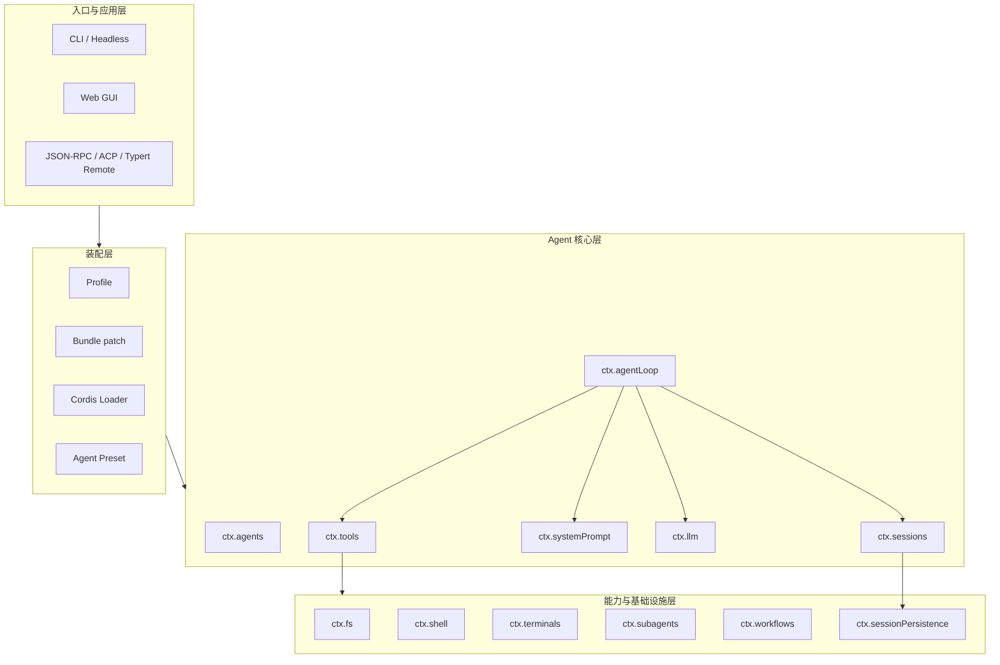
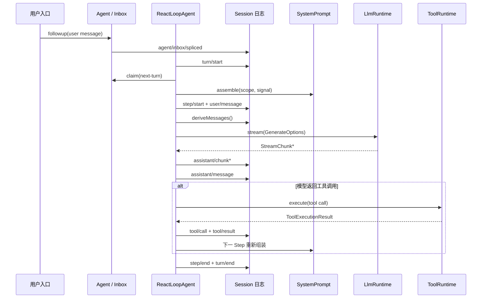

# DeepSeek Harness 项目全景

## 本篇解决的问题

DeepSeek Harness 不是一个把所有逻辑集中在“主程序”里的应用。它把模型、Agent 循环、工具、文件系统、持久化、API 和界面都实现为 Cordis 插件。启动时，配置把插件装配成一棵树；运行时，各插件通过 Context 中的服务与类型化事件协作。

理解整个项目可以先抓住三条主线：插件如何装配、一次请求如何执行、执行事实如何记录。

## 四层结构

入口层决定用户如何提交工作，但不复制 Agent 实现。Headless 创建 Agent 后发送一条消息；Web 通过连接层调用 Host 侧服务并订阅事件。两种入口最终都使用 `ctx.agents`、会话日志、提示词组装、LLM 和工具运行时。

装配层决定“本次运行有哪些插件”。Profile 是用户选择的运行组合，Bundle 是可分发的配置补丁，Loader 把最终配置变成插件树。Web 还会把部分插件放进每个 Agent 的独立 Preset，使不同会话可以拥有不同工具和提示词。

核心层负责 Agent 的行为。`AgentRegistry` 管理存活 Agent，`ReactLoopAgent` 驱动 Turn 和 Step，`Session` 保存事件，`SystemPrompt` 组装模型输入，`LlmRuntime` 路由模型适配器，`ToolRuntime` 执行工具。

能力层提供可替换实现。例如文件系统的接口、宿主机实现和模型工具属于不同包。替换提供者时，工具消费者不需要改写。

## 一次请求的数据流

这条链路体现了三个重要事实。

第一，输入先进入 Inbox，不直接调用模型。Inbox 有 `next-turn` 与 `next-step` 两类队列，决定消息开启新 Turn，还是加入当前 Turn 的下一个 Step。

第二，每次模型请求都从 Session 日志重新推导历史。Agent Loop 不维护另一份隐藏的对话数组，因此恢复、分叉、压缩和重放都能从同一事件流工作。

第三，工具不是模型适配器内部逻辑。模型只产生 `tool-call` 内容块，Agent Loop 把它们交给 `ToolRuntime`，执行结果再写回 Session，下一 Step 才把结果交给模型。

## 目录与职责

| 目录 | 阅读时关注什么 |
|---|---|
| `packages/core/` | Session、SystemPrompt、Tools、Agent、Agent Loop 和作用域 |
| `packages/boot/`、`packages/bundle/` | 启动、Profile、Bundle 和应用组合 |
| `packages/llm/` | 通用模型接口、适配器注册、流式协议与 DeepSeek 实现 |
| `packages/fs/`、`shell/`、`terminal/`、`sandbox/` | 能力接口、提供者、工具消费者和安全策略 |
| `packages/subagent/`、`workflow/`、`jobs/` | 并行、隔离、子 Agent 和后台生命周期 |
| `packages/session/` | 持久化、投影、查询、标题和遥测 |
| `packages/api/`、客户端相关包 | Host/Client 类型映射、RPC 与浏览器连接 |
| `examples/` | 已装配的真实运行入口，不是独立的核心实现 |
| `vendor/` | 固定版本的 Cordis 源码；学习框架内部时再进入 |

## 三类扩展点

### 服务注册

服务适合“只有一个当前实现”或“由注册表管理多个实现”的长期能力。例如 `ctx.sessions` 是一个服务；`ctx.llm` 又在服务内部注册多个模型适配器。

### 类型化事件

事件适合观察或拦截正在发生的操作。`agent/request`、`llm/stream`、`tools/execute` 是 waterfall：监听器必须调用 `next()` 才会继续下游。`session/event` 是事实通知，持久化和界面投影都消费它。

### 可撤销注册

提示词段、工具、适配器和事件监听都随插件生命周期存在。插件卸载时，Cordis effect 调用 disposer，撤销注册。这个机制让热重载、Agent 专属工具和失败回滚成为同一种生命周期操作。

## 继续阅读

下一篇先准备可验证的阅读环境：[[02-阅读与运行准备]]。随后用 [[03-Cordis与插件生命周期]] 理解所有包共同使用的框架规则。
