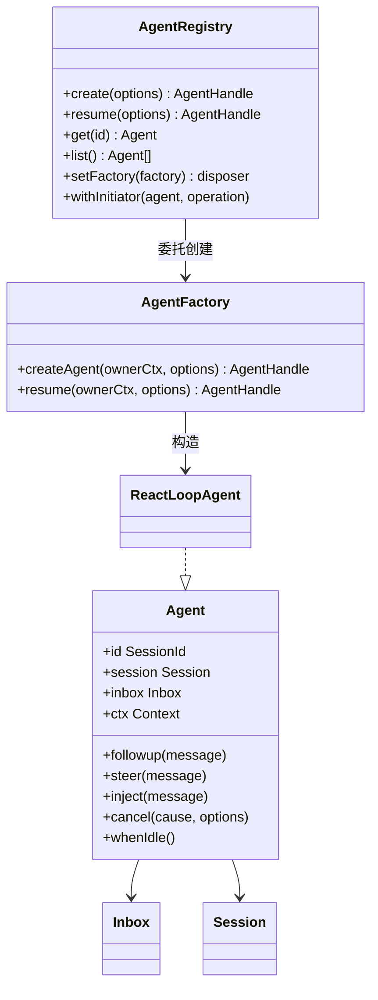
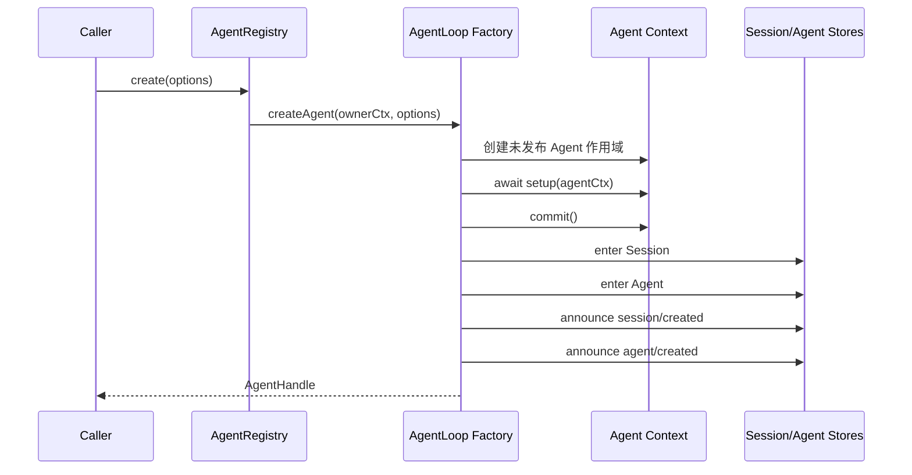

# Agent 接口、注册表与收件箱

## 三个彼此分离的职责

`@deepseek-ai/dsh-agent` 定义 Agent 接口、注册表和事件；`@deepseek-ai/dsh-agent-loop` 提供创建工厂和默认驱动实现；`@deepseek-ai/dsh-session` 保存 Agent 的持久事实。接口包不依赖具体循环，因此入口、API 和子代理代码只需要面向 `ctx.agents` 编程。



## Agent 的公共操作

源码：`packages/core/agent/src/runtime-types.ts`。

```ts
export interface Agent {
  readonly id: SessionId
  readonly options: AgentOptions
  readonly session: Session
  readonly inbox: Inbox
  readonly status: AgentStatus
  readonly ctx: Context

  cancel(cause: AgentCancelCause, options?: CancelOptions): void
  whenIdle(): Promise<void>
  runMaintenance<T>(task: (signal: AbortSignal) => Promise<T>): Promise<T>
  send(message: UserMessage, target: InboxTarget, wakeup: boolean): void
  followup(message: UserMessage): void
  steer(message: UserMessage): void
  inject(message: UserMessage): void
}
```

`id` 与 `session.id` 必须相同。`ctx` 是 Agent 专属 Context，注册在这里的提示词、工具和监听器只对该 Agent 可见，并在 Agent 销毁时撤销。

三种输入方法的差异不是命名风格，而是调度语义：

| 方法 | 目标队列 | 是否唤醒 | 用途 |
|---|---|---|---|
| `followup()` | `next-turn` | 是 | 普通用户消息，单独开启后续 Turn |
| `steer()` | `next-step` | 是 | 尽快加入当前 Turn 的下一次模型请求 |
| `inject()` | `next-step` | 否 | 添加上下文，但不单独触发模型运行 |

## AgentRegistry 只管理存活对象

`AgentRegistry` 是 `ctx.agents`。它保存实时 Agent、注册创建工厂，并通过 `AsyncLocalStorage` 传递“当前异步调用链由哪个 Agent 发起”。它不实现 Agent Loop，也不负责持久化。

创建调用的关键委托如下：

```ts
async create(options: CreateAgentOptions): Promise<AgentHandle> {
  const ownerCtx = this.ctx
  const { target } = this.requireFactory()
  const receiver = getTraceable(ownerCtx, target)
  return Reflect.apply(target.createAgent, receiver, [ownerCtx, options])
}
```

调用者 Context 被显式传给工厂，因此新 Agent 的生命周期属于创建者，而不是固定属于注册工厂的插件。返回的 `AgentHandle` 同时携带 Agent 和 `dispose()`；只有持有 Handle 的消费者拥有主动销毁它的能力。

### 创建事务

`CreateAgentOptions.setup` 在 Agent 和 Session 对外发布前运行。Preset、工具限制、模型选择和 Agent 专属提示词都在这里装配。只有 setup 及其可选 `commit()` 完成后，工厂才依次发布 Session 和 Agent。



setup 失败时，外部观察者不会看见半配置 Agent。发布过程中失败时，已经产生的创建通知会由对应的 disposed 通知配对，然后整个 Effect 逆序回滚。

## Inbox 是会话日志的增量投影

源码：`packages/core/agent/src/inbox.ts`。Inbox 内存里有两组消息，但每次修改先写入 `agent/inbox/spliced` 会话事件。

```ts
private readonly state: InboxState = { 'next-turn': [], 'next-step': [] }

constructor(
  private readonly session: Session,
  private readonly notifications: InboxNotifications,
) {
  for (const event of session.events.slice(session.header.seedLength ?? 0)) {
    if (event.type !== 'agent/inbox/spliced') continue
    try {
      this.apply(event.data)
    } catch (error: unknown) {
      throw new Error(`invalid persisted inbox splice at session seq ${event.seq}`, { cause: error })
    }
  }
}
```

恢复 Agent 时，构造函数重放日志中属于当前 Session 生命周期的 splice，重建尚未被消费的消息。因此排队但未进入模型的输入不会因为进程重启而凭空消失。

### Claim 顺序

```ts
claim(target: InboxTarget, turn: number): UserMessage[] {
  const claimed = this.mutate('next-step', 0, this.nextStep.length, [], false)
  if (target === 'next-turn') {
    claimed.push(...this.mutate('next-turn', 0, 1, [], false))
  }
  for (const message of claimed) this.notifications.claimed(message, turn)
  return claimed
}
```

每个 Step 先取走全部 `next-step` 消息；若这是 Turn 的第一个 Step，再取一条 `next-turn` 消息。因此多个注入上下文会与下一条普通消息一起进入请求，而多条普通 Follow-up 保持一个 Turn 一条的顺序。

### 先记录，后修改

`mutate()` 先规范化 splice 坐标、验证消息 ID 不重复，再调用 `session.append()`，最后才修改内存数组。同步 `session/event` 观察者看到的是修改前队列和一条足以重放修改的事件。若日志写入失败，内存队列不会先行变化。

## Initiator 与 Agent Scope 不是一回事

`agent.ctx.agent` 表示“这个 Context 属于哪个 Agent”；`ctx.agents.currentInitiator()` 表示“当前异步执行链由哪个 Agent 发起”。子 Agent 的 setup 中，Context 归子 Agent，但 Initiator 可能仍是父 Agent。前者用于作用域选择，后者用于因果归属和权限审计，两者不能互相替代。

下一篇 [[07-Turn、Step与Agent Loop]] 进入 `ReactLoopAgent`，观察 Inbox 内容如何变成 Turn、Step 和模型请求。

