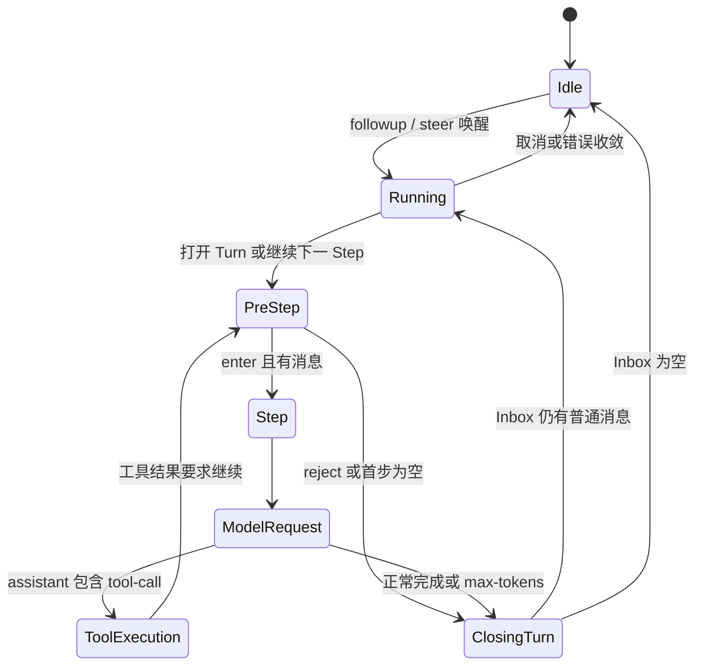

# Turn、Step 与 Agent Loop

## Turn 和 Step 的精确定义

一个 Step 是一次模型请求，以及该响应要求执行的全部工具。一个 Turn 从接纳一条普通输入开始，可以包含多个 Step：模型调用工具后，工具结果推动下一个 Step；工具不再产生后续请求时，Turn 结束。

源码主入口：`packages/core/agent-loop/src/agent.ts` 的 `ReactLoopAgent`。



## 驱动器如何启动

`followup()`、`steer()` 和 `inject()` 最终进入 `send()`。只有 `wakeup=true` 才会调用 `wakeDriver()`。

```ts
send(message: UserMessage, target: InboxTarget, wakeup: boolean): void {
  const wakingAfterAbort = wakeup && this.phase.kind !== 'idle' && this.phase.abort.signal.aborted
  const resolvedTarget = wakingAfterAbort ? 'next-turn' : target
  this.inbox.splice(resolvedTarget, Infinity, 0, [message])
  if (wakeup) this.wakeDriver(wakingAfterAbort)
}

followup(input: UserMessage): void {
  this.send(input, 'next-turn', true)
}

steer(input: UserMessage): void {
  this.send(input, 'next-step', true)
}

inject(input: UserMessage): void {
  this.send(input, 'next-step', false)
}
```

如果当前活动已经被取消，新到的唤醒输入会改投 `next-turn`，等待旧活动收敛后开启干净的新 Turn，避免把新任务塞进已取消的 Step。

`wakeDriver()` 把 phase 从 `idle` 改成 `running`，建立新的 `AbortController`，再通过 `ctx.agents.withInitiator(this, () => this.kick())` 启动异步循环。这样整个驱动链能读取当前 Initiator。

## Pre-Step：接纳输入和组装上下文

```ts
private async preStep(target: InboxTarget, position: { turn: number; step: number }): Promise<PreparedStep> {
  if (this.phase.kind !== 'running') throw new Error(`agent "${this.id}": pre-step outside running phase`)
  const signal = this.phase.abort.signal
  const claimed = this.inbox.claim(target, position.turn)
  const assembly = await this.loopCtx.systemPrompt.assemble(assembleContextFor(this, signal))
  signal.throwIfAborted()
  const sections = renderContextSections(assembly)
  const context = this.runtimeContext.project(joinContextSections(sections), sections)
  const decision = await this.dispatch.waterfall(
    'agent/pre-step', { messages: claimed, ...position, signal },
    (): Promise<PreStepDecision> => Promise.resolve<PreStepDecision>({
      kind: 'enter',
      messages: context === undefined ? claimed : [...claimed, context],
    }),
  )
  signal.throwIfAborted()
  return decision.kind === 'reject' ? decision : { ...decision, assembly }
}
```

顺序很重要：先从 Inbox claim，再组装提示词和动态上下文，然后运行 `agent/pre-step` waterfall。监听器可以拒绝本 Step，或改写将进入日志的消息。动态上下文不是隐藏参数；它被投影为 `user/message` 候选，只有内容变化时才追加。

## Turn 主循环

`turn()` 在 claim 之前就写 `turn/start`。即使 pre-step 拒绝或输入被改成空数组，Session 仍记录一次已尝试但未产生模型请求的 Turn。

```ts
this.session.append('turn/start', { turn })
phase.turn = turn
let turnEnds: TurnEndReason | null = null
let target: InboxTarget = 'next-turn'
try {
  while (true) {
    const step = phase.step + 1
    const decision = await this.preStep(target, { turn, step })
    if (decision.kind === 'reject') {
      turnEnds = { kind: 'blocked' }
      return false
    }
    if (phase.step === 0 && decision.messages.length === 0) {
      turnEnds = { kind: 'completed' }
      return false
    }
    this.session.append('step/start', { turn, step })
    phase.step = step
    try {
      for (const message of decision.messages) {
        this.session.append('user/message', message, { surfaceOp: 'append' })
      }
      const stepEnd = await this.step(decision.assembly)
      if (turnEnds === null || turnEnds.kind !== 'max-tokens') turnEnds = stepEnd
    } finally {
      this.session.append('step/end', { turn, step })
    }
    if (turnEnds && this.inbox.nextStep.length === 0) {
      await this.dispatch.serial('agent/turn-stopping', { turn, signal })
    }
    if (turnEnds && this.inbox.nextStep.length === 0) break
    target = 'next-step'
  }
} finally {
  this.session.append('turn/end', { turn, reason: turnEnds! })
}
```

`step/end` 位于 `finally`，所以 Step 内发生请求错误或工具错误时，已经打开的 Step 仍得到闭合事件。外层 `turn/end` 也位于 `finally`，记录完成、阻塞、取消、错误或 token 上限等终止原因。

`agent/turn-stopping` 在看似即将结束、且 `next-step` 为空时执行。监听器可以同步注入新的下一步内容，使 Turn 延续；它是串行事件，不使用 `next()`。

## Step：模型响应与工具续步

```ts
private async step(assembly: PromptAssembly): Promise<StepEndReason | null> {
  const { turn, step, abort: { signal } } = this.phase
  const system = renderPrompt(assembly)

  while (true) {
    const { request, preparedCall } = await this.buildRequest(
      turn, step, assembly.tools, system, this.session.deriveMessages(), signal,
    )
    const assembler = new BlockAssembler()
    const chunkSeqs: number[] = []
    const stream = preparedCall?.stream(request) ?? this.loopCtx.llm.stream(request)
    for await (const chunk of stream) {
      chunkSeqs.push(this.session.append('assistant/chunk', { turn, step, chunk }).seq)
      assembler.push(chunk)
    }
    const finish = assembler.finish
    // 错误恢复省略，见下一篇
    const message = createAssistantMessage({
      content: assembler.blocks(),
      source: { provider: request.provider, model: request.model },
    })
    this.session.append('assistant/message', { turn, step, message }, {
      surfaceOp: 'append', sourceEventSeqs: chunkSeqs,
    })
    if (finish.kind === 'max-tokens') return { kind: 'max-tokens' }
    const toolCalls = message.content.filter(block => block.type === 'tool-call')
    if (toolCalls.length === 0) return { kind: 'completed' }
    const { concluded } = await executeToolCalls(/* ... */)
    return concluded ? { kind: 'completed' } : null
  }
}
```

每个原始 Chunk 先写日志，再推入 `BlockAssembler`。最终 `assistant/message` 通过 `sourceEventSeqs` 指向组成它的 Chunk。没有工具调用时 Step 和 Turn 可以完成；有工具调用时执行工具并返回 `null`，表示 Turn 尚未结束，外层循环进入下一 Step。

## 为什么每个 Step 都重新组装

工具注册、Agent Scope、提示词上下文、模型选择和设置都可能在两个 Step 之间变化。循环不会在 Turn 开始时冻结整个会话配置，而是在每个 Step 的 pre-step 和 buildRequest 阶段重新解析当前有效值，同时把实际请求头记录到 Session，保证重放知道模型当时看到了什么。

下一篇 [[08-取消、错误与恢复]] 专门分析这条循环如何在取消、模型失败和工具失败下保持日志闭合。

