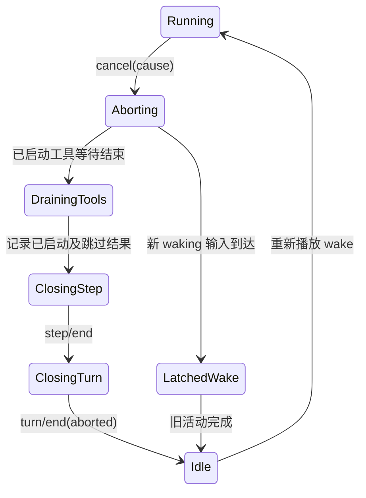

# Agent 取消、错误与恢复

## 一个活动只有一条取消信号

`ReactLoopAgent` 的运行 phase 持有 `AbortController`。Pre-step、提示词组装、模型请求和工具执行共享其 `signal`。`cancel()` 默认先清空 Inbox，再中止当前活动；`keepInbox` 可以保留尚未接纳的工作。

```ts
cancel(cause: AgentCancelCause, options: CancelOptions = {}): void {
  if (!options.keepInbox) {
    this.inbox.clear()
    if (this.phase.kind !== 'idle') this.phase.wakeRequested = false
  }
  if (this.phase.kind !== 'idle') this.phase.abort.abort(cause)
}
```

Agent 空闲时取消是无操作，不会让下一次请求一开始就处于 aborted。`AbortController.abort()` 只接受第一次 cause，因此同一活动的终止原因保持稳定。

## 取消后的收敛



取消不会粗暴丢弃已经写入日志的 `tool/call`。工具调度器停止启动新调用，等待已启动调用收敛，并为未开始的调用写入“aborted before dispatch”结果，使每个已记录调用都有可重放的结果。

## Turn 如何记录取消和未知错误

`turn()` 的 catch 把取消和普通失败分开：

```ts
} catch (error: unknown) {
  if (signal.aborted) {
    turnEnds = { kind: 'aborted', reason: signal.reason as AgentCancelCause }
    throw error
  }
  turnEnds = {
    kind: 'error',
    error: error instanceof LlmError
      ? error.failure
      : { message: errorChain(error), code: 'UNKNOWN' },
  }
  this.throwError(error)
} finally {
  this.session.append('turn/end', { turn, reason: turnEnds! })
}
```

模型错误保留 `LlmError.failure` 中的稳定代码、状态和提供者信息；其他异常用 `errorChain()` 展开 cause 链，并归类为 `UNKNOWN`。`throwError()` 先发布实时 `agent/error`，再抛到 driver 边界。最终 `kick()` 包含失败，让单个 Turn 不会形成未处理 Promise rejection，但详细事实已经进入事件和日志。

## 模型流失败与重试

`step()` 把流式 Chunk 交给 `BlockAssembler`。终止块为 `error` 或 `aborted` 时，先通过 `agent/request-error` waterfall 询问是否由某个恢复插件重试：

```ts
if (finish.kind === 'error' || finish.kind === 'aborted') {
  const action = await this.dispatch.waterfall(
    'agent/request-error', {
      turn,
      step,
      provider: request.provider,
      failure: finish.failure,
      retryPolicy: preparedCall?.retryPolicy,
      signal,
    },
    () => Promise.resolve<RequestErrorAction>(undefined),
  )
  signal.throwIfAborted()
  if (action?.kind !== 'retry') {
    throw new LlmError(finish.failure.message, finish.failure.code, finish.failure)
  }
  continue
}
```

重试发生在同一个 Step 的内部 `while (true)`，不会重新写 `step/start`，也不会重复接纳用户消息。已经到达的失败 Chunk 留在日志中，后续成功尝试继续追加 Chunk，最终消息的 `sourceEventSeqs` 只引用组成成功消息的那批 Chunk。

`PreparedLlmCall` 携带适配器针对该模型解析出的重试策略，因此恢复插件不需要重新猜测提供者能力。

## 工具调度失败与工具结果错误不同

工具自身返回 `isError: true` 是模型可见结果，正常写入 `tool/result`，下一个 Step 可以根据错误文本继续处理。调度器内部异常则表示运行时无法可靠完成调用顺序，它会停止补充新调用，等待已经派发的调用结束，然后拒绝整个 Step，不伪造后续结果。

这一区分保证日志不说谎：只有确定“调用因取消而未派发”时才生成合成结果；未知调度异常不会假装工具已经返回一个普通错误。

## 持久化恢复处理进程崩溃

运行时取消会主动写 `step/end` 和 `turn/end`。进程崩溃时来不及执行 finally，持久化层在冷加载时检测完整但未闭合的尾部，补充缺失工具结果、Step 和 Turn 结束事件，原因标记为 `interrupted`。若最后一条物理记录本身撕裂，只丢弃该不完整记录，不重写已经提交的事件。

这部分在 [[15-持久化与会话恢复]] 详解。

## 维护任务

`runMaintenance()` 只允许从真正 idle phase 开始，用于压缩等不属于普通 Turn 的工作。维护期间 Agent 的公共 `status` 仍是 `idle`，但 `whenIdle()` 会等待维护完成；新 waking 输入先进入 Inbox，待维护结束后启动 Driver。取消信号同样可以中止维护任务。

## 检查错误路径时应问的问题

- 失败发生前哪些事件已经写入？
- 打开的 Step 和 Turn 是否一定闭合？
- 取消是否阻止新副作用开始？
- 已经开始的异步操作由谁等待和清理？
- 错误是模型可见结果、实时通知，还是会话终止原因？

下一单元从日志本身开始：[[09-会话事件日志与消息投影]]。

