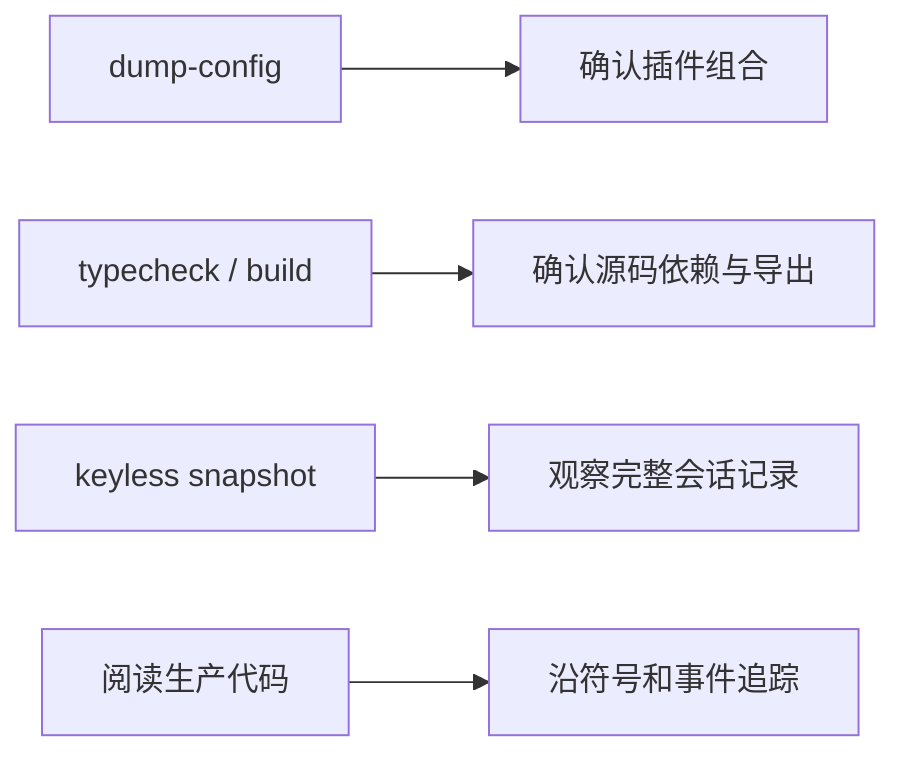

# 阅读与运行准备

## 环境要求

仓库要求 Node.js `^22.19` 或 `>=24`，使用 pnpm workspace。所有包采用 ESM，源码局部导入保留 `.ts` 后缀。阅读时不要把构建产物 `lib/` 当作源码入口；生产实现位于各包的 `src/`。

```sh
cd /Users/robot/Documents/Projects/deepseek-harness
pnpm install
```

安装依赖需要网络，但核心学习路径不依赖 `DEEPSEEK_API_KEY`。没有密钥时仍可查看配置树、阅读源码、构建、类型检查，以及运行仓库提供的 keyless 快照或自跳过的真实 API 路径。

## 首先查看实际插件树

```sh
pnpm dsh --profile headless --dump-config
pnpm dsh --profile web --dump-config
```

输出不是静态包清单，而是 Profile、Bundle、用户补丁和命令行覆盖合成后的有效配置。学习 [[04-Profile、Bundle与配置分层]] 时，应把这个结果与以下文件对照：

- `packages/bundle/base/cordis.patch.yml`
- `packages/bundle/headless/cordis.patch.yml`
- `packages/bundle/web-app/cordis.patch.yml`

## 不依赖密钥的观察路径



建议在阅读每篇笔记时使用 `rg` 搜索文中列出的类和函数。例如：

```sh
rg -n "class ReactLoopAgent|private async turn|private async step" packages/core/agent-loop/src
rg -n "class Session|deriveMessages|append<T" packages/core/session/src
rg -n "class ToolRuntime|register\(|execute\(" packages/core/tools/src
```

## 选择正确的源码面

一个包可能有多个 TypeScript 编译面：Host、Client 或 Remote 类型导出。阅读运行逻辑时优先看普通 `src/index.ts`；阅读浏览器通信时再看 `src/client/`、`remote` 导出和对应类型文件。不要因为同名类型在客户端出现，就认为浏览器直接持有 Host 侧 Service。

## 阅读记录方法

每追踪一条调用链，记录四项：调用者、被调用者、状态写入点、失败或取消点。以下形式比“这个函数调用了另一个函数”更有用：

| 问题 | 示例 |
|---|---|
| 谁拥有操作？ | Agent Handle 的持有者拥有 Agent 的销毁能力 |
| 状态写在哪里？ | Inbox 修改先写 `agent/inbox/spliced`，再改变内存投影 |
| 谁观察状态？ | 持久化与 UI 都监听 `session/event` |
| 何时可以继续？ | Loader 完成装配、Step 结束、工具结果按模型顺序提交 |

## 下一步

准备完成后进入 [[03-Cordis与插件生命周期]]。如果只是快速查找主题，可跳到 [[18-源码索引与版本更新]]，但第一次学习不建议绕过 Cordis 和启动装配。

