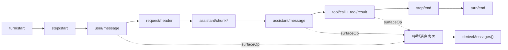

# 会话事件日志与消息投影

## Session 是什么

`Session` 是追加写的事件日志，不是简单的聊天消息数组。它同时保存 Turn/Step 边界、用户消息、模型原始 Chunk、组装后的助手消息、工具调用与结果、请求头、Inbox 修改以及其他插件扩展事件。

`SessionEventMap` 位于 `packages/core/session/src/types.ts`，可以通过 TypeScript declaration merging 扩展。每个事件进入统一 envelope：`type`、连续 `seq`、`time`、`data`，以及可选的模型表面元数据。



并非所有事件都进入模型历史。Chunk 和边界用于重放、诊断和 UI，但只有带 `surfaceOp` 的消息生产事件进入有序 Surface。

## `append()`：事实提交点

源码：`packages/core/session/src/index.ts`，`Session.append()`。

```ts
append<T extends SessionEventType>(
  type: T,
  data: SessionEventMap[T],
  ...opts: T extends SurfaceEventType ? [opts: SurfaceIntent] : []
): SessionEvent<T> {
  const surfaceOpts: SurfaceIntent | undefined = opts[0]
  const surfaceMetadata = {
    ...surfaceOpts?.sourceEventSeqs === undefined ? {} : { sourceEventSeqs: surfaceOpts.sourceEventSeqs },
    ...surfaceOpts?.surfaceOp === undefined ? {} : { surfaceOp: surfaceOpts.surfaceOp },
  }
  const dataSnapshot = snapshotJsonValue(data)
  if (dataSnapshot === undefined) {
    throw new Error(`session event "${type}" carries non-JSON-serializable data`)
  }
  const event = deepFreeze({
    type,
    seq: this.log.length,
    time: Date.now(),
    data: dataSnapshot,
    ...surfaceMetadataSnapshot,
  } as unknown as SessionEvent<T>)
  this.surfaceManager.validateNext(event as SessionEvent)
  this.log.push(event as SessionEvent)
  this.eventsSnapshot = undefined
  // 同步发布 session/event，省略观察者收集细节
  return event
}
```

数据先转换为无损 JSON 快照并深度冻结。Surface 变更在写入前验证。只有两者都成功，事件才进入 `log`。`seq` 就是写入时的数组长度，因此从 0 开始连续增长。

Session 被 `SessionStore.enter()` 附加后，`append()` 同步发布 `session/event`。持久化、界面投影和统计插件都从这一事实流更新自己，而不是侵入 Agent Loop。

## Surface：模型可见事件的有序集合

普通消息使用 `{ surfaceOp: 'append' }` 追加。压缩等功能可以用 replace 操作，用一个新节点替换一段旧 Surface，而原始事件仍留在 append-only 日志中。这样审计历史没有被删除，但 `deriveMessages()` 只返回当前有效上下文。

`sourceEventSeqs` 表示一个表面节点来自哪些先前事实。例如最终 `assistant/message` 引用组成它的全部 `assistant/chunk`；`tool/result` 引用对应 `tool/call`。UI 可以从这些关系重建卡片和流式显示。

## `deriveMessages()`：唯一的模型历史来源

```ts
deriveMessages(): Message[] {
  const surface = this.surface
  const nodes = surface.nodes
  const generation = surface.replaceGeneration
  if (generation !== this.derivedGeneration) {
    this.derived = []
    this.derivedNodes = 0
    this.derivedGeneration = generation
  }
  for (const seq of nodes.slice(this.derivedNodes)) {
    const msg = this.deriveEventMessage(this.log[seq]!)
    if (msg) this.derived.push(msg)
  }
  this.derivedNodes = nodes.length
  return [...this.derived]
}
```

缓存按 Surface 节点增量扩展。发生 replace 时 `replaceGeneration` 改变，缓存从头重建。返回数组是新快照，内部 Message 已深度冻结，所以调用者无法修改日志事实。

“模型可见就必须写日志”的具体含义是：`buildRequest()` 的 `messages` 只能来自 `session.deriveMessages()`；动态运行上下文也先形成 `user/message`，再进入请求。若插件绕过日志直接把隐藏消息加到 `GenerateOptions`，恢复和审计就无法重建模型看到的输入，运行时不变量会拒绝这种关系。

## 请求头不属于消息历史

`request/header` 保存模型路由、系统提示词、工具模式和调用配置。它不会作为聊天消息发送给模型，但恢复时必须知道上一请求使用了什么配置。

`requestHeader()` 增量折叠最新快照：

```ts
requestHeader(): EpochHeader | undefined {
  if (this.headerFoldSeq < this.log.length) {
    this.headerFold = deepFreeze(foldRequestHeader(this.log.slice(this.headerFoldSeq), this.headerFold))
    this.headerFoldSeq = this.log.length
  }
  return this.headerFold
}
```

Agent Loop 只有在首次请求、恢复首次请求或请求头实际变化时追加新事件，避免每个 Step 重复保存相同的大型工具模式和系统提示词。

## SessionStore 的边界

`SessionStore` 管理当前进程中的 Session，提供 `create()`、`prepare()`、`enter()`、`announce()`、`flush()` 和 `fork()`。持久化不在这里实现；持久化插件监听 Session 事件，并实现 `session/flush`。

`prepare → enter → announce` 的拆分让 Agent 工厂把 Session 和 Agent 放入同一个有序 Effect。先准备和配置，再进入 Store，最后发创建通知；回滚时保持关闭顺序。

下一篇 [[10-系统提示词与请求组装]] 解释模型历史之外的系统提示词、动态上下文、工具模式和模型配置如何进入同一个请求。

