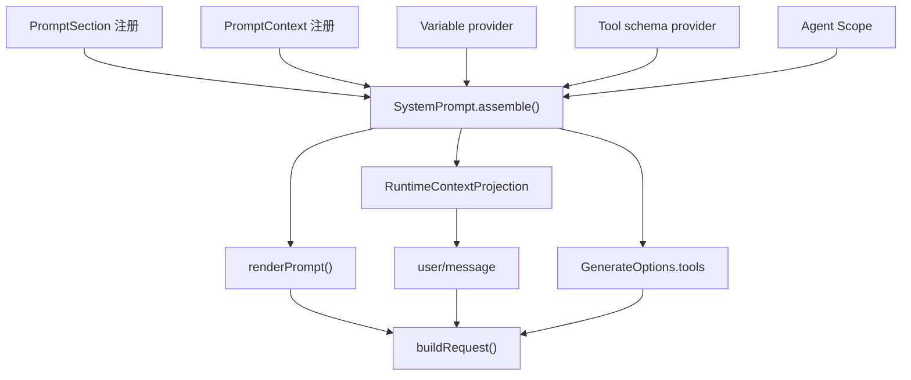

# 系统提示词与请求组装

## PromptAssembly 的四部分

`SystemPrompt` 不只保存一段字符串。每次 `assemble()` 返回：有序系统段 `sections`、动态上下文 `contexts`、工具模式 `tools` 和模板变量 `variables`。

```ts
export interface PromptAssembly {
  sections: AssembledSection[]
  contexts: AssembledContext[]
  tools: ToolSchema[]
  variables: Record<string, string | undefined>
}
```



## 注册系统段和动态上下文

系统段通过 `section()` 注册，按 `order` 升序连接。动态上下文通过 `context()` 注册，也按顺序连接，但不会放在 system 字段里，而会形成可持久化的用户角色快照。

```ts
ctx.systemPrompt.section({
  name: 'tool:pty',
  order: 106,
  text: 'Use a terminal session only when work needs persistent terminal state ...',
})
```

注册名在同一层必须唯一。Agent Scope 中相同名称的段可以遮蔽全局段，例如 Preset 使用 `deployment:persona` 覆盖部署默认 Persona，而不需要删除全局配置。

模板只允许 `{{name}}` 形式。渲染时未知变量、未定义值或畸形引用都会失败，不会把未解析模板发送给模型。

```ts
export function renderPrompt(assembly: PromptAssembly): string {
  return assembly.sections
    .map(section => interpolate(section, assembly.variables, 'section'))
    .filter(text => text.length > 0)
    .join('\n\n')
}
```

## 动态上下文为什么成为消息

运行目录、当前技能、文件变化等上下文会随时间改变。如果只把它们临时拼进请求，Session 无法重建模型当时看到的事实。

`ReactLoopAgent.preStep()` 先渲染全部 Context，再交给 `RuntimeContextProjection.project()`：

```ts
project(current: string, sections: readonly ContextSnapshotSection[]): UserMessage | undefined {
  if (this.retained === undefined && current.length === 0) return
  const snapshot = current.length === 0 ? CLEARED : current
  if (this.retained?.text === snapshot) return
  return createUserMessage({
    content: [{ type: 'text', text: snapshot }],
    source: sections.length === 0
      ? { kind: 'plugin', plugin: SOURCE }
      : { kind: 'plugin', plugin: SOURCE, form: 'snapshot', sections },
  })
}
```

内容未变化时不重复写入；内容清空时写明确的 cleared 标记，防止旧快照继续被理解为有效。候选消息经过 `agent/pre-step` 后才以 `user/message` 进入 Session。

## 工具模式来自 ToolRuntime

`ToolRuntime` 向 `SystemPrompt` 注册一个工具模式提供者。每次组装根据 Agent Scope、限制规则和当前工具模式返回有效 `ToolSchema[]`。因此“模型能看到某工具”和“执行时能找到某工具”使用同一注册与限制来源。

工具顺序默认按名称稳定排序，也可由配置 `toolOrder` 指定；配置必须包含 `<unlisted-tools>` 占位，未知名称在组装时失败。

## `buildRequest()` 汇合所有输入

源码：`packages/core/agent-loop/src/agent.ts`。

```ts
const proposedConfig = await this.dispatch.waterfall(
  'agent/request', { turn, step, signal },
  () => Promise.resolve(seedConfig),
)
if (!proposedConfig.provider || !proposedConfig.model) {
  throw new Error(`agent "${this.id}" has no provider/model: set AgentOptions.provider and AgentOptions.model or supply both via the agent/request waterfall`)
}
const preparedCall = await this.loopCtx.llm.prepareCall(proposedConfig, signal)
const config = preparedCall.config

const header = canonicalHeader({
  config,
  adapterDefaults: preparedCall.adapterDefaults,
  ...system ? { system } : {},
  ...tools.length > 0 ? { tools } : {},
})
```

流程先从 Agent 初始路由或上次 Request Header 生成提案，再允许 `agent/request` 监听器修改。`LlmRuntime.prepareCall()` 选择准确适配器和模型，补齐该模型的默认推理强度、最大 token 与 context window。

实际请求头被规范化并写入 Session 后，才创建最终 `GenerateOptions`：

```ts
const request = markAgentLoopRequest(deepFreeze({
  ...header.config,
  messages: boundaryMessages,
  ...header.system !== undefined ? { system: header.system } : {},
  ...header.tools !== undefined ? { tools: header.tools } : {},
  sessionId: this.session.id,
  signal,
}))
```

`messages` 来自 `deriveMessages()`；`system`、`tools` 和 config 来自当前 Header；`sessionId` 让持久化检查点和提供者归属能定位会话；`signal` 贯穿请求取消。

## 请求头只在变化时追加

首次新会话记录 `reason: initial`，恢复后第一次请求记录 `resume`，后续有效配置不同才记录 `change`。适配器补齐的默认字段也记录在 Header 中，使“用户未显式设置”和“用户明确选择了默认值”在下一次解析时仍可区分。

下一篇 [[11-LLM流式调用]] 从 `prepareCall()` 继续进入 LLM 适配器、DeepSeek 请求和流式块组装。

