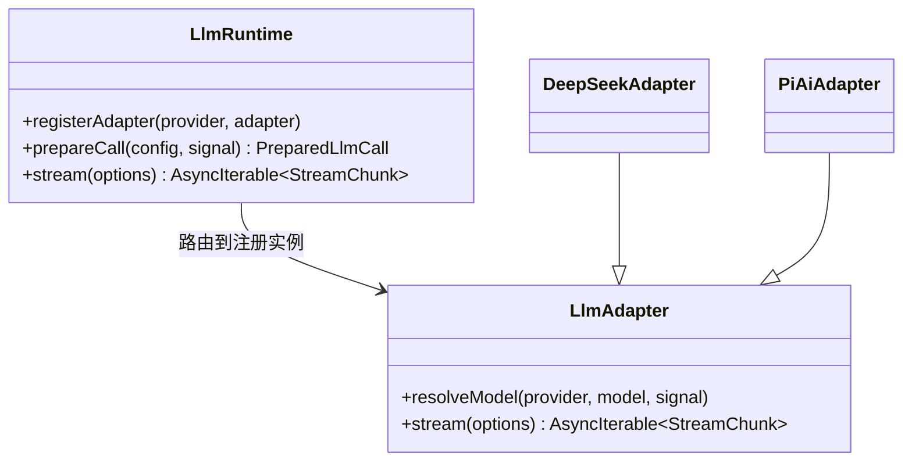
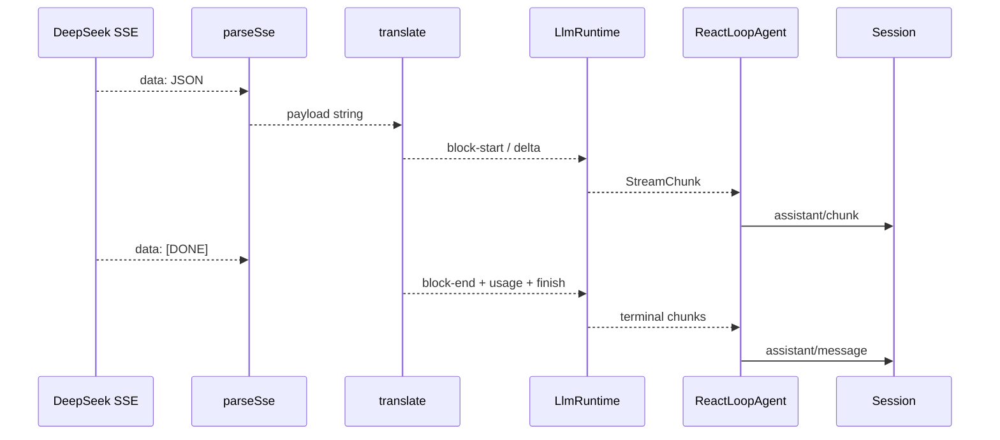

# LLM 流式调用

## 通用运行时与提供者适配器

`LlmRuntime` 是 `ctx.llm`，负责注册多个 provider/model 路由、解析模型信息、准备请求并把适配器异常规范化为终止 Chunk。`LlmAdapter` 是提供者实现基类。DeepSeek、pi-ai 等包各自注册适配器，不修改 Agent Loop。



`PreparedLlmCall` 把“解析时选中的适配器”与本次请求绑定。即使适配器注册表在解析后发生变化，本次请求仍使用同一注册实例和它给出的默认值。

## StreamChunk 协议

模型适配器不直接返回字符串，而是返回统一的 `StreamChunk` 联合类型，主要包括：

- `block-start`：开始 text、reasoning 或 tool-call 内容块。
- `text-delta`、`reasoning-delta`、`tool-call-delta`：增量内容。
- `block-end`：给出完整内容块。
- `usage`：token 统计。
- `finish`：stop、tool-calls、max-tokens、error 或 aborted。

这个协议让 Agent Loop 不依赖某家模型的 SSE 字段。Provider 包负责把线上的协议翻译为这些 Chunk。

## DeepSeek 请求序列化

源码：`packages/llm/llm-deepseek/src/serialize.ts`。

```ts
export function serializeRequest(
  options: GenerateOptions,
  defaults: RequestDefaults = {},
): WireRequest {
  const messages: WireMessage[] = []
  if (options.system !== undefined) {
    messages.push({ role: 'system', content: options.system })
  }
  messages.push(...serializeMessages(options.messages))

  const tools: WireTool[] | undefined = options.tools?.map(tool => ({
    type: 'function',
    function: {
      name: tool.name,
      description: tool.description,
      parameters: tool.parameters,
    },
  }))
  const resolvedThinking = resolveThinking(options, defaults)

  return {
    model: options.model,
    messages,
    stream: true,
    stream_options: { include_usage: true },
    ...resolvedThinking.thinking !== undefined ? { thinking: { type: resolvedThinking.thinking } } : {},
    ...resolvedThinking.reasoningEffort !== undefined
      ? { reasoning_effort: resolvedThinking.reasoningEffort }
      : {},
    ...tools !== undefined && tools.length > 0 ? { tools } : {},
    ...options.maxTokens === undefined ? {} : { max_tokens: options.maxTokens },
  }
}
```

SystemPrompt 成为第一条 system wire message；统一 Message 转为 DeepSeek 消息；工具模式转为 function tools。可选字段不存在时直接省略，而不是发送 `null`，让提供者默认规则正常工作。

## DeepSeekAdapter 的流式边界

`packages/llm/llm-deepseek/src/adapter.ts` 的 `stream()` 每次调用先冻结一份连接配置和密钥解析结果，再建立组合取消信号与空闲看门狗。

```ts
async * stream(options: GenerateOptions): AsyncIterable<StreamChunk> {
  const connection = this.config.options()
  const apiKey = await this.config.resolveApiKey(connection)
  const userId = this.config.resolveUserId()
  const consumer = new AbortController()
  const upstream = options.signal === undefined
    ? consumer.signal
    : AbortSignal.any([options.signal, consumer.signal])
  using watchdog = idleWatchdog(upstream, connection.streamIdleTimeoutMs, STREAM_IDLE_TIMEOUT_CODE)
  const iterator = this.request(
    options, watchdog.signal, connection, apiKey, userId,
    () => { watchdog.pulse() },
  )[Symbol.asyncIterator]()
  let exhausted = false
  try {
    while (true) {
      const result = await watchdog.next(iterator)
      if (result.done) {
        exhausted = true
        return
      }
      yield result.value
    }
  } finally {
    consumer.abort('DeepSeek stream consumer stopped')
    if (!exhausted && iterator.return !== undefined) {
      try { await iterator.return() } catch (_abortedTransportTeardown) {}
    }
  }
}
```

调用者取消、消费者提前停止和流空闲超时最终都中止同一传输。配置与凭据来自同一个快照，避免动态设置变化时把旧 endpoint 与新密钥组合在同一请求中。

`request()` 执行 `POST /chat/completions`，检查 HTTP 状态和响应体，再把 SSE 数据交给 `translate(parseSse(...))`。HTTP 状态、提供者错误码、Retry-After 和 Request ID 被整理为 `LlmError` 事实。

## SSE 到 StreamChunk

`translate()` 为 reasoning、text 和每个 tool call 维护 OpenBlock。增量到达时立即产出 delta；遇到 `[DONE]` 时按打开顺序产出完整 `block-end`、usage 和唯一的 finish。



如果 wire finish reason 未知，翻译器生成 error finish；如果正常 stop 却从未打开内容块，则生成 `EMPTY_RESPONSE`，不会把空响应当成功。

## BlockAssembler

Agent Loop 使用 `BlockAssembler` 校验每个索引的 start、delta 和 end 顺序，并组装最终 `ContentBlock[]`。当 finish 为 `max-tokens` 时，未完整闭合的工具调用会被丢弃，因为参数可能被截断，不能安全执行；文本和 reasoning 仍可形成助手消息。

原始 Chunk 与最终消息都写入日志：Chunk 支持实时 UI 和精确重放，最终消息支持模型历史。两者由 `sourceEventSeqs` 连接。

下一篇 [[12-工具注册与执行管线]] 从模型产生的 `tool-call` 内容块继续追踪执行。
