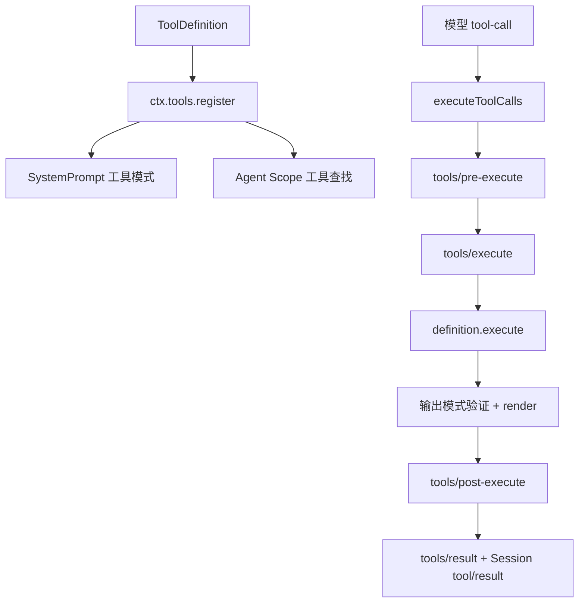
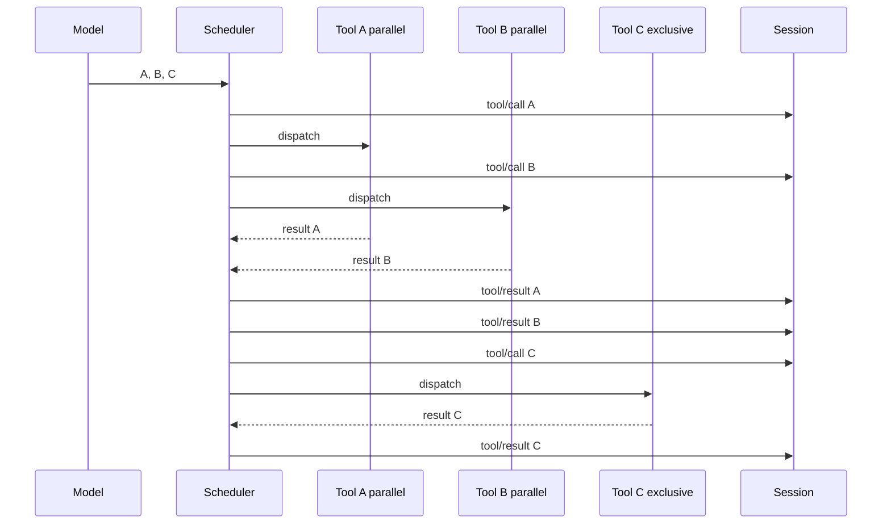

# 工具注册与执行管线

## 工具定义同时服务模型、运行时和界面

`ToolDefinition` 不只有 `name` 与 `execute()`。它还包含参数模式、输出模式、模型可见描述、结果渲染和调用展示意图。注册时 `ToolRuntime` 校验这些字段；组装提示词时生成模型工具模式；执行成功后验证结构化输出并渲染为 `ContentBlock[]`。



## 注册与作用域

源码：`packages/core/tools/src/index.ts`，`ToolRuntime.register()`。

```ts
register(definition: ToolDefinition): () => void {
  const name = definition.name
  const output = (definition as Partial<ToolDefinition>).output
  if (output === undefined || typeof output !== 'object'
    || typeof output.render !== 'function'
    || (output.presentationMeta !== undefined && typeof output.presentationMeta !== 'function')) {
    throw new TypeError(`tool "${name}" must declare output { schema, render, presentationMeta? }`)
  }
  assertSupportedJsonSchema(output.schema)
  const timeoutMs = definition.timeoutMs
  if (timeoutMs !== undefined
    && (!Number.isFinite(timeoutMs) || timeoutMs <= 0)) {
    throw new TypeError(`tool "${name}" timeoutMs must be a positive finite number`)
  }
  if (name === RUN_CODE_NAME) {
    throw new Error(`tool name "${RUN_CODE_NAME}" is reserved for the Code Mode presentation transport and cannot be registered or shadowed`)
  }
  return this.layers.effect(
    this.ctx,
    layer => layer.tools.insert(name, definition),
    { label: 'tools.register()' },
  )
}
```

全局 Context 注册全局工具；`agent.ctx` 注册 Agent 专属工具。同一 Scope 的重复名称失败，Agent 专属工具可以遮蔽全局同名工具。返回值是精确 disposer，随插件或 Agent Fiber 卸载。

`tools.restrict()` 只能从 Agent Scope 调用。多个限制求交集，并且只限制全局工具；Scope 本地注册的工具仍可见。提示词模式和执行查找都使用同一有效视图，避免“模型看不见但可以执行”或“模型看见却必然找不到”。

## Agent Loop 的工具调度

`packages/core/agent-loop/src/tool-calls.ts` 把模型返回的 `ToolCallBlock[]` 转为执行输入。每个输入携带 call ID、工具名、解析后的参数、Agent 和 Step 的取消信号。

```ts
const planned: PlannedCall[] = toolCalls.map(block => ({
  block,
  exec: {
    callId: block.id,
    name: block.name,
    arguments: parseArguments(block.arguments),
    agent,
    signal,
  },
}))
```

参数是合法 JSON 时解析为值，空字符串变成 `{}`，非法 JSON 保留原始文本。真正的工具参数模式验证仍在 ToolRuntime 的输入边界完成，因此模型得到明确的模式错误，而不是调度器提前猜测工具类型。

## 并发组与屏障

每个工具声明当前执行模式：`parallel` 或独占。调度器从左到右重新查询尚未开始调用的模式。连续 parallel 调用进入有上限的滚动并发池；独占调用形成屏障，必须等待前一组排空。



执行可以重叠，但结果始终按模型调用顺序提交。这样模型历史稳定，不会因网络或进程速度改变工具结果顺序。

## ToolRuntime 的分阶段执行

`execute()` 自身很短，因为内部把过程拆成可供调度器分别调用的阶段：

```ts
async execute(exec: ToolExecutionInput): Promise<ToolExecutionResult> {
  return this.prepareExecution(exec, prepared => this.completeScheduledExecution(prepared))
}
```

主要阶段如下：

1. 创建不可变执行快照并分配关联 token。
2. 运行 `tools/pre-execute`，得到 allow、deny 或 ask。
3. 若 ask，调用 Approval Service；没有可用渠道时拒绝。
4. 检查单调收紧的 Guard。
5. 运行 `tools/execute` waterfall，最内层调用工具 body。
6. 验证成功值满足输出 JSON Schema，并通过定义自己的 `render()` 生成模型内容。
7. 运行 `tools/post-execute`，允许接受、替换内容或阻断结果。
8. 应用工具定义自己的 `finalizeContent`，深度冻结最终结果。
9. 发布非否决性的 `tools/result` 通知。

### Pre-execute 与 Execute 的区别

`tools/pre-execute` 用于策略判断，不应启动工具副作用。它可以请求审批或拒绝。`tools/execute` 是 around middleware，可以包装真正的 body，例如持久化检查点在最外层确保调用记录已经落盘。

```ts
const gate = await this.ctx.waterfall(
  carrier, 'tools/pre-execute', exec,
  () => Promise.resolve<PreToolDecision>({ kind: 'allow' }),
)
```

### 工具 body 的错误不会逃逸

```ts
try {
  const tool = this.resolveExecution(exec.name, exec.agent, exec.parent !== undefined)
  if (!tool) throw new ToolNotFoundError(exec.name)
  state.bodyInvoked = true
  const returned = await tool.execute(exec.arguments, exec)
  const result = this.createSuccessResult(exec, tool, returned)
  return isAborted(signal) ? toolAbortedResult(result) : result
} catch (error: unknown) {
  return toolErrorResult(error)
}
```

工具异常转为 `isError: true` 的结果，仍进入 post-execute、结果通知和 Session。模型下一 Step 可以阅读错误并修正调用。只有调度器或生命周期本身无法维持一致性时，Step 才以异常失败。

## 输出为什么先验证再渲染

成功 body 返回业务值。ToolRuntime 先复制并验证其输出模式，再冻结为 `value`，然后调用 `output.render(args, value)` 生成模型可见内容。界面元数据由可选 `presentationMeta()` 单独生成。

因此业务代码不需要手工拼接“结果字符串 + UI 数据”；同一规范值可以为模型和界面提供不同表示。若 render 自身失败，工具结果变成明确错误，不会记录一个无法重放的半成品。

下一篇 [[13-文件系统、Shell、终端与沙箱]] 用一组具体能力展示 ToolRuntime 如何连接接口和提供者。

