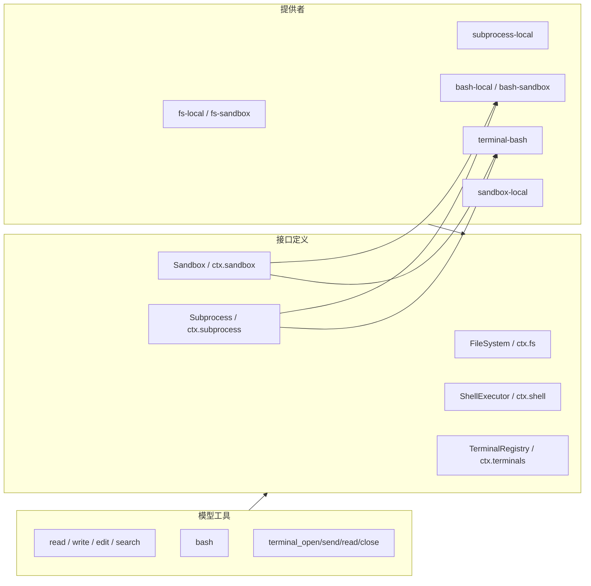

# 文件系统、Shell、终端与沙箱

## 一项能力的三种角色

Harness 把可替换能力拆为接口定义、提供者和消费者。文件系统的接口是 `@deepseek-ai/dsh-fs`，本地提供者是 `dsh-fs-local`，模型消费者是 read/write/edit/search 等工具包。Shell、Terminal、Subagent 与 Workflow 也采用同样结构。



## 文件系统：路径与稳定目标分离

`FileSystem.resolve()` 把用户提供的路径转换为 `FsTarget`。Target 含不透明的稳定 `targetKey` 和用于显示的 `displayPath`。消费者不能自己解析 targetKey；需要给进程传路径时调用 `processPath()`，需要 URI 时调用 `fileUrl()`。

这一设计处理了符号链接、远程文件系统和不同宿主平台：两个别名可以解析到同一个稳定目标，版本观察与写入锁就不会被路径字符串绕过。

本地实现 `LocalFileSystem.resolve()`：

```ts
override async resolve(path: string, opts?: { cwd?: string; signal?: AbortSignal }): Promise<FsTarget> {
  if (opts?.signal?.aborted) throw new FsError('resolve aborted', 'FS_ABORTED')
  const local = await resolveLocalTarget(opts?.cwd ?? this.config.cwd, path)
  if (opts?.signal?.aborted) throw new FsError('resolve aborted', 'FS_ABORTED')
  return { targetKey: local.targetKey, displayPath: local.displayPath }
}
```

`cwd` 只是相对路径解析基准，不是安全边界。文件限制由 `fs-sandbox`、权限策略和工具执行策略明确实现。

### 原子写与陈旧保护

本地提供者按 `targetKey` 建立 FIFO 锁，把读取当前版本、检查预期和原子替换放在同一串行区间。`replaceIfVersion` 要求文件仍处于之前观察到的版本；`createIfAbsent` 防止盲目覆盖已存在文件。

```ts
if (expected?.kind === 'replaceIfVersion') {
  if (!existing) throw new FsError(`cannot write "${target.displayPath}": file no longer exists`, 'FS_STALE_VERSION')
  if (existing.version !== expected.version) {
    throw new FsError(`cannot write "${target.displayPath}": file changed since it was read`, 'FS_STALE_VERSION')
  }
} else if (expected?.kind === 'createIfAbsent' && existing) {
  throw new FsError(`cannot overwrite existing "${target.displayPath}" without reading it first`, 'FS_NOT_OBSERVED')
}
```

模型工具读取文件时通过 `fs/observed` 记录版本，后续写入策略再生成合适 intent。接口定义把原子 edit 留在提供者一侧，使版本检查、文字匹配与写入不能被其他操作插入。

## Shell 与 Subprocess

Shell 接口描述一次有界命令执行，具体 Bash/Pwsh 提供者通过 `ctx.subprocess` 启动实际进程。Subprocess 提供者拥有进程树、环境清理、信号和终止逻辑；Shell 提供者拥有 shell argv、输出解释和模式配置。

当 Sandbox 模式不是 `danger-full-access` 时，sandboxing shell provider 先调用 `ctx.sandbox.confine(argv, policy)`，再把包装后的 argv 交给 subprocess。权限策略和命令执行因此没有散落在 Bash 工具 body 中。

## Terminal 为什么独立于 Shell

Shell 适合一次性有界命令；Terminal 保存 PTY 状态，支持交互输入、长期 REPL 和多次读取。`ctx.terminals` 注册多个后端并按 owner Agent 隔离 Session。

`terminal-bash` 的 spawn 主路径：

```ts
async spawn(spec: TerminalBackendSpawnSpec): Promise<LocalPtySession> {
  spec.signal?.throwIfAborted()
  ensureSandboxModeFence(this.ctx, spec.owner)
  const policy = this.ctx.sandboxPolicy.resolve({ session: spec.owner.session })
  const argv = spawnArgv(this.ctx, this.config, policy)
  const terminal = await this.spawnTerminal({
    argv,
    cwd: spec.cwd ?? policy.workspaceRoot,
    env: childEnvironment(spec),
    rows: this.config.rows,
    cols: this.config.cols,
    graceMs: this.config.disposeGraceMs,
    signal: spec.signal,
  })
  const session = this.createSession(terminal, this.config)
  try {
    await initializeSession(session, spec.signal)
    return session
  } catch (error) {
    try { await session.close('PTY startup failed') }
    catch (closeError: unknown) { throw new TerminalBackendCleanupError(error, closeError) }
    throw error
  }
}
```

它从所属 Agent 的 Session 解析当前 sandbox policy，包装 shell argv，创建 PTY，并等待初始提示符。初始化失败时必须关闭已创建的进程；若关闭也失败，用聚合清理错误同时保留两者。

## 持久终端工具

`@deepseek-ai/dsh-tool-terminal` 注册 `terminal_open`、`terminal_send`、`terminal_read`、`terminal_list`、`terminal_signal` 和 `terminal_close`。工具执行中的 `exec.agent` 是所有权凭证，不能只用 Session ID 猜测 owner。

`terminal_send` 可以前台等待，也可以把发送操作交给 `ctx.jobs`：

```ts
if (args.run_in_background === true) {
  const jobId = jobs.start({
    kind: 'pty-send',
    label: `${id}: ${args.text || '(input)'}`,
    owner,
    outputLimitBytes: maxResultBytes,
    run: () => {
      const operation = ctx.terminals.startSend(owner, id, request)
      return {
        cancel: () => operation.cancel(),
        done: operation.done.then(/* 归一化终态 */),
        readOutput: () => renderSendRead(operation.readOutput()),
      }
    },
  })
  return { kind: 'background' as const, jobId }
}
```

Job Registry 管理跨工具调用的生命周期，Terminal 后端继续拥有 PTY。两者没有互相复制状态。

## Sandbox Policy 与执行提供者

Sandbox Policy 解析本次调用的有效模式和 workspace root；Sandbox Provider 把策略转换为平台执行方式；FS/Shell/Terminal 消费策略。修改 Session 的 sandbox 模式时，Terminal 后端禁止在仍有 PTY 活动的情况下切换，因为已经启动的进程不可能被新策略重新包裹。

能力之间共享同一执行环境非常重要：远程或隔离部署同时替换 FS 与 Subprocess 提供者后，Shell、PTY 和 LSP 都随之移动，而不需要为每个模型工具维护远程分支。

下一篇 [[14-子代理、工作流与后台任务]] 继续分析三种更长生命周期的执行机制。

