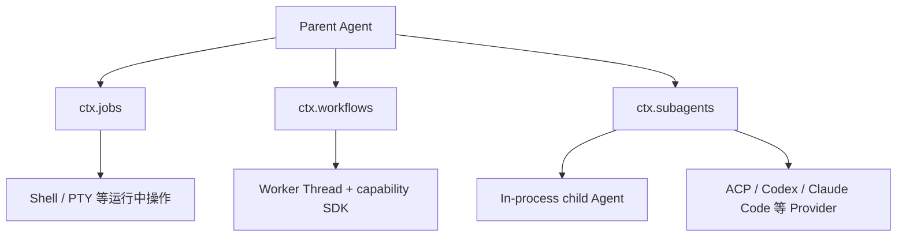
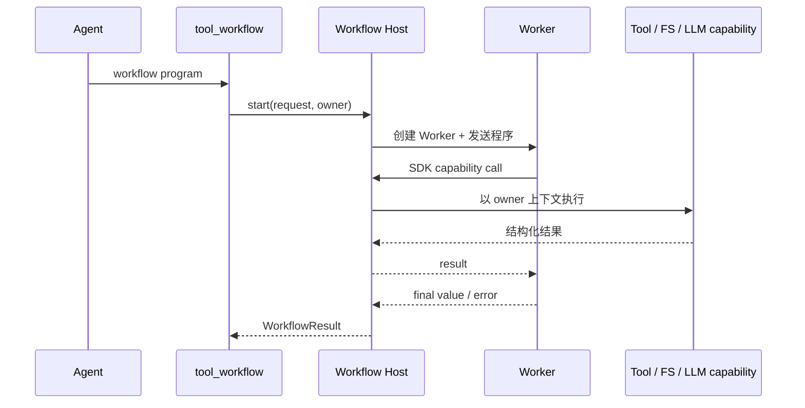
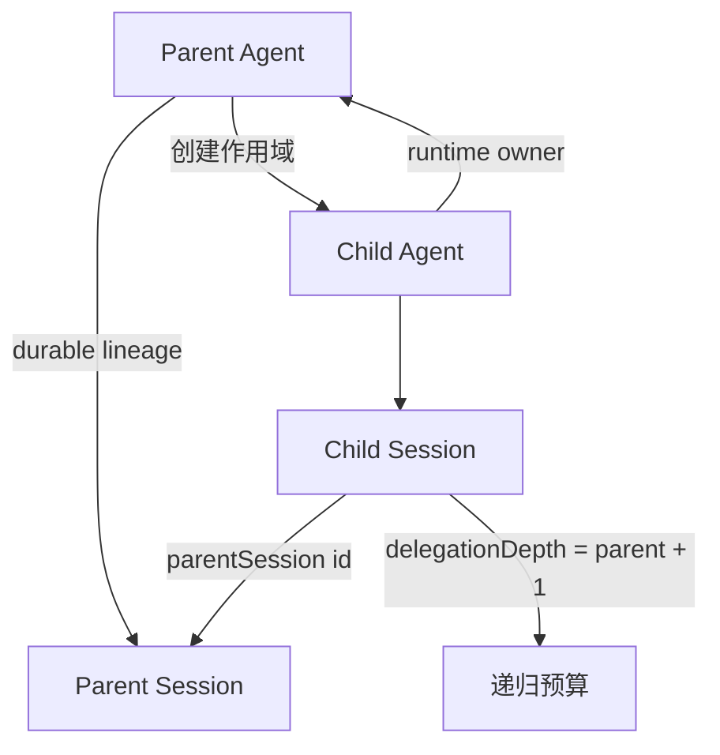

# 子代理、工作流与后台任务

## 三种机制解决不同问题

后台 Job 保存一个已经启动的异步操作，允许后续读取输出或取消。Workflow 在隔离的 Worker Thread 中运行模型编写的程序，并通过限定 SDK 调用能力。Subagent 创建另一个 Agent 或委托到外部代理产品，拥有独立的会话、模型循环和生命周期。

| 机制 | 是否有独立 Agent | 是否有独立程序运行环境 | 适合什么 |
|---|---:|---:|---|
| Job | 否 | 否 | 已启动命令、PTY send、异步结果收集 |
| Workflow | 否 | 是，Worker Thread | 确定性编排多个工具调用、循环和聚合 |
| Subagent | 是 | 取决于 Provider | 需要独立上下文、独立模型推理或外部代理 |



## Job：跨工具调用保存异步操作

Job Producer 调用 `ctx.jobs.start()`，提供 `cancel`、`done` 和可选 `readOutput`。Registry 分配稳定 Job ID、记录状态并执行 owner 隔离。

```ts
const hooks = spec.run()
const count = (this.counters.get(spec.kind) ?? 0) + 1
this.counters.set(spec.kind, count)
const id = JobId(`${spec.kind}-${count}`)

const job: TrackedTask = {
  id,
  kind: spec.kind,
  label: spec.label,
  owner: spec.owner,
  cancel: hooks.cancel.bind(hooks),
  readOutput: hooks.readOutput?.bind(hooks),
  status: 'running',
  startedAt: Date.now(),
  // 其余状态省略
}
this.store.set(id, job)
void hooks.done.then(
  outcome => { this.settle(job, outcome) },
  error => { this.settle(job, { status: 'failed', detail: String(error) }) },
)
```

Job 本身不拥有业务操作的实现。PTY、Shell 或其他 Producer 继续拥有资源，只把控制与观察钩子交给 Registry。`tool-jobs` 提供 `job_list`、`job_output`、`job_kill`，并在完成时向所属 Agent 投递通知。

Owner 忙碌时通知使用 `agent.inject()` 合并到下一 Step；Owner 空闲时可使用 `followup()` 唤醒。每个 Owner 有连续唤醒预算，避免“Job 完成 → 唤醒模型 → 模型再启动 Job”的无限自激链。

## Workflow：隔离程序编排能力

Workflow 的 Service Definition 注册可用后端；Worker Thread Provider 建立协议、模块白名单和主线程能力代理。模型工具提交程序后，Worker 中的 SDK 调用返回主线程，由 Host 侧在原始 Agent 的权限与作用域下执行。



Worker 是实际序列化边界，因此消息协议必须验证输入，不能依赖主进程 TypeScript 类型。Host 仍然保留 Agent 身份和取消信号，使 Worker 程序不能通过脱离上下文获得额外权限。

## SubagentRuntime：多 Provider 注册表

`ctx.subagents` 与单一 FS 服务不同，可以同时注册多个命名 Provider。调用方按名称选择。Service Definition 在调用 Provider 前检查请求是否需要 output schema、深度限制、工具过滤或 Persona，并确认 Provider 声明支持这些能力；不支持时立即失败，不静默忽略。

```ts
export interface SubagentCapabilities {
  readonly outputSchema: boolean
  readonly depthLimit: boolean
  readonly toolFilter: boolean
  readonly persona: boolean
}
```

一发即止的 `start()` 返回 `SubagentRun`；可继续的 `startContinuable()` 创建持久子会话，后续 `followup()` 直接进入子 Agent Inbox。可继续子 Agent 的 Continuation Manager 持有其 `AgentHandle`，Provider 只负责准备创建方式，不接管后续 Turn。

## In-process 子 Agent 的所有权

同进程 Provider 通过父 Agent 的 Scope 创建子 Agent。子 Session 写入 `parentSession`、`origin: subagent` 和 `delegationDepth`。深度是持久元数据，因此恢复子 Session 后不会错误回到顶层深度。



运行时 owner 与持久 lineage 是两种关系。Owner 决定当前进程中谁能控制子 Agent；`parentSession` 决定重放、列表和恢复时的会话血缘。恢复出来的 Session 可以有 parentSession，但当前运行时是顶层 Agent。

## 生命周期事件

Subagent Runtime 为已发布运行发 `subagent/start`，终止后发配对的 `subagent/end`。事件带同一个 `runId`、Provider 名、子 Session ID、本地/外部标记和停止原因。Provider 在 start 返回前必须完成子运行的建立，所以 Promise fulfillment 是明确的发布与所有权转移边界。

## 如何选择

- 已经有一个异步句柄，只需跨调用管理：Job。
- 需要在隔离程序中确定性调用多项能力：Workflow。
- 需要独立模型上下文、工具集合、Persona 或外部代理：Subagent。
- 只是当前 Agent 的下一步上下文：不要创建上述机制，使用 `inject()`。

下一篇 [[15-持久化与会话恢复]] 解释这些长期状态依赖的会话存储基础。

