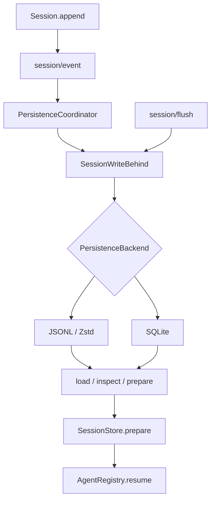
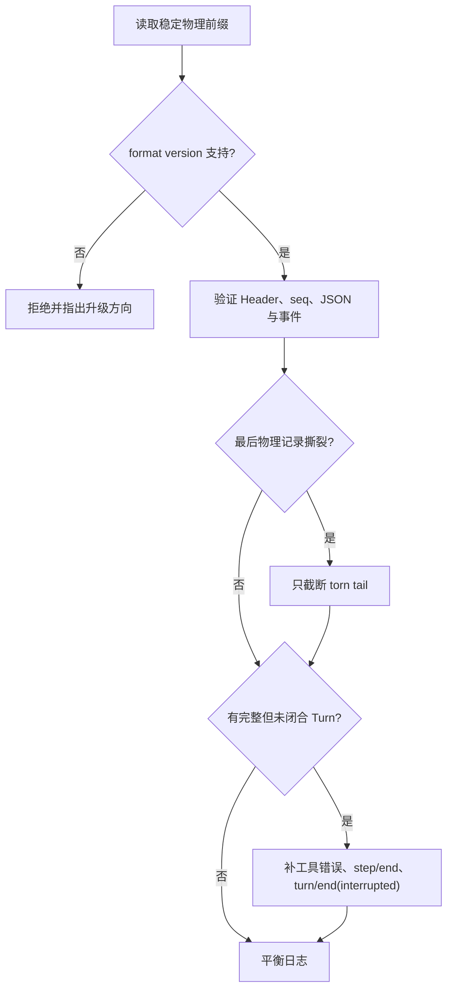

# 持久化与会话恢复

## 接口、协调器和介质

`SessionPersistence` 是存储接口；`PersistenceCoordinator` 为一方后端提供缓冲、序列化、游标、准备缓存和崩溃修复编排；JSONL 与 SQLite 包实现实际介质操作。



## SessionPersistence 的核心承诺

源码：`packages/session/session-persistence/src/index.ts`。

```ts
export abstract class SessionPersistence extends Service {
  constructor(ctx: Context) {
    super(ctx, 'sessionPersistence')
  }

  abstract create(meta: SessionHeader): Promise<void>
  abstract append(id: SessionId, events: readonly SessionEvent[]): Promise<void>
  abstract load(id: SessionId): Promise<SessionInspection>
  abstract inspect(id: SessionId, signal?: AbortSignal): Promise<SessionInspection>
  abstract readFrom(id: SessionId, fromSeq: number, signal?: AbortSignal):
    Promise<{ meta: SessionHeader; events: SessionEvent[] }>
  abstract list(signal?: AbortSignal): Promise<SessionHeader[]>
}
```

`append()` 只接受连续批次，第一条 seq 必须等于存储的 next seq。`load()` 返回平衡的逻辑日志：冷加载发现完整但中断的 Turn 时，提交合成闭合事件；发现撕裂的最后物理记录时，只截断该尾部。

`inspect()` 不发布 Session，也不一定提交修复，适合历史查看。`prepare()` 则产生一个由恢复流程拥有的未发布 Session，供 Agent Factory 进入统一创建事务。

## 写后缓冲与检查点

每次 `session/event` 都直接同步写磁盘会拖慢 Chunk 流，因此 Coordinator 用 `SessionWriteBehind` 缓冲连续事件并按大小或短延时成批写入。`session/flush` 是显式耐久屏障，等待所有已提交内存事件进入后端。

`session-checkpoint-policy` 把 flush 放在即将发生外部副作用的位置：

```ts
export function apply(ctx: Context): void {
  ctx.on('llm/stream', (options, next): AsyncIterable<StreamChunk> => {
    if (options.sessionId === undefined) return next()
    const session = ctx.sessions.get(options.sessionId)
    return session === undefined ? next() : afterCheckpoint(ctx, session, next)
  })

  ctx.on('tools/execute', async (exec, next): Promise<ToolExecutionResult> => {
    if (exec.agent === undefined || exec.parent !== undefined) return next()
    await ctx.sessions.flush(exec.agent.session)
    if (exec.signal.aborted) return abortedBeforeDispatchResult()
    return next()
  })

  ctx.on('agent/pre-step', async ({ agent }, next): Promise<PreStepDecision> => {
    await ctx.sessions.flush(agent.session)
    return next()
  })
}
```

在模型请求前，完整请求前缀必须耐久；在顶层工具 body 前，工具调用事实必须耐久；下一 pre-step 前，上一 Step 的响应与结果必须耐久。Flush 失败会阻止模型请求或工具副作用继续，避免外部世界已经变化但日志没有对应事实。

## JSONL 物理结构

JSONL 文件第一行是 Session Header，后续为事件或压缩后的 Chunk Row。默认可使用 Zstandard 物理压缩，但逻辑读取仍还原同一事件序列。

Header 由 `packages/session/session-persistence-jsonl/src/format.ts` 生成：

```ts
export function toHeaderLine(header: SessionHeader): HeaderLine {
  return {
    type: 'session',
    version: header.version,
    id: header.id,
    createdAt: header.createdAt,
    ...header.cwd !== undefined ? { cwd: header.cwd } : {},
    ...header.parentSession !== undefined ? { parentSession: header.parentSession } : {},
    ...header.seedLength !== undefined ? { seedLength: header.seedLength } : {},
    ...header.origin !== undefined ? { origin: header.origin } : {},
    delegationDepth: header.delegationDepth ?? 0,
    ...header.agentPreset !== undefined ? { agentPreset: header.agentPreset } : {},
  }
}
```

Session ID 是编译期品牌字符串，不保证适合文件路径。`encodeSegment()` 对所有不安全 UTF-16 code unit 转义，并特殊处理 `.` 与 `..`，防止路径穿越和名称碰撞。

## 崩溃恢复



格式版本不匹配与损坏是不同错误。新版本日志被旧运行时读取时，错误要求升级 Harness；旧版本且没有迁移路径时明确拒绝。不会把“当前代码不理解”误报为“文件损坏”。

## 恢复 Agent

`AgentRegistry.resume()` 委托 Agent Loop Factory。Factory 调用 `sessionPersistence.prepare(id)`，得到未发布 Session；随后创建新的 Agent Scope，运行 Preset/setup，进入 SessionStore 和 AgentRegistry，发布生命周期事件，最后启动 Loop。

恢复复用持久事件，但不会复用旧进程中的服务对象、AbortController 或 Agent Scope。运行能力来自当前装配；因此 Session Header 记录 `agentPreset`，防止恢复时不知不觉换成不兼容的工具与提示词组合。

下一篇 [[16-API、Web与Headless调用链]] 对比两种应用入口如何创建 Agent、发送消息和观察同一日志。

