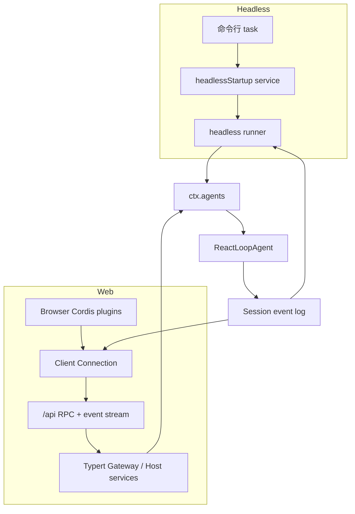
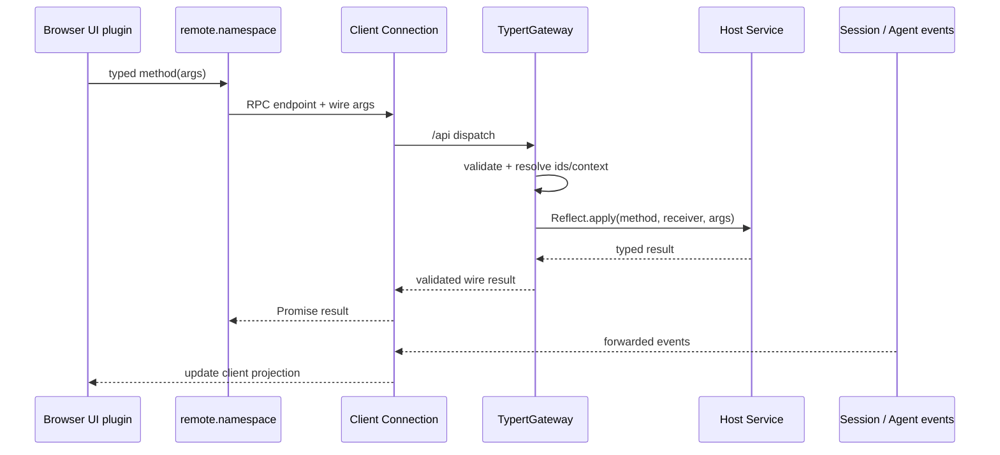

# API、Web 与 Headless 调用链

## 两种入口，共用一个 Agent 核心

Headless 是同进程一次性消费者：创建 Agent、发送一条消息、等待空闲、刷新会话、打印结果并退出。Web 是长期运行的 Host/Client 应用：浏览器通过连接与 Typert Remote 调用 Host 服务，并订阅会话与运行事件。二者最终都进入 `ctx.agents` 和同一个 Agent Loop。



## Headless：完整的一次性驱动

源码：`packages/bundle/headless/src/index.ts`，`run()`。

```ts
async function run(ctx: Context, task: string, io: HeadlessIo): Promise<void> {
  await ctx.get('loader')?.await()
  const agents = ctx.get('agents')
  const defaultModel = ctx.get('agentDefaultModel')
  const sessions = ctx.get('sessions')
  if (agents === undefined || defaultModel === undefined || sessions === undefined) return

  const selection = defaultModel.currentSelection()
  const { agent } = await agents.create({
    sessionId: SessionId(`session-${randomUUID()}`),
    meta: { cwd: process.cwd() },
    agentOptions: { provider: selection.provider, model: selection.model },
    setup: (agentCtx) => {
      const selected: ModelSelectionRef = { current: selection, assembled: undefined }
      installModelSelection(agentCtx, selected)
    },
  })
  await agent.whenIdle()
  const firstSeq = agent.session.seq
  agent.followup(createUserMessage({
    content: [{ type: 'text', text: task }],
    source: { kind: 'user' },
  }))
  await agent.whenIdle()
  await sessions.flush(agent.session)
  const outcome = summarize(agent.session.events, firstSeq)
  io.stdout.write(outcome.text + '\n')
  if (outcome.reason?.kind === 'error') {
    io.stderr.write(`dsh: ${outcome.reason.error.code}: ${outcome.reason.error.message}\n`)
  }
  io.exit(outcome.reason?.kind === 'completed' ? 0 : 1)
}
```

### 为什么创建后先 `whenIdle()`

Agent 创建完成前会发布 `agent/session-start`，监听器可能注入启动上下文或触发初始化活动。第一次 `whenIdle()` 等这些工作结束，再确定本次 Task 的起始 seq，避免把启动阶段助手消息误当作 Task 结果。

### 为什么从 Session 汇总输出

Runner 没有从 `followup()` 获取“返回值”，因为 Agent 输入是异步队列。它等待 Agent 空闲，再扫描本次区间中的 `assistant/message` 与 `turn/end`。最终输出来自持久事实，而不是 Loop 内部临时变量。

### 为什么退出前 flush

`whenIdle()` 只表示 Agent 没有运行活动，不等于持久化缓冲已经写完。Runner 显式 `sessions.flush()`，再请求宿主退出，保证本次 Session 可恢复。

## Web Bundle 的 Host 侧装配

`packages/bundle/web-app/cordis.patch.yml` 在 Base 之上增加：

- `webserver`：绑定 Host 和端口。
- `web-runtime`：提供静态前端、可信 Host 快照和 Web 环境提示词。
- `client-modules`：扫描 Client 插件，生成浏览器启动清单并提供 bundle。
- `client-connection`：Host 侧绑定 `/api`，浏览器侧提供 RPC/SSE 客户端。
- `api-remotes`：显式选择可暴露给客户端的 Remote 命名空间。
- UI 插件：会话、工具、工作区、设置、权限、子代理等界面。

Web 模式把模型工具、提示词和部分能力移入 Agent Preset。Host 服务仍是共享的，但每个会话通过 `agent.ctx` 得到自己的模型可见组合。

## Typert Gateway：从 Wire 参数到 Service 方法

`packages/api/gateway/src/index.ts` 的 `TypertGatewayService` 不实现业务 API。它读取生成的 Remote 描述，查找当前 Service，解析参数中的 Session/Agent 等引用，调用真实方法，并验证返回值。

```ts
constructor(ctx: Context) {
  super(ctx, 'typertGateway')
  ctx.on('internal/service', () => {
    this.srcClaims = undefined
  })
  ctx.inject(['connection'], (connectionCtx) => {
    connectionCtx.connection.rpc.intercept(
      '/api',
      endpoint => this.claimsEndpoint(endpoint),
      (endpoint, payload, signal) => this.dispatchRpc(endpoint, payload, signal),
      { authority: 'trusted-host' },
    )
  })
}
```

Gateway 只接管形如 `namespace/method` 的已声明 endpoint。连接层处理传输、请求关联和信任；Gateway 处理类型描述、服务解析和调用；业务 Service 处理领域行为。

`invoke()` 的核心顺序：

1. 解析 endpoint 描述。
2. 检查请求只包含声明参数。
3. 根据参数解析接收者 Context，例如定位某个 Agent Scope。
4. 从该 Context 读取目标 Service。
5. 用 Typert lookup 把 wire ID 转成 Host 对象。
6. 追加取消信号参数。
7. 调用业务方法并验证返回值。



## Client Remote 不是 JavaScript Proxy 猜出来的

浏览器侧 `ClientRemote` 挂载生成的贡献，并为每个 namespace 安装明确 Service。`packages/api/remotes/src/client/index.ts` 显式选择 commands、goals、动态 Cordis、插件清单和反馈等贡献：

```ts
export async function apply(ctx: Context): Promise<() => Promise<void>> {
  const disposers: Array<() => Promise<void>> = []
  try {
    for (const contribution of [
      commandsRemote, goalsRemote, dynamicRemote, pluginInventoryRemote, messageFeedbackRemote,
    ]) {
      disposers.push(await ctx.remote.$mount(contribution))
    }
  } catch (error) {
    for (const dispose of disposers.reverse()) await dispose()
    throw error
  }
  return async () => {
    for (const dispose of disposers.reverse()) await dispose()
  }
}
```

显式清单决定客户端能调用什么。挂载失败时按逆序撤销，卸载时 Remote namespace 不会比其贡献活得更久。

## 如何沿 Web 请求读代码

从具体 UI 动作出发，不要先读全部前端：先找到 UI 插件调用的 `ctx.remote.<namespace>.<method>`，再查对应 Remote 描述与 Host Service 方法；若行为通过事件更新，再找 `client-connection` 的转发事件和 UI 投影消费者。最后才进入 Agent、Session 或工具核心。

下一篇 [[17-实现一个插件扩展]] 用一个实际工具把装配、Scope、输出验证和配置接入串起来。

