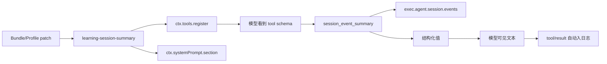

# 实现一个 DeepSeek Harness 插件扩展

## 目标

实现一个 `session_event_summary` 工具：读取当前 Agent 的 Session，按事件类型统计数量，并返回出现次数最多的若干类型。这个练习不需要 API Key，也不修改 Agent Loop。

它覆盖五个关键点：插件依赖、配置验证、工具注册、Agent 所有权和输出模式。它不增加新的 Session 事件，因为工具调用与结果已经由 Agent Loop 自动记录；也不添加隐藏的模型上下文。



## 1. 放置包

按仓库规则选择合适包组，例如：

```text
packages/examples/learning-session-summary/
├── package.json
├── tsconfig.json
├── README.md
└── src/
    └── index.ts
```

真实贡献若属于现有领域，应放进该领域组，而不是机械放在 `examples`。这里使用 examples 只是说明学习插件不应被误解为产品核心能力。

## 2. 包清单

最小 `package.json` 需要 ESM、Harness 包命名、Cordis peer dependency 和实际运行依赖。版本与完整发布字段应跟随仓库同组包，而不是从这段示例复制固定值。

```json
{
  "name": "@deepseek-ai/dsh-learning-session-summary",
  "private": true,
  "type": "module",
  "main": "lib/index.js",
  "types": "lib/types/index.d.ts",
  "exports": {
    ".": {
      "types": "./lib/types/index.d.ts",
      "default": "./lib/index.js"
    },
    "./src/*": "./src/*",
    "./package.json": "./package.json"
  },
  "peerDependencies": {
    "@deepseek-ai/cordis": "workspace:^",
    "@deepseek-ai/dsh-agent": "workspace:^",
    "@deepseek-ai/dsh-session": "workspace:^",
    "@deepseek-ai/dsh-system-prompt": "workspace:^",
    "@deepseek-ai/dsh-tools": "workspace:^"
  },
  "dependencies": {
    "@deepseek-ai/schemastery": "workspace:^"
  },
  "devDependencies": {
    "@deepseek-ai/cordis": "workspace:^",
    "@deepseek-ai/dsh-agent": "workspace:^",
    "@deepseek-ai/dsh-session": "workspace:^",
    "@deepseek-ai/dsh-system-prompt": "workspace:^",
    "@deepseek-ai/dsh-tools": "workspace:^"
  }
}
```

Cordis 同时出现在 peer 与 dev：运行时由装配提供同一个 Cordis 实例，开发编译又需要类型与模块可解析。

## 3. 完整插件源码

`src/index.ts`：

```ts
/**
 * Model-facing summary of the current agent's durable session event types.
 * @module @deepseek-ai/dsh-learning-session-summary
 */

import type { Context } from '@deepseek-ai/cordis'
import z from '@deepseek-ai/schemastery'
import { defineTool } from '@deepseek-ai/dsh-tools'

/** Stable Cordis plugin name. */
export const name = 'learning-session-summary'

/** Services required to register the tool and its model guidance. */
export const inject = ['tools', 'systemPrompt']

/** Deployment configuration for the summary size. */
export interface Config {
  /** Maximum number of event types returned, ordered by count then name. */
  maxTypes: number
}

/** Runtime validation for plugin configuration. */
export const Config: z<Config> = z.object({
  maxTypes: z.number().step(1).min(1).max(100).required(),
})

interface EventCount {
  type: string
  count: number
}

/** Register the session summary tool and concise usage guidance. */
export function apply(ctx: Context, config: Config): void {
  ctx.systemPrompt.section({
    name: 'tool:session-event-summary',
    order: 150,
    text: 'Use session_event_summary only when you need aggregate event counts for the current session; it does not return event payloads.',
  })

  ctx.tools.register(defineTool({
    name: 'session_event_summary',
    description: 'Count durable event types in the current agent session without returning event payloads.',
    parameters: {},
    output: {
      schema: {
        type: 'object',
        additionalProperties: false,
        properties: {
          total: { type: 'integer', required: true },
          types: {
            type: 'array',
            required: true,
            items: {
              type: 'object',
              additionalProperties: false,
              properties: {
                type: { type: 'string', required: true },
                count: { type: 'integer', required: true },
              },
            },
          },
        },
      },
      render: (_args, value) => [{
        type: 'text',
        text: [
          `Session contains ${value.total} events.`,
          ...value.types.map(item => `${item.type}: ${item.count}`),
        ].join('\n'),
      }],
    },
    execute(_args, exec) {
      if (exec.agent === undefined) {
        throw new Error('session_event_summary requires an owning agent session')
      }
      const counts = new Map<string, number>()
      for (const event of exec.agent.session.events) {
        counts.set(event.type, (counts.get(event.type) ?? 0) + 1)
      }
      const types: EventCount[] = [...counts]
        .map(([type, count]) => ({ type, count }))
        .sort((left, right) => right.count - left.count || left.type.localeCompare(right.type))
        .slice(0, config.maxTypes)
      return Promise.resolve({
        total: exec.agent.session.events.length,
        types,
      })
    },
    presentCall: () => ({
      card: 'generic',
      title: 'Summarize session events',
      kind: 'read',
    }),
  }))
}
```

## 4. 逐段解释

### `inject`

工具和提示词段都是插件的必要行为，因此插件整体要求 `tools` 与 `systemPrompt`。如果提示词只是可选增强，才改用 `ctx.inject(['systemPrompt'], ...)`，让工具在无提示词服务的组合中仍可存在。

### 配置

`maxTypes` 是部署可变选择，放在 Config 并验证整数范围。工具 body 不使用隐藏常量决定输出大小。加载时即可发现无效配置。

### Agent 身份

Session 是每个 Agent 的状态，工具必须使用 `exec.agent`。缺少 Agent 时明确拒绝，不能退回“随便选一个当前 Session”。

### 输出值与渲染

`execute()` 返回结构化值；ToolRuntime 验证它符合输出模式，然后 `render()` 生成给模型的文本。若以后 Web UI 需要专用卡片，可以加入 `presentationMeta` 与对应客户端 renderer，而不用改变模型文本。

### 生命周期

`ctx.systemPrompt.section()` 和 `ctx.tools.register()` 返回的 disposer 都被当前 Fiber 接管。插件卸载时，提示词段和工具一起撤销。若通过 `agent.ctx.plugin()` 挂载，则只对该 Agent 生效，并随 Agent 销毁。

## 5. 接入配置

在实验用 Profile Patch 中插入：

```yaml
- insert:
    - id: learning-session-summary
      name: '@deepseek-ai/dsh-learning-session-summary'
      config:
        maxTypes: 20
```

不要直接修改生成后的 `--dump-config` 输出。Bundle 或 Profile Patch 才是装配来源。

## 6. 验证架构关系

不依赖 API Key 的验证顺序：

1. 用 `--dump-config` 确认条目进入有效插件树。
2. 运行 TypeScript 检查，确认 Context declaration merging、输出类型和 ESM 导入正确。
3. 启动使用 mock/replay 的 keyless 示例，确认工具模式出现。
4. 调用工具后查看 Session 日志，应出现普通 `tool/call` 与 `tool/result`，不应出现自创的隐藏状态。
5. 卸载或移除 Patch 后，工具模式与执行查找应同时消失。

## 何时需要更完整的能力拆分

这个插件只读取现有 Session，因此一个工具包足够。如果功能需要可替换后端，例如查询远程分析服务，应拆成：Service Definition、一个或多个 Provider、工具 Consumer，并为三者分别定义配置和失败行为。不要把远程客户端、注册表和模型参数全部写进一个工具 body。

最后阅读 [[18-源码索引与版本更新]]，建立后续自主查找和维护笔记的方法。

