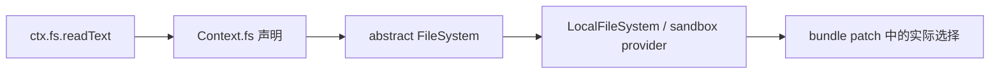

# 源码索引与版本更新

## 按问题定位源码

| 想回答的问题 | 首要文件 | 关键符号 |
|---|---|---|
| Profile 如何变成 Patch 层 | `packages/boot/app-boot/src/profile.ts` | `loadProfile`、`composeEntries` |
| Loader 如何启动整棵树 | `packages/boot/app-boot/src/index.ts` | `boot`、`mountRootInclude`、`assertEntriesActivated` |
| Agent 公共行为是什么 | `packages/core/agent/src/runtime-types.ts` | `Agent`、`AgentOptions` |
| Agent 如何创建与查找 | `packages/core/agent/src/index.ts` | `AgentRegistry`、`AgentHandle`、`AgentFactory` |
| 输入如何排队和恢复 | `packages/core/agent/src/inbox.ts` | `Inbox.claim`、`Inbox.splice` |
| Turn 和 Step 如何运行 | `packages/core/agent-loop/src/agent.ts` | `ReactLoopAgent.turn`、`step`、`buildRequest` |
| 工具调用如何并发 | `packages/core/agent-loop/src/tool-calls.ts` | `executeToolCalls`、`runGroup` |
| 会话事件类型有哪些 | `packages/core/session/src/types.ts` | `SessionEventMap`、`SessionHeader` |
| 日志如何提交和投影 | `packages/core/session/src/index.ts` | `Session.append`、`deriveMessages`、`SessionStore` |
| Surface 如何替换消息历史 | `packages/core/session/src/surface.ts` | `SurfaceManager`、`foldSurface` |
| 提示词如何组装 | `packages/core/system-prompt/src/index.ts` | `SystemPrompt`、`PromptAssembly`、`renderPrompt` |
| LLM 如何选适配器 | `packages/llm/llm/src/index.ts` | `LlmRuntime`、`LlmAdapter`、`prepareCall` |
| 流式 Chunk 如何成消息 | `packages/llm/llm/src/assembler.ts` | `BlockAssembler` |
| DeepSeek Wire 如何转换 | `packages/llm/llm-deepseek/src/` | `serializeRequest`、`parseSse`、`translate` |
| 工具如何注册和执行 | `packages/core/tools/src/index.ts` | `ToolRuntime.register`、`execute`、`postExecute` |
| 文件系统接口与本地实现 | `packages/fs/fs/src/index.ts`、`fs-local/src/index.ts` | `FileSystem`、`LocalFileSystem` |
| Shell/进程/沙箱如何连接 | `packages/shell/`、`packages/subprocess/`、`packages/sandbox/` | 各 Service 与 Provider `apply` |
| PTY 如何管理 | `packages/terminal/` | `TerminalRegistry`、`BashTerminalBackend` |
| 子 Agent 如何创建 | `packages/subagent/` | `SubagentRuntime`、Provider、Continuation Manager |
| 后台任务如何保存 | `packages/jobs/` | `Jobs` Service、`start`、`wait`、`kill` |
| Workflow 如何隔离 | `packages/workflow/` | Workflow Service、Worker Host、协议类型 |
| Session 如何持久化 | `packages/session/session-persistence/` | `SessionPersistence`、`PersistenceCoordinator` |
| JSONL 格式在哪里 | `packages/session/session-persistence-jsonl/src/` | `format.ts`、后端 `index.ts` |
| Headless 如何驱动 | `packages/bundle/headless/src/index.ts` | `run`、`summarize` |
| Web 组合有哪些插件 | `packages/bundle/web-app/cordis.patch.yml` | 条目 `id` 与 `name` |
| Remote 如何调用 Host | `packages/api/gateway/src/index.ts` | `TypertGatewayService.invoke` |

## 按事件追踪消费者

事件是跨包连接的主要入口。先在声明处读 payload 与模式，再搜索所有监听和发送：

```sh
rg -n "'agent/pre-step'" packages --glob '!**/tests/**'
rg -n "'session/event'" packages --glob '!**/tests/**'
rg -n "'tools/execute'" packages --glob '!**/tests/**'
rg -n "'llm/stream'" packages --glob '!**/tests/**'
```

阅读 waterfall 时检查每个监听器是否调用 `next()`，以及调用前后分别做什么。阅读普通 emit 时区分同步事实通知与异步后台工作，确认监听失败是否会影响主生命周期。

## 按服务追踪装配

看到 `ctx.<service>` 时执行三步：

1. 搜索 `interface Context` 的 declaration merging，找到 Service Definition。
2. 搜索继承该 Service 或注册 provider 的实现包。
3. 在 Bundle/Preset Patch 中搜索包名，确认当前 Profile 选择哪个提供者。



## 版本更新流程

这些笔记基于提交 `47f943859bef60e4160492346772ded9b24f765a`。更新仓库后，先记录新提交：

```sh
git -C /Users/robot/Documents/Projects/deepseek-harness rev-parse HEAD
git -C /Users/robot/Documents/Projects/deepseek-harness diff --name-status 47f943859bef60e4160492346772ded9b24f765a..HEAD
```

然后按改动目录选择需要复核的笔记，不要全部重写：

| 改动范围 | 优先复核笔记 |
|---|---|
| `packages/boot/`、`bundle/` | [[04-Profile、Bundle与配置分层]]、[[05-启动装配链路]]、[[16-API、Web与Headless调用链]] |
| `packages/core/agent*` | [[06-Agent接口、注册表与收件箱]]、[[07-Turn、Step与Agent Loop]]、[[08-取消、错误与恢复]] |
| `packages/core/session` | [[09-会话事件日志与消息投影]]、[[15-持久化与会话恢复]] |
| `system-prompt`、`llm` | [[10-系统提示词与请求组装]]、[[11-LLM流式调用]] |
| `tools` 或具体工具包 | [[12-工具注册与执行管线]]、相应能力篇 |
| `fs/shell/terminal/sandbox` | [[13-文件系统、Shell、终端与沙箱]] |
| `subagent/workflow/jobs` | [[14-子代理、工作流与后台任务]] |
| `session-persistence*` | [[15-持久化与会话恢复]] |
| `api`、Web Client、Web Bundle | [[16-API、Web与Headless调用链]] |

### 复核每个源码片段

对文中标注的文件与符号逐项确认：文件是否仍存在、符号是否改名、代码段是否仍连续、输入输出是否变化、事件顺序是否变化、错误和取消路径是否变化。只改注释或局部实现时，不要无理由重写整篇说明。

### 更新属性

完成复核的笔记把 `source_commit` 更新为新提交。若只有部分笔记完成复核，未检查的笔记保留旧提交号，这比统一改成新值却没有验证更可靠。

## 架构变化的判断信号

以下变化通常不只是源码片段更新，需要重画图或重组篇章：

- `Agent`、`Session`、`ToolRuntime` 或 `LlmRuntime` 的职责移动到新服务。
- 新的模型可见输入不再通过 Session 事件重建。
- Turn/Step 边界或工具结果提交顺序改变。
- Bundle 把能力从 Host 全局层移入或移出 Agent Preset。
- 接口、Provider、Consumer 三类包之间的依赖方向改变。
- Web 不再通过当前 Connection/Typert Remote 路径调用 Host。

## 学习闭环

完成本套文档后，应能回答：一次输入存在哪里、谁唤醒 Agent、每次模型请求从哪里重建、工具如何被限制和执行、取消后哪些事实必须补齐、进程退出前怎样保证耐久、Web 与 Headless 为什么不需要两套 Agent 核心。

若其中任何一项只能背结论而无法指向源码，请返回对应主题篇，沿本页的符号索引重新追踪。总入口是 [[00-学习路线]]。

