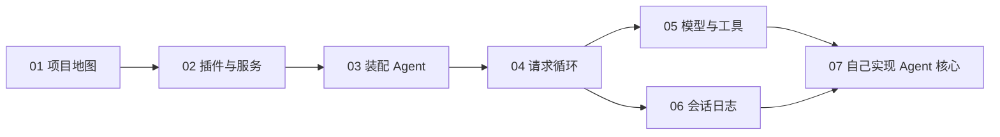

# DeepSeek Harness 学习路线与代码地图

这套笔记的目标是：理解 DeepSeek Harness 如何组织 Agent 的核心逻辑，并能够自己写出一个由模拟模型驱动、可调用工具、可记录状态的 Agent 核心。

它不把 Web、命令行或远程 API 当作重点。这些只是把消息送进 Agent 的外层；核心代码在 `packages/core`、`packages/llm` 及与它们配合的插件中。

> [!info] 源码基线
> 本笔记对应仓库的 `master` 分支、提交 `47f943859b`。阅读前可在仓库根目录执行 `git rev-parse --short HEAD`；若结果不同，先把差异记在本页，再按路径阅读。

## 学完后你应能做到

- 说明一个输入如何变成模型请求、工具调用和新的会话记录。
- 区分服务、插件、事件和工具各自负责什么。
- 找到“加入一个能力”应修改的接口、提供者和使用者。
- 用模拟模型和模拟工具实现一个不依赖 UI 的 Agent 核心。

## 阅读顺序

1. [[01 - 项目地图与阅读方法]]：先建立目录和职责的整体印象。
2. [[02 - 运行结构：插件、配置与服务]]：理解应用如何由插件组成。
3. [[03 - 从配置到可运行 Agent]]：理解核心服务怎样被装配成一个 Agent。
4. [[04 - 一次 Agent 请求的完整流程]]：沿着一次请求追踪真实运行路径。
5. [[05 - 能力、模型与工具]]：学习可替换能力和工具执行管线。
6. [[06 - 会话日志、历史与恢复]]：理解持久化状态为何是 Agent 的事实来源。
7. [[07 - 实现一个不依赖界面的 Agent 核心]]：把前面的概念组合为自己的模拟 Agent。



## 先记住这张责任地图

| 问题 | 主要代码位置 | 阅读时要找的对象 |
| --- | --- | --- |
| Agent 的公开能力是什么？ | `packages/core/agent` | `Agent`、收件箱、`agent/*` 事件 |
| Agent 如何运行一轮？ | `packages/core/agent-loop` | `ReactLoopAgent`、turn、step |
| 对话历史从哪里来？ | `packages/core/session` | `Session`、`SessionEventMap`、`deriveMessages()` |
| 模型如何被接入？ | `packages/llm/llm` | `LlmAdapter`、`LlmRuntime`、`stream()` |
| 工具如何注册和执行？ | `packages/core/tools` | `ToolRuntime`、`tools/*` 事件 |
| 一组通用核心服务如何组合？ | `packages/examples/agent-spine-demo` | `apply()` 和它加载的插件 |

## 阅读方法

每次只回答一个问题：谁创建对象、谁保存状态、谁调用谁、结果写到哪里。不要一开始试图读完整个 `packages/` 目录。

优先从类型、构造函数和测试开始。类型给出对象边界，构造函数显示依赖，测试给出可重复的行为示例。

推荐使用下面三类只读操作；它们不需要 API Key：

```sh
rg -n "class ReactLoopAgent|interface Agent" packages/core
rg -n "deriveMessages|SessionEventMap" packages/core/session
rg -n "registerAdapter|stream\(" packages/llm/llm
```

## 练习：在开始前定位核心

1. 打开 `packages/core/agent/src/runtime-types.ts`，找到 `Agent` 接口。
2. 打开 `packages/core/agent-loop/src/agent.ts`，确认具体实现类是 `ReactLoopAgent`。
3. 打开 `packages/core/session/src/index.ts`，找到 `Session.deriveMessages()`。
4. 在自己的话中写下：Agent 的实时状态与对话历史分别由哪个对象管理？

答案应是：`ReactLoopAgent` 管理实时执行和收件箱；`Session` 保存事件并从事件推导模型历史。下一篇解释为什么这两个职责不能混在一起。
