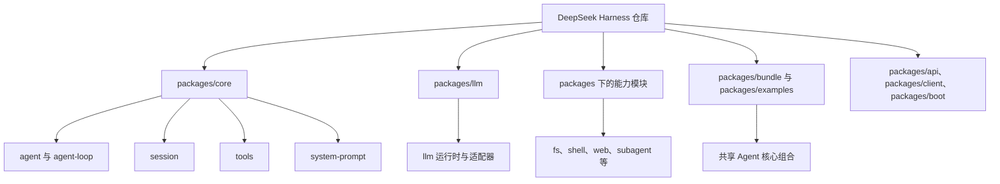
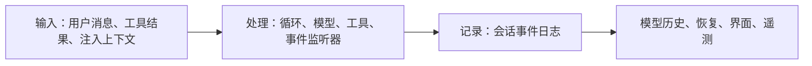
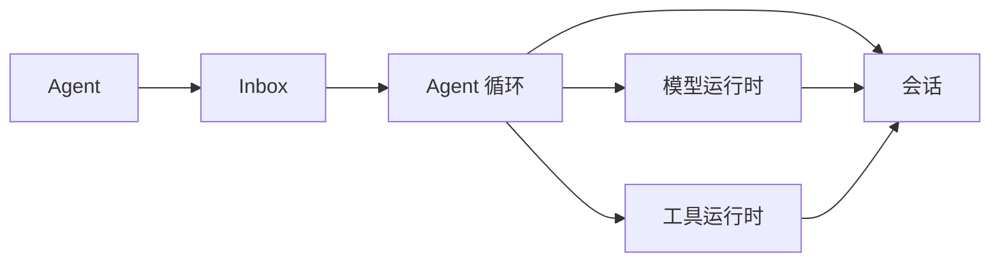

# 项目地图与阅读方法

[[00 - 学习路线与代码地图|返回学习索引]]

DeepSeek Harness 是一个插件化的 Agent 运行框架。它的关键选择是：模型、工具、会话、Agent 循环和存储都以插件形式加入同一个运行环境，而不是把它们写死在一个大类里。

这不表示每个目录都同样重要。想实现自己的 Agent，先聚焦“核心执行路径”，然后再把文件系统、子 Agent、终端等能力当作可选扩展。

## 目录按职责划分

| 部分 | 作用 | 本轮学习深度 |
| --- | --- | --- |
| `packages/core/agent` | 定义 Agent、收件箱和运行期事件 | 必读 |
| `packages/core/agent-loop` | 实现 turn/step 循环 | 必读 |
| `packages/core/session` | 追加事件、推导历史、支持恢复 | 必读 |
| `packages/core/tools` | 注册工具并执行安全检查、调用和结果处理 | 必读 |
| `packages/core/system-prompt` | 组合系统提示词和工具 schema | 读接口与调用处 |
| `packages/llm/llm` | 定义模型适配器和流式响应 | 必读 |
| `packages/examples/agent-spine-demo` | 把通用服务组合成不依赖界面的 Agent 核心 | 必读 |
| `packages/fs`、`shell`、`web`、`subagent` | 可选能力的真实例子 | 选择一个精读 |
| `packages/client`、`api`、`boot` | 介质、远程服务和启动方式 | 只做定位 |

## 用“输入—处理—记录”读代码

任何 Agent 功能都可以先放进三格：

如果一个信息会影响下一次模型请求，它必须能从记录中重新得到。这个项目通过会话事件实现这一点。反过来，临时的执行状态，例如“当前请求是否正在运行”，不适合写成对话历史。

## 从一个类向外阅读

以 `ReactLoopAgent` 为例，不要从文件顶部逐行读到末尾。按下面顺序跳转：

1. 看它实现的 `Agent` 接口，列出公开方法：`followup()`、`steer()`、`inject()`、`cancel()`、`whenIdle()`。
2. 看构造函数，记录它拿到的依赖：运行环境、Agent ID、选项、`Session`。
3. 搜索 `session.append(`，确认哪些结果会写进事件日志。
4. 搜索 `ctx` 或 `dispatch`，确认有哪些可被插件观察或改写的事件。
5. 回到测试，找一个只使用 `mock` 模型的用例，观察它期待的日志顺序。

这种方式比“先理解所有类型”更有效，因为你一直有一个具体对象作为中心。

## 练习：画出你自己的核心切片

在纸上或新笔记中画出下面五个节点，并为每条箭头写一句解释：

检查点：`Inbox` 不保存完整历史；`Session` 不主动调用模型；`Agent 循环` 才是两者之间的调度者。

继续阅读：[[02 - 运行结构：插件、配置与服务]]。
