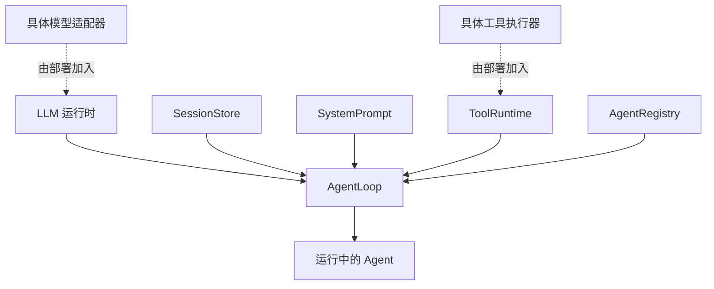

# 运行结构：插件、配置与服务

[[00 - 学习路线与代码地图|返回学习索引]] · [[01 - 项目地图与阅读方法|上一章]]

要理解这个项目，先把三个词分开：插件负责安装行为，服务提供可调用对象，事件让其他插件在既定时机参与执行。

## 三个基本部件

| 部件 | 解决的问题 | 例子 |
| --- | --- | --- |
| 插件 | 运行时要安装哪些能力？ | `AgentLoop`、`ToolRuntime` |
| 服务 | 其他代码通过什么对象调用能力？ | `ctx.llm`、`ctx.tools`、`ctx.sessions` |
| 事件 | 其他插件在哪个时机观察或改变行为？ | `agent/pre-step`、`tools/execute` |

一个插件通常在 `apply(ctx, config)` 中把服务或监听器注册到 Cordis 的 `Context`。它注册的内容要能在插件卸载时撤销，因此不要把运行时全局变量当作注册表。

```mermaid
flowchart LR
    Config[配置] --> Plugin[插件 apply(ctx, config)]
    Plugin --> Service[注册服务到 ctx]
    Plugin --> Event[注册事件监听器]
    Consumer[其他插件] --> Service
    Event --> Consumer
    Service --> Consumer
```

## 为什么 Agent 需要很多插件

一个 Agent 需要模型调用、会话记录、提示词组装、工具注册和循环调度。它们变化的原因不同：例如换模型不应重写工具，加入工具不应改会话存储。

`packages/examples/agent-spine-demo/src/index.ts` 的 `apply()` 是一张很好的组合清单。它先加入模型运行时、会话、提示词、工具和 Agent 注册表，再加入实际的 `AgentLoop`。这个示例故意不绑定 UI 或具体模型执行器。



实线表示循环运行时必须使用的服务。虚线表示同一核心可以替换的外部实现。

## 配置不是普通对象

这个项目用配置决定“装配什么”，而不是在循环里到处写 `if`。例如，某个配置层可以选择模型适配器、工具后端或是否安装某项能力。

因此阅读配置时先问两个问题：它是选择一个实现，还是调整一个实现的参数？选择不同实现通常意味着插件树改变；调整参数通常只影响某个服务。

## 事件是受控的扩展点

事件不是任意的广播消息。它们有固定的时机和类型。

- `agent/pre-step`：模型请求前，决定本步是否进入以及使用哪些消息。
- `agent/request`：模型请求前，允许调整模型路由与参数。
- `tools/pre-execute`、`tools/execute`、`tools/post-execute`：工具执行前、中、后。
- `session/event`：会话追加事件后，供存储、界面或遥测观察。

有些事件是“waterfall”：监听器必须调用 `next()` 才会把控制权交给下一个监听器。它适合审批、超时、重试和策略包装；普通通知事件不承担这种控制责任。

## 练习：从组合找到最小依赖

1. 打开 `packages/examples/agent-spine-demo/src/index.ts`，只看 `apply()`。
2. 将每个 `ctx.plugin(...)` 标成“核心”“可选功能”或“具体后端”。
3. 找出 `LlmRuntime`、`SessionStore`、`ToolRuntime` 和 `AgentLoop` 的导入行。
4. 写下：若你只做模拟 Agent，哪些具体后端可以先不加入？

建议答案：真实模型适配器、文件系统、Shell、Web 和任何 UI 都可以先不加入；但仍需一个模拟模型、会话、工具注册表和循环。

继续阅读：[[03 - 从配置到可运行 Agent]]。
