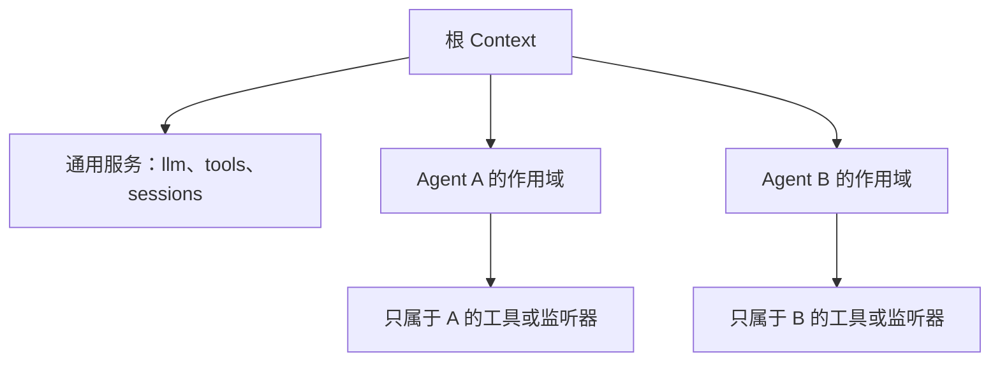

# 从配置到可运行 Agent

[[00 - 学习路线与代码地图|返回学习索引]] · [[02 - 运行结构：插件、配置与服务|上一章]]

这一章只讨论 Agent 核心如何被创建，不讨论它从网页、终端还是 API 接收消息。外层介质最终都要调用 Agent 的输入方法。

## 创建时发生的事

在本项目中，`AgentLoop` 既是默认循环的插件，也是创建具体 Agent 的工厂。创建时它准备会话、建立 Agent 专属作用域、发布创建事件，并把 Agent 放入注册表。

```mermaid
sequenceDiagram
    participant Setup as 插件组合
    participant Loop as AgentLoop
    participant Store as SessionStore
    participant Registry as AgentRegistry
    participant Agent as ReactLoopAgent

    Setup->>Loop: 安装循环服务
    Loop->>Store: 创建或恢复 Session
    Loop->>Agent: 创建 Agent 与收件箱
    Loop->>Registry: 发布 Agent
    Registry-->>Setup: 可按 ID 取得 Agent
```

`packages/core/agent/src/runtime-types.ts` 中的 `Agent` 接口是外层调用方应依赖的最小能力。它不暴露循环内部的每一个阶段，但提供了几种有清晰语义的输入方式：

| 方法 | 输入何时使用 | 是否立即唤醒循环 |
| --- | --- | --- |
| `followup(message)` | 新的普通回合 | 是 |
| `steer(message)` | 最近的下一步 | 是或等待当前步骤结束 |
| `inject(message)` | 下次模型请求的上下文 | 否 |
| `cancel(cause)` | 中止当前工作 | 不产生新回合 |

这些方法最终都进入 `Inbox`。收件箱按“下一回合”和“下一步”等边界保存待处理输入，因此工具结果和用户补充信息不必错误地混进同一批消息。

## Agent 专属作用域

一个运行环境可以同时有多个 Agent。它们共享通用服务，却不应共享每个 Agent 的临时注册，例如只给某个 Agent 的工具或请求拦截器。

`ReactLoopAgent` 创建一个 Agent 作用域，并把它暴露为 `agent.ctx`。在该作用域注册的内容会随 Agent 释放，不会遗留给下一个 Agent。



## 你的最小装配清单

当你自己搭建一个不依赖界面的 Agent 时，先明确下面五项，而不是先写 UI：

1. 一个消息类型和收件箱。
2. 一个事件日志或其他可重放状态。
3. 一个模型接口；本教程使用模拟实现。
4. 一个工具注册表；最开始只放一个确定性工具。
5. 一个循环；负责取输入、请求模型、处理工具结果、决定停止。

下面是概念骨架，不是本项目的可直接复制代码：

```ts
interface Model {
  respond(history: readonly Message[], tools: readonly ToolSchema[]): AsyncIterable<ModelChunk>
}

interface AgentCore {
  followup(message: Message): void
  whenIdle(): Promise<void>
}
```

接下来的章节会分别说明 `history` 如何从事件产生，以及模型返回工具调用后循环如何继续。

## 练习：区分创建和运行

1. 阅读 `packages/core/agent-loop/src/index.ts` 中的 `AgentLoop` 类，找到它实现工厂接口的位置。
2. 阅读 `packages/core/agent-loop/src/agent.ts` 的构造函数，列出它立即创建的对象。
3. 搜索 `followup(`，确认它不是直接调用模型，而是先把消息放进收件箱。
4. 解释为什么“创建 Agent”与“处理一条消息”应是两个独立阶段。

检查点：创建阶段建立身份、会话和依赖；运行阶段才会消耗输入并请求模型。

继续阅读：[[04 - 一次 Agent 请求的完整流程]]。
