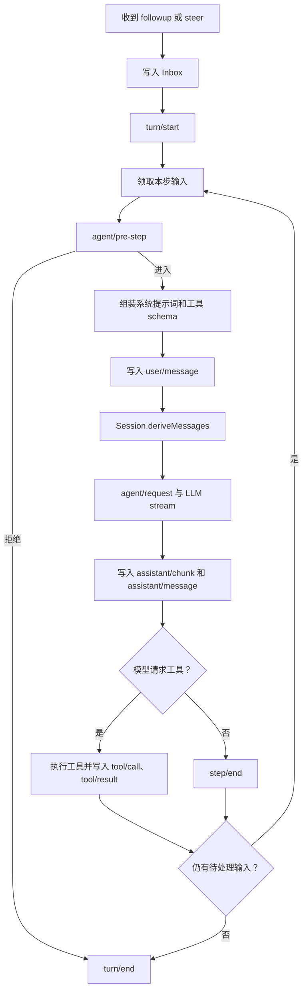
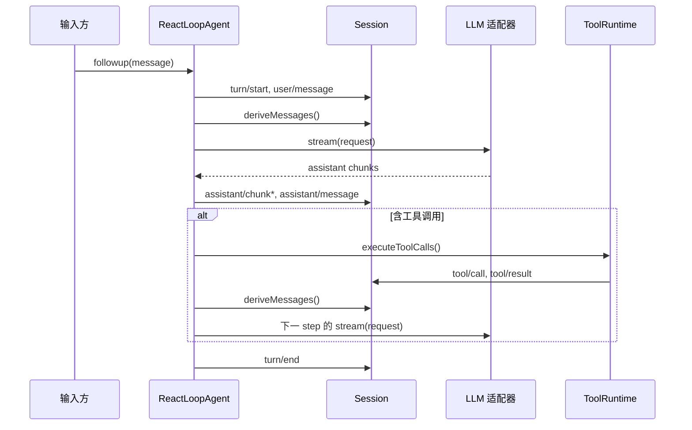

# 一次 Agent 请求的完整流程

[[00 - 学习路线与代码地图|返回学习索引]] · [[03 - 从配置到可运行 Agent|上一章]]

Agent 不是“发一次请求就结束”。一次用户任务是一个 turn（回合）；一个 turn 可包含多个 step（步骤）。每个 step 发起一次模型请求，而模型调用工具后通常需要另一个 step 来读取工具结果。

## 一张完整流程图



## turn 与 step 的区别

| 概念 | 含义 | 典型情况 |
| --- | --- | --- |
| turn | 一次待完成的任务边界 | “请读取文件后总结” |
| step | 一次模型请求和其工具调用 | 模型先请求 `read_file`，再根据结果回答 |

如果模型第一步返回工具调用，循环会记录调用和结果，把工具提供的额外上下文放进下一步收件箱，然后再次请求模型。这样每次模型请求都从会话日志重建历史，而不是依赖某个可变数组。

## 从真实代码跟踪

`packages/core/agent-loop/src/agent.ts` 的 `step()` 方法是阅读入口。它做了四件事：

1. 调用 `buildRequest()`，把当前提示词、工具 schema 和 `session.deriveMessages()` 组合成模型请求。
2. 遍历模型流式输出，把原始块记录为 `assistant/chunk`。
3. 把完整回复记录为 `assistant/message`。
4. 若回复内含 `tool-call`，调用 `executeToolCalls()`，否则结束当前 step。

下面的时序图省略了错误和取消分支，突出正常路径：



## 三个容易混淆的点

### 1. 原始 chunk 与完整消息不同

`assistant/chunk` 保存流式过程，便于重放或界面逐字显示。`assistant/message` 是本步完成后得到的完整消息，才会作为模型历史的一部分。不要只保存最终文本，否则无法重放流式行为；也不要把每个 chunk 都放进历史，否则模型会看到重复内容。

### 2. 工具调用记录与工具结果不同

`tool/call` 记录模型请求了什么工具和参数，供重放与诊断使用；`tool/result` 才投影为模型可以读取的消息。这保证恢复 Agent 后仍能得到相同的工具上下文。

### 3. 插件能改变明确的阶段

插件可以在 `agent/pre-step` 拒绝输入，在 `agent/request` 修改请求配置，或在工具执行事件中应用审批和重试。它不应该偷偷修改已经写入日志的历史。

## 练习：模拟两步任务

假设模拟模型的第一轮返回“调用 `add(2, 3)`”，第二轮返回“答案是 5”。请在纸上列出合理的事件顺序，至少包含：

```text
turn/start
user/message
assistant/message（含 tool-call）
tool/call
tool/result
assistant/message（最终回答）
turn/end
```

然后打开 `packages/core/agent-loop/src/tool-calls.ts`，确认工具调用和结果是由循环调度器按模型调用顺序写入的。

继续阅读：[[05 - 能力、模型与工具]]。
