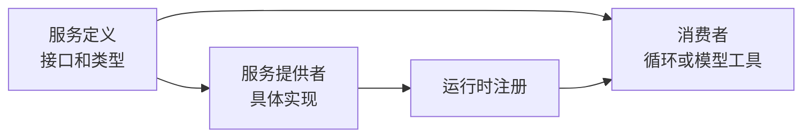
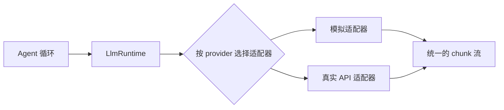
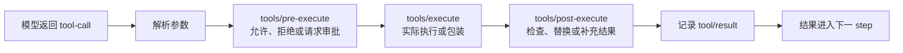

# 能力、模型与工具

[[00 - 学习路线与代码地图|返回学习索引]] · [[04 - 一次 Agent 请求的完整流程|上一章]]

一个 Agent 核心不应知道“某个模型 API 怎么调用”或“某个工具怎样读文件”。它只需要知道抽象接口。项目把这种可替换的功能拆成三种角色：服务定义、服务提供者、消费者。

## 三种角色



| 角色 | 要回答的问题 | 模型例子 | 工具例子 |
| --- | --- | --- | --- |
| 服务定义 | 调用者可依赖什么？ | `LlmAdapter.stream()` | 工具 schema、执行输入和结果 |
| 服务提供者 | 如何完成具体工作？ | DeepSeek、回放或模拟适配器 | 文件系统、Shell 或内存工具 |
| 消费者 | 谁在什么时机使用它？ | Agent 循环请求模型 | 模型通过 schema 请求工具，循环调度执行 |

这种划分的实际价值是替换。例如把真实模型换成模拟模型时，循环无需改动；把本地文件系统换成远程沙箱时，工具接口与循环也无需改动。

## 模型能力

`packages/llm/llm/src/index.ts` 中的 `LlmAdapter` 只有一个关键抽象方法：`stream(options)`。它接收已经组装完成的请求，返回异步 chunk 流。

```ts
interface ModelAdapter {
  stream(request: ModelRequest): AsyncIterable<ModelChunk>
}
```

模拟模型可以预先安排响应：第一轮返回工具调用，第二轮返回文本。它不需要网络，也最适合验证循环是否正确。



无论选择哪一个适配器，循环只处理统一的 chunk、完整消息和完成原因。

## 工具能力

工具有两面：模型需要 schema 来知道工具名称和参数；运行时需要实现来验证参数、执行操作并返回结果。

`ToolRuntime` 负责注册和执行管线。工具调用不会直接跳到工具函数，而是经过确定的阶段：



这个顺序使审批、超时、指标和结果整理能作为插件独立加入。Agent 循环只负责调度，并不在自己内部实现每一种安全规则。

## 先实现一个确定性工具

实现自己的 Agent 时，第一把工具应尽量简单，例如 `add(a, b)` 或 `lookup(key)`。目标不是工具本身，而是验证这些事实：

- 模型能看到工具名称和参数说明。
- 参数无效时有清楚的错误结果。
- 工具结果写进日志。
- 下一次模型调用能从历史读到结果。

概念骨架如下：

```ts
interface Tool {
  readonly name: string
  readonly description: string
  execute(args: unknown): Promise<ToolResult>
}

const add: Tool = {
  name: 'add',
  description: '返回两个整数的和',
  async execute(args) {
    const { a, b } = args as { a: number; b: number }
    return { content: String(a + b) }
  },
}
```

真实实现还应在边界处验证 `args`，并把失败也转成可记录的结果。

## 练习：找出一个能力的三种角色

以 Shell 为例，在仓库中找到：

1. `packages/shell/shell` 中的抽象服务定义。
2. `packages/shell/bash-local` 或 `packages/shell/bash-sandbox` 中的具体提供者。
3. `packages/shell/tool-bash` 中让模型使用 Shell 的工具消费者。

再回答：如果改用模拟 Shell，Agent 循环是否需要改？答案应是否定的；替换的是提供者。

继续阅读：[[06 - 会话日志、历史与恢复]]。
