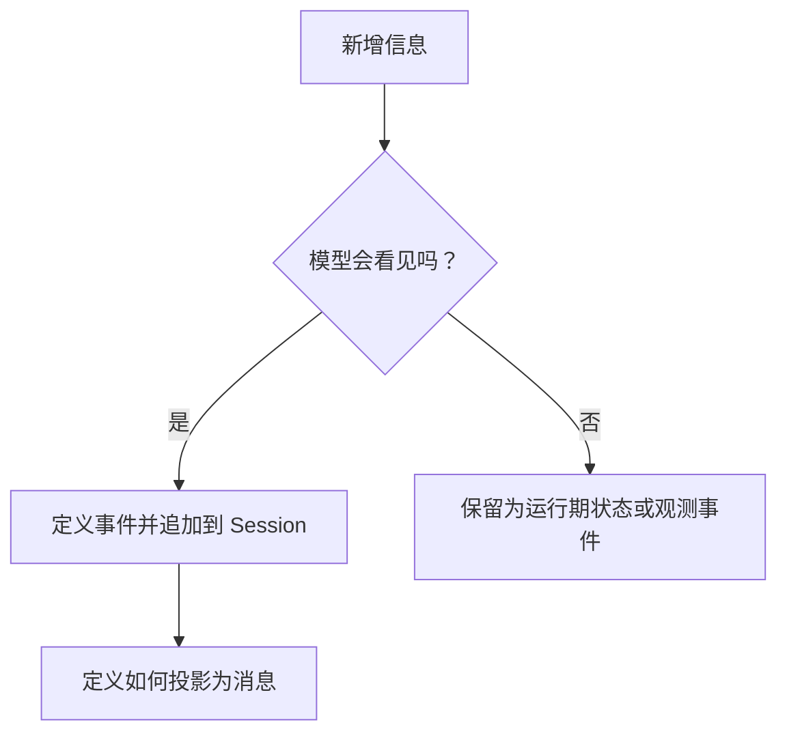

# 会话日志、历史与恢复

[[00 - 学习路线与代码地图|返回学习索引]] · [[05 - 能力、模型与工具|上一章]]

Agent 最容易出错的地方是状态。若历史只存在某个内存数组中，重启后无法继续；若界面、存储和模型各自维护一份历史，它们迟早会不一致。

DeepSeek Harness 使用追加式会话日志解决这个问题。`Session` 只追加事件；模型历史、界面显示、恢复和部分遥测都从同一份事件推导。

## 从事件到模型历史

```mermaid
flowchart LR
    Input[用户消息] --> E1[user/message]
    Model[模型 chunk 与完整消息] --> E2[assistant/chunk 与 assistant/message]
    Tool[工具调用与结果] --> E3[tool/call 与 tool/result]
    E1 --> Log[Session 追加式日志]
    E2 --> Log
    E3 --> Log
    Log --> History[deriveMessages()\n模型历史]
    Log --> Persist[持久化]
    Log --> Replay[恢复与重放]
```

`packages/core/session/src/types.ts` 的 `SessionEventMap` 定义事件名称和事件数据。`packages/core/session/src/index.ts` 的 `Session.append()` 接受事件并给它分配连续序号。`Session.deriveMessages()` 则把其中能形成模型消息的事件投影为历史。

## 事件与消息不是一回事

| 内容 | 是否写入日志 | 是否直接进入模型历史 |
| --- | --- | --- |
| `turn/start`、`turn/end` | 是 | 否 |
| `assistant/chunk` | 是 | 否 |
| `user/message` | 是 | 是 |
| `assistant/message` | 是 | 是 |
| `tool/call` | 是 | 否 |
| `tool/result` | 是 | 是 |

一个事件可以是运行记录，却不需要让模型看见。例如 chunk 用于重放流式输出，`tool/call` 用于保留模型发起调用的事实；最终 `assistant/message` 和 `tool/result` 才会进入模型历史。

## 为什么要求“模型可见的内容必须有记录”

假设你在模型请求前临时拼入一段文本，但没有记录它。恢复 Agent 后，下一次生成的请求将缺少这段文本；同一会话会得出不同结果。

因此规则很简单：凡是会进入模型请求的新增信息，都要设计对应的事件和投影方式。临时的取消信号、正在运行的 Promise 等执行状态则不应伪装成历史消息。



## 恢复不是“重新开始”

恢复时，`Session` 从已有事件构造自己，再从同一份日志推导消息历史。Agent 循环读取这个历史继续下一步。只要事件序列与投影规则稳定，恢复后的模型请求就能保留需要的上下文。

这也是工具结果必须记录的原因：模型在下一步决定如何回答时，需要知道工具返回了什么。

## 自己实现时的最小事件集

你的第一个 Agent 不必复制项目所有事件，但建议至少有：

```ts
type Event =
  | { type: 'user'; text: string }
  | { type: 'assistant'; content: ContentBlock[] }
  | { type: 'tool-call'; name: string; args: unknown }
  | { type: 'tool-result'; name: string; content: string; isError?: boolean }
  | { type: 'turn-start' }
  | { type: 'turn-end'; reason: 'completed' | 'error' }
```

再写一个纯函数 `deriveMessages(events)`。它输入相同事件时必须返回相同历史；不要让它依赖当前时间、网络或可变的全局状态。

## 练习：手动重建历史

1. 写出一组事件：用户问“2 加 3 是多少”、模型请求 `add`、工具返回 `5`、模型回答“答案是 5”。
2. 只保留应进入模型历史的部分，按顺序写成消息数组。
3. 假设程序在工具结果后崩溃。恢复后，下一次模型请求还缺什么？

正确结论是：只要 `tool/result` 已经写入日志，就不缺工具结果；循环可以继续请求模型。若工具结果只保存在内存变量中，则无法可靠恢复。

继续阅读：[[07 - 实现一个不依赖界面的 Agent 核心]]。
