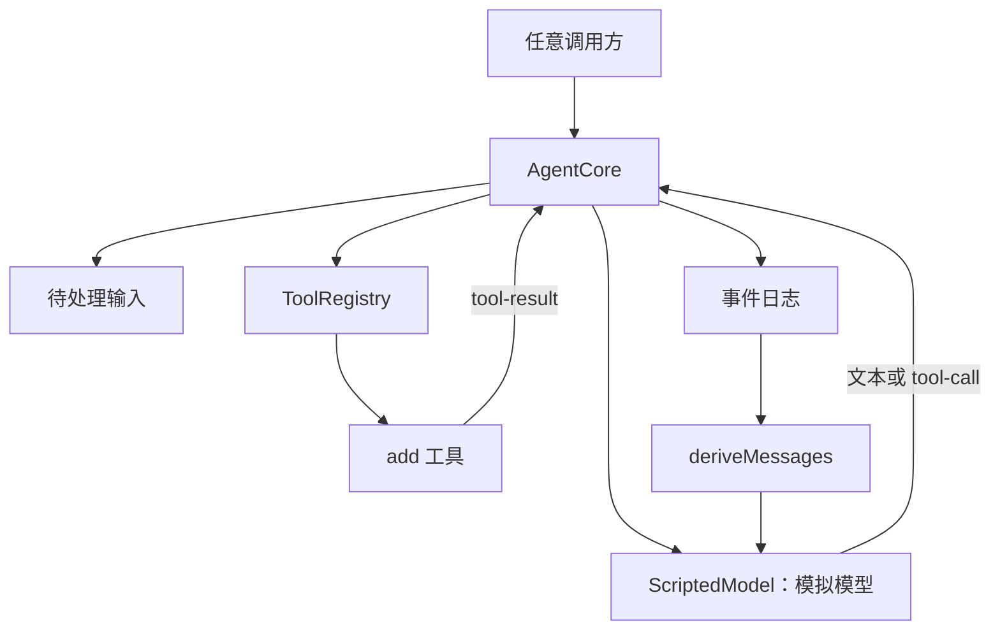
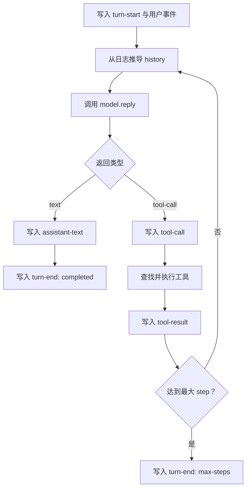

# 实现一个不依赖界面的 Agent 核心

[[00 - 学习路线与代码地图|返回学习索引]] · [[06 - 会话日志、历史与恢复|上一章]]

本章的成果是一个不依赖 Web、命令行或 API Key 的 Agent 核心。它接收消息，调用模拟模型；模拟模型可以要求调用工具；核心记录事件并把工具结果送进下一次模型请求。

这里不要求你复制 DeepSeek Harness 的完整实现。目标是先掌握不可省略的职责，再回头阅读项目中更完整的并发、取消、恢复和插件机制。

## 目标结构



调用方可以是测试、定时任务、网页或命令行，但 `AgentCore` 不应关心它是哪一种。

## 先定义最小数据模型

先把输入、模型输出和事件分开。下面是教学骨架；可在新 TypeScript 项目中逐步补全。

```ts
type Message =
  | { role: 'user'; text: string }
  | { role: 'assistant'; text: string }
  | { role: 'tool'; name: string; text: string }

type ModelReply =
  | { kind: 'text'; text: string }
  | { kind: 'tool-call'; id: string; name: string; args: unknown }

type Event =
  | { type: 'turn-start' }
  | { type: 'user'; text: string }
  | { type: 'assistant-text'; text: string }
  | { type: 'tool-call'; id: string; name: string; args: unknown }
  | { type: 'tool-result'; id: string; name: string; text: string; isError: boolean }
  | { type: 'turn-end'; reason: 'completed' | 'max-steps' | 'error' }

interface Model {
  reply(history: readonly Message[], tools: readonly Tool[]): Promise<ModelReply>
}

interface Tool {
  readonly name: string
  run(args: unknown): Promise<string>
}
```

每次追加 `Event` 时都应只追加，不修改过去的事件。`deriveMessages(events)` 只读取事件，按顺序产生模型历史；`tool-call` 留在日志中，而 `tool-result` 才转换成 `role: 'tool'` 消息。

## 再实现循环，而不是递归回调

循环应该有明确的停止条件。最小版本可以限制每个 turn 的最大 step 数；这样模拟模型即使持续要求调用工具，也不会无限运行。



核心循环可从下面开始：

```ts
class AgentCore {
  private readonly events: Event[] = []

  constructor(
    private readonly model: Model,
    private readonly tools: Map<string, Tool>,
    private readonly maxSteps = 8,
  ) {}

  async run(text: string): Promise<void> {
    this.events.push({ type: 'turn-start' }, { type: 'user', text })

    for (let step = 0; step < this.maxSteps; step++) {
      const reply = await this.model.reply(deriveMessages(this.events), [...this.tools.values()])
      if (reply.kind === 'text') {
        this.events.push({ type: 'assistant-text', text: reply.text })
        this.events.push({ type: 'turn-end', reason: 'completed' })
        return
      }

      this.events.push({ type: 'tool-call', id: reply.id, name: reply.name, args: reply.args })
      const tool = this.tools.get(reply.name)
      try {
        const result = tool === undefined
          ? `unknown tool: ${reply.name}`
          : await tool.run(reply.args)
        this.events.push({ type: 'tool-result', id: reply.id, name: reply.name, text: result, isError: tool === undefined })
      } catch (error) {
        const text = error instanceof Error ? error.message : String(error)
        this.events.push({ type: 'tool-result', id: reply.id, name: reply.name, text, isError: true })
      }
    }

    this.events.push({ type: 'turn-end', reason: 'max-steps' })
  }
}
```

这个骨架刻意省略了并发、流式 chunk、取消和插件框架。先把事件顺序与历史重建写对，再逐项加入这些能力。

## 编写模拟模型

模拟模型不根据自然语言“思考”，而是按调用次数返回预定结果，因此测试完全确定。

```ts
class ScriptedModel implements Model {
  private index = 0

  constructor(private readonly replies: readonly ModelReply[]) {}

  async reply(): Promise<ModelReply> {
    const reply = this.replies[this.index]
    this.index++
    if (reply === undefined) throw new Error('模拟模型没有更多响应')
    return reply
  }
}

const scripted = new ScriptedModel([
  { kind: 'tool-call', id: 'call-1', name: 'add', args: { a: 2, b: 3 } },
  { kind: 'text', text: '答案是 5。' },
])
```

这里的 `reply()` 可以接受但不使用 `history` 和 `tools` 参数；真实测试里应断言第二次调用看到 `tool-result`，以验证状态传递正确。

## 用测试判断是否完成

| 场景 | 应验证的结果 |
| --- | --- |
| 直接文本回答 | `user` 后有 `assistant-text`，最后为 `turn-end: completed` |
| 一次工具调用 | 有 `tool-call` 和对应 `tool-result`，模型被调用两次 |
| 工具不存在 | 写入错误 `tool-result`，循环仍能让模型处理错误 |
| 工具抛错 | 错误被转为 `tool-result`，不是丢失状态 |
| 无限工具调用 | 达到 `maxSteps` 后写入 `turn-end: max-steps` |
| 重放历史 | 相同事件传给 `deriveMessages()` 时得到相同消息 |

## 与 DeepSeek Harness 的对应关系

| 你的最小实现 | 项目中的更完整实现 |
| --- | --- |
| `AgentCore.run()` | `ReactLoopAgent`，位于 `packages/core/agent-loop/src/agent.ts` |
| `events` 与 `deriveMessages()` | `Session`，位于 `packages/core/session` |
| `Model` | `LlmAdapter` 与 `LlmRuntime`，位于 `packages/llm/llm` |
| `Tool` 与工具映射 | `ToolRuntime`，位于 `packages/core/tools` |
| 最大步数 | 项目中的 turn/step 生命周期、取消和策略插件 |

## 最终练习

1. 实现 `add` 工具，拒绝非数字参数。
2. 实现 `deriveMessages(events)`，让工具结果成为 `role: 'tool'` 消息。
3. 用 `ScriptedModel` 跑完“2 加 3”的两步场景。
4. 写一个测试，断言事件顺序和第二次模型调用收到的历史。
5. 在实现稳定后，回到 `packages/examples/agent-spine-demo`，找出项目如何把同样的责任拆成插件。

> [!success] 到这里你已经具备核心能力
> 你可以自行实现一个不依赖具体对话介质的 Agent：它有输入、状态、模型、工具、循环和停止条件。接下来再学习插件、并发、持久化或 UI，都是在这个核心之上增加能力。

回到 [[00 - 学习路线与代码地图|学习索引]]，按你的兴趣选择一个扩展模块继续阅读。
