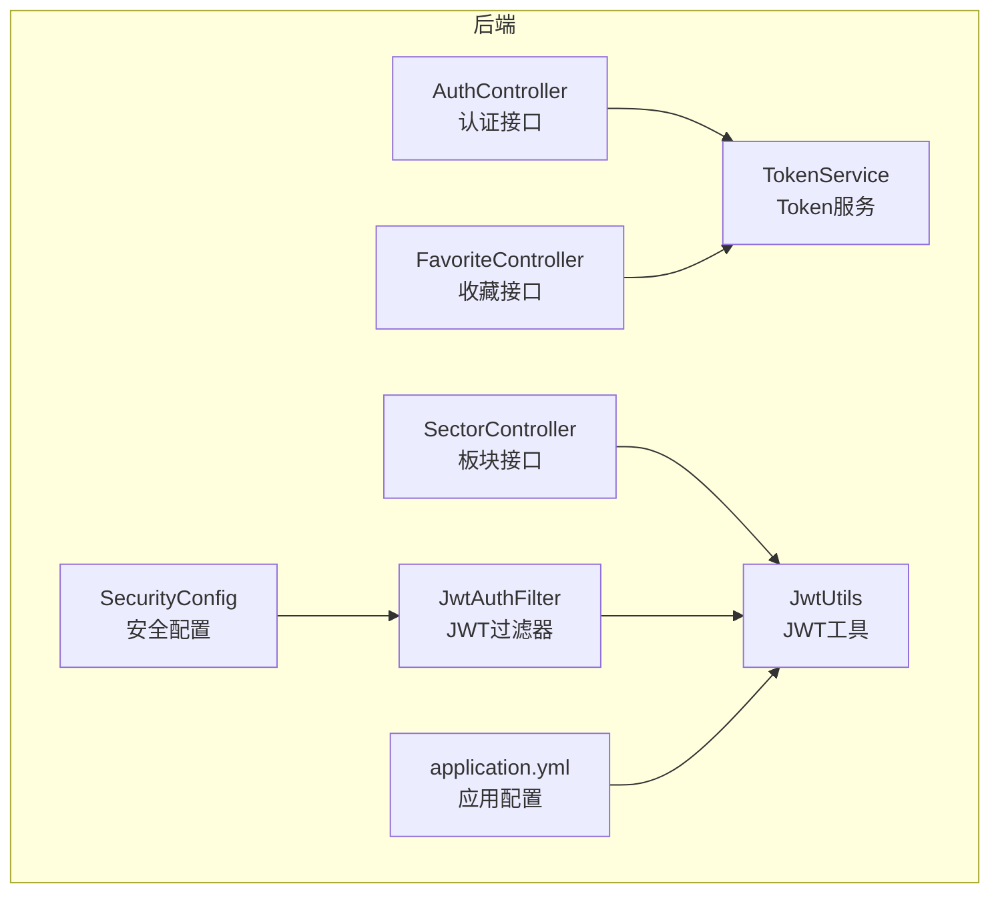
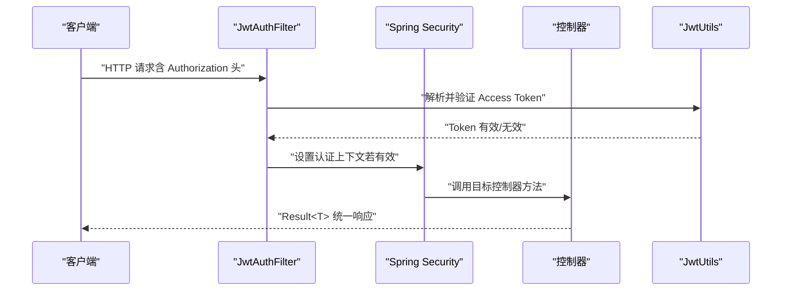
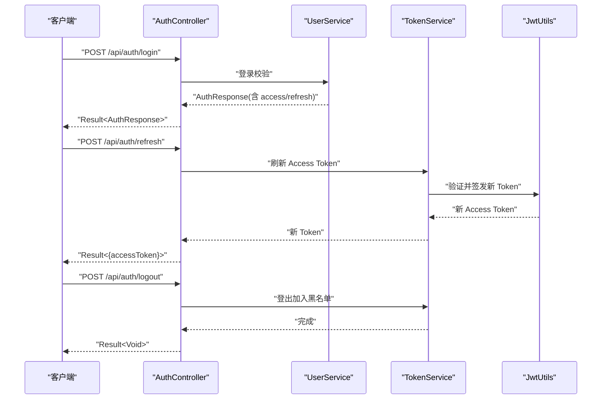
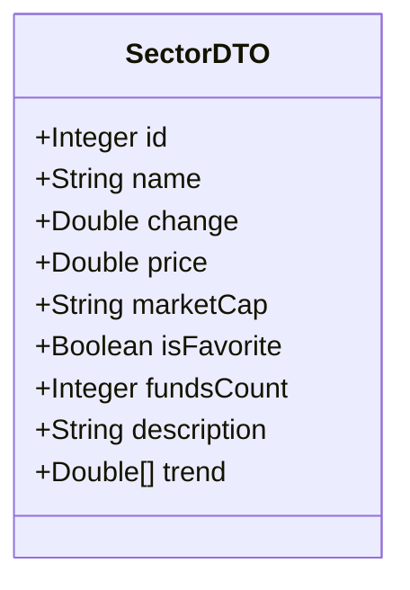
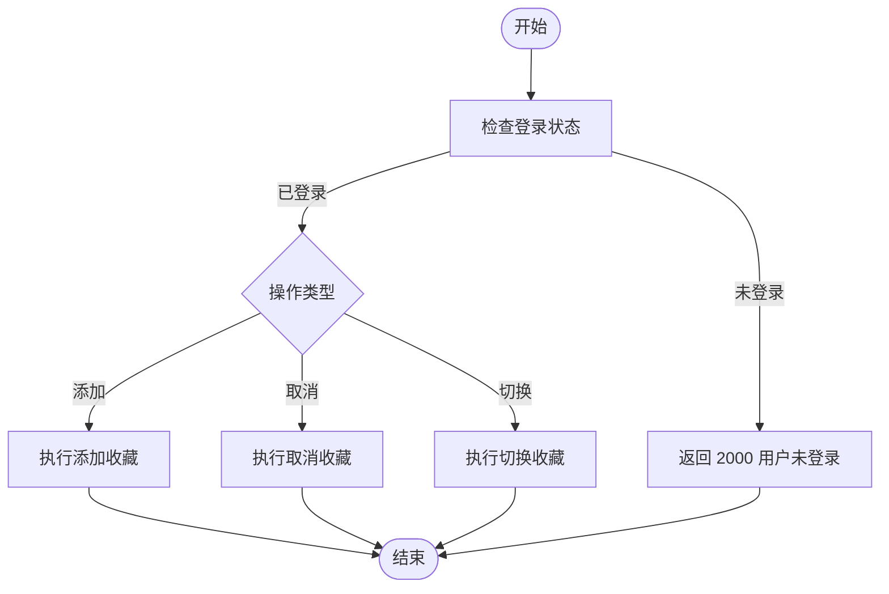
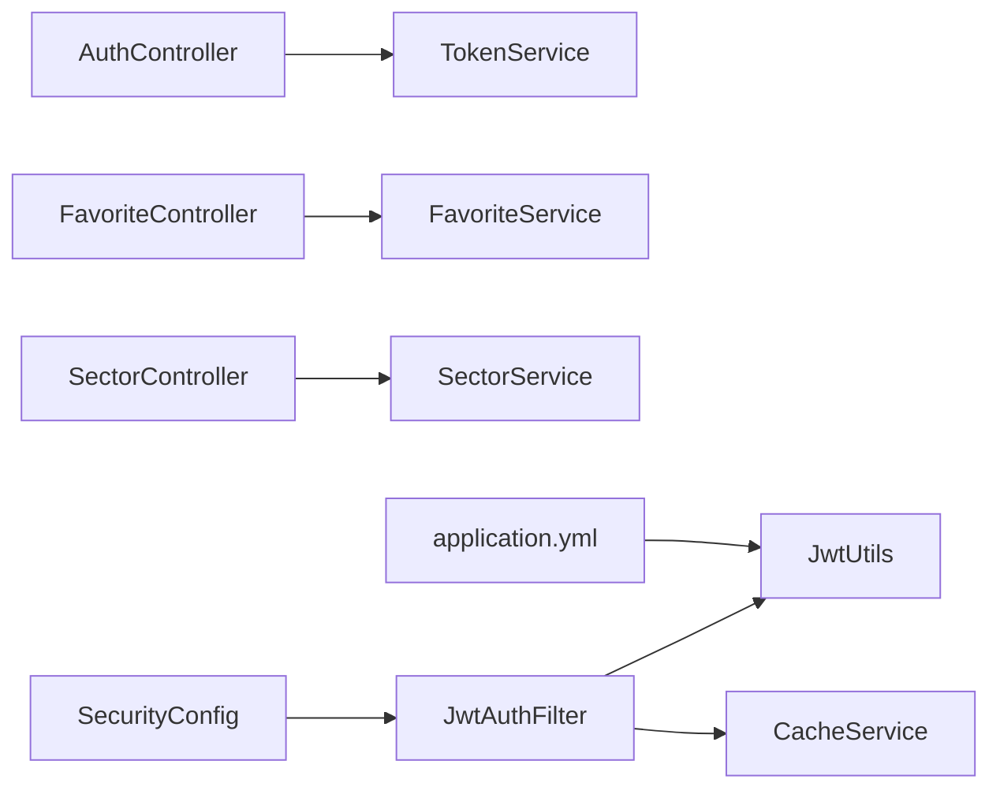

# API 接口文档

<cite>
**本文引用的文件**
- [AuthController.java](file://backend/src/main/java/com/freetrader/controller/AuthController.java)
- [FavoriteController.java](file://backend/src/main/java/com/freetrader/controller/FavoriteController.java)
- [SectorController.java](file://backend/src/main/java/com/freetrader/controller/SectorController.java)
- [LoginRequest.java](file://backend/src/main/java/com/freetrader/dto/LoginRequest.java)
- [RegisterRequest.java](file://backend/src/main/java/com/freetrader/dto/RegisterRequest.java)
- [RefreshTokenRequest.java](file://backend/src/main/java/com/freetrader/dto/RefreshTokenRequest.java)
- [AuthResponse.java](file://backend/src/main/java/com/freetrader/dto/AuthResponse.java)
- [Result.java](file://backend/src/main/java/com/freetrader/dto/Result.java)
- [SectorDTO.java](file://backend/src/main/java/com/freetrader/dto/SectorDTO.java)
- [JwtUtils.java](file://backend/src/main/java/com/freetrader/security/JwtUtils.java)
- [TokenService.java](file://backend/src/main/java/com/freetrader/service/TokenService.java)
- [SecurityConfig.java](file://backend/src/main/java/com/freetrader/config/SecurityConfig.java)
- [JwtAuthFilter.java](file://backend/src/main/java/com/freetrader/security/JwtAuthFilter.java)
- [SecurityConstants.java](file://backend/src/main/java/com/freetrader/util/SecurityConstants.java)
- [ErrorCode.java](file://backend/src/main/java/com/freetrader/exception/ErrorCode.java)
- [application.yml](file://backend/src/main/resources/application.yml)
- [api.ts](file://frontend/src/lib/api.ts)
</cite>

## 目录
1. [简介](#简介)
2. [项目结构](#项目结构)
3. [核心组件](#核心组件)
4. [架构总览](#架构总览)
5. [详细组件分析](#详细组件分析)
6. [依赖关系分析](#依赖关系分析)
7. [性能与安全考量](#性能与安全考量)
8. [故障排查指南](#故障排查指南)
9. [结论](#结论)
10. [附录](#附录)

## 简介
本文件为 FreeTrader 项目的完整 API 接口文档，覆盖认证、板块与收藏三大模块。文档面向前端与第三方集成开发者，提供端点规范、认证机制、参数校验、错误处理、版本与兼容性说明，并给出客户端集成与常见使用场景的参考实现。

## 项目结构
后端采用 Spring Boot 架构，控制器位于 controller 包，统一以 /api 前缀暴露 RESTful 接口；认证通过 JWT 实现，基于 Spring Security 的无状态过滤器链进行鉴权；数据传输对象（DTO）集中于 dto 包；业务逻辑由 service 层承载；配置集中在 config 与 resources 下。

图表来源
- [AuthController.java](file://backend/src/main/java/com/freetrader/controller/AuthController.java#L19-L71)
- [FavoriteController.java](file://backend/src/main/java/com/freetrader/controller/FavoriteController.java#L25-L89)
- [SectorController.java](file://backend/src/main/java/com/freetrader/controller/SectorController.java#L22-L62)
- [SecurityConfig.java](file://backend/src/main/java/com/freetrader/config/SecurityConfig.java#L29-L46)
- [JwtAuthFilter.java](file://backend/src/main/java/com/freetrader/security/JwtAuthFilter.java#L31-L82)
- [JwtUtils.java](file://backend/src/main/java/com/freetrader/security/JwtUtils.java#L21-L194)
- [TokenService.java](file://backend/src/main/java/com/freetrader/service/TokenService.java#L13-L63)
- [application.yml](file://backend/src/main/resources/application.yml#L60-L66)

章节来源
- [AuthController.java](file://backend/src/main/java/com/freetrader/controller/AuthController.java#L19-L71)
- [FavoriteController.java](file://backend/src/main/java/com/freetrader/controller/FavoriteController.java#L25-L89)
- [SectorController.java](file://backend/src/main/java/com/freetrader/controller/SectorController.java#L22-L62)
- [SecurityConfig.java](file://backend/src/main/java/com/freetrader/config/SecurityConfig.java#L29-L46)
- [JwtAuthFilter.java](file://backend/src/main/java/com/freetrader/security/JwtAuthFilter.java#L31-L82)
- [JwtUtils.java](file://backend/src/main/java/com/freetrader/security/JwtUtils.java#L21-L194)
- [TokenService.java](file://backend/src/main/java/com/freetrader/service/TokenService.java#L13-L63)
- [application.yml](file://backend/src/main/resources/application.yml#L60-L66)

## 核心组件
- 统一响应包装 Result<T>：所有接口返回统一结构，包含 code、message、data 字段，便于前端一致处理。
- DTO 对象：如 AuthResponse、SectorDTO 等，用于封装请求与响应数据结构。
- 安全常量：SecurityConstants 定义了 Authorization 头、Bearer 前缀、Token 类型等常量。
- 错误码：ErrorCode 定义了系统、认证、用户、业务等错误码，便于错误分类与国际化。

章节来源
- [Result.java](file://backend/src/main/java/com/freetrader/dto/Result.java#L10-L30)
- [AuthResponse.java](file://backend/src/main/java/com/freetrader/dto/AuthResponse.java#L12-L18)
- [SectorDTO.java](file://backend/src/main/java/com/freetrader/dto/SectorDTO.java#L12-L22)
- [SecurityConstants.java](file://backend/src/main/java/com/freetrader/util/SecurityConstants.java#L12-L41)
- [ErrorCode.java](file://backend/src/main/java/com/freetrader/exception/ErrorCode.java#L8-L35)

## 架构总览
FreeTrader 后端采用无状态 JWT 认证，通过自定义过滤器在每次请求进入时解析并验证 Access Token，匹配用户权限后放行到对应控制器。认证接口无需登录即可访问，板块接口对匿名用户开放，收藏接口需要携带有效 Bearer Token。

图表来源
- [JwtAuthFilter.java](file://backend/src/main/java/com/freetrader/security/JwtAuthFilter.java#L31-L82)
- [JwtUtils.java](file://backend/src/main/java/com/freetrader/security/JwtUtils.java#L138-L154)
- [SecurityConfig.java](file://backend/src/main/java/com/freetrader/config/SecurityConfig.java#L30-L46)

章节来源
- [SecurityConfig.java](file://backend/src/main/java/com/freetrader/config/SecurityConfig.java#L29-L46)
- [JwtAuthFilter.java](file://backend/src/main/java/com/freetrader/security/JwtAuthFilter.java#L31-L82)
- [JwtUtils.java](file://backend/src/main/java/com/freetrader/security/JwtUtils.java#L138-L154)

## 详细组件分析

### 认证接口
- 基础路径：/api/auth
- 认证方式：Bearer Token（Access Token）
- 速率限制：登录与注册接口分别配置 IP 级限流

接口一览
- POST /api/auth/login
  - 功能：用户登录，返回 AccessToken 与 RefreshToken
  - 请求体：LoginRequest（用户名、密码）
  - 成功响应：Result<AuthResponse>
  - 失败响应：401 未授权（用户名或密码错误）
  - 速率限制：每 IP 60 秒最多 5 次
  - 参数校验：用户名与密码均非空
  - 参考示例：见“附录/请求与响应示例”

- POST /api/auth/register
  - 功能：用户注册并自动登录
  - 请求体：RegisterRequest（用户名、邮箱、密码）
  - 成功响应：Result<AuthResponse>
  - 失败响应：400 参数冲突（用户名或邮箱已存在）
  - 速率限制：每 IP 60 秒最多 3 次
  - 参数校验：用户名长度 3-50、邮箱格式正确、密码长度 6-100

- POST /api/auth/refresh
  - 功能：使用 Refresh Token 刷新 Access Token
  - 请求体：RefreshTokenRequest（refreshToken）
  - 成功响应：Result<{ accessToken }>
  - 失败响应：401 令牌无效或已过期
  - 参数校验：refreshToken 非空

- POST /api/auth/logout
  - 功能：登出，将当前 Access/Refresh Token 加入黑名单
  - 请求体：LogoutRequest（accessToken、refreshToken）
  - 成功响应：Result<Void>
  - 参数校验：可为空（按实际传入的 Token 处理）

认证流程（登录 → 刷新 Token → 登出）

图表来源
- [AuthController.java](file://backend/src/main/java/com/freetrader/controller/AuthController.java#L28-L70)
- [TokenService.java](file://backend/src/main/java/com/freetrader/service/TokenService.java#L18-L55)
- [JwtUtils.java](file://backend/src/main/java/com/freetrader/security/JwtUtils.java#L100-L133)

章节来源
- [AuthController.java](file://backend/src/main/java/com/freetrader/controller/AuthController.java#L28-L70)
- [LoginRequest.java](file://backend/src/main/java/com/freetrader/dto/LoginRequest.java#L7-L14)
- [RegisterRequest.java](file://backend/src/main/java/com/freetrader/dto/RegisterRequest.java#L9-L22)
- [RefreshTokenRequest.java](file://backend/src/main/java/com/freetrader/dto/RefreshTokenRequest.java#L7-L10)
- [AuthResponse.java](file://backend/src/main/java/com/freetrader/dto/AuthResponse.java#L12-L18)
- [TokenService.java](file://backend/src/main/java/com/freetrader/service/TokenService.java#L18-L55)
- [JwtUtils.java](file://backend/src/main/java/com/freetrader/security/JwtUtils.java#L100-L133)

### 板块接口
- 基础路径：/api/sectors
- 访问权限：匿名开放（无需登录）

接口一览
- GET /api/sectors
  - 功能：获取所有 ETF 板块列表，包含平均涨跌幅、最新净值、是否收藏、历史趋势等
  - 成功响应：Result<List<SectorDTO>>
  - 返回字段：id、name、change、price、marketCap、isFavorite、fundsCount、description、trend

- GET /api/sectors/{id}
  - 功能：获取指定板块详情，包含旗下表现最好 ETF 列表等
  - 路径参数：id（整数）
  - 成功响应：Result<Map<String,Object>>
  - 失败响应：404 板块不存在

板块数据模型（SectorDTO）

图表来源
- [SectorDTO.java](file://backend/src/main/java/com/freetrader/dto/SectorDTO.java#L12-L22)

章节来源
- [SectorController.java](file://backend/src/main/java/com/freetrader/controller/SectorController.java#L41-L61)
- [SectorDTO.java](file://backend/src/main/java/com/freetrader/dto/SectorDTO.java#L12-L22)

### 收藏接口
- 基础路径：/api/favorites
- 访问权限：需要 Bearer Token（登录态）
- 当用户未登录时，接口抛出“用户未登录”错误

接口一览
- GET /api/favorites
  - 功能：获取当前用户收藏的所有板块
  - 成功响应：Result<List<SectorDTO>>

- POST /api/favorites/{cid}
  - 功能：添加收藏
  - 路径参数：cid（板块ID）
  - 成功响应：Result<Void>
  - 失败响应：400 已收藏该板块

- DELETE /api/favorites/{cid}
  - 功能：取消收藏
  - 路径参数：cid（板块ID）
  - 成功响应：Result<Void>
  - 失败响应：400 未收藏该板块

- POST /api/favorites/{cid}/toggle
  - 功能：切换收藏状态（已收藏则取消，未收藏则添加）
  - 路径参数：cid（板块ID）
  - 成功响应：Result<{ isFavorite: boolean }>

收藏流程（添加/取消/切换）

图表来源
- [FavoriteController.java](file://backend/src/main/java/com/freetrader/controller/FavoriteController.java#L35-L88)
- [ErrorCode.java](file://backend/src/main/java/com/freetrader/exception/ErrorCode.java#L19-L19)

章节来源
- [FavoriteController.java](file://backend/src/main/java/com/freetrader/controller/FavoriteController.java#L45-L88)
- [ErrorCode.java](file://backend/src/main/java/com/freetrader/exception/ErrorCode.java#L19-L19)

## 依赖关系分析
- 控制器依赖服务层：AuthController 依赖 UserService 与 TokenService；FavoriteController 依赖 FavoriteService 与 UserService；SectorController 依赖 SectorService 与 UserService。
- 安全过滤器依赖 JwtUtils 与 CacheService，负责解析与校验 Token 并注入认证上下文。
- 应用配置提供 JWT 密钥、过期时间、Redis 缓存等运行时参数。

图表来源
- [AuthController.java](file://backend/src/main/java/com/freetrader/controller/AuthController.java#L25-L26)
- [FavoriteController.java](file://backend/src/main/java/com/freetrader/controller/FavoriteController.java#L32-L33)
- [SectorController.java](file://backend/src/main/java/com/freetrader/controller/SectorController.java#L28-L29)
- [JwtAuthFilter.java](file://backend/src/main/java/com/freetrader/security/JwtAuthFilter.java#L27-L29)
- [SecurityConfig.java](file://backend/src/main/java/com/freetrader/config/SecurityConfig.java#L25-L27)
- [application.yml](file://backend/src/main/resources/application.yml#L60-L66)

章节来源
- [AuthController.java](file://backend/src/main/java/com/freetrader/controller/AuthController.java#L25-L26)
- [FavoriteController.java](file://backend/src/main/java/com/freetrader/controller/FavoriteController.java#L32-L33)
- [SectorController.java](file://backend/src/main/java/com/freetrader/controller/SectorController.java#L28-L29)
- [JwtAuthFilter.java](file://backend/src/main/java/com/freetrader/security/JwtAuthFilter.java#L27-L29)
- [SecurityConfig.java](file://backend/src/main/java/com/freetrader/config/SecurityConfig.java#L25-L27)
- [application.yml](file://backend/src/main/resources/application.yml#L60-L66)

## 性能与安全考量
- 无状态会话：基于 JWT 的无状态设计，适合水平扩展。
- 速率限制：登录与注册接口内置限流，防止暴力破解与刷单。
- Token 黑名单：登出时将 Access/Refresh Token 加入缓存黑名单，避免被继续使用。
- 过期策略：Access Token 过期时间短（默认 1 小时），Refresh Token 过期时间较长（默认 7 天），配合刷新接口降低频繁登录成本。
- CORS 与 CSRF：已禁用 CSRF，开启跨域支持，具体策略可在 SecurityConfig 中调整。
- 前端拦截：前端 axios 在请求头自动附加 Bearer Token，并在 401 时清理本地存储并跳转登录页。

章节来源
- [SecurityConfig.java](file://backend/src/main/java/com/freetrader/config/SecurityConfig.java#L30-L46)
- [TokenService.java](file://backend/src/main/java/com/freetrader/service/TokenService.java#L41-L55)
- [application.yml](file://backend/src/main/resources/application.yml#L60-L66)
- [api.ts](file://frontend/src/lib/api.ts#L13-L37)

## 故障排查指南
- 401 未授权
  - 可能原因：缺少 Authorization 头、Token 不是 Access Token、Token 已过期或被加入黑名单
  - 处理建议：重新登录获取新 Token，或使用 Refresh Token 刷新
  - 参考：JwtAuthFilter 与 JwtUtils 的验证逻辑

- 400 参数校验失败
  - 可能原因：用户名/邮箱/密码不符合规则，或收藏相关业务错误（已收藏/未收藏）
  - 处理建议：根据提示修正输入或检查收藏状态

- 500 系统内部错误
  - 可能原因：服务异常或未知错误
  - 处理建议：查看后端日志定位问题

章节来源
- [JwtAuthFilter.java](file://backend/src/main/java/com/freetrader/security/JwtAuthFilter.java#L49-L60)
- [JwtUtils.java](file://backend/src/main/java/com/freetrader/security/JwtUtils.java#L138-L154)
- [ErrorCode.java](file://backend/src/main/java/com/freetrader/exception/ErrorCode.java#L10-L35)

## 结论
本 API 文档覆盖 FreeTrader 的认证、板块与收藏三大核心功能，明确了端点、认证机制、参数校验与错误处理。结合前后端实现，开发者可快速集成并稳定运行。

## 附录

### 认证机制与 Token 使用
- 请求头格式：Authorization: Bearer <AccessToken>
- 刷新策略：当 Access Token 过期时，使用 Refresh Token 调用刷新接口获取新 Access Token
- 登出策略：调用登出接口将当前 Access/Refresh Token 加入黑名单，立即失效

章节来源
- [SecurityConstants.java](file://backend/src/main/java/com/freetrader/util/SecurityConstants.java#L18-L25)
- [TokenService.java](file://backend/src/main/java/com/freetrader/service/TokenService.java#L41-L55)
- [JwtUtils.java](file://backend/src/main/java/com/freetrader/security/JwtUtils.java#L100-L133)

### 请求与响应示例
以下为典型请求与响应的结构示例（字段与含义参见各 DTO 与控制器定义）：

- 登录请求
  - 请求体：{ "username": "...", "password": "..." }
  - 成功响应：{ "code": 200, "message": "success", "data": { "accessToken", "refreshToken", "userId", "username", "email" } }

- 注册请求
  - 请求体：{ "username": "...", "email": "...", "password": "..." }
  - 成功响应：同登录成功响应

- 刷新 Token 请求
  - 请求体：{ "refreshToken": "..." }
  - 成功响应：{ "code": 200, "message": "success", "data": { "accessToken": "..." } }

- 获取板块列表
  - 请求：GET /api/sectors
  - 成功响应：{ "code": 200, "message": "success", "data": [ { "id","name","change","price","marketCap","isFavorite","fundsCount","description","trend" }, ... ] }

- 获取板块详情
  - 请求：GET /api/sectors/{id}
  - 成功响应：{ "code": 200, "message": "success", "data": { ... } }

- 获取收藏列表
  - 请求：GET /api/favorites
  - 成功响应：{ "code": 200, "message": "success", "data": [ { ... }, ... ] }

- 添加/取消/切换收藏
  - 添加：POST /api/favorites/{cid}
  - 取消：DELETE /api/favorites/{cid}
  - 切换：POST /api/favorites/{cid}/toggle
  - 成功响应：{ "code": 200, "message": "success", "data": null 或 { "isFavorite": true/false } }

章节来源
- [AuthController.java](file://backend/src/main/java/com/freetrader/controller/AuthController.java#L35-L61)
- [SectorController.java](file://backend/src/main/java/com/freetrader/controller/SectorController.java#L43-L61)
- [FavoriteController.java](file://backend/src/main/java/com/freetrader/controller/FavoriteController.java#L47-L88)
- [Result.java](file://backend/src/main/java/com/freetrader/dto/Result.java#L15-L29)
- [AuthResponse.java](file://backend/src/main/java/com/freetrader/dto/AuthResponse.java#L12-L18)
- [SectorDTO.java](file://backend/src/main/java/com/freetrader/dto/SectorDTO.java#L12-L22)

### 参数验证规则
- 登录：用户名与密码均非空
- 注册：用户名长度 3-50、邮箱格式正确、密码长度 6-100
- 刷新：refreshToken 非空
- 收藏：cid 为整数路径参数

章节来源
- [LoginRequest.java](file://backend/src/main/java/com/freetrader/dto/LoginRequest.java#L7-L14)
- [RegisterRequest.java](file://backend/src/main/java/com/freetrader/dto/RegisterRequest.java#L9-L22)
- [RefreshTokenRequest.java](file://backend/src/main/java/com/freetrader/dto/RefreshTokenRequest.java#L7-L10)

### 错误码对照
- 通用错误：1xxx
- 认证错误：2xxx（未授权、Token 无效/过期、刷新 Token 无效、用户未登录）
- 用户错误：3xxx（用户不存在、用户名/邮箱已存在、密码错误）
- 业务错误：4xxx（板块不存在、已收藏/未收藏）

章节来源
- [ErrorCode.java](file://backend/src/main/java/com/freetrader/exception/ErrorCode.java#L8-L35)

### API 版本控制与兼容性
- 当前未显式使用 URL 版本前缀（如 /api/v1），建议后续引入 /api/v1 作为稳定版本入口，保持向后兼容并在 v2 中谨慎引入破坏性变更。
- Swagger/OpenAPI 文档可通过 /v3/api-docs 与 /swagger-ui.html 访问，便于联调与测试。

章节来源
- [application.yml](file://backend/src/main/resources/application.yml#L92-L102)

### 客户端集成指南
- 基础配置
  - 基础 URL：http://localhost:8080/api
  - 默认 Content-Type：application/json
- 认证
  - 登录/注册成功后保存 accessToken 至本地存储
  - 请求拦截器自动在 Authorization 头添加 Bearer Token
  - 401 时清理本地存储并跳转登录页
- 常见场景
  - 登录：调用 /api/auth/login
  - 获取板块：调用 /api/sectors
  - 收藏管理：调用 /api/favorites 以及 /api/favorites/{cid}、/api/favorites/{cid}/toggle

章节来源
- [api.ts](file://frontend/src/lib/api.ts#L3-L11)
- [api.ts](file://frontend/src/lib/api.ts#L40-L86)