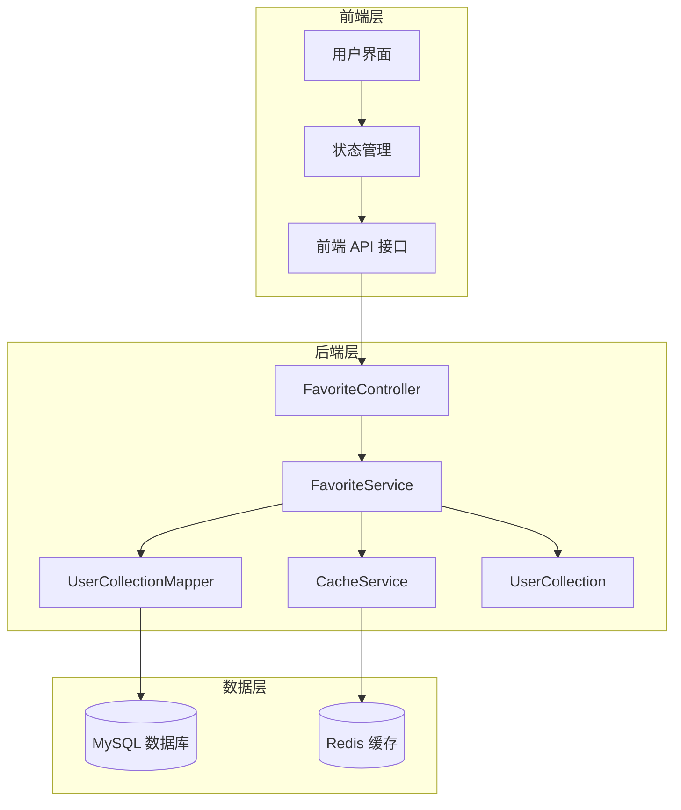
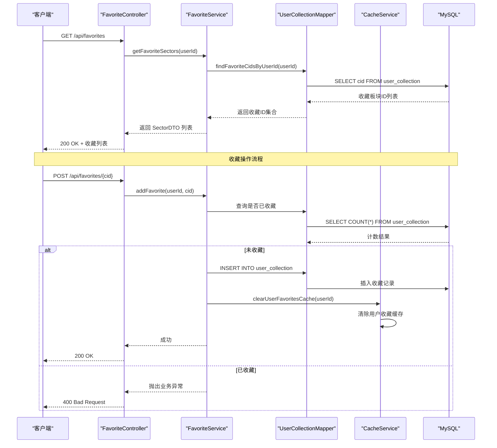
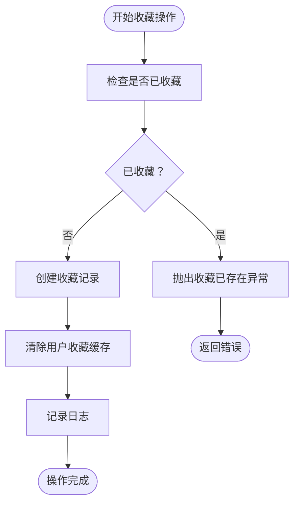
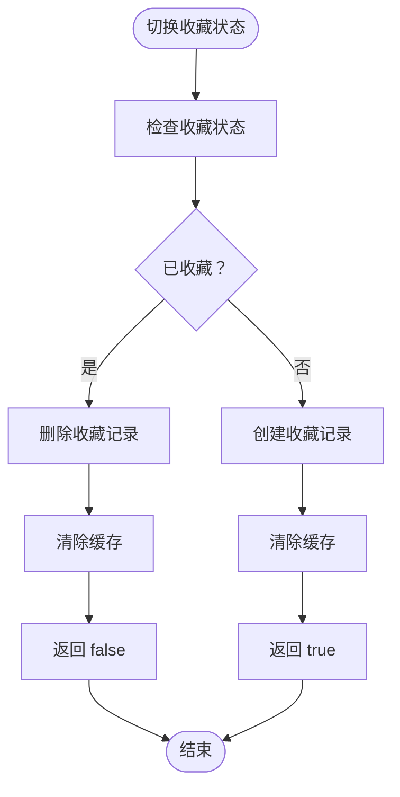
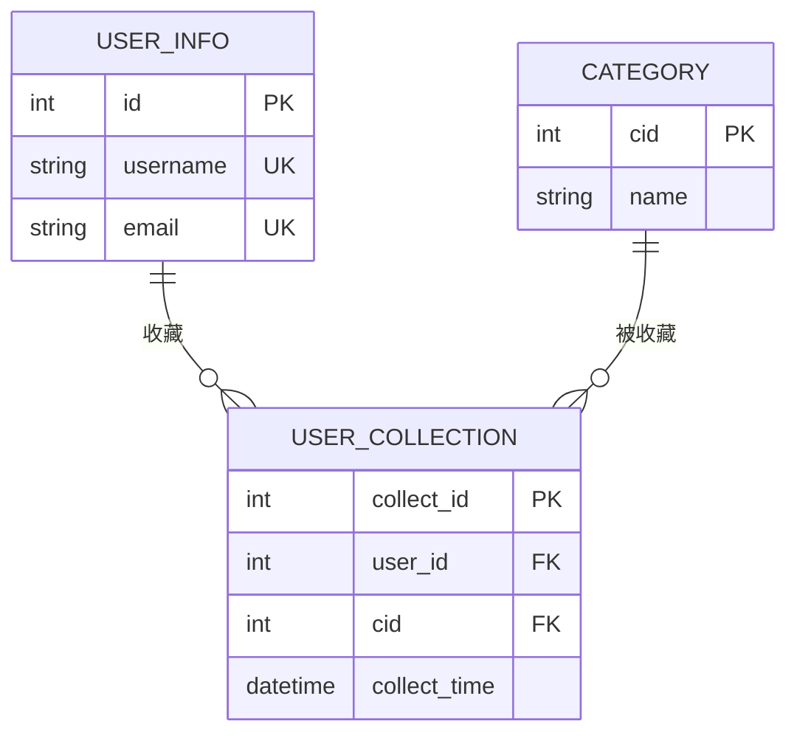
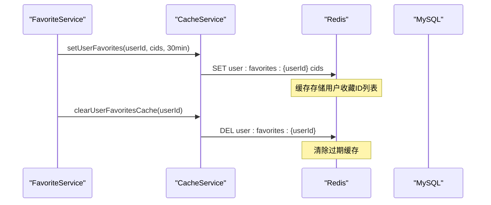
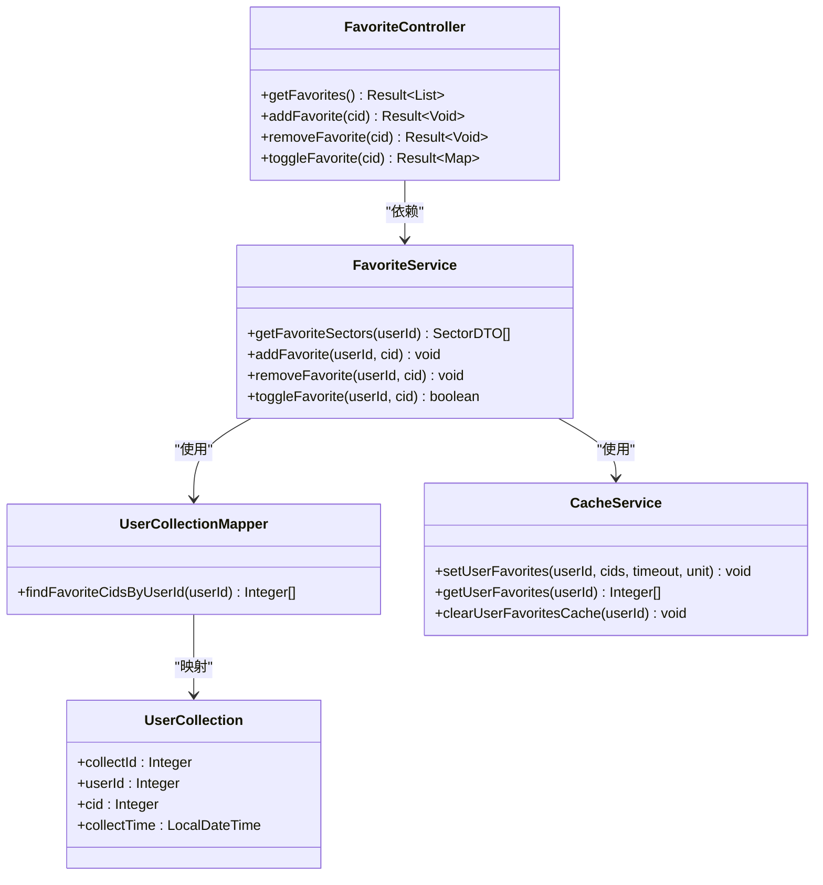
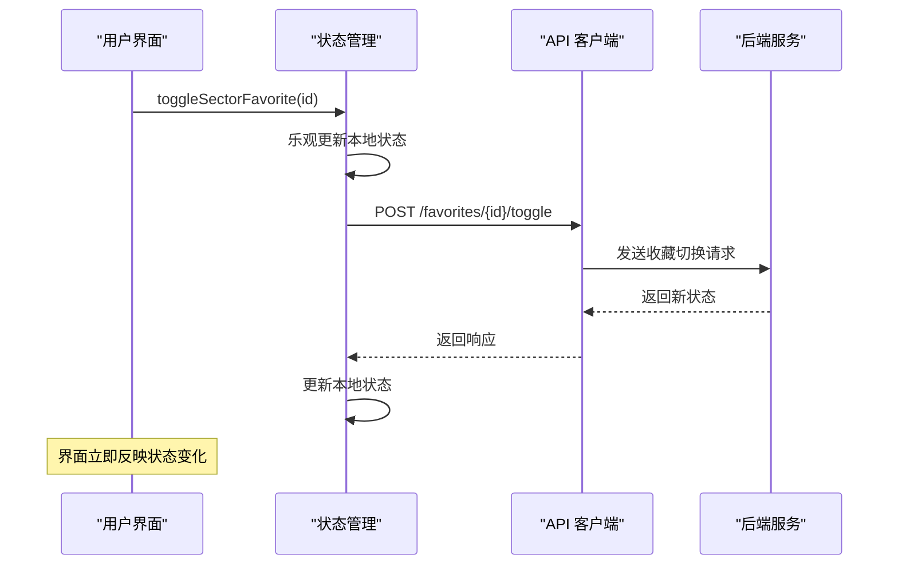

# 收藏接口

<cite>
**本文引用的文件**
- [FavoriteController.java](file://backend/src/main/java/com/freetrader/controller/FavoriteController.java)
- [FavoriteService.java](file://backend/src/main/java/com/freetrader/service/FavoriteService.java)
- [UserCollectionMapper.java](file://backend/src/main/java/com/freetrader/mapper/UserCollectionMapper.java)
- [UserCollection.java](file://backend/src/main/java/com/freetrader/entity/UserCollection.java)
- [Result.java](file://backend/src/main/java/com/freetrader/dto/Result.java)
- [CacheService.java](file://backend/src/main/java/com/freetrader/service/CacheService.java)
- [RedisConfig.java](file://backend/src/main/java/com/freetrader/config/RedisConfig.java)
- [user_collection.sql](file://sql/user_collection.sql)
- [ErrorCode.java](file://backend/src/main/java/com/freetrader/exception/ErrorCode.java)
- [api.ts](file://frontend/src/lib/api.ts)
- [useStore.ts](file://frontend/src/store/useStore.ts)
- [page.tsx](file://frontend/src/app/favorites/page.tsx)
</cite>

## 目录
1. [简介](#简介)
2. [项目结构](#项目结构)
3. [核心组件](#核心组件)
4. [架构概览](#架构概览)
5. [详细组件分析](#详细组件分析)
6. [依赖关系分析](#依赖关系分析)
7. [性能考虑](#性能考虑)
8. [故障排除指南](#故障排除指南)
9. [结论](#结论)
10. [附录](#附录)

## 简介
FreeTrader 项目的收藏管理接口提供了完整的用户板块收藏功能，包括收藏添加、取消收藏、收藏列表查询和收藏状态切换等核心功能。该接口采用 RESTful 设计，支持 JWT 认证，具备完善的错误处理和缓存机制。

## 项目结构
收藏管理功能主要分布在以下层次：
- 控制器层：处理 HTTP 请求和响应
- 服务层：实现业务逻辑和事务管理
- 数据访问层：操作数据库和缓存
- 前端集成：提供用户界面和状态管理



**图表来源**
- [FavoriteController.java](file://backend/src/main/java/com/freetrader/controller/FavoriteController.java#L25-L89)
- [FavoriteService.java](file://backend/src/main/java/com/freetrader/service/FavoriteService.java#L22-L118)
- [CacheService.java](file://backend/src/main/java/com/freetrader/service/CacheService.java#L25-L205)

**章节来源**
- [FavoriteController.java](file://backend/src/main/java/com/freetrader/controller/FavoriteController.java#L1-L90)
- [FavoriteService.java](file://backend/src/main/java/com/freetrader/service/FavoriteService.java#L1-L119)

## 核心组件
收藏管理接口由四个核心组件构成：

### 控制器层
- **FavoriteController**：提供 RESTful API 接口，处理认证和权限控制
- **Result**：统一响应格式，标准化 API 输出

### 服务层
- **FavoriteService**：实现收藏业务逻辑，包含事务管理和缓存清理
- **CacheService**：管理 Redis 缓存，提供用户收藏缓存操作

### 数据访问层
- **UserCollectionMapper**：MyBatis 映射器，负责数据库操作
- **UserCollection**：实体类，映射 user_collection 表结构

**章节来源**
- [FavoriteController.java](file://backend/src/main/java/com/freetrader/controller/FavoriteController.java#L25-L89)
- [FavoriteService.java](file://backend/src/main/java/com/freetrader/service/FavoriteService.java#L18-L118)
- [UserCollectionMapper.java](file://backend/src/main/java/com/freetrader/mapper/UserCollectionMapper.java#L11-L19)
- [UserCollection.java](file://backend/src/main/java/com/freetrader/entity/UserCollection.java#L10-L22)
- [Result.java](file://backend/src/main/java/com/freetrader/dto/Result.java#L10-L30)

## 架构概览
收藏管理采用分层架构设计，确保关注点分离和代码可维护性。



**图表来源**
- [FavoriteController.java](file://backend/src/main/java/com/freetrader/controller/FavoriteController.java#L45-L88)
- [FavoriteService.java](file://backend/src/main/java/com/freetrader/service/FavoriteService.java#L34-L117)
- [UserCollectionMapper.java](file://backend/src/main/java/com/freetrader/mapper/UserCollectionMapper.java#L17-L18)

## 详细组件分析

### 收藏控制器 (FavoriteController)
控制器层提供三个核心接口和一个状态切换接口：

#### 获取收藏列表接口
- **URL**: `GET /api/favorites`
- **功能**: 获取当前用户收藏的所有板块
- **认证**: 需要 Bearer Token
- **响应**: 返回 SectorDTO 对象数组

#### 添加收藏接口
- **URL**: `POST /api/favorites/{cid}`
- **参数**: 路径参数 cid（板块ID）
- **功能**: 收藏指定板块
- **响应**: 成功返回 200，已收藏返回 400

#### 取消收藏接口
- **URL**: `DELETE /api/favorites/{cid}`
- **参数**: 路径参数 cid（板块ID）
- **功能**: 取消收藏指定板块
- **响应**: 成功返回 200，未收藏返回 400

#### 切换收藏状态接口
- **URL**: `POST /api/favorites/{cid}/toggle`
- **参数**: 路径参数 cid（板块ID）
- **功能**: 自动判断状态并进行切换
- **响应**: 返回当前收藏状态

**章节来源**
- [FavoriteController.java](file://backend/src/main/java/com/freetrader/controller/FavoriteController.java#L45-L88)

### 收藏服务 (FavoriteService)
服务层实现核心业务逻辑，包含完整的事务管理和错误处理。

#### 收藏状态管理


**图表来源**
- [FavoriteService.java](file://backend/src/main/java/com/freetrader/service/FavoriteService.java#L46-L66)

#### 状态切换算法
切换功能采用智能判断逻辑，无需额外查询：



**图表来源**
- [FavoriteService.java](file://backend/src/main/java/com/freetrader/service/FavoriteService.java#L91-L117)

**章节来源**
- [FavoriteService.java](file://backend/src/main/java/com/freetrader/service/FavoriteService.java#L31-L117)

### 数据访问层
#### 实体模型
UserCollection 实体类映射 user_collection 表结构：

| 字段名 | 类型 | 约束 | 描述 |
|--------|------|------|------|
| collect_id | int | 主键, 自增 | 收藏记录唯一标识 |
| user_id | int | 外键 | 关联用户ID |
| cid | int | 外键 | 兴趣类别标识 |
| collect_time | datetime | 默认当前时间 | 收藏时间 |

#### 数据库结构


**图表来源**
- [UserCollection.java](file://backend/src/main/java/com/freetrader/entity/UserCollection.java#L12-L22)
- [user_collection.sql](file://sql/user_collection.sql#L24-L34)

**章节来源**
- [UserCollection.java](file://backend/src/main/java/com/freetrader/entity/UserCollection.java#L10-L22)
- [user_collection.sql](file://sql/user_collection.sql#L20-L37)

### 缓存策略
系统采用 Redis 缓存提升性能，特别是用户收藏列表的查询效率。

#### 缓存键设计
- **用户收藏缓存**: `user:favorites:{userId}` - 存储用户收藏的板块ID列表
- **缓存过期时间**: 30分钟（用户收藏列表）

#### 缓存更新机制


**图表来源**
- [CacheService.java](file://backend/src/main/java/com/freetrader/service/CacheService.java#L105-L139)
- [RedisConfig.java](file://backend/src/main/java/com/freetrader/config/RedisConfig.java#L48-L77)

**章节来源**
- [CacheService.java](file://backend/src/main/java/com/freetrader/service/CacheService.java#L103-L139)
- [RedisConfig.java](file://backend/src/main/java/com/freetrader/config/RedisConfig.java#L21-L77)

## 依赖关系分析

### 后端依赖图


**图表来源**
- [FavoriteController.java](file://backend/src/main/java/com/freetrader/controller/FavoriteController.java#L30-L33)
- [FavoriteService.java](file://backend/src/main/java/com/freetrader/service/FavoriteService.java#L27-L29)
- [UserCollectionMapper.java](file://backend/src/main/java/com/freetrader/mapper/UserCollectionMapper.java#L12-L18)
- [CacheService.java](file://backend/src/main/java/com/freetrader/service/CacheService.java#L27-L27)

### 前端集成
前端通过 API 客户端与后端进行交互，实现收藏状态的实时同步。

#### 前端 API 接口


**图表来源**
- [useStore.ts](file://frontend/src/store/useStore.ts#L261-L302)
- [api.ts](file://frontend/src/lib/api.ts#L65-L86)

**章节来源**
- [useStore.ts](file://frontend/src/store/useStore.ts#L261-L302)
- [api.ts](file://frontend/src/lib/api.ts#L65-L86)

## 性能考虑
收藏管理接口在设计时充分考虑了性能优化：

### 缓存策略
- **用户收藏列表缓存**：30分钟过期时间，减少数据库查询压力
- **批量查询优化**：通过一次性获取所有板块数据，然后在内存中进行过滤
- **缓存失效机制**：每次收藏/取消收藏操作后立即清除相关缓存

### 数据库优化
- **索引设计**：在 user_id 和 cid 组合上建立唯一索引，防止重复收藏
- **查询优化**：使用高效的 SQL 查询语句获取用户收藏列表
- **事务管理**：确保收藏操作的原子性和一致性

### 前端性能
- **乐观更新**：先更新本地状态，再异步同步到服务器，提升用户体验
- **状态缓存**：避免重复的 API 调用
- **批量操作**：支持多个板块的批量收藏操作

## 故障排除指南

### 常见错误及解决方案

#### 认证错误
- **错误码**: 2005 (USER_NOT_LOGIN)
- **原因**: 用户未登录或 Token 过期
- **解决方案**: 重新登录获取新的 Token

#### 业务逻辑错误
- **错误码**: 4002 (FAVORITE_EXISTS)
- **原因**: 已收藏该板块
- **解决方案**: 检查收藏状态后再执行操作

- **错误码**: 4003 (FAVORITE_NOT_FOUND)
- **原因**: 未收藏该板块
- **解决方案**: 确认板块确实已收藏

#### 数据库错误
- **错误码**: 1000 (INTERNAL_ERROR)
- **原因**: 系统内部错误
- **解决方案**: 检查数据库连接和服务器状态

**章节来源**
- [ErrorCode.java](file://backend/src/main/java/com/freetrader/exception/ErrorCode.java#L8-L35)

### 日志监控
系统提供详细的日志记录，便于问题诊断：

- **收藏操作日志**: 记录用户收藏和取消收藏的具体信息
- **缓存操作日志**: 跟踪缓存的读写和清理操作
- **异常日志**: 记录所有业务异常和系统错误

## 结论
FreeTrader 项目的收藏管理接口设计合理，实现了完整的收藏功能。通过分层架构、缓存策略和错误处理机制，确保了系统的稳定性、性能和可维护性。前端的乐观更新和实时同步进一步提升了用户体验。

接口设计遵循 RESTful 原则，参数清晰明确，响应格式统一，便于集成和扩展。推荐的后续改进包括：
- 添加批量收藏/取消收藏接口
- 实现收藏列表的分页和排序功能
- 增加收藏统计和分析功能

## 附录

### API 接口规范

#### 获取收藏列表
- **方法**: GET
- **路径**: `/api/favorites`
- **认证**: Bearer Token
- **响应**: `Result<List<SectorDTO>>`

#### 添加收藏
- **方法**: POST
- **路径**: `/api/favorites/{cid}`
- **参数**: `cid` (板块ID)
- **认证**: Bearer Token
- **响应**: `Result<Void>`

#### 取消收藏
- **方法**: DELETE
- **路径**: `/api/favorites/{cid}`
- **参数**: `cid` (板块ID)
- **认证**: Bearer Token
- **响应**: `Result<Void>`

#### 切换收藏状态
- **方法**: POST
- **路径**: `/api/favorites/{cid}/toggle`
- **参数**: `cid` (板块ID)
- **认证**: Bearer Token
- **响应**: `Result<Map<String, Boolean>>`

### 前端使用示例

#### React Hook 使用
```typescript
// 在组件中使用收藏状态
const toggleSectorFavorite = useStore((state) => state.toggleSectorFavorite);

// 触发收藏切换
<button onClick={() => toggleSectorFavorite(sectorId)}>
  {isFavorite ? '取消收藏' : '添加收藏'}
</button>
```

#### 状态管理
前端使用 Zustand 进行状态管理，支持：
- 乐观更新本地状态
- 异步同步服务器状态
- 错误处理和回滚机制

**章节来源**
- [page.tsx](file://frontend/src/app/favorites/page.tsx#L13-L247)
- [useStore.ts](file://frontend/src/store/useStore.ts#L261-L302)