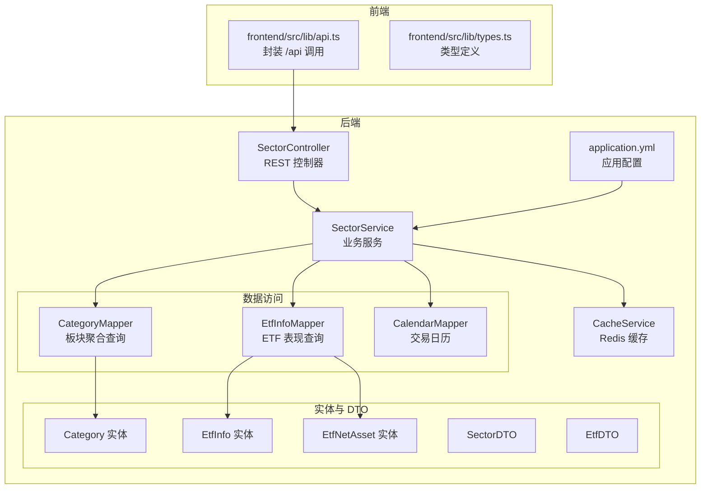
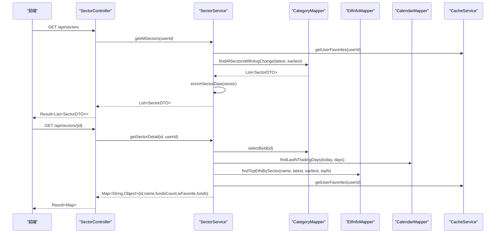
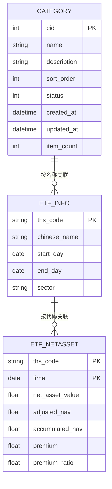
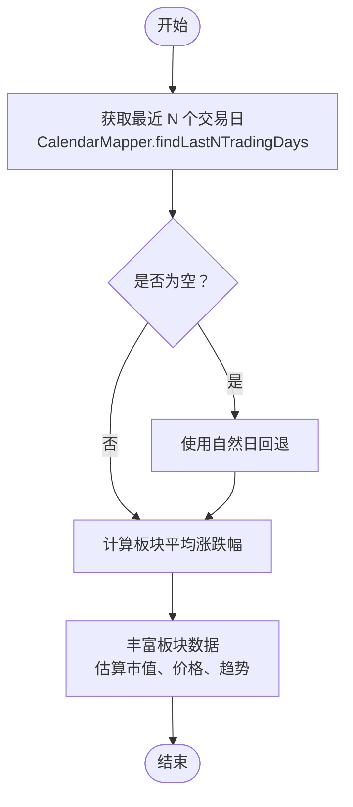
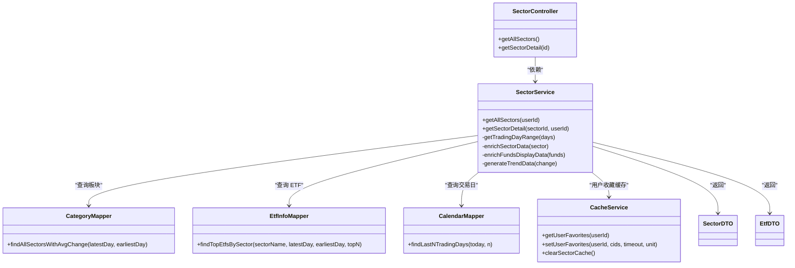

# 板块接口

<cite>
**本文引用的文件**
- [backend/src/main/java/com/freetrader/controller/SectorController.java](file://backend/src/main/java/com/freetrader/controller/SectorController.java)
- [backend/src/main/java/com/freetrader/service/SectorService.java](file://backend/src/main/java/com/freetrader/service/SectorService.java)
- [backend/src/main/java/com/freetrader/dto/SectorDTO.java](file://backend/src/main/java/com/freetrader/dto/SectorDTO.java)
- [backend/src/main/java/com/freetrader/dto/EtfDTO.java](file://backend/src/main/java/com/freetrader/dto/EtfDTO.java)
- [backend/src/main/java/com/freetrader/mapper/CategoryMapper.java](file://backend/src/main/java/com/freetrader/mapper/CategoryMapper.java)
- [backend/src/main/java/com/freetrader/mapper/EtfInfoMapper.java](file://backend/src/main/java/com/freetrader/mapper/EtfInfoMapper.java)
- [backend/src/main/java/com/freetrader/mapper/CalendarMapper.java](file://backend/src/main/java/com/freetrader/mapper/CalendarMapper.java)
- [backend/src/main/java/com/freetrader/entity/Category.java](file://backend/src/main/java/com/freetrader/entity/Category.java)
- [backend/src/main/java/com/freetrader/entity/EtfInfo.java](file://backend/src/main/java/com/freetrader/entity/EtfInfo.java)
- [backend/src/main/java/com/freetrader/entity/EtfNetAsset.java](file://backend/src/main/java/com/freetrader/entity/EtfNetAsset.java)
- [backend/src/main/resources/application.yml](file://backend/src/main/resources/application.yml)
- [backend/src/main/java/com/freetrader/service/CacheService.java](file://backend/src/main/java/com/freetrader/service/CacheService.java)
- [frontend/src/lib/api.ts](file://frontend/src/lib/api.ts)
- [frontend/src/lib/types.ts](file://frontend/src/lib/types.ts)
- [sql/category.sql](file://sql/category.sql)
- [sql/etf_info.sql](file://sql/etf_info.sql)
- [sql/etf_netasset.sql](file://sql/etf_netasset.sql)
- [sql/calendar.sql](file://sql/calendar.sql)
</cite>

## 目录
1. [简介](#简介)
2. [项目结构](#项目结构)
3. [核心组件](#核心组件)
4. [架构总览](#架构总览)
5. [详细组件分析](#详细组件分析)
6. [依赖关系分析](#依赖关系分析)
7. [性能与缓存策略](#性能与缓存策略)
8. [故障排查指南](#故障排查指南)
9. [结论](#结论)
10. [附录](#附录)

## 简介
本文件为 FreeTrader 项目的“板块管理接口”提供完整的 API 文档，覆盖以下能力：
- 板块数据查询：获取所有板块列表，包含平均涨跌幅、最新净值、估算市值、是否收藏、走势等信息
- 板块详情查询：获取指定板块的详细信息，包含该板块下表现最好的若干 ETF 列表
- ETF 关联数据：按板块聚合的 ETF 表现数据，含净值、涨跌幅、图标等展示增强字段
- 时间序列与趋势：基于交易日历的多日涨跌幅区间，生成用于前端展示的简单趋势数组
- 分页、排序与过滤：当前实现不提供分页与显式排序参数，但支持通过配置项控制默认天数与展示数量
- 请求与响应示例：提供正常查询与异常处理场景的示例
- 数据更新频率与缓存策略：说明默认交易日窗口、缓存 TTL 与失效机制

## 项目结构
后端采用 Spring Boot + MyBatis-Plus 架构，板块接口位于控制器层，业务逻辑由服务层实现，数据访问通过 Mapper 接口完成；前端通过 axios 封装的 API 模块调用后端接口。

**图表来源**
- [backend/src/main/java/com/freetrader/controller/SectorController.java](file://backend/src/main/java/com/freetrader/controller/SectorController.java#L22-L62)
- [backend/src/main/java/com/freetrader/service/SectorService.java](file://backend/src/main/java/com/freetrader/service/SectorService.java#L27-L252)
- [backend/src/main/java/com/freetrader/service/CacheService.java](file://backend/src/main/java/com/freetrader/service/CacheService.java#L25-L205)
- [backend/src/main/java/com/freetrader/mapper/CategoryMapper.java](file://backend/src/main/java/com/freetrader/mapper/CategoryMapper.java#L12-L47)
- [backend/src/main/java/com/freetrader/mapper/EtfInfoMapper.java](file://backend/src/main/java/com/freetrader/mapper/EtfInfoMapper.java#L12-L52)
- [backend/src/main/java/com/freetrader/mapper/CalendarMapper.java](file://backend/src/main/java/com/freetrader/mapper/CalendarMapper.java#L11-L24)
- [backend/src/main/resources/application.yml](file://backend/src/main/resources/application.yml#L67-L76)

**章节来源**
- [backend/src/main/java/com/freetrader/controller/SectorController.java](file://backend/src/main/java/com/freetrader/controller/SectorController.java#L22-L62)
- [backend/src/main/java/com/freetrader/service/SectorService.java](file://backend/src/main/java/com/freetrader/service/SectorService.java#L27-L252)
- [frontend/src/lib/api.ts](file://frontend/src/lib/api.ts#L52-L63)

## 核心组件
- SectorController：暴露 /api/sectors 的 GET 列表与 GET /{id} 详情接口，负责鉴权上下文提取用户 ID，并将结果包装为 Result<T>
- SectorService：核心业务逻辑，负责：
  - 计算交易日范围
  - 查询板块基础数据并丰富展示字段（估算市值、价格、趋势）
  - 查询板块详情并返回包含“表现最好 ETF 列表”的聚合结果
  - 使用缓存服务与注解缓存提升性能
- DTO 与实体：
  - SectorDTO：板块列表项的数据传输对象
  - EtfDTO：ETF 表现数据的传输对象
  - Category、EtfInfo、EtfNetAsset：对应数据库表的实体映射
- Mapper：提供板块聚合与 ETF 表现的 SQL 查询
- CacheService：统一的 Redis 缓存操作，包含板块缓存清理等能力
- application.yml：应用配置，包含默认交易日天数、展示 ETF 数量、缓存 TTL 等

**章节来源**
- [backend/src/main/java/com/freetrader/dto/SectorDTO.java](file://backend/src/main/java/com/freetrader/dto/SectorDTO.java#L9-L22)
- [backend/src/main/java/com/freetrader/dto/EtfDTO.java](file://backend/src/main/java/com/freetrader/dto/EtfDTO.java#L7-L22)
- [backend/src/main/java/com/freetrader/entity/Category.java](file://backend/src/main/java/com/freetrader/entity/Category.java#L11-L44)
- [backend/src/main/java/com/freetrader/entity/EtfInfo.java](file://backend/src/main/java/com/freetrader/entity/EtfInfo.java#L9-L23)
- [backend/src/main/java/com/freetrader/entity/EtfNetAsset.java](file://backend/src/main/java/com/freetrader/entity/EtfNetAsset.java#L8-L25)

## 架构总览
板块接口的调用链路如下：

**图表来源**
- [backend/src/main/java/com/freetrader/controller/SectorController.java](file://backend/src/main/java/com/freetrader/controller/SectorController.java#L41-L61)
- [backend/src/main/java/com/freetrader/service/SectorService.java](file://backend/src/main/java/com/freetrader/service/SectorService.java#L109-L212)
- [backend/src/main/java/com/freetrader/mapper/CategoryMapper.java](file://backend/src/main/java/com/freetrader/mapper/CategoryMapper.java#L19-L46)
- [backend/src/main/java/com/freetrader/mapper/EtfInfoMapper.java](file://backend/src/main/java/com/freetrader/mapper/EtfInfoMapper.java#L18-L51)
- [backend/src/main/java/com/freetrader/mapper/CalendarMapper.java](file://backend/src/main/java/com/freetrader/mapper/CalendarMapper.java#L17-L23)
- [backend/src/main/java/com/freetrader/service/CacheService.java](file://backend/src/main/java/com/freetrader/service/CacheService.java#L108-L130)

## 详细组件分析

### 接口定义与行为

- 获取所有板块
  - 方法：GET /api/sectors
  - 功能：返回所有板块的基础信息，包含平均涨跌幅、最新净值、估算市值、是否收藏、走势等
  - 参数：无
  - 返回：Result<List<SectorDTO>>
  - 异常：无显式异常返回码（内部异常将被全局异常处理器捕获）

- 获取板块详情
  - 方法：GET /api/sectors/{id}
  - 功能：返回指定板块的详情，包含板块基本信息与“表现最好 ETF 列表”
  - 参数：
    - 路径参数：id（板块 ID）
  - 返回：Result<Map<String,Object>>，包含：
    - id：板块 ID
    - name：板块名称
    - description：板块描述
    - fundsCount：ETF 数量
    - isFavorite：是否收藏
    - funds：List<EtfDTO>，按涨跌幅排序的 ETF 列表
  - 异常：当板块不存在时抛出业务异常（SECTOR_NOT_FOUND）

**章节来源**
- [backend/src/main/java/com/freetrader/controller/SectorController.java](file://backend/src/main/java/com/freetrader/controller/SectorController.java#L41-L61)
- [backend/src/main/java/com/freetrader/service/SectorService.java](file://backend/src/main/java/com/freetrader/service/SectorService.java#L169-L212)

### 数据模型与字段说明

- SectorDTO（板块列表项）
  - 字段：
    - id：板块 ID
    - name：板块名称
    - change：平均涨跌幅（百分比）
    - price：最新净值（基于基准价与涨跌幅推导）
    - marketCap：估算市值（格式化字符串）
    - isFavorite：是否收藏
    - fundsCount：ETF 数量
    - description：板块描述
    - trend：走势数组（用于前端 Sparkline）

- EtfDTO（ETF 表现项）
  - 字段：
    - name：代码（ths_code）
    - fullName：中文名称
    - price：净值（net_asset_value）
    - fcfShare：每股现金流（占位）
    - mktCap：市值（占位）
    - returns：涨跌额
    - returnsPercent：涨跌幅（百分比）
    - icon：图标字符（取名称首字）
    - iconBg：背景色类名
    - iconColor：文字颜色类名
    - isFavorite：是否收藏

- Category（板块实体）
  - 字段：cid、name、description、sortOrder、status、createdAt、updatedAt、itemCount、avgChange、price、marketCap、isFavorite

- EtfInfo（ETF 基本信息）
  - 字段：thsCode、chineseName、startDay、endDay、sector

- EtfNetAsset（ETF 净值时间序列）
  - 字段：thsCode、time、netAssetValue、adjustedNav、accumulatedNav、premium、premiumRatio

**章节来源**
- [backend/src/main/java/com/freetrader/dto/SectorDTO.java](file://backend/src/main/java/com/freetrader/dto/SectorDTO.java#L9-L22)
- [backend/src/main/java/com/freetrader/dto/EtfDTO.java](file://backend/src/main/java/com/freetrader/dto/EtfDTO.java#L7-L22)
- [backend/src/main/java/com/freetrader/entity/Category.java](file://backend/src/main/java/com/freetrader/entity/Category.java#L11-L44)
- [backend/src/main/java/com/freetrader/entity/EtfInfo.java](file://backend/src/main/java/com/freetrader/entity/EtfInfo.java#L9-L23)
- [backend/src/main/java/com/freetrader/entity/EtfNetAsset.java](file://backend/src/main/java/com/freetrader/entity/EtfNetAsset.java#L8-L25)

### SQL 查询与数据聚合

- 板块聚合查询（平均涨跌幅）
  - 通过 CategoryMapper 的 findAllSectorsWithAvgChange，按板块聚合，计算最近 N 个交易日的平均涨跌幅
  - 使用 etf_netasset 的 latest 与 earliest 两期净值进行涨跌幅计算
  - 按 sort_order 降序排列

- ETF 表现查询（按板块）
  - 通过 EtfInfoMapper 的 findTopEtfsBySector，按板块名称筛选，计算涨跌幅并按百分比降序取前 N

- 交易日范围
  - 通过 CalendarMapper 的 findLastNTradingDays 获取最近 N 个交易日（考虑节假日）

**图表来源**
- [backend/src/main/java/com/freetrader/mapper/CategoryMapper.java](file://backend/src/main/java/com/freetrader/mapper/CategoryMapper.java#L19-L46)
- [backend/src/main/java/com/freetrader/mapper/EtfInfoMapper.java](file://backend/src/main/java/com/freetrader/mapper/EtfInfoMapper.java#L18-L51)
- [backend/src/main/java/com/freetrader/mapper/CalendarMapper.java](file://backend/src/main/java/com/freetrader/mapper/CalendarMapper.java#L17-L23)
- [backend/src/main/java/com/freetrader/entity/Category.java](file://backend/src/main/java/com/freetrader/entity/Category.java#L11-L44)
- [backend/src/main/java/com/freetrader/entity/EtfInfo.java](file://backend/src/main/java/com/freetrader/entity/EtfInfo.java#L9-L23)
- [backend/src/main/java/com/freetrader/entity/EtfNetAsset.java](file://backend/src/main/java/com/freetrader/entity/EtfNetAsset.java#L8-L25)

**章节来源**
- [backend/src/main/java/com/freetrader/mapper/CategoryMapper.java](file://backend/src/main/java/com/freetrader/mapper/CategoryMapper.java#L19-L46)
- [backend/src/main/java/com/freetrader/mapper/EtfInfoMapper.java](file://backend/src/main/java/com/freetrader/mapper/EtfInfoMapper.java#L18-L51)
- [backend/src/main/java/com/freetrader/mapper/CalendarMapper.java](file://backend/src/main/java/com/freetrader/mapper/CalendarMapper.java#L17-L23)

### 时间序列与趋势生成

- 交易日窗口
  - 默认最近交易日天数由配置项决定（默认 7 天），可通过配置覆盖
  - 当无法从交易日历获取时，回退到自然日

- 走势数组
  - 基于板块涨跌幅生成固定长度的简单趋势数组（用于前端 Sparkline）
  - 方向与随机扰动根据涨跌情况生成

**图表来源**
- [backend/src/main/java/com/freetrader/service/SectorService.java](file://backend/src/main/java/com/freetrader/service/SectorService.java#L64-L76)
- [backend/src/main/java/com/freetrader/service/SectorService.java](file://backend/src/main/java/com/freetrader/service/SectorService.java#L124-L141)
- [backend/src/main/java/com/freetrader/service/SectorService.java](file://backend/src/main/java/com/freetrader/service/SectorService.java#L146-L165)
- [backend/src/main/java/com/freetrader/mapper/CalendarMapper.java](file://backend/src/main/java/com/freetrader/mapper/CalendarMapper.java#L17-L23)

**章节来源**
- [backend/src/main/java/com/freetrader/service/SectorService.java](file://backend/src/main/java/com/freetrader/service/SectorService.java#L64-L76)
- [backend/src/main/java/com/freetrader/service/SectorService.java](file://backend/src/main/java/com/freetrader/service/SectorService.java#L124-L165)

### 分页、排序与过滤
- 分页：当前接口未提供分页参数
- 排序：板块列表按 sort_order 降序返回
- 过滤：板块状态为启用（status=1）参与统计；ETF 表现按板块名称过滤

**章节来源**
- [backend/src/main/java/com/freetrader/mapper/CategoryMapper.java](file://backend/src/main/java/com/freetrader/mapper/CategoryMapper.java#L39-L41)
- [backend/src/main/java/com/freetrader/mapper/EtfInfoMapper.java](file://backend/src/main/java/com/freetrader/mapper/EtfInfoMapper.java#L42-L44)

### 请求与响应示例

- 获取所有板块（正常）
  - 请求：GET /api/sectors
  - 响应：Result<List<SectorDTO>>，其中每个 SectorDTO 包含 id、name、change、price、marketCap、isFavorite、fundsCount、description、trend

- 获取板块详情（正常）
  - 请求：GET /api/sectors/1
  - 响应：Result<Map>，包含 id、name、description、fundsCount、isFavorite、funds（List<EtfDTO>）

- 获取板块详情（异常：板块不存在）
  - 请求：GET /api/sectors/999
  - 响应：业务异常（SECTOR_NOT_FOUND），由全局异常处理器转换为标准错误响应

- 前端调用示例
  - 获取全部板块：sectorApi.getAll()
  - 获取板块详情：sectorApi.getDetail(id)

**章节来源**
- [frontend/src/lib/api.ts](file://frontend/src/lib/api.ts#L52-L63)
- [backend/src/main/java/com/freetrader/controller/SectorController.java](file://backend/src/main/java/com/freetrader/controller/SectorController.java#L41-L61)
- [backend/src/main/java/com/freetrader/service/SectorService.java](file://backend/src/main/java/com/freetrader/service/SectorService.java#L169-L178)

## 依赖关系分析

**图表来源**
- [backend/src/main/java/com/freetrader/controller/SectorController.java](file://backend/src/main/java/com/freetrader/controller/SectorController.java#L26-L39)
- [backend/src/main/java/com/freetrader/service/SectorService.java](file://backend/src/main/java/com/freetrader/service/SectorService.java#L32-L36)
- [backend/src/main/java/com/freetrader/mapper/CategoryMapper.java](file://backend/src/main/java/com/freetrader/mapper/CategoryMapper.java#L12-L47)
- [backend/src/main/java/com/freetrader/mapper/EtfInfoMapper.java](file://backend/src/main/java/com/freetrader/mapper/EtfInfoMapper.java#L12-L52)
- [backend/src/main/java/com/freetrader/mapper/CalendarMapper.java](file://backend/src/main/java/com/freetrader/mapper/CalendarMapper.java#L11-L24)
- [backend/src/main/java/com/freetrader/service/CacheService.java](file://backend/src/main/java/com/freetrader/service/CacheService.java#L108-L139)

**章节来源**
- [backend/src/main/java/com/freetrader/controller/SectorController.java](file://backend/src/main/java/com/freetrader/controller/SectorController.java#L26-L39)
- [backend/src/main/java/com/freetrader/service/SectorService.java](file://backend/src/main/java/com/freetrader/service/SectorService.java#L32-L36)

## 性能与缓存策略

- 缓存配置
  - Redis 作为缓存类型，全局 TTL 默认 5 分钟
  - 板块基础数据缓存（sectors）TTL 5 分钟
  - 板块详情缓存（sectorDetail）TTL 5 分钟

- 用户收藏缓存
  - 用户收藏的板块 ID 列表缓存 TTL 5 分钟
  - 提供批量删除板块缓存与用户缓存的能力

- 默认参数
  - 默认交易日天数：7 天
  - 默认展示 ETF 数量：10 只

- 性能建议
  - 前端可复用列表与详情缓存，减少请求频率
  - 合理设置默认天数与展示数量，平衡数据新鲜度与性能

**章节来源**
- [backend/src/main/resources/application.yml](file://backend/src/main/resources/application.yml#L39-L44)
- [backend/src/main/resources/application.yml](file://backend/src/main/resources/application.yml#L68-L76)
- [backend/src/main/java/com/freetrader/service/CacheService.java](file://backend/src/main/java/com/freetrader/service/CacheService.java#L187-L204)
- [backend/src/main/java/com/freetrader/service/SectorService.java](file://backend/src/main/java/com/freetrader/service/SectorService.java#L124-L141)
- [backend/src/main/java/com/freetrader/service/SectorService.java](file://backend/src/main/java/com/freetrader/service/SectorService.java#L170-L171)

## 故障排查指南

- 常见问题
  - 板块不存在：getSectorDetail 抛出业务异常（SECTOR_NOT_FOUND），需检查板块 ID
  - 交易日历缺失：当无法获取最近 N 个交易日时，系统回退到自然日，可能影响涨跌幅计算
  - 缓存未命中：首次访问或缓存过期时，会触发数据库查询，建议观察日志中的缓存命中情况

- 建议排查步骤
  - 检查 Redis 连接与可用性
  - 查看应用日志中“从数据库加载”与“从缓存获取”的提示
  - 确认交易日历表数据完整性
  - 核对板块状态与 ETF 关联关系

**章节来源**
- [backend/src/main/java/com/freetrader/service/SectorService.java](file://backend/src/main/java/com/freetrader/service/SectorService.java#L169-L178)
- [backend/src/main/java/com/freetrader/service/SectorService.java](file://backend/src/main/java/com/freetrader/service/SectorService.java#L64-L76)
- [backend/src/main/java/com/freetrader/service/CacheService.java](file://backend/src/main/java/com/freetrader/service/CacheService.java#L187-L204)

## 结论
本接口文档梳理了 FreeTrader 板块管理的核心能力：板块列表与详情查询、ETF 表现聚合、时间序列与趋势生成，并明确了缓存策略与默认参数。当前实现未提供分页与显式排序参数，但通过配置项可灵活调整数据新鲜度与展示规模。建议在生产环境中结合 Redis 缓存与合理的 TTL 设置，确保接口性能与用户体验。

## 附录

### 接口清单与示例

- 获取所有板块
  - 方法：GET /api/sectors
  - 示例：sectorApi.getAll()

- 获取板块详情
  - 方法：GET /api/sectors/{id}
  - 示例：sectorApi.getDetail(1)

- 前端类型定义参考
  - SectorData：与 SectorDTO 字段对应
  - StockData：与 EtfDTO 字段对应

**章节来源**
- [frontend/src/lib/api.ts](file://frontend/src/lib/api.ts#L52-L63)
- [frontend/src/lib/types.ts](file://frontend/src/lib/types.ts#L34-L46)

### 数据库结构参考

- 板块表（category）
  - 字段：cid、name、description、sort_order、status、created_at、updated_at、item_count
- ETF 基本信息表（etf_info）
  - 字段：ths_code、chinese_name、start_day、end_day、sector
- ETF 净值表（etf_netasset）
  - 字段：ths_code、time、net_asset_value、adjusted_nav、accumulated_nav、premium、premium_ratio
- 交易日历表（calendar）
  - 字段：Day、IsTradingDay、IsWorkingDay、Comments、FetchHoliday、UpdateTime

**章节来源**
- [sql/category.sql](file://sql/category.sql#L23-L36)
- [sql/etf_info.sql](file://sql/etf_info.sql#L23-L33)
- [sql/etf_netasset.sql](file://sql/etf_netasset.sql#L23-L34)
- [sql/calendar.sql](file://sql/calendar.sql#L23-L31)