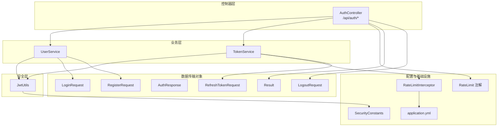
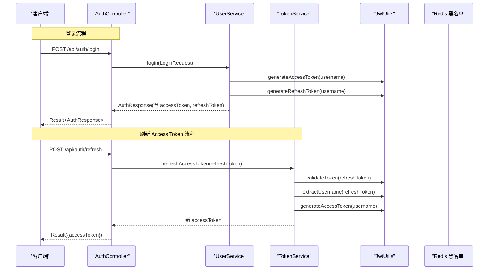
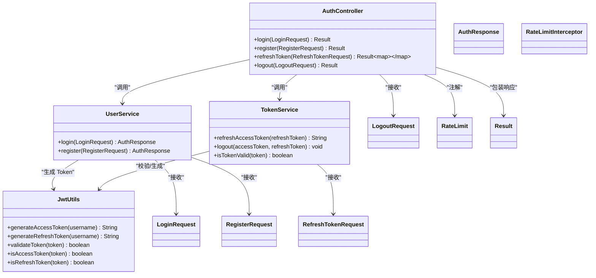

# 认证接口

<cite>
**本文引用的文件**
- [AuthController.java](file://backend/src/main/java/com/freetrader/controller/AuthController.java)
- [UserService.java](file://backend/src/main/java/com/freetrader/service/UserService.java)
- [TokenService.java](file://backend/src/main/java/com/freetrader/service/TokenService.java)
- [JwtUtils.java](file://backend/src/main/java/com/freetrader/security/JwtUtils.java)
- [LoginRequest.java](file://backend/src/main/java/com/freetrader/dto/LoginRequest.java)
- [RegisterRequest.java](file://backend/src/main/java/com/freetrader/dto/RegisterRequest.java)
- [AuthResponse.java](file://backend/src/main/java/com/freetrader/dto/AuthResponse.java)
- [RefreshTokenRequest.java](file://backend/src/main/java/com/freetrader/dto/RefreshTokenRequest.java)
- [LogoutRequest.java](file://backend/src/main/java/com/freetrader/dto/LogoutRequest.java)
- [RateLimit.java](file://backend/src/main/java/com/freetrader/annotation/RateLimit.java)
- [RateLimitInterceptor.java](file://backend/src/main/java/com/freetrader/interceptor/RateLimitInterceptor.java)
- [SecurityConstants.java](file://backend/src/main/java/com/freetrader/util/SecurityConstants.java)
- [application.yml](file://backend/src/main/resources/application.yml)
- [Result.java](file://backend/src/main/java/com/freetrader/dto/Result.java)
</cite>

## 目录
1. [简介](#简介)
2. [项目结构](#项目结构)
3. [核心组件](#核心组件)
4. [架构总览](#架构总览)
5. [详细组件分析](#详细组件分析)
6. [依赖关系分析](#依赖关系分析)
7. [性能与可扩展性](#性能与可扩展性)
8. [故障排查指南](#故障排查指南)
9. [结论](#结论)
10. [附录](#附录)

## 简介
本文件为 FreeTrader 项目的认证接口 API 文档，覆盖以下四个核心接口：
- 用户登录
- 用户注册
- 刷新 Token
- 用户登出

文档详细说明每个接口的 HTTP 方法、URL 路径、请求参数、响应格式、状态码、数据传输对象（DTO）字段定义与校验规则；解释 JWT 的生成、验证与刷新机制（Access Token 与 Refresh Token 的区别与使用场景）；提供请求与响应示例（含成功与常见错误情形）；说明速率限制策略与安全注意事项；并给出前端集成示例与最佳实践。

## 项目结构
认证相关代码主要位于后端模块，采用分层架构：
- 控制器层：处理 HTTP 请求与响应包装
- 业务层：实现登录、注册、Token 刷新与登出逻辑
- 安全层：JWT 工具类负责 Token 的生成、解析与校验
- 配置层：应用配置、Redis 限流与跨域等

图表来源
- [AuthController.java](file://backend/src/main/java/com/freetrader/controller/AuthController.java#L19-L71)
- [UserService.java](file://backend/src/main/java/com/freetrader/service/UserService.java#L25-L96)
- [TokenService.java](file://backend/src/main/java/com/freetrader/service/TokenService.java#L13-L55)
- [JwtUtils.java](file://backend/src/main/java/com/freetrader/security/JwtUtils.java#L23-L193)
- [RateLimit.java](file://backend/src/main/java/com/freetrader/annotation/RateLimit.java#L12-L48)
- [RateLimitInterceptor.java](file://backend/src/main/java/com/freetrader/interceptor/RateLimitInterceptor.java#L27-L152)
- [SecurityConstants.java](file://backend/src/main/java/com/freetrader/util/SecurityConstants.java#L6-L41)
- [application.yml](file://backend/src/main/resources/application.yml#L60-L66)

章节来源
- [AuthController.java](file://backend/src/main/java/com/freetrader/controller/AuthController.java#L19-L71)
- [application.yml](file://backend/src/main/resources/application.yml#L60-L66)

## 核心组件
- 控制器：提供 /api/auth 下的四个认证接口，统一使用 Result<T> 包装响应。
- 用户服务：实现登录与注册流程，调用 JWT 工具生成 Access/Refresh Token。
- Token 服务：负责刷新 Access Token、登出时将 Token 加入黑名单、校验 Token 有效性。
- JWT 工具：封装 Token 的生成、解析、验证、类型判断与过期时间获取。
- DTO：LoginRequest、RegisterRequest、AuthResponse、RefreshTokenRequest、LogoutRequest。
- 速率限制：基于 Redis 的滑动窗口限流，支持按 IP/用户/全局限流。
- 安全常量：定义 Authorization 头、Bearer 前缀、Token 类型声明键等。

章节来源
- [UserService.java](file://backend/src/main/java/com/freetrader/service/UserService.java#L41-L96)
- [TokenService.java](file://backend/src/main/java/com/freetrader/service/TokenService.java#L18-L55)
- [JwtUtils.java](file://backend/src/main/java/com/freetrader/security/JwtUtils.java#L100-L192)
- [Result.java](file://backend/src/main/java/com/freetrader/dto/Result.java#L10-L29)

## 架构总览
认证流程涉及控制器、服务层、JWT 工具与缓存（Redis 黑名单）之间的协作。下图展示典型登录与 Token 刷新的时序：

图表来源
- [AuthController.java](file://backend/src/main/java/com/freetrader/controller/AuthController.java#L28-L62)
- [UserService.java](file://backend/src/main/java/com/freetrader/service/UserService.java#L73-L96)
- [TokenService.java](file://backend/src/main/java/com/freetrader/service/TokenService.java#L18-L39)
- [JwtUtils.java](file://backend/src/main/java/com/freetrader/security/JwtUtils.java#L100-L133)

## 详细组件分析

### 数据传输对象（DTO）
- LoginRequest
  - 字段：username（必填）、password（必填）
  - 校验：非空校验
- RegisterRequest
  - 字段：username（必填，长度 3-50）、email（必填，邮箱格式）、password（必填，长度 6-100）
  - 校验：非空、长度范围、邮箱格式
- AuthResponse
  - 字段：accessToken、refreshToken、userId、username、email
- RefreshTokenRequest
  - 字段：refreshToken（必填）
  - 校验：非空
- LogoutRequest
  - 字段：accessToken、refreshToken（二者至少一个可选）

章节来源
- [LoginRequest.java](file://backend/src/main/java/com/freetrader/dto/LoginRequest.java#L7-L14)
- [RegisterRequest.java](file://backend/src/main/java/com/freetrader/dto/RegisterRequest.java#L9-L22)
- [AuthResponse.java](file://backend/src/main/java/com/freetrader/dto/AuthResponse.java#L12-L18)
- [RefreshTokenRequest.java](file://backend/src/main/java/com/freetrader/dto/RefreshTokenRequest.java#L7-L10)
- [LogoutRequest.java](file://backend/src/main/java/com/freetrader/dto/LogoutRequest.java#L6-L9)

### 登录接口
- 方法与路径
  - POST /api/auth/login
- 请求体
  - LoginRequest：username、password
- 响应体
  - Result<AuthResponse>：包含 accessToken、refreshToken、userId、username、email
- 状态码
  - 200：登录成功
  - 401：用户名或密码错误
- 速率限制
  - 60 秒窗口，最多 5 次；按 IP 限流
- 安全要点
  - 密码使用 PasswordEncoder 加密存储
  - 返回的 Token 有效期由配置决定
- 前端集成建议
  - 成功后持久化保存 accessToken 与 refreshToken
  - 后续请求在 Authorization 头中携带 Bearer token

章节来源
- [AuthController.java](file://backend/src/main/java/com/freetrader/controller/AuthController.java#L28-L39)
- [UserService.java](file://backend/src/main/java/com/freetrader/service/UserService.java#L73-L96)
- [RateLimit.java](file://backend/src/main/java/com/freetrader/annotation/RateLimit.java#L18-L24)
- [RateLimitInterceptor.java](file://backend/src/main/java/com/freetrader/interceptor/RateLimitInterceptor.java#L46-L59)
- [SecurityConstants.java](file://backend/src/main/java/com/freetrader/util/SecurityConstants.java#L18-L25)

### 注册接口
- 方法与路径
  - POST /api/auth/register
- 请求体
  - RegisterRequest：username、email、password
- 响应体
  - Result<AuthResponse>：注册成功即返回 Token 与用户信息
- 状态码
  - 200：注册成功
  - 400：用户名或邮箱已存在
- 速率限制
  - 60 秒窗口，最多 3 次；按 IP 限流
- 安全要点
  - 用户名与邮箱唯一性校验
  - 密码加密存储
- 前端集成建议
  - 注册成功后立即进行登录态初始化

章节来源
- [AuthController.java](file://backend/src/main/java/com/freetrader/controller/AuthController.java#L41-L51)
- [UserService.java](file://backend/src/main/java/com/freetrader/service/UserService.java#L41-L71)
- [RateLimit.java](file://backend/src/main/java/com/freetrader/annotation/RateLimit.java#L18-L24)
- [RateLimitInterceptor.java](file://backend/src/main/java/com/freetrader/interceptor/RateLimitInterceptor.java#L46-L59)

### 刷新 Token 接口
- 方法与路径
  - POST /api/auth/refresh
- 请求体
  - RefreshTokenRequest：refreshToken
- 响应体
  - Result<{ accessToken }>：返回新的 Access Token
- 状态码
  - 200：刷新成功
  - 401：Refresh Token 无效或已过期
- 业务逻辑
  - 校验 Refresh Token 有效性与类型
  - 检查是否在黑名单
  - 生成新的 Access Token 并返回
- 前端集成建议
  - 在 Access Token 即将过期时主动刷新
  - 避免在本地长期存储 Refresh Token

章节来源
- [AuthController.java](file://backend/src/main/java/com/freetrader/controller/AuthController.java#L53-L62)
- [TokenService.java](file://backend/src/main/java/com/freetrader/service/TokenService.java#L18-L39)
- [JwtUtils.java](file://backend/src/main/java/com/freetrader/security/JwtUtils.java#L146-L178)

### 登出接口
- 方法与路径
  - POST /api/auth/logout
- 请求体
  - LogoutRequest：accessToken、refreshToken（二者至少提供其一）
- 响应体
  - Result<void>：无数据
- 状态码
  - 200：登出成功
- 业务逻辑
  - 若传入有效 Token，则按其过期时间加入 Redis 黑名单
  - 使该 Token 在剩余有效期内无法继续使用
- 前端集成建议
  - 清理本地存储的 Token
  - 发起登出时可同时提交两个 Token

章节来源
- [AuthController.java](file://backend/src/main/java/com/freetrader/controller/AuthController.java#L64-L70)
- [TokenService.java](file://backend/src/main/java/com/freetrader/service/TokenService.java#L41-L55)

### JWT 机制说明
- Token 类型与用途
  - Access Token：短期有效，用于访问受保护资源
  - Refresh Token：长期有效但受控，用于换取新的 Access Token
- 生成与验证
  - 使用对称密钥（secret）签名，支持提取用户名、过期时间与类型
  - 支持独立校验 Token 有效性与类型判断
- 过期时间
  - 可在配置中设置 Access/Refresh Token 的过期时长
- 黑名单
  - 登出或刷新时将 Token 加入 Redis 黑名单，结合 Token 服务统一校验

章节来源
- [JwtUtils.java](file://backend/src/main/java/com/freetrader/security/JwtUtils.java#L100-L192)
- [TokenService.java](file://backend/src/main/java/com/freetrader/service/TokenService.java#L41-L62)
- [application.yml](file://backend/src/main/resources/application.yml#L60-L66)

### 速率限制策略
- 限流注解
  - window：时间窗口（秒）
  - maxRequests：窗口内最大请求数
  - prefix：限流 key 前缀
  - limitType：限流类型（IP/USER/GLOBAL）
- 实现方式
  - 基于 Redis 的滑动窗口计数器
  - 当超过阈值时返回 429 与统一错误响应
- 认证接口默认策略
  - 登录：60 秒窗口，最多 5 次（按 IP）
  - 注册：60 秒窗口，最多 3 次（按 IP）

章节来源
- [RateLimit.java](file://backend/src/main/java/com/freetrader/annotation/RateLimit.java#L12-L48)
- [RateLimitInterceptor.java](file://backend/src/main/java/com/freetrader/interceptor/RateLimitInterceptor.java#L35-L62)
- [AuthController.java](file://backend/src/main/java/com/freetrader/controller/AuthController.java#L34-L46)

### 响应包装与错误码
- 统一响应结构
  - code：HTTP 语义码或业务码
  - message：描述信息
  - data：泛型数据
- 错误示例
  - 429：请求过于频繁
  - 401：认证失败或 Token 无效
  - 400：参数校验失败（如用户名/邮箱已存在）

章节来源
- [Result.java](file://backend/src/main/java/com/freetrader/dto/Result.java#L10-L29)
- [RateLimitInterceptor.java](file://backend/src/main/java/com/freetrader/interceptor/RateLimitInterceptor.java#L52-L58)

## 依赖关系分析
认证相关组件的依赖关系如下：

图表来源
- [AuthController.java](file://backend/src/main/java/com/freetrader/controller/AuthController.java#L23-L70)
- [UserService.java](file://backend/src/main/java/com/freetrader/service/UserService.java#L25-L96)
- [TokenService.java](file://backend/src/main/java/com/freetrader/service/TokenService.java#L13-L62)
- [JwtUtils.java](file://backend/src/main/java/com/freetrader/security/JwtUtils.java#L23-L193)
- [RateLimit.java](file://backend/src/main/java/com/freetrader/annotation/RateLimit.java#L12-L48)
- [Result.java](file://backend/src/main/java/com/freetrader/dto/Result.java#L10-L29)

## 性能与可扩展性
- Redis 限流
  - 使用 Redis 计数器实现滑动窗口，具备良好的分布式一致性
  - Redis 异常时采用“宽松放行”策略，避免影响主业务
- Token 存储与查询
  - Access Token 为短期有效，无需持久化
  - Refresh Token 仅在必要时校验与生成，避免频繁数据库查询
- 扩展建议
  - 对高并发场景可引入本地缓存与异步落库
  - 增加 Token 刷新频率统计与异常告警

[本节为通用性能讨论，不直接分析具体文件]

## 故障排查指南
- 登录失败（401）
  - 检查用户名是否存在与密码是否匹配
  - 确认密码编码器配置一致
- 刷新失败（401）
  - 确认提交的是 Refresh Token 且未过期
  - 检查是否已被加入黑名单
- 429 频繁触发
  - 检查限流配置与客户端重试策略
  - 调整 window 与 maxRequests 或改为按用户限流
- Token 无法访问受保护资源
  - 确认请求头 Authorization 使用 Bearer 前缀
  - 检查 Token 类型与过期时间

章节来源
- [UserService.java](file://backend/src/main/java/com/freetrader/service/UserService.java#L73-L82)
- [TokenService.java](file://backend/src/main/java/com/freetrader/service/TokenService.java#L18-L32)
- [RateLimitInterceptor.java](file://backend/src/main/java/com/freetrader/interceptor/RateLimitInterceptor.java#L46-L62)
- [SecurityConstants.java](file://backend/src/main/java/com/freetrader/util/SecurityConstants.java#L18-L25)

## 结论
FreeTrader 的认证体系以 JWT 为核心，配合 Redis 限流与统一响应包装，提供了清晰、安全、易扩展的认证能力。通过明确区分 Access/Refresh Token 的职责与生命周期，既能保障用户体验，又能有效降低安全风险。建议在生产环境中严格配置密钥与过期时间，并完善监控与告警机制。

[本节为总结性内容，不直接分析具体文件]

## 附录

### 请求与响应示例

- 登录（成功）
  - 请求体
    - {
      - "username": "string",
      - "password": "string"
      - }
  - 响应体
    - {
      - "code": 200,
      - "message": "success",
      - "data": {
        - "accessToken": "string",
        - "refreshToken": "string",
        - "userId": 1,
        - "username": "string",
        - "email": "string"
        - }
      - }

- 登录（失败：用户名或密码错误）
  - 响应体
    - {
      - "code": 401,
      - "message": "用户名或密码错误",
      - "data": null
      - }

- 注册（成功）
  - 请求体
    - {
      - "username": "string",
      - "email": "string",
      - "password": "string"
      - }
  - 响应体
    - {
      - "code": 200,
      - "message": "success",
      - "data": {
        - "accessToken": "string",
        - "refreshToken": "string",
        - "userId": 1,
        - "username": "string",
        - "email": "string"
        - }
      - }

- 注册（失败：用户名已存在）
  - 响应体
    - {
      - "code": 400,
      - "message": "用户名已存在",
      - "data": null
      - }

- 刷新 Token（成功）
  - 请求体
    - {
      - "refreshToken": "string"
      - }
  - 响应体
    - {
      - "code": 200,
      - "message": "success",
      - "data": {
        - "accessToken": "string"
        - }
      - }

- 刷新 Token（失败：Token 无效）
  - 响应体
    - {
      - "code": 401,
      - "message": "Refresh Token 无效或已过期",
      - "data": null
      - }

- 登出（成功）
  - 请求体
    - {
      - "accessToken": "string",
      - "refreshToken": "string"
      - }
  - 响应体
    - {
      - "code": 200,
      - "message": "success",
      - "data": null
      - }

- 429 频繁请求
  - 响应体
    - {
      - "code": 429,
      - "message": "请求过于频繁，请稍后再试",
      - "data": null
      - }

章节来源
- [AuthController.java](file://backend/src/main/java/com/freetrader/controller/AuthController.java#L28-L70)
- [UserService.java](file://backend/src/main/java/com/freetrader/service/UserService.java#L41-L96)
- [TokenService.java](file://backend/src/main/java/com/freetrader/service/TokenService.java#L18-L55)
- [Result.java](file://backend/src/main/java/com/freetrader/dto/Result.java#L15-L29)

### 前端集成示例与最佳实践
- 请求头设置
  - Authorization: Bearer <accessToken>
- 登录后存储
  - 建议使用安全的 HttpOnly Cookie 存储 Refresh Token，本地存储 AccessToken
- 自动刷新
  - 在 Access Token 过期前（例如剩余 5 分钟）发起刷新请求
- 登出清理
  - 清除本地存储并调用登出接口，确保 Token 加入黑名单
- 错误处理
  - 遇到 401 时引导用户重新登录
  - 遇到 429 时提示稍后再试并限制重试频率

章节来源
- [SecurityConstants.java](file://backend/src/main/java/com/freetrader/util/SecurityConstants.java#L18-L25)
- [TokenService.java](file://backend/src/main/java/com/freetrader/service/TokenService.java#L41-L55)
- [RateLimitInterceptor.java](file://backend/src/main/java/com/freetrader/interceptor/RateLimitInterceptor.java#L46-L62)