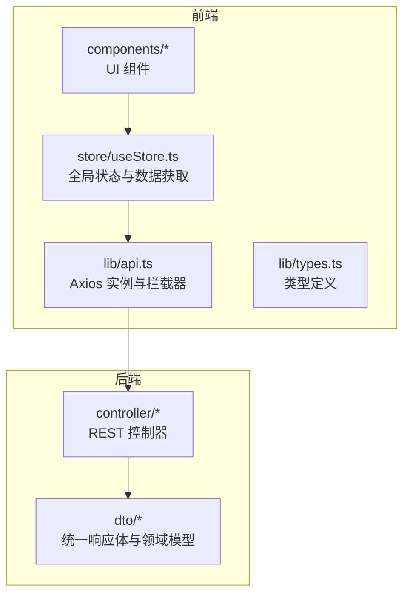
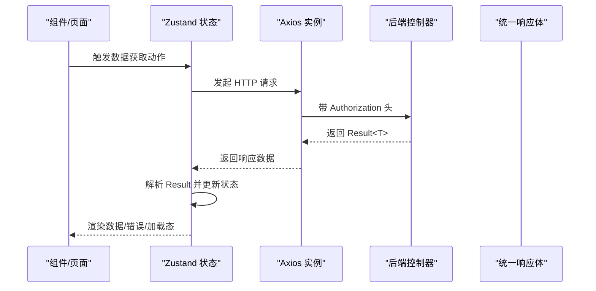
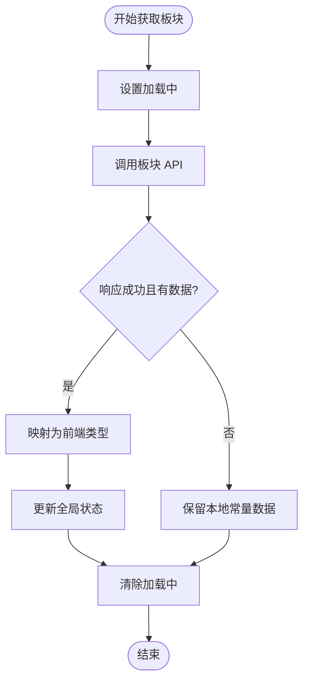
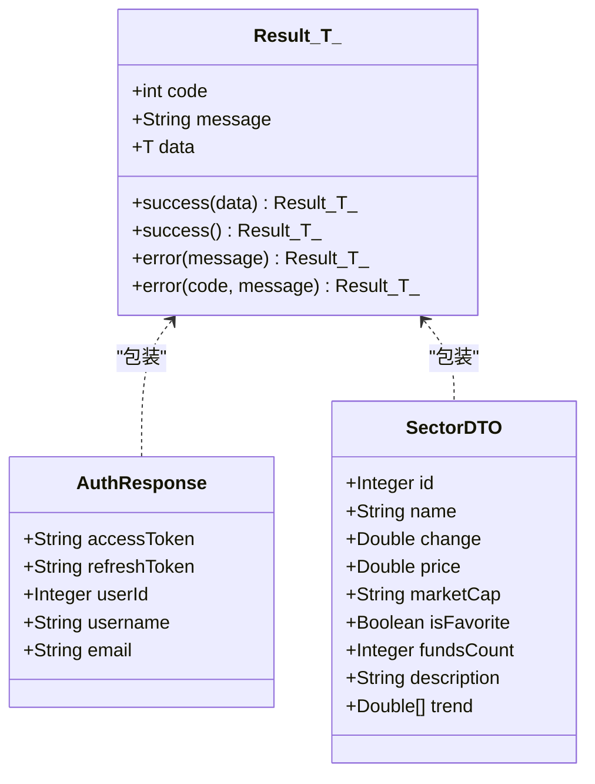
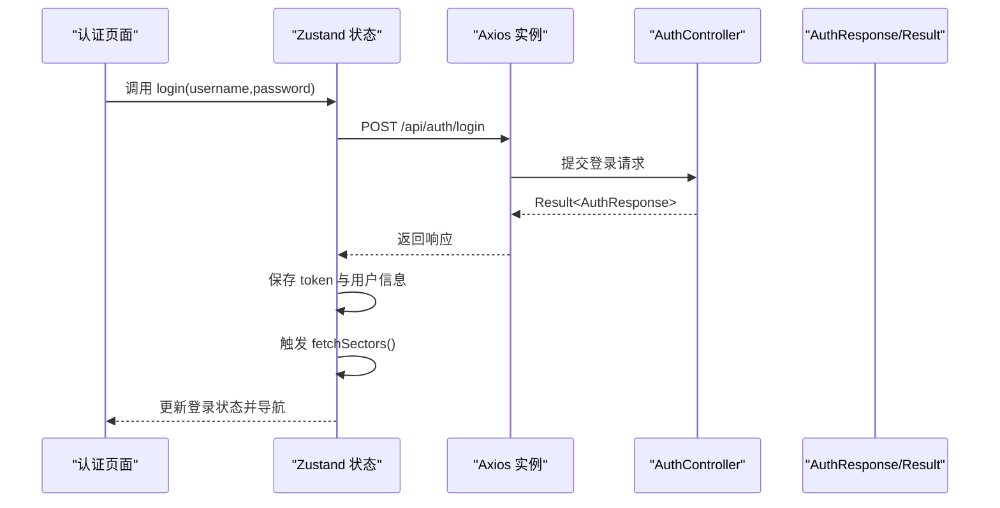
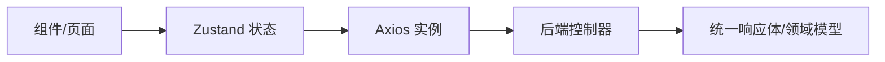

# API 集成与数据获取

<cite>
**本文引用的文件**
- [frontend/src/lib/api.ts](file://frontend/src/lib/api.ts)
- [frontend/src/lib/types.ts](file://frontend/src/lib/types.ts)
- [frontend/src/lib/constants.ts](file://frontend/src/lib/constants.ts)
- [frontend/src/store/useStore.ts](file://frontend/src/store/useStore.ts)
- [frontend/src/components/AuthPage.tsx](file://frontend/src/components/AuthPage.tsx)
- [frontend/src/app/layout.tsx](file://frontend/src/app/layout.tsx)
- [frontend/src/components/GlobalClientComponents.tsx](file://frontend/src/components/GlobalClientComponents.tsx)
- [frontend/src/components/SectorDetailModal.tsx](file://frontend/src/components/SectorDetailModal.tsx)
- [frontend/src/components/StockTable.tsx](file://frontend/src/components/StockTable.tsx)
- [backend/src/main/java/com/freetrader/dto/Result.java](file://backend/src/main/java/com/freetrader/dto/Result.java)
- [backend/src/main/java/com/freetrader/dto/AuthResponse.java](file://backend/src/main/java/com/freetrader/dto/AuthResponse.java)
- [backend/src/main/java/com/freetrader/dto/SectorDTO.java](file://backend/src/main/java/com/freetrader/dto/SectorDTO.java)
- [backend/src/main/java/com/freetrader/controller/AuthController.java](file://backend/src/main/java/com/freetrader/controller/AuthController.java)
- [backend/src/main/java/com/freetrader/controller/SectorController.java](file://backend/src/main/java/com/freetrader/controller/SectorController.java)
- [backend/src/main/java/com/freetrader/controller/FavoriteController.java](file://backend/src/main/java/com/freetrader/controller/FavoriteController.java)
</cite>

## 目录
1. [简介](#简介)
2. [项目结构](#项目结构)
3. [核心组件](#核心组件)
4. [架构总览](#架构总览)
5. [详细组件分析](#详细组件分析)
6. [依赖关系分析](#依赖关系分析)
7. [性能考量](#性能考量)
8. [故障排查指南](#故障排查指南)
9. [结论](#结论)
10. [附录](#附录)

## 简介
本文件面向 FreeTrader 前端的 API 集成与数据获取，围绕 Axios 客户端配置、请求/响应拦截器、认证头管理、错误处理、端点定义与调用、数据格式与类型、缓存与加载状态管理、错误恢复策略、并发与取消机制等主题进行系统化说明，并提供可直接定位到源码的路径指引与可视化图示。

## 项目结构
前端采用 Next.js 应用，API 封装位于 lib 目录，全局状态使用 Zustand 管理，组件按功能模块组织；后端采用 Spring Boot，统一返回体封装在 DTO 中，控制器暴露 REST 接口。

图表来源
- [frontend/src/lib/api.ts](file://frontend/src/lib/api.ts#L1-L89)
- [frontend/src/store/useStore.ts](file://frontend/src/store/useStore.ts#L1-L304)
- [backend/src/main/java/com/freetrader/controller/AuthController.java](file://backend/src/main/java/com/freetrader/controller/AuthController.java#L1-L72)
- [backend/src/main/java/com/freetrader/dto/Result.java](file://backend/src/main/java/com/freetrader/dto/Result.java#L1-L31)

章节来源
- [frontend/src/lib/api.ts](file://frontend/src/lib/api.ts#L1-L89)
- [frontend/src/lib/types.ts](file://frontend/src/lib/types.ts#L1-L47)
- [frontend/src/store/useStore.ts](file://frontend/src/store/useStore.ts#L1-L304)
- [backend/src/main/java/com/freetrader/dto/Result.java](file://backend/src/main/java/com/freetrader/dto/Result.java#L1-L31)

## 核心组件
- Axios 客户端与拦截器：负责基础 URL、默认头、请求头注入、统一 401 处理。
- API 模块：按业务域拆分，如认证、板块、收藏。
- 全局状态与数据获取：Zustand 状态集中管理，包含加载状态、错误回退、乐观更新与同步。
- 类型系统：前后端类型对齐，确保数据解析与渲染安全。
- 统一响应体：后端以 Result<T> 包裹响应，前端据此判断成功与错误。

章节来源
- [frontend/src/lib/api.ts](file://frontend/src/lib/api.ts#L1-L89)
- [frontend/src/store/useStore.ts](file://frontend/src/store/useStore.ts#L1-L304)
- [backend/src/main/java/com/freetrader/dto/Result.java](file://backend/src/main/java/com/freetrader/dto/Result.java#L1-L31)

## 架构总览
下图展示从 UI 到 API 再到后端的整体调用链路与数据流向。

图表来源
- [frontend/src/store/useStore.ts](file://frontend/src/store/useStore.ts#L171-L206)
- [frontend/src/lib/api.ts](file://frontend/src/lib/api.ts#L14-L37)
- [backend/src/main/java/com/freetrader/controller/SectorController.java](file://backend/src/main/java/com/freetrader/controller/SectorController.java#L41-L48)
- [backend/src/main/java/com/freetrader/dto/Result.java](file://backend/src/main/java/com/freetrader/dto/Result.java#L10-L14)

## 详细组件分析

### Axios 客户端与拦截器
- 基础配置
  - 基础 URL：指向后端 /api 前缀。
  - 默认 Content-Type：application/json。
- 请求拦截器
  - 自动从本地存储读取 token，并注入到 Authorization 头。
- 响应拦截器
  - 对 401 错误进行统一处理：清理本地 token 与用户信息，跳转至认证页。
- 导出模块
  - 认证 API：登录、注册。
  - 板块 API：获取全部板块、获取板块详情。
  - 收藏 API：获取收藏、添加收藏、取消收藏、切换收藏。

章节来源
- [frontend/src/lib/api.ts](file://frontend/src/lib/api.ts#L3-L11)
- [frontend/src/lib/api.ts](file://frontend/src/lib/api.ts#L14-L23)
- [frontend/src/lib/api.ts](file://frontend/src/lib/api.ts#L25-L37)
- [frontend/src/lib/api.ts](file://frontend/src/lib/api.ts#L39-L86)

### API 端点定义与调用
- 认证端点
  - 登录：POST /api/auth/login
  - 注册：POST /api/auth/register
  - 刷新 Token：POST /api/auth/refresh
  - 登出：POST /api/auth/logout
- 板块端点
  - 获取全部：GET /api/sectors
  - 获取详情：GET /api/sectors/{id}
- 收藏端点
  - 获取收藏：GET /api/favorites
  - 添加收藏：POST /api/favorites/{cid}
  - 取消收藏：DELETE /api/favorites/{cid}
  - 切换收藏：POST /api/favorites/{cid}/toggle

章节来源
- [backend/src/main/java/com/freetrader/controller/AuthController.java](file://backend/src/main/java/com/freetrader/controller/AuthController.java#L34-L70)
- [backend/src/main/java/com/freetrader/controller/SectorController.java](file://backend/src/main/java/com/freetrader/controller/SectorController.java#L41-L61)
- [backend/src/main/java/com/freetrader/controller/FavoriteController.java](file://backend/src/main/java/com/freetrader/controller/FavoriteController.java#L45-L88)

### 数据获取策略与状态管理
- 加载状态管理
  - 在发起请求前设置 isLoading=true，在 finally 中重置，避免阻塞 UI。
- 错误恢复
  - 请求失败时保留本地常量数据作为回退，保证界面可用性。
- 乐观更新与后端同步
  - 收藏切换先本地更新，再异步同步后端；若失败不回滚，保持用户体验连续性。
- 数据映射
  - 将后端返回字段映射为前端类型所需的属性，兼容空值与默认值。

图表来源
- [frontend/src/store/useStore.ts](file://frontend/src/store/useStore.ts#L171-L206)
- [frontend/src/lib/constants.ts](file://frontend/src/lib/constants.ts#L86-L96)

章节来源
- [frontend/src/store/useStore.ts](file://frontend/src/store/useStore.ts#L171-L206)
- [frontend/src/lib/constants.ts](file://frontend/src/lib/constants.ts#L86-L96)

### API 响应数据格式与类型定义
- 统一响应体
  - 字段：code、message、data
  - 成功：code=200；失败：非 200 或异常
- 认证响应
  - 字段：accessToken、refreshToken、userId、username、email
- 板块数据
  - 字段：id、name、change、price、marketCap、isFavorite、fundsCount、description、trend
- 前端类型
  - SectorData、StockData、ChartDataPoint、Suggestion、TimeRange、ViewState

图表来源
- [backend/src/main/java/com/freetrader/dto/Result.java](file://backend/src/main/java/com/freetrader/dto/Result.java#L10-L30)
- [backend/src/main/java/com/freetrader/dto/AuthResponse.java](file://backend/src/main/java/com/freetrader/dto/AuthResponse.java#L12-L18)
- [backend/src/main/java/com/freetrader/dto/SectorDTO.java](file://backend/src/main/java/com/freetrader/dto/SectorDTO.java#L12-L22)

章节来源
- [backend/src/main/java/com/freetrader/dto/Result.java](file://backend/src/main/java/com/freetrader/dto/Result.java#L1-L31)
- [backend/src/main/java/com/freetrader/dto/AuthResponse.java](file://backend/src/main/java/com/freetrader/dto/AuthResponse.java#L1-L19)
- [backend/src/main/java/com/freetrader/dto/SectorDTO.java](file://backend/src/main/java/com/freetrader/dto/SectorDTO.java#L1-L23)
- [frontend/src/lib/types.ts](file://frontend/src/lib/types.ts#L1-L47)

### 认证流程与最佳实践
- 认证头管理
  - 请求拦截器自动附加 Bearer Token；后端控制器通过安全上下文解析用户。
- 登录/注册
  - 前端提交表单后调用 authApi.login/register，成功后持久化 token 与用户信息，并触发数据拉取。
- 401 统一处理
  - 响应拦截器检测 401，清理本地状态并跳转认证页，避免后续请求继续携带失效 token。
- 最佳实践
  - 使用统一响应体 Result<T>，前端据此分支处理。
  - 对敏感操作（收藏）采用乐观更新，失败不回滚，提升交互体验。
  - 对高频请求（如板块列表）结合本地常量数据作为回退，减少白屏时间。

图表来源
- [frontend/src/components/AuthPage.tsx](file://frontend/src/components/AuthPage.tsx#L38-L70)
- [frontend/src/store/useStore.ts](file://frontend/src/store/useStore.ts#L69-L103)
- [frontend/src/lib/api.ts](file://frontend/src/lib/api.ts#L40-L50)
- [backend/src/main/java/com/freetrader/controller/AuthController.java](file://backend/src/main/java/com/freetrader/controller/AuthController.java#L34-L51)
- [backend/src/main/java/com/freetrader/dto/AuthResponse.java](file://backend/src/main/java/com/freetrader/dto/AuthResponse.java#L12-L18)

章节来源
- [frontend/src/components/AuthPage.tsx](file://frontend/src/components/AuthPage.tsx#L38-L70)
- [frontend/src/store/useStore.ts](file://frontend/src/store/useStore.ts#L69-L103)
- [frontend/src/lib/api.ts](file://frontend/src/lib/api.ts#L14-L37)
- [backend/src/main/java/com/freetrader/controller/AuthController.java](file://backend/src/main/java/com/freetrader/controller/AuthController.java#L19-L71)

### 数据获取与 UI 展示
- 板块详情弹窗
  - 选择板块后触发 fetchSectorDetail，将后端 funds 映射为前端 StockData，渲染表格与图表。
- 收藏切换
  - 限制收藏数量（最多 10），乐观更新本地状态，异步同步后端。
- 表格渲染
  - 使用颜色哈希为每个基金生成标识色，支持收藏星标切换。

章节来源
- [frontend/src/components/SectorDetailModal.tsx](file://frontend/src/components/SectorDetailModal.tsx#L10-L62)
- [frontend/src/store/useStore.ts](file://frontend/src/store/useStore.ts#L208-L253)
- [frontend/src/store/useStore.ts](file://frontend/src/store/useStore.ts#L261-L302)
- [frontend/src/components/StockTable.tsx](file://frontend/src/components/StockTable.tsx#L37-L112)

## 依赖关系分析
- 前端依赖
  - api.ts 依赖 axios，导出各业务 API 模块。
  - useStore.ts 依赖 api.ts 与 types.ts，负责状态与数据流。
  - 组件依赖 store 与 ui 组件库。
- 后端依赖
  - 控制器依赖服务层与 DTO；统一由 Result<T> 包裹响应。

图表来源
- [frontend/src/store/useStore.ts](file://frontend/src/store/useStore.ts#L1-L60)
- [frontend/src/lib/api.ts](file://frontend/src/lib/api.ts#L1-L89)
- [backend/src/main/java/com/freetrader/dto/Result.java](file://backend/src/main/java/com/freetrader/dto/Result.java#L1-L31)

章节来源
- [frontend/src/store/useStore.ts](file://frontend/src/store/useStore.ts#L1-L60)
- [frontend/src/lib/api.ts](file://frontend/src/lib/api.ts#L1-L89)
- [backend/src/main/java/com/freetrader/dto/Result.java](file://backend/src/main/java/com/freetrader/dto/Result.java#L1-L31)

## 性能考量
- 缓存与回退
  - 使用本地常量数据作为首次渲染的回退，降低首屏等待时间。
- 加载状态
  - 在关键请求前设置加载态，避免重复触发与闪烁。
- 乐观更新
  - 收藏切换先本地更新，减少等待时间，失败不影响继续使用。
- 并发与取消
  - 当前实现未显式使用并发控制与请求取消；建议在需要时引入 AbortController 与并发队列管理，避免竞态与重复请求。

## 故障排查指南
- 401 未授权
  - 现象：自动跳转认证页。
  - 处理：检查本地 token 是否存在且未过期；必要时重新登录。
- 登录/注册失败
  - 现象：表单显示错误信息。
  - 处理：核对用户名/邮箱/密码格式；查看后端返回的 Result.message。
- 数据为空或异常
  - 现象：板块列表为空白或部分字段缺失。
  - 处理：确认后端返回的 Result.code=200；前端已做空值保护与默认值填充。
- 收藏上限
  - 现象：无法添加更多收藏。
  - 处理：当前最多 10 个，超过将提示上限。

章节来源
- [frontend/src/lib/api.ts](file://frontend/src/lib/api.ts#L25-L37)
- [frontend/src/components/AuthPage.tsx](file://frontend/src/components/AuthPage.tsx#L38-L70)
- [frontend/src/store/useStore.ts](file://frontend/src/store/useStore.ts#L261-L302)

## 结论
本项目通过 Axios 拦截器实现了统一认证头与错误处理，结合 Zustand 的状态管理与乐观更新策略，提供了良好的用户体验。后端以 Result<T> 统一响应格式，前端据此进行分支处理与数据映射。建议在后续迭代中引入并发控制与请求取消机制，进一步提升复杂场景下的稳定性与性能。

## 附录
- 关键调用示例（路径）
  - 登录：[frontend/src/store/useStore.ts](file://frontend/src/store/useStore.ts#L69-L85)
  - 注册：[frontend/src/store/useStore.ts](file://frontend/src/store/useStore.ts#L87-L103)
  - 获取板块列表：[frontend/src/store/useStore.ts](file://frontend/src/store/useStore.ts#L171-L206)
  - 获取板块详情：[frontend/src/store/useStore.ts](file://frontend/src/store/useStore.ts#L208-L253)
  - 切换收藏（乐观更新）：[frontend/src/store/useStore.ts](file://frontend/src/store/useStore.ts#L261-L302)
- 错误处理代码
  - 请求拦截器 401 处理：[frontend/src/lib/api.ts](file://frontend/src/lib/api.ts#L25-L37)
  - 登录/注册错误提示：[frontend/src/components/AuthPage.tsx](file://frontend/src/components/AuthPage.tsx#L38-L70)
- 全局布局与守卫
  - 布局与守卫：[frontend/src/app/layout.tsx](file://frontend/src/app/layout.tsx#L16-L35)
  - 全局客户端组件：[frontend/src/components/GlobalClientComponents.tsx](file://frontend/src/components/GlobalClientComponents.tsx#L6-L13)