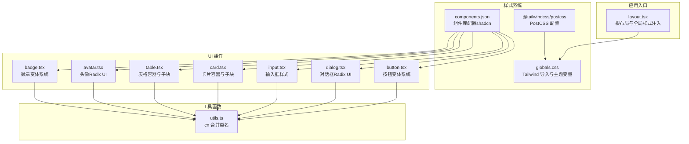
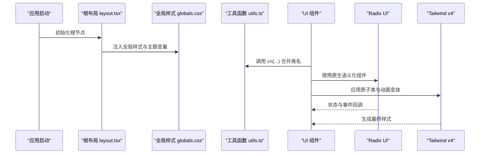
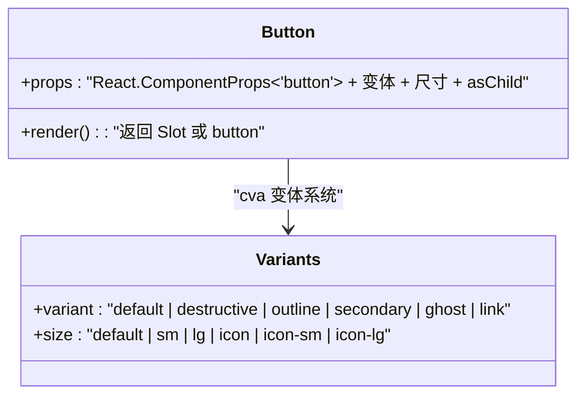
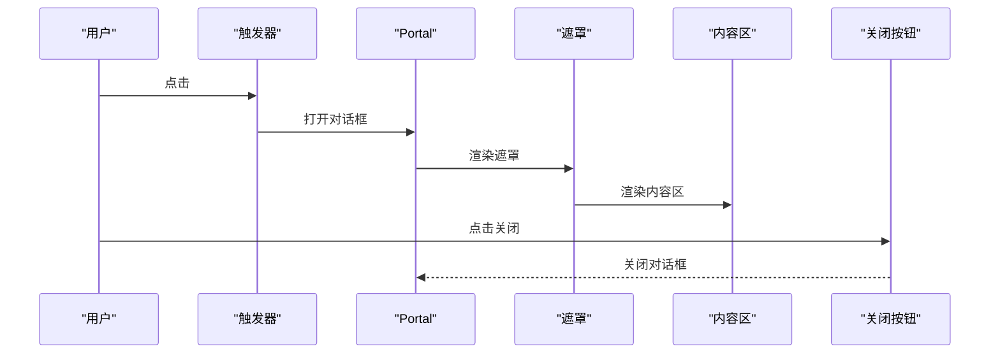
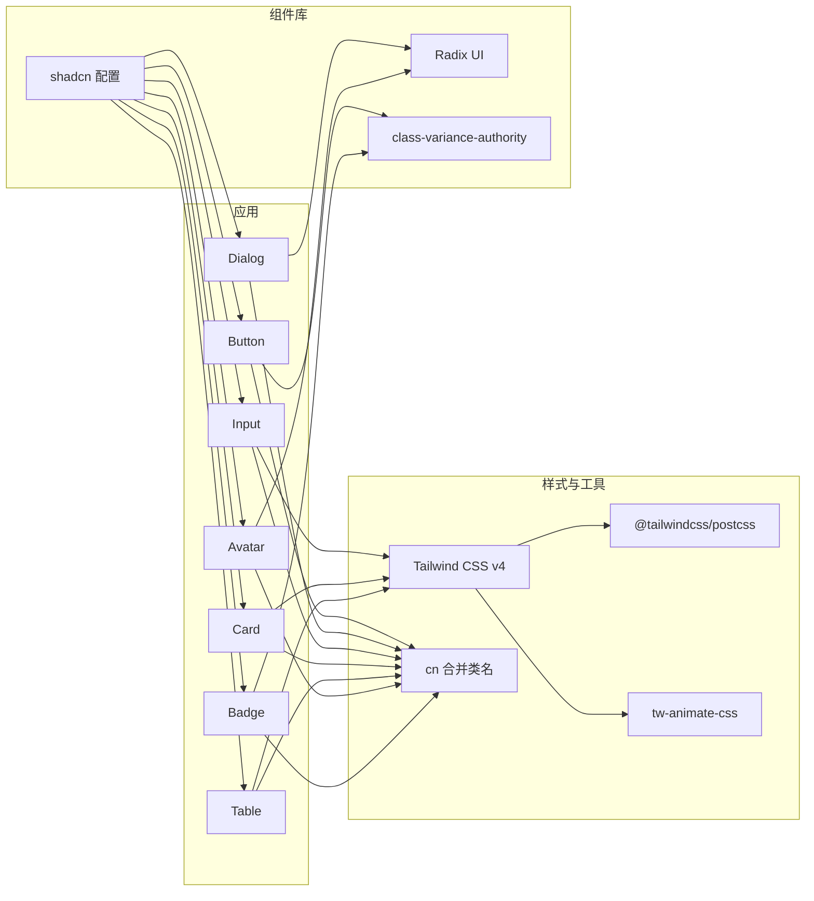

# UI 组件库与样式系统

<cite>
**本文引用的文件**
- [package.json](file://frontend/package.json)
- [postcss.config.mjs](file://frontend/postcss.config.mjs)
- [components.json](file://frontend/components.json)
- [globals.css](file://frontend/src/app/globals.css)
- [layout.tsx](file://frontend/src/app/layout.tsx)
- [utils.ts](file://frontend/src/lib/utils.ts)
- [button.tsx](file://frontend/src/components/ui/button.tsx)
- [card.tsx](file://frontend/src/components/ui/card.tsx)
- [dialog.tsx](file://frontend/src/components/ui/dialog.tsx)
- [input.tsx](file://frontend/src/components/ui/input.tsx)
- [avatar.tsx](file://frontend/src/components/ui/avatar.tsx)
- [badge.tsx](file://frontend/src/components/ui/badge.tsx)
- [table.tsx](file://frontend/src/components/ui/table.tsx)
- [tsconfig.json](file://frontend/tsconfig.json)
</cite>

## 目录
1. [引言](#引言)
2. [项目结构](#项目结构)
3. [核心组件](#核心组件)
4. [架构总览](#架构总览)
5. [详细组件分析](#详细组件分析)
6. [依赖关系分析](#依赖关系分析)
7. [性能考量](#性能考量)
8. [故障排查指南](#故障排查指南)
9. [结论](#结论)
10. [附录](#附录)

## 引言
本设计文档围绕 FreeTrader 前端的 UI 组件库与样式系统展开，重点说明以下内容：
- Radix UI 组件库的集成与使用，涵盖基础组件的封装与扩展思路。
- Tailwind CSS v4 在本项目中的配置与样式系统，包括主题变量、暗色模式、响应式与动画。
- 组件样式的实现方式：变体系统（cva）、条件样式与动态样式。
- 设计系统建立：颜色体系、字体规范与间距标准。
- 样式开发最佳实践：性能优化与可维护性建议。
- 具体样式使用示例与设计规范说明。

## 项目结构
前端采用 Next.js 应用，样式系统基于 Tailwind CSS v4，通过 PostCSS 插件启用新语法与动画扩展；组件层使用 Radix UI 并结合 class-variance-authority 实现变体系统，使用 clsx 与 tailwind-merge 进行类名合并与去重。

图表来源
- [layout.tsx](file://frontend/src/app/layout.tsx#L1-L36)
- [globals.css](file://frontend/src/app/globals.css#L1-L126)
- [postcss.config.mjs](file://frontend/postcss.config.mjs#L1-L8)
- [components.json](file://frontend/components.json#L1-L23)
- [utils.ts](file://frontend/src/lib/utils.ts#L1-L7)
- [button.tsx](file://frontend/src/components/ui/button.tsx#L1-L63)
- [dialog.tsx](file://frontend/src/components/ui/dialog.tsx#L1-L144)
- [input.tsx](file://frontend/src/components/ui/input.tsx#L1-L22)
- [card.tsx](file://frontend/src/components/ui/card.tsx#L1-L93)
- [table.tsx](file://frontend/src/components/ui/table.tsx#L1-L117)
- [avatar.tsx](file://frontend/src/components/ui/avatar.tsx#L1-L54)
- [badge.tsx](file://frontend/src/components/ui/badge.tsx#L1-L47)

章节来源
- [layout.tsx](file://frontend/src/app/layout.tsx#L1-L36)
- [globals.css](file://frontend/src/app/globals.css#L1-L126)
- [postcss.config.mjs](file://frontend/postcss.config.mjs#L1-L8)
- [components.json](file://frontend/components.json#L1-L23)
- [utils.ts](file://frontend/src/lib/utils.ts#L1-L7)

## 核心组件
本节聚焦于样式系统的关键构件及其职责：
- 主题与变量：通过 CSS 变量定义颜色、半径等设计令牌，并在明/暗两套主题下切换。
- 类名合并：统一使用 cn 工具函数进行类名合并与冲突消除。
- 变体系统：使用 class-variance-authority 定义组件的变体与尺寸，确保一致的外观与行为。
- 动画与过渡：借助 Tailwind v4 与 tw-animate-css 提供的动画变体，实现开盒即用的过渡效果。
- Radix UI 封装：以语义化数据槽（data-slot）标记组件结构，便于调试与样式定位。

章节来源
- [globals.css](file://frontend/src/app/globals.css#L6-L47)
- [globals.css](file://frontend/src/app/globals.css#L49-L116)
- [utils.ts](file://frontend/src/lib/utils.ts#L4-L6)
- [button.tsx](file://frontend/src/components/ui/button.tsx#L7-L37)
- [dialog.tsx](file://frontend/src/components/ui/dialog.tsx#L33-L47)
- [input.tsx](file://frontend/src/components/ui/input.tsx#L10-L15)

## 架构总览
下图展示样式系统在运行时的交互流程：应用启动时加载全局样式与主题变量，组件按需引入并使用变体系统与 Radix UI 原子能力，最终由 Tailwind 生成的原子类驱动渲染。

图表来源
- [layout.tsx](file://frontend/src/app/layout.tsx#L22-L32)
- [globals.css](file://frontend/src/app/globals.css#L1-L126)
- [utils.ts](file://frontend/src/lib/utils.ts#L4-L6)
- [button.tsx](file://frontend/src/components/ui/button.tsx#L49-L59)
- [dialog.tsx](file://frontend/src/components/ui/dialog.tsx#L10-L13)

## 详细组件分析

### 按钮组件（Button）
- 变体系统：通过 cva 定义 variant 与 size 两类变体，覆盖默认、破坏性、描边、次级、幽灵、链接等风格与多档尺寸。
- 可组合性：支持 asChild 使用 Slot 包裹任意元素，保持语义与可访问性。
- 焦点与无效状态：内置聚焦环、阴影与无效态（aria-invalid）的颜色提示。
- 数据槽标记：使用 data-slot、data-variant、data-size 便于调试与测试断言。

图表来源
- [button.tsx](file://frontend/src/components/ui/button.tsx#L39-L62)

章节来源
- [button.tsx](file://frontend/src/components/ui/button.tsx#L1-L63)

### 对话框组件（Dialog）
- 结构化封装：对 Radix UI 的 Root、Trigger、Portal、Overlay、Content、Close、Header、Footer、Title、Description 进行统一封装。
- 动画与定位：使用 Tailwind 动画变体实现开合与缩放过渡，固定居中定位并适配移动端宽度。
- 可选关闭按钮：通过 showCloseButton 控制是否渲染关闭按钮，保持无障碍与可访问性。
- 数据槽标记：为每个子组件添加 data-slot，便于样式定位与调试。

图表来源
- [dialog.tsx](file://frontend/src/components/ui/dialog.tsx#L9-L81)

章节来源
- [dialog.tsx](file://frontend/src/components/ui/dialog.tsx#L1-L144)

### 输入框组件（Input）
- 原子样式：直接使用 Tailwind 原子类组合边框、背景、内边距、阴影与过渡。
- 焦点与无效状态：聚焦时显示 ring 效果，无效时以 destructive 色系提示。
- 无障碍增强：保留原生 input 行为，支持选择、禁用与占位符等通用属性。

章节来源
- [input.tsx](file://frontend/src/components/ui/input.tsx#L1-L22)

### 卡片组件（Card）
- 子块解耦：Card、CardHeader、CardTitle、CardDescription、CardAction、CardContent、CardFooter 提供清晰的结构划分。
- 响应式与容器：部分子块使用容器查询与网格布局，提升复杂卡片的自适应表现。
- 数据槽标记：每个子块均带有 data-slot，便于样式定位与一致性校验。

章节来源
- [card.tsx](file://frontend/src/components/ui/card.tsx#L1-L93)

### 表格组件（Table）
- 容器与滚动：Table 外层包裹一个可横向滚动的容器，适配窄屏环境。
- 子块职责：TableHeader、TableBody、TableFooter、TableRow、TableHead、TableCell、TableCaption 分别承担表头、主体、页脚、行、列头、单元格与标题的样式与行为。
- 交互态：悬停与选中态通过数据属性与过渡类实现，保证可读性与反馈。

章节来源
- [table.tsx](file://frontend/src/components/ui/table.tsx#L1-L117)

### 头像组件（Avatar）
- 原子样式：头像根容器、图片与回退文本均使用 Tailwind 原子类控制尺寸、圆角与背景。
- 可访问性：保留原生头像语义，支持图片加载失败时的回退处理。

章节来源
- [avatar.tsx](file://frontend/src/components/ui/avatar.tsx#L1-L54)

### 徽章组件（Badge）
- 变体系统：通过 cva 定义 default、secondary、destructive、outline 四种风格，满足标签、状态、强调等场景。
- 可组合性：支持 asChild 以包裹链接等内联元素，同时保留焦点与无效态样式。

章节来源
- [badge.tsx](file://frontend/src/components/ui/badge.tsx#L1-L47)

## 依赖关系分析
- 组件库与工具链
  - Radix UI：提供无障碍、可组合的基础 UI 原语，组件通过其命名空间导入并封装。
  - class-variance-authority：用于定义组件变体系统，统一风格与尺寸。
  - clsx/tailwind-merge：合并与去重类名，避免冲突与冗余。
  - lucide-react：图标库，配合组件中的 SVG 使用。
  - next-themes：主题切换（如启用），与 CSS 变量配合实现明/暗模式。
  - Tailwind CSS v4：提供原子类、主题变量与动画变体。
  - PostCSS：通过 @tailwindcss/postcss 插件启用新语法与动画扩展。
  - shadcn 配置：components.json 定义组件别名与样式风格，便于复用与一致性。

图表来源
- [package.json](file://frontend/package.json#L11-L31)
- [postcss.config.mjs](file://frontend/postcss.config.mjs#L1-L8)
- [components.json](file://frontend/components.json#L1-L23)
- [utils.ts](file://frontend/src/lib/utils.ts#L1-L7)
- [button.tsx](file://frontend/src/components/ui/button.tsx#L1-L63)
- [dialog.tsx](file://frontend/src/components/ui/dialog.tsx#L1-L144)
- [input.tsx](file://frontend/src/components/ui/input.tsx#L1-L22)
- [card.tsx](file://frontend/src/components/ui/card.tsx#L1-L93)
- [table.tsx](file://frontend/src/components/ui/table.tsx#L1-L117)
- [avatar.tsx](file://frontend/src/components/ui/avatar.tsx#L1-L54)
- [badge.tsx](file://frontend/src/components/ui/badge.tsx#L1-L47)

章节来源
- [package.json](file://frontend/package.json#L11-L31)
- [postcss.config.mjs](file://frontend/postcss.config.mjs#L1-L8)
- [components.json](file://frontend/components.json#L1-L23)
- [utils.ts](file://frontend/src/lib/utils.ts#L1-L7)

## 性能考量
- 类名合并策略
  - 使用 clsx 与 tailwind-merge 合并类名，减少重复与冲突，降低运行时样式抖动风险。
- 变体系统
  - 通过 cva 预编译变体，避免在渲染路径上进行字符串拼接或条件判断，提高渲染效率。
- 原子类优先
  - Tailwind 原子类具备高度复用性与缓存友好性，配合 PostCSS 插件可按需生成，避免全局样式膨胀。
- 动画与过渡
  - 使用 CSS 变换与透明度动画，尽量避免触发布局与重绘；在需要时使用 transform 与 opacity。
- 主题切换
  - 通过 CSS 变量与暗色模式类切换，避免在运行时频繁重排样式树。
- 组件拆分
  - 将复杂组件拆分为多个小块（如 Card 的子块、Table 的子块），减少不必要的重渲染范围。

## 故障排查指南
- 样式未生效
  - 检查 globals.css 是否正确导入 Tailwind 与 tw-animate-css，并确认 @theme inline 与 CSS 变量定义完整。
  - 确认 PostCSS 配置已启用 @tailwindcss/postcss 插件。
- 变体不生效
  - 确认组件使用了 cva 并传入正确的 variant/size 参数；检查 data-slot 与 data-variant/data-size 是否存在。
- 类名冲突
  - 使用 cn 工具函数合并类名，避免重复设置同一属性；检查 tailwind-merge 是否正确安装与调用。
- 动画异常
  - 确认 tw-animate-css 已正确导入；检查动画变体名称是否符合 Tailwind v4 规范。
- 暗色模式不切换
  - 确认根节点存在暗色类（如 .dark），并检查 CSS 变量在 :root 与 .dark 中的定义是否一致。
- 图标不显示
  - 确认 lucide-react 已安装，且组件中 SVG 使用的 size 类与组件约定一致。

章节来源
- [globals.css](file://frontend/src/app/globals.css#L1-L126)
- [postcss.config.mjs](file://frontend/postcss.config.mjs#L1-L8)
- [utils.ts](file://frontend/src/lib/utils.ts#L4-L6)
- [button.tsx](file://frontend/src/components/ui/button.tsx#L49-L59)
- [dialog.tsx](file://frontend/src/components/ui/dialog.tsx#L33-L47)
- [input.tsx](file://frontend/src/components/ui/input.tsx#L10-L15)

## 结论
本项目通过 Tailwind CSS v4 与 PostCSS 插件构建了现代化、可维护的样式系统，结合 Radix UI 的可组合性与 class-variance-authority 的变体系统，实现了高内聚、低耦合的 UI 组件库。CSS 变量与明/暗两套主题确保了设计一致性与可扩展性；cn 工具函数与原子类优先策略提升了性能与可维护性。建议在后续迭代中持续完善设计令牌与组件变体，保持样式系统的演进与一致性。

## 附录

### 设计系统与规范
- 颜色体系
  - 使用 oklch 颜色空间定义主色、前景、背景、卡片、弹出层、输入、边框、危险、环形光晕等设计令牌，并在明/暗两套主题下分别赋值。
- 字体规范
  - 通过 CSS 变量定义无衬线与等宽字体族，根布局应用字体类，确保全局一致性。
- 间距与圆角
  - 使用 CSS 变量定义基础半径与派生半径（sm/md/lg/xl/2xl/3xl/4xl），在组件中按需引用，保证视觉层级一致。
- 动画与过渡
  - 使用 tw-animate-css 提供的开盒即用动画变体，结合 Tailwind v4 的过渡类，实现流畅的交互反馈。

章节来源
- [globals.css](file://frontend/src/app/globals.css#L6-L47)
- [globals.css](file://frontend/src/app/globals.css#L49-L116)
- [layout.tsx](file://frontend/src/app/layout.tsx#L22-L32)

### 样式使用示例（路径指引）
- 按钮：参考 [button.tsx](file://frontend/src/components/ui/button.tsx#L39-L62)，通过 variant 与 size 切换风格与尺寸。
- 对话框：参考 [dialog.tsx](file://frontend/src/components/ui/dialog.tsx#L49-L81)，通过 showCloseButton 控制关闭按钮显示。
- 输入框：参考 [input.tsx](file://frontend/src/components/ui/input.tsx#L5-L18)，聚焦与无效态自动生效。
- 卡片：参考 [card.tsx](file://frontend/src/components/ui/card.tsx#L5-L82)，按需组合子块实现复杂布局。
- 表格：参考 [table.tsx](file://frontend/src/components/ui/table.tsx#L7-L105)，容器滚动与子块职责清晰。
- 头像：参考 [avatar.tsx](file://frontend/src/components/ui/avatar.tsx#L8-L51)，原生语义与回退处理。
- 徽章：参考 [badge.tsx](file://frontend/src/components/ui/badge.tsx#L28-L44)，asChild 支持内联元素。

### TypeScript 路径映射
- 项目使用路径映射 @/* 指向 src/*，便于在组件与工具函数间保持简洁导入路径。

章节来源
- [tsconfig.json](file://frontend/tsconfig.json#L21-L23)