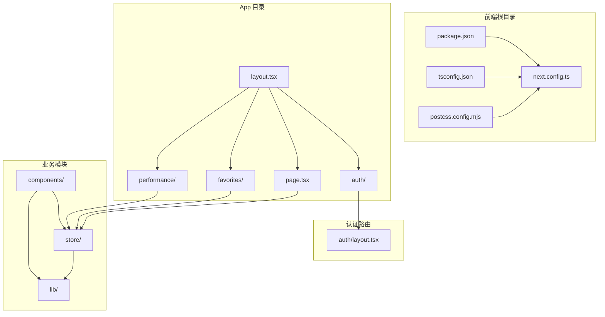
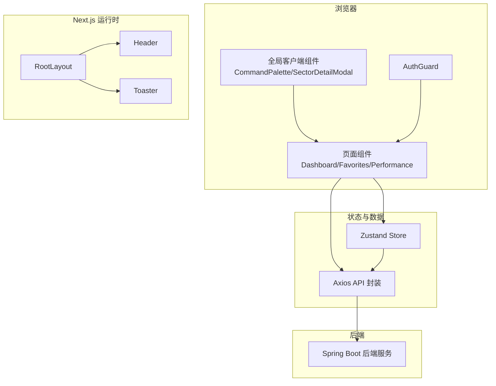
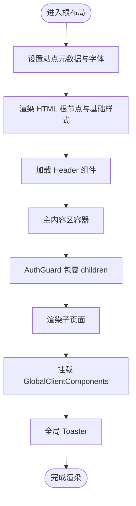
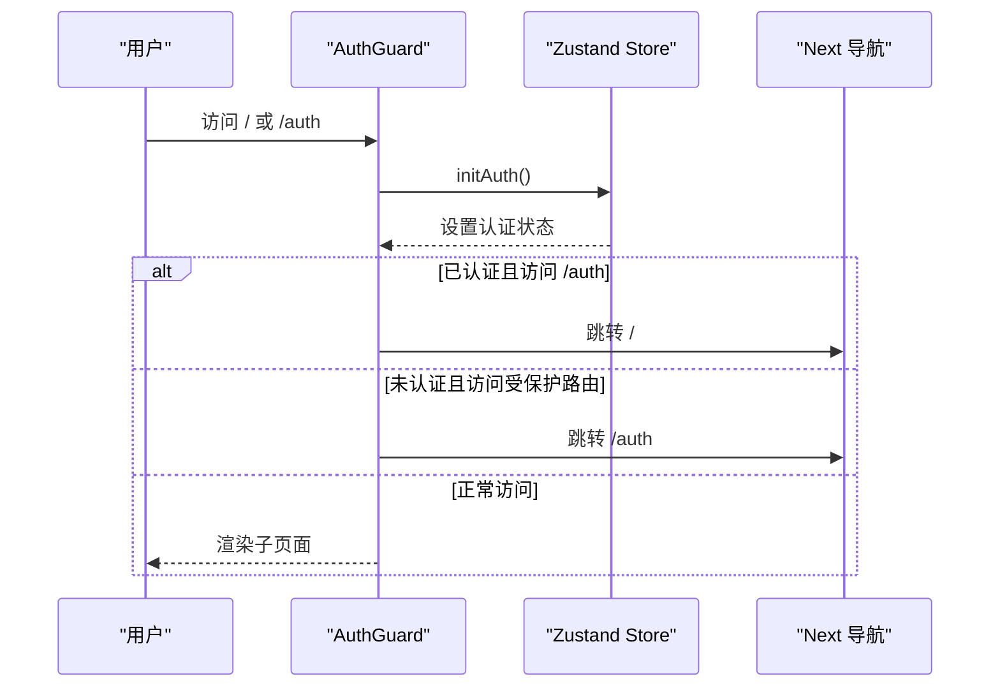
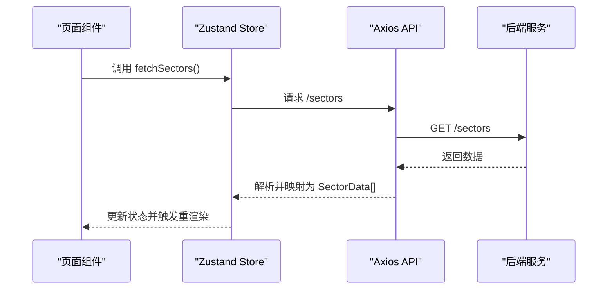
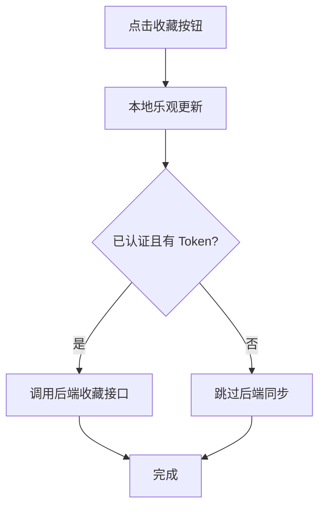
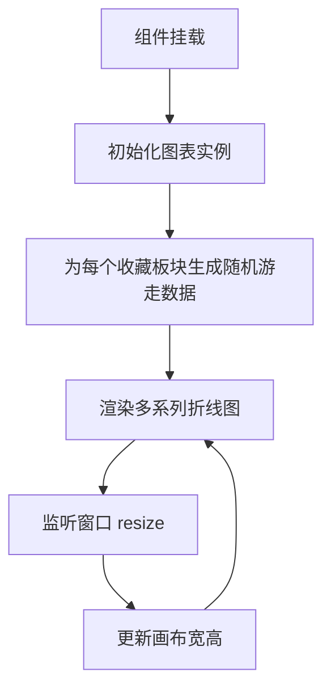
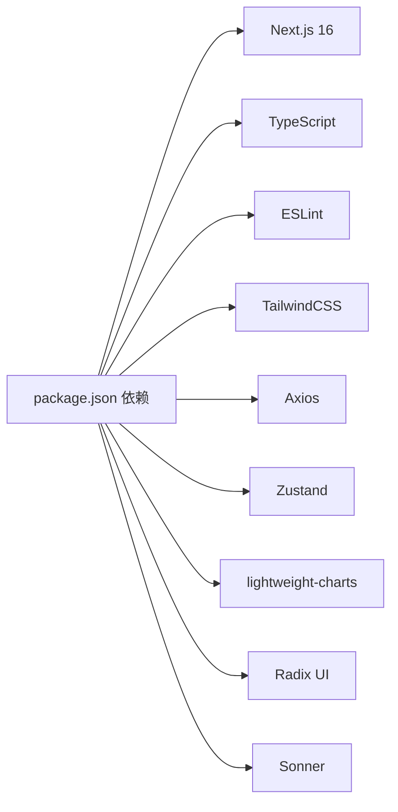

# 前端架构设计

<cite>
**本文引用的文件**
- [package.json](file://frontend/package.json)
- [tsconfig.json](file://frontend/tsconfig.json)
- [next.config.ts](file://frontend/next.config.ts)
- [postcss.config.mjs](file://frontend/postcss.config.mjs)
- [src/app/layout.tsx](file://frontend/src/app/layout.tsx)
- [src/app/page.tsx](file://frontend/src/app/page.tsx)
- [src/app/auth/layout.tsx](file://frontend/src/app/auth/layout.tsx)
- [src/app/favorites/page.tsx](file://frontend/src/app/favorites/page.tsx)
- [src/app/performance/page.tsx](file://frontend/src/app/performance/page.tsx)
- [src/components/AuthGuard.tsx](file://frontend/src/components/AuthGuard.tsx)
- [src/components/GlobalClientComponents.tsx](file://frontend/src/components/GlobalClientComponents.tsx)
- [src/lib/api.ts](file://frontend/src/lib/api.ts)
- [src/lib/types.ts](file://frontend/src/lib/types.ts)
- [src/lib/constants.ts](file://frontend/src/lib/constants.ts)
- [src/store/useStore.ts](file://frontend/src/store/useStore.ts)
</cite>

## 目录
1. [引言](#引言)
2. [项目结构](#项目结构)
3. [核心组件](#核心组件)
4. [架构总览](#架构总览)
5. [详细组件分析](#详细组件分析)
6. [依赖关系分析](#依赖关系分析)
7. [性能考虑](#性能考虑)
8. [故障排查指南](#故障排查指南)
9. [结论](#结论)
10. [附录](#附录)

## 引言
本文件面向 FreeTrader 前端，系统性阐述基于 Next.js 16 App Router 的架构设计与实现细节。内容覆盖路由组织、布局设计、页面渲染机制、目录结构约定、TypeScript 配置、构建与开发服务器设置，并结合实际源码路径给出架构决策依据与最佳实践建议。

## 项目结构
前端采用 Next.js 16 App Router 的 app 目录组织方式，以“约定优于配置”为核心思想，通过文件系统路由自动推导页面路径与层级关系。根级 app 目录下包含全局布局、入口页面以及按功能划分的子路由页面；src 下的 components、lib、store 等模块化组织业务与数据层。

图表来源
- [src/app/layout.tsx](file://frontend/src/app/layout.tsx#L1-L36)
- [src/app/page.tsx](file://frontend/src/app/page.tsx#L1-L271)
- [src/app/auth/layout.tsx](file://frontend/src/app/auth/layout.tsx#L1-L33)
- [src/app/favorites/page.tsx](file://frontend/src/app/favorites/page.tsx#L1-L247)
- [src/app/performance/page.tsx](file://frontend/src/app/performance/page.tsx#L1-L231)
- [src/store/useStore.ts](file://frontend/src/store/useStore.ts#L1-L304)
- [src/lib/api.ts](file://frontend/src/lib/api.ts#L1-L89)

章节来源
- [package.json](file://frontend/package.json#L1-L44)
- [tsconfig.json](file://frontend/tsconfig.json#L1-L35)
- [next.config.ts](file://frontend/next.config.ts#L1-L8)
- [postcss.config.mjs](file://frontend/postcss.config.mjs#L1-L8)

## 核心组件
- 全局根布局：定义站点元数据、字体、全局样式、头部导航、客户端全局组件挂载点与全局通知组件。
- 页面组件：首页仪表盘、自选页、表现页等，均标记为客户端组件，使用状态管理与 API 访问。
- 认证布局：独立的认证页面容器，提供背景装饰与居中内容区域。
- 客户端守卫：在客户端侧进行认证状态校验与路由跳转控制。
- 全局客户端组件：命令面板与详情弹窗等跨页面使用的客户端组件统一挂载。
- 状态管理：基于 Zustand 的集中式状态，包含认证、UI、图表选择、数据拉取与收藏同步。
- API 层：Axios 实例封装，统一请求拦截器注入令牌、响应拦截器处理未授权跳转。
- 类型与常量：统一的数据接口定义与本地演示数据，支撑开发与联调。

章节来源
- [src/app/layout.tsx](file://frontend/src/app/layout.tsx#L1-L36)
- [src/app/page.tsx](file://frontend/src/app/page.tsx#L1-L271)
- [src/app/auth/layout.tsx](file://frontend/src/app/auth/layout.tsx#L1-L33)
- [src/components/AuthGuard.tsx](file://frontend/src/components/AuthGuard.tsx#L1-L60)
- [src/components/GlobalClientComponents.tsx](file://frontend/src/components/GlobalClientComponents.tsx#L1-L14)
- [src/store/useStore.ts](file://frontend/src/store/useStore.ts#L1-L304)
- [src/lib/api.ts](file://frontend/src/lib/api.ts#L1-L89)
- [src/lib/types.ts](file://frontend/src/lib/types.ts#L1-L47)
- [src/lib/constants.ts](file://frontend/src/lib/constants.ts#L1-L96)

## 架构总览
Next.js 16 App Router 以“文件系统即路由”的方式组织页面，app 目录下的每个页面文件对应一个路由路径。根布局负责全局结构与主题、导航、守卫与客户端组件挂载；各功能页面通过客户端组件与状态管理实现交互逻辑；API 层统一处理后端通信与鉴权。

图表来源
- [src/app/layout.tsx](file://frontend/src/app/layout.tsx#L1-L36)
- [src/components/GlobalClientComponents.tsx](file://frontend/src/components/GlobalClientComponents.tsx#L1-L14)
- [src/components/AuthGuard.tsx](file://frontend/src/components/AuthGuard.tsx#L1-L60)
- [src/store/useStore.ts](file://frontend/src/store/useStore.ts#L1-L304)
- [src/lib/api.ts](file://frontend/src/lib/api.ts#L1-L89)

## 详细组件分析

### 根布局与全局结构
- 元数据与字体：在根布局中声明站点标题、描述与 Google 字体资源。
- 结构组织：头部导航、主内容区、客户端全局组件挂载点、全局通知。
- 客户端守卫：包裹 children，确保受保护路由的访问控制。

图表来源
- [src/app/layout.tsx](file://frontend/src/app/layout.tsx#L1-L36)
- [src/components/GlobalClientComponents.tsx](file://frontend/src/components/GlobalClientComponents.tsx#L1-L14)
- [src/components/AuthGuard.tsx](file://frontend/src/components/AuthGuard.tsx#L1-L60)

章节来源
- [src/app/layout.tsx](file://frontend/src/app/layout.tsx#L1-L36)

### 认证路由与布局
- 独立布局：认证页面使用独立布局，提供视觉背景与居中内容容器。
- 公开路由：根路径与认证页为公开路由，避免循环重定向。

图表来源
- [src/components/AuthGuard.tsx](file://frontend/src/components/AuthGuard.tsx#L1-L60)
- [src/store/useStore.ts](file://frontend/src/store/useStore.ts#L115-L133)

章节来源
- [src/app/auth/layout.tsx](file://frontend/src/app/auth/layout.tsx#L1-L33)
- [src/components/AuthGuard.tsx](file://frontend/src/components/AuthGuard.tsx#L1-L60)

### 页面渲染与数据流
- 客户端组件：页面组件标记为客户端组件，使用 useEffect 在挂载时拉取数据。
- 状态驱动：通过 Zustand store 获取/更新状态，触发 UI 更新。
- 数据回退：API 失败时保留本地演示数据，保证可用性。

图表来源
- [src/app/page.tsx](file://frontend/src/app/page.tsx#L1-L271)
- [src/store/useStore.ts](file://frontend/src/store/useStore.ts#L171-L206)
- [src/lib/api.ts](file://frontend/src/lib/api.ts#L52-L63)

章节来源
- [src/app/page.tsx](file://frontend/src/app/page.tsx#L1-L271)
- [src/store/useStore.ts](file://frontend/src/store/useStore.ts#L171-L206)
- [src/lib/api.ts](file://frontend/src/lib/api.ts#L52-L63)

### 收藏与详情联动
- 乐观更新：切换收藏时先更新本地状态，再异步同步至后端。
- 详情联动：选择板块后拉取详情并填充股票列表，支持图表选择。

图表来源
- [src/store/useStore.ts](file://frontend/src/store/useStore.ts#L261-L302)

章节来源
- [src/store/useStore.ts](file://frontend/src/store/useStore.ts#L261-L302)

### 自选页与图表集成
- 图表库：使用 lightweight-charts 创建多系列折线图，按收藏板块生成数据序列。
- 响应式：监听窗口 resize 并动态调整画布尺寸。
- 性能：仅在收藏列表变化时重建图表，减少不必要的重绘。

图表来源
- [src/app/favorites/page.tsx](file://frontend/src/app/favorites/page.tsx#L29-L94)

章节来源
- [src/app/favorites/page.tsx](file://frontend/src/app/favorites/page.tsx#L1-L247)

### 表现页与可视化
- 排序与筛选：按涨跌幅排序，支持限制数量与时间范围。
- 可视化：自定义柱状图与表格展示，支持点击选择板块。

章节来源
- [src/app/performance/page.tsx](file://frontend/src/app/performance/page.tsx#L1-L231)

## 依赖关系分析
- 构建与运行：Next.js 16 作为核心框架，配合 TypeScript 编译、ESLint、TailwindCSS PostCSS 插件。
- 状态管理：Zustand 提供轻量级状态容器，替代 Redux。
- UI 组件：Radix UI 与 Tailwind 组合，部分组件来自本地 ui 目录。
- 图表：lightweight-charts 用于高性能 K 线与折线图。
- 通知：Sonner 提供全局通知提示。
- 开发工具：Axios 作为 HTTP 客户端，内置拦截器处理鉴权与错误。

图表来源
- [package.json](file://frontend/package.json#L1-L44)

章节来源
- [package.json](file://frontend/package.json#L1-L44)

## 性能考虑
- 懒加载与并发：页面组件按需加载，避免一次性渲染过多内容。
- 乐观更新：收藏切换即时反馈，降低感知延迟。
- 图表优化：仅在收藏变更时重建图表，减少计算与 DOM 操作。
- 缓存策略：本地存储令牌与用户信息，减少重复鉴权请求。
- 构建优化：启用增量编译与严格类型检查，提升开发体验与稳定性。

## 故障排查指南
- 未登录跳转：当后端返回 401 时，移除本地令牌与用户信息并跳转至认证页。
- 加载状态：守卫组件在初始化期间显示加载指示，避免误判权限。
- 网络异常：API 层捕获错误并提示，页面保留本地数据作为回退。
- 路由循环：公共路由与受保护路由之间避免相互跳转导致的死循环。

章节来源
- [src/lib/api.ts](file://frontend/src/lib/api.ts#L25-L37)
- [src/components/AuthGuard.tsx](file://frontend/src/components/AuthGuard.tsx#L22-L38)

## 结论
FreeTrader 前端以 Next.js 16 App Router 为基础，结合 Zustand 状态管理、Axios API 封装与 TailwindCSS 设计体系，实现了清晰的页面组织、可靠的认证控制与高效的交互体验。通过乐观更新、图表懒加载与本地回退策略，兼顾了用户体验与系统鲁棒性。建议持续关注 Next.js 新特性与生态演进，保持依赖版本更新与安全补丁。

## 附录

### TypeScript 配置要点
- 目标与模块：ES2017、esnext、bundler 分辨，启用严格模式与增量编译。
- 路径别名：@/* 映射到 src/*，简化导入路径。
- JSX：使用 react-jsx，配合 Next 插件增强类型推断。

章节来源
- [tsconfig.json](file://frontend/tsconfig.json#L1-L35)

### 构建与开发配置
- Next 配置：当前为空配置，可扩展实验性功能与输出策略。
- PostCSS：启用 TailwindCSS 插件，支持现代 CSS 特性。
- 脚本：dev/build/start/lint 四类脚本满足开发、构建与质量检查需求。

章节来源
- [next.config.ts](file://frontend/next.config.ts#L1-L8)
- [postcss.config.mjs](file://frontend/postcss.config.mjs#L1-L8)
- [package.json](file://frontend/package.json#L5-L10)