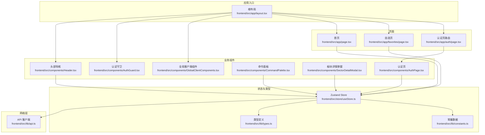
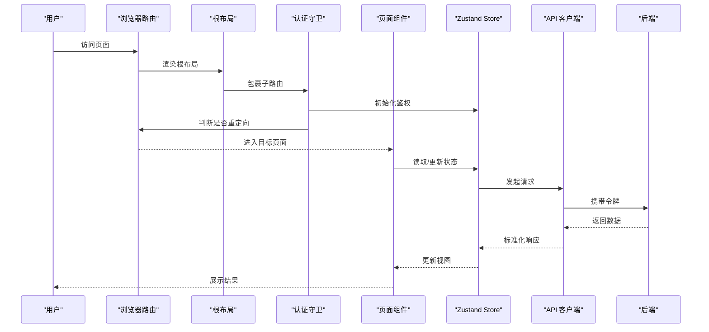
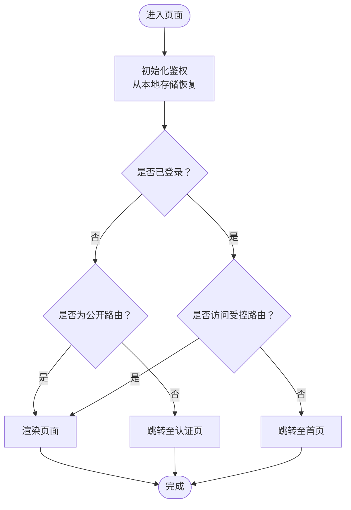
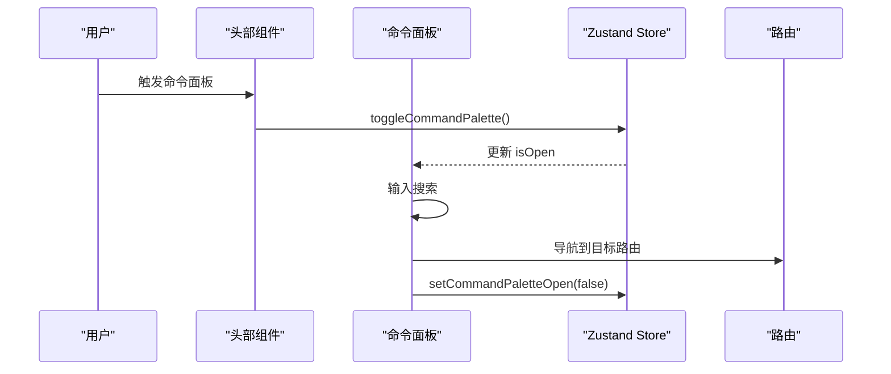
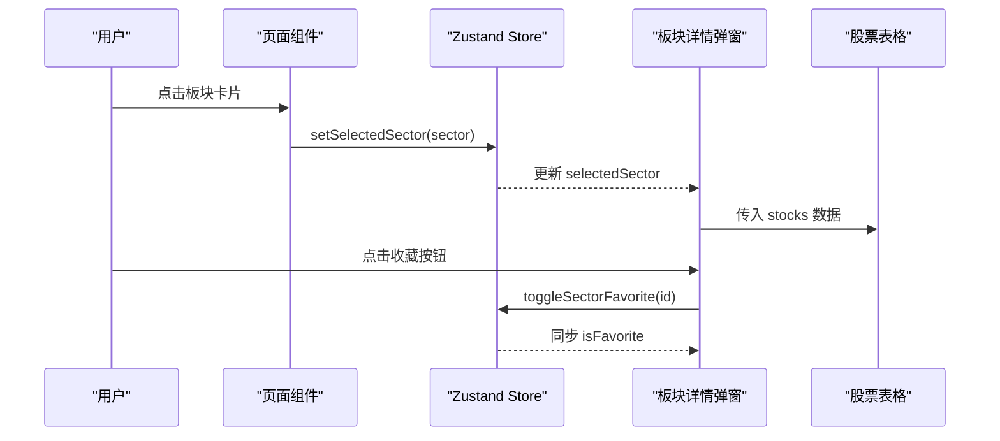
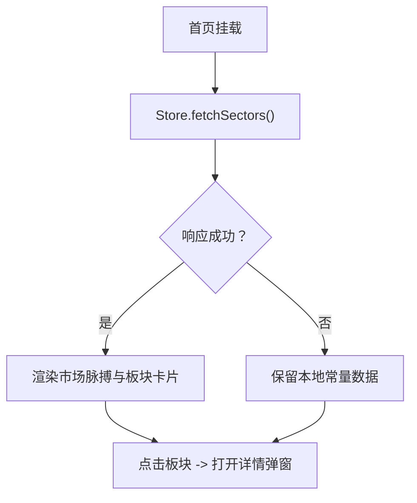
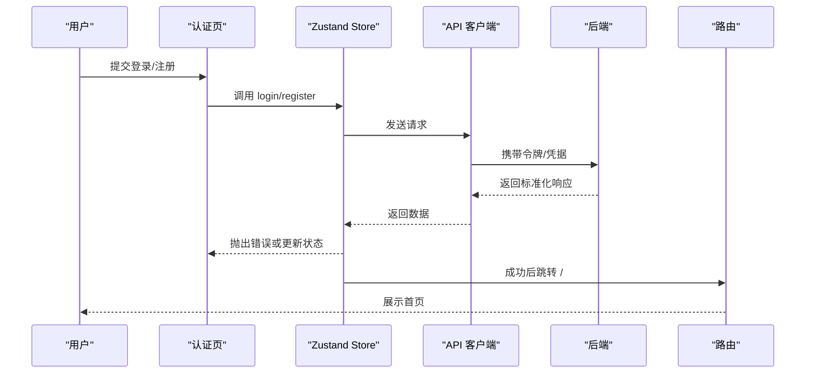
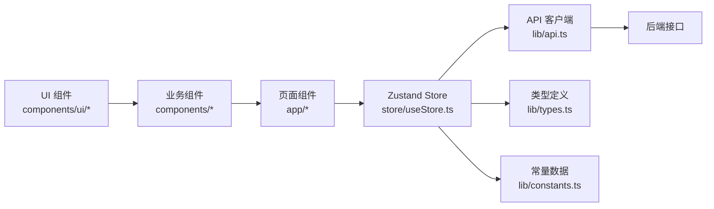

# 前端系统

<cite>
**本文引用的文件**
- [frontend/src/app/layout.tsx](file://frontend/src/app/layout.tsx)
- [frontend/src/store/useStore.ts](file://frontend/src/store/useStore.ts)
- [frontend/src/lib/api.ts](file://frontend/src/lib/api.ts)
- [frontend/src/lib/types.ts](file://frontend/src/lib/types.ts)
- [frontend/package.json](file://frontend/package.json)
- [frontend/src/lib/constants.ts](file://frontend/src/lib/constants.ts)
- [frontend/src/components/Header.tsx](file://frontend/src/components/Header.tsx)
- [frontend/src/components/AuthGuard.tsx](file://frontend/src/components/AuthGuard.tsx)
- [frontend/src/components/GlobalClientComponents.tsx](file://frontend/src/components/GlobalClientComponents.tsx)
- [frontend/src/app/auth/page.tsx](file://frontend/src/app/auth/page.tsx)
- [frontend/src/components/AuthPage.tsx](file://frontend/src/components/AuthPage.tsx)
- [frontend/src/components/CommandPalette.tsx](file://frontend/src/components/CommandPalette.tsx)
- [frontend/src/components/SectorDetailModal.tsx](file://frontend/src/components/SectorDetailModal.tsx)
- [frontend/src/app/page.tsx](file://frontend/src/app/page.tsx)
- [frontend/src/app/favorites/page.tsx](file://frontend/src/app/favorites/page.tsx)
</cite>

## 目录
1. [简介](#简介)
2. [项目结构](#项目结构)
3. [核心组件](#核心组件)
4. [架构总览](#架构总览)
5. [组件详解](#组件详解)
6. [依赖关系分析](#依赖关系分析)
7. [性能考量](#性能考量)
8. [故障排查指南](#故障排查指南)
9. [结论](#结论)
10. [附录](#附录)

## 简介
本文件面向 FreeTrader 前端团队，系统化梳理基于 Next.js 16 的前端应用架构与实现细节。内容覆盖 App Router 页面组织、布局与守卫机制、组件分层设计（布局组件、业务组件、UI 组件）、状态管理（Zustand Store）与数据流、API 客户端封装与错误处理、TypeScript 类型体系、UI 组件库（Radix UI + Tailwind CSS）集成方式，并提供可复用的最佳实践与参考路径。

## 项目结构
前端采用 Next.js 16 App Router 结构，页面按功能域组织在 app 目录下，通用 UI 组件位于 components/ui，业务组件位于 components，全局状态与类型定义分别位于 store 与 lib。

图表来源
- [frontend/src/app/layout.tsx](file://frontend/src/app/layout.tsx#L16-L35)
- [frontend/src/app/page.tsx](file://frontend/src/app/page.tsx#L1-L271)
- [frontend/src/app/favorites/page.tsx](file://frontend/src/app/favorites/page.tsx#L1-L247)
- [frontend/src/app/auth/page.tsx](file://frontend/src/app/auth/page.tsx#L1-L6)
- [frontend/src/components/Header.tsx](file://frontend/src/components/Header.tsx#L12-L128)
- [frontend/src/components/AuthGuard.tsx](file://frontend/src/components/AuthGuard.tsx#L11-L59)
- [frontend/src/components/GlobalClientComponents.tsx](file://frontend/src/components/GlobalClientComponents.tsx#L6-L13)
- [frontend/src/components/CommandPalette.tsx](file://frontend/src/components/CommandPalette.tsx#L26-L90)
- [frontend/src/components/SectorDetailModal.tsx](file://frontend/src/components/SectorDetailModal.tsx#L10-L62)
- [frontend/src/components/AuthPage.tsx](file://frontend/src/components/AuthPage.tsx#L14-L321)
- [frontend/src/store/useStore.ts](file://frontend/src/store/useStore.ts#L62-L303)
- [frontend/src/lib/api.ts](file://frontend/src/lib/api.ts#L1-L89)
- [frontend/src/lib/types.ts](file://frontend/src/lib/types.ts#L1-L47)
- [frontend/src/lib/constants.ts](file://frontend/src/lib/constants.ts#L1-L96)

章节来源
- [frontend/src/app/layout.tsx](file://frontend/src/app/layout.tsx#L1-L36)
- [frontend/src/app/page.tsx](file://frontend/src/app/page.tsx#L1-L271)
- [frontend/src/app/favorites/page.tsx](file://frontend/src/app/favorites/page.tsx#L1-L247)
- [frontend/src/app/auth/page.tsx](file://frontend/src/app/auth/page.tsx#L1-L6)

## 核心组件
- 根布局：统一注入全局样式、头部、认证守卫、全局客户端组件与通知提示器，控制整站骨架与权限边界。
- 认证守卫：在路由变化时校验鉴权状态，保护受控页面，避免未登录访问。
- 头部导航：根据登录态显示菜单与用户操作，支持命令面板快捷键触发。
- 全局客户端组件：挂载命令面板与板块详情弹窗，保证客户端交互能力。
- 页面组件：首页负责市场脉搏与板块概览；自选页负责收藏板块的汇总与对比图表；认证页提供登录/注册表单。
- Zustand Store：集中管理认证、UI、图表选择、数据加载与后端同步逻辑。
- API 客户端：Axios 实例封装，自动注入令牌与统一错误处理。
- 类型与常量：明确数据模型与本地回退数据，保障开发体验与容错。

章节来源
- [frontend/src/components/AuthGuard.tsx](file://frontend/src/components/AuthGuard.tsx#L11-L59)
- [frontend/src/components/Header.tsx](file://frontend/src/components/Header.tsx#L12-L128)
- [frontend/src/components/GlobalClientComponents.tsx](file://frontend/src/components/GlobalClientComponents.tsx#L6-L13)
- [frontend/src/app/page.tsx](file://frontend/src/app/page.tsx#L11-L271)
- [frontend/src/app/favorites/page.tsx](file://frontend/src/app/favorites/page.tsx#L13-L247)
- [frontend/src/app/auth/page.tsx](file://frontend/src/app/auth/page.tsx#L1-L6)
- [frontend/src/store/useStore.ts](file://frontend/src/store/useStore.ts#L24-L60)
- [frontend/src/lib/api.ts](file://frontend/src/lib/api.ts#L1-L89)
- [frontend/src/lib/types.ts](file://frontend/src/lib/types.ts#L1-L47)
- [frontend/src/lib/constants.ts](file://frontend/src/lib/constants.ts#L1-L96)

## 架构总览
Next.js App Router 将页面作为“路由单元”，通过布局组件组合形成站点骨架。认证守卫在进入页面前进行鉴权判断，头部组件提供导航与用户入口，全局客户端组件承载跨页面交互（命令面板、详情弹窗）。状态管理通过 Zustand 聚合，API 客户端统一处理请求与响应拦截，类型系统贯穿前后端契约。

图表来源
- [frontend/src/app/layout.tsx](file://frontend/src/app/layout.tsx#L16-L35)
- [frontend/src/components/AuthGuard.tsx](file://frontend/src/components/AuthGuard.tsx#L22-L38)
- [frontend/src/app/page.tsx](file://frontend/src/app/page.tsx#L17-L20)
- [frontend/src/store/useStore.ts](file://frontend/src/store/useStore.ts#L62-L303)
- [frontend/src/lib/api.ts](file://frontend/src/lib/api.ts#L13-L37)

## 组件详解

### 布局与守卫
- 根布局负责字体、全局样式、头部、守卫与全局客户端组件挂载，确保所有页面共享一致的导航与交互体验。
- 认证守卫在初始化时从本地存储恢复登录态，并在路由切换时阻止未登录访问受控页面，同时避免已登录用户停留在认证页。

图表来源
- [frontend/src/components/AuthGuard.tsx](file://frontend/src/components/AuthGuard.tsx#L18-L38)
- [frontend/src/app/layout.tsx](file://frontend/src/app/layout.tsx#L22-L31)

章节来源
- [frontend/src/app/layout.tsx](file://frontend/src/app/layout.tsx#L16-L35)
- [frontend/src/components/AuthGuard.tsx](file://frontend/src/components/AuthGuard.tsx#L11-L59)

### 头部导航与命令面板
- 头部根据登录态显示菜单项与用户信息，提供登出与命令面板触发。
- 命令面板通过快捷键监听打开，提供导航、工具与设置入口，联动 Store 控制开关。

图表来源
- [frontend/src/components/Header.tsx](file://frontend/src/components/Header.tsx#L15-L29)
- [frontend/src/components/CommandPalette.tsx](file://frontend/src/components/CommandPalette.tsx#L26-L90)
- [frontend/src/store/useStore.ts](file://frontend/src/store/useStore.ts#L39-L41)

章节来源
- [frontend/src/components/Header.tsx](file://frontend/src/components/Header.tsx#L12-L128)
- [frontend/src/components/CommandPalette.tsx](file://frontend/src/components/CommandPalette.tsx#L26-L90)
- [frontend/src/store/useStore.ts](file://frontend/src/store/useStore.ts#L39-L41)

### 板块详情弹窗与表格
- 弹窗在选中板块时打开，包含侧边栏、图表与股票列表三段式布局，支持收藏切换。
- 表格展示板块内基金明细，配合 Store 的收藏与图表选择状态驱动。

图表来源
- [frontend/src/app/page.tsx](file://frontend/src/app/page.tsx#L12-L15)
- [frontend/src/store/useStore.ts](file://frontend/src/store/useStore.ts#L136-L145)
- [frontend/src/components/SectorDetailModal.tsx](file://frontend/src/components/SectorDetailModal.tsx#L10-L62)
- [frontend/src/store/useStore.ts](file://frontend/src/store/useStore.ts#L261-L302)

章节来源
- [frontend/src/components/SectorDetailModal.tsx](file://frontend/src/components/SectorDetailModal.tsx#L10-L62)
- [frontend/src/store/useStore.ts](file://frontend/src/store/useStore.ts#L136-L145)
- [frontend/src/store/useStore.ts](file://frontend/src/store/useStore.ts#L261-L302)

### 首页与自选页
- 首页聚合市场脉搏、收藏板块与热门板块，使用 SVG 渲染简单折线图（sparkline），并提供收藏切换与详情弹窗入口。
- 自选页展示收藏板块的汇总卡片与对比图表，支持时间范围切换与导出入口。

图表来源
- [frontend/src/app/page.tsx](file://frontend/src/app/page.tsx#L17-L20)
- [frontend/src/store/useStore.ts](file://frontend/src/store/useStore.ts#L171-L206)
- [frontend/src/lib/constants.ts](file://frontend/src/lib/constants.ts#L86-L96)

章节来源
- [frontend/src/app/page.tsx](file://frontend/src/app/page.tsx#L11-L271)
- [frontend/src/app/favorites/page.tsx](file://frontend/src/app/favorites/page.tsx#L13-L247)
- [frontend/src/store/useStore.ts](file://frontend/src/store/useStore.ts#L171-L206)
- [frontend/src/lib/constants.ts](file://frontend/src/lib/constants.ts#L86-L96)

### 认证流程
- 认证页提供登录/注册双标签页，提交后调用 Store 的 login/register，成功后跳转首页并拉取板块数据。
- 守卫在初始化时恢复登录态，避免重复登录。

图表来源
- [frontend/src/components/AuthPage.tsx](file://frontend/src/components/AuthPage.tsx#L38-L70)
- [frontend/src/store/useStore.ts](file://frontend/src/store/useStore.ts#L69-L103)
- [frontend/src/lib/api.ts](file://frontend/src/lib/api.ts#L40-L50)
- [frontend/src/components/AuthGuard.tsx](file://frontend/src/components/AuthGuard.tsx#L22-L26)

章节来源
- [frontend/src/components/AuthPage.tsx](file://frontend/src/components/AuthPage.tsx#L14-L321)
- [frontend/src/store/useStore.ts](file://frontend/src/store/useStore.ts#L69-L103)
- [frontend/src/lib/api.ts](file://frontend/src/lib/api.ts#L40-L50)
- [frontend/src/components/AuthGuard.tsx](file://frontend/src/components/AuthGuard.tsx#L22-L26)

## 依赖关系分析
- 组件耦合：页面组件仅通过 Store 与 API 交互，降低对具体实现的耦合；UI 组件通过 Radix UI 与 Tailwind 组合，保持样式与语义分离。
- 状态管理：Store 聚合认证、UI、数据与图表选择，动作方法内聚请求与本地更新，必要时异步同步后端。
- 网络层：Axios 实例统一注入 Authorization 头与错误处理，减少重复逻辑。
- 类型系统：类型定义与常量数据为组件提供契约与回退，提升健壮性。

图表来源
- [frontend/src/store/useStore.ts](file://frontend/src/store/useStore.ts#L1-L304)
- [frontend/src/lib/api.ts](file://frontend/src/lib/api.ts#L1-L89)
- [frontend/src/lib/types.ts](file://frontend/src/lib/types.ts#L1-L47)
- [frontend/src/lib/constants.ts](file://frontend/src/lib/constants.ts#L1-L96)

章节来源
- [frontend/src/store/useStore.ts](file://frontend/src/store/useStore.ts#L1-L304)
- [frontend/src/lib/api.ts](file://frontend/src/lib/api.ts#L1-L89)
- [frontend/src/lib/types.ts](file://frontend/src/lib/types.ts#L1-L47)
- [frontend/src/lib/constants.ts](file://frontend/src/lib/constants.ts#L1-L96)

## 性能考量
- 首屏与懒加载：页面组件在挂载时发起数据拉取，Store 内对失败场景保留本地常量回退，避免白屏。
- 图表渲染：自选页使用轻量级图表库，按需生成数据与事件监听，窗口尺寸变更时动态适配。
- 状态粒度：Store 将认证、UI、数据与收藏等状态解耦，避免无关重渲染。
- 本地存储：登录态与用户信息持久化，减少重复登录成本。

章节来源
- [frontend/src/store/useStore.ts](file://frontend/src/store/useStore.ts#L171-L206)
- [frontend/src/app/favorites/page.tsx](file://frontend/src/app/favorites/page.tsx#L30-L94)
- [frontend/src/lib/constants.ts](file://frontend/src/lib/constants.ts#L1-L96)

## 故障排查指南
- 401 未授权：请求拦截器检测到 401 时清除本地令牌与用户信息并跳转认证页，检查后端令牌有效性与过期策略。
- 登录/注册失败：Store 在响应非 200 时抛出错误，前端捕获并提示；检查后端返回字段与网络连通性。
- 收藏上限：Store 对收藏数量做上限校验并提示，避免超过限制；若后端同步失败，本地状态仍保持可用。
- 命令面板无响应：确认快捷键监听与 Store 开关逻辑，检查全局客户端组件是否正确挂载。

章节来源
- [frontend/src/lib/api.ts](file://frontend/src/lib/api.ts#L25-L37)
- [frontend/src/store/useStore.ts](file://frontend/src/store/useStore.ts#L82-L102)
- [frontend/src/store/useStore.ts](file://frontend/src/store/useStore.ts#L269-L276)
- [frontend/src/components/GlobalClientComponents.tsx](file://frontend/src/components/GlobalClientComponents.tsx#L6-L13)

## 结论
本前端系统以 Next.js 16 App Router 为基础，结合 Radix UI 与 Tailwind CSS 实现高可维护的 UI 体系，通过 Zustand 聚合状态与 API 客户端统一处理网络层，辅以完善的类型定义与本地回退策略，形成清晰的职责划分与稳健的数据流。建议后续持续完善错误边界、国际化与测试覆盖，以进一步提升可扩展性与可靠性。

## 附录
- 依赖清单（关键）
  - Next.js 16、React 19、Zustand 5、Axios、Radix UI、Tailwind CSS、Sonner、Lightweight Charts、Lucide React
- 推荐实践
  - 使用 Store 动作方法封装副作用，保持纯视图组件。
  - 对外请求统一走 API 客户端，避免分散的请求逻辑。
  - 为每个页面组件提供最小可运行示例与 Storybook（如引入）。
  - 对复杂计算与渲染使用 useMemo/useCallback 缓存，避免抖动。

章节来源
- [frontend/package.json](file://frontend/package.json#L11-L31)