# 状态管理方案

<cite>
**本文档引用的文件**
- [useStore.ts](file://frontend/src/store/useStore.ts)
- [types.ts](file://frontend/src/lib/types.ts)
- [api.ts](file://frontend/src/lib/api.ts)
- [constants.ts](file://frontend/src/lib/constants.ts)
- [layout.tsx](file://frontend/src/app/layout.tsx)
- [GlobalClientComponents.tsx](file://frontend/src/components/GlobalClientComponents.tsx)
- [AuthGuard.tsx](file://frontend/src/components/AuthGuard.tsx)
- [Header.tsx](file://frontend/src/components/Header.tsx)
- [CommandPalette.tsx](file://frontend/src/components/CommandPalette.tsx)
- [page.tsx](file://frontend/src/app/page.tsx)
- [StockTable.tsx](file://frontend/src/components/StockTable.tsx)
- [ChartSection.tsx](file://frontend/src/components/ChartSection.tsx)
- [package.json](file://frontend/package.json)
</cite>

## 目录
1. [简介](#简介)
2. [项目结构](#项目结构)
3. [核心组件](#核心组件)
4. [架构概览](#架构概览)
5. [详细组件分析](#详细组件分析)
6. [依赖关系分析](#依赖关系分析)
7. [性能考虑](#性能考虑)
8. [故障排除指南](#故障排除指南)
9. [结论](#结论)
10. [附录](#附录)

## 简介

FreeTrader 项目采用 Zustand 作为其主要的状态管理解决方案，实现了现代化的 React 应用状态管理。本项目通过 Store 设计模式，将全局状态、用户认证状态、UI 状态和业务数据状态进行统一管理，提供了完整的状态持久化、状态同步和响应式更新机制。

Zustand 作为一个轻量级的状态管理库，为本项目提供了简洁而强大的状态管理能力，支持中间件、异步操作和复杂的业务逻辑处理。

## 项目结构

项目采用前后端分离的架构设计，前端部分专门负责状态管理和用户界面交互。状态管理相关的文件组织如下：

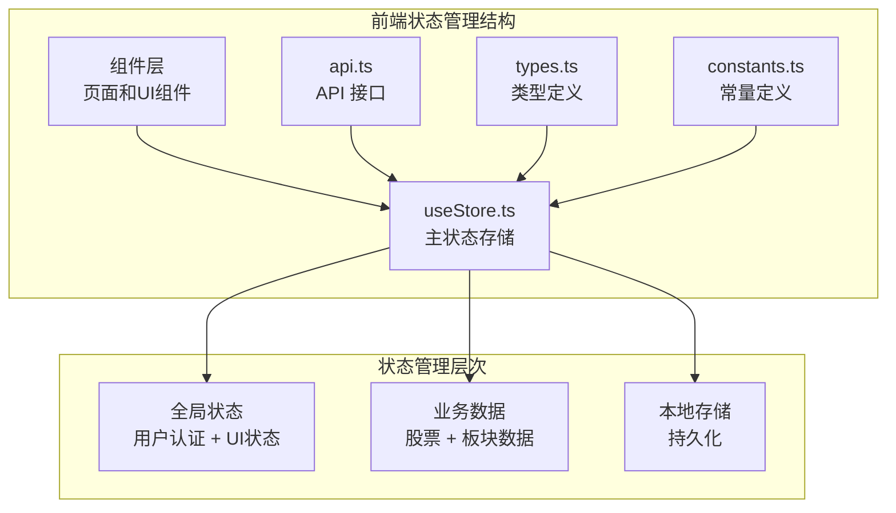

**图表来源**
- [useStore.ts](file://frontend/src/store/useStore.ts#L1-L304)
- [types.ts](file://frontend/src/lib/types.ts#L1-L47)
- [api.ts](file://frontend/src/lib/api.ts#L1-L89)

**章节来源**
- [useStore.ts](file://frontend/src/store/useStore.ts#L1-L304)
- [layout.tsx](file://frontend/src/app/layout.tsx#L1-L36)

## 核心组件

### Zustand Store 架构

项目的核心是单一的全局 Store，它包含了所有应用程序的状态和动作函数。Store 的设计遵循了模块化的理念，将不同类型的业务状态进行分类管理。

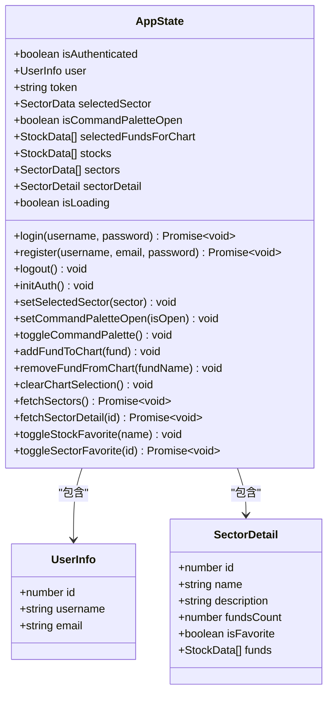

**图表来源**
- [useStore.ts](file://frontend/src/store/useStore.ts#L7-L60)

### 状态类型系统

项目建立了完整的类型系统，确保状态管理的类型安全性和开发体验：

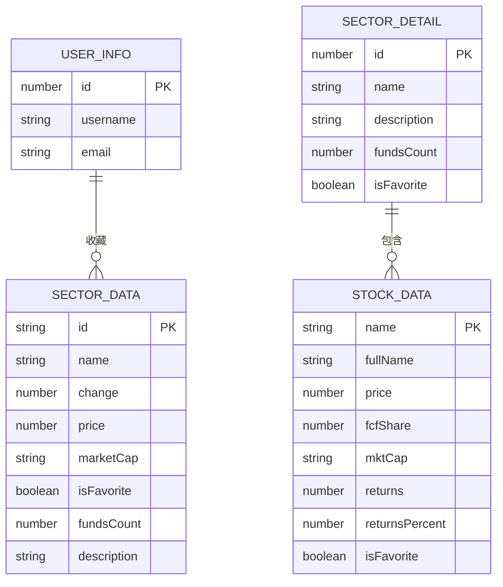

**图表来源**
- [types.ts](file://frontend/src/lib/types.ts#L1-L47)

**章节来源**
- [useStore.ts](file://frontend/src/store/useStore.ts#L1-L304)
- [types.ts](file://frontend/src/lib/types.ts#L1-L47)

## 架构概览

### 状态管理流程

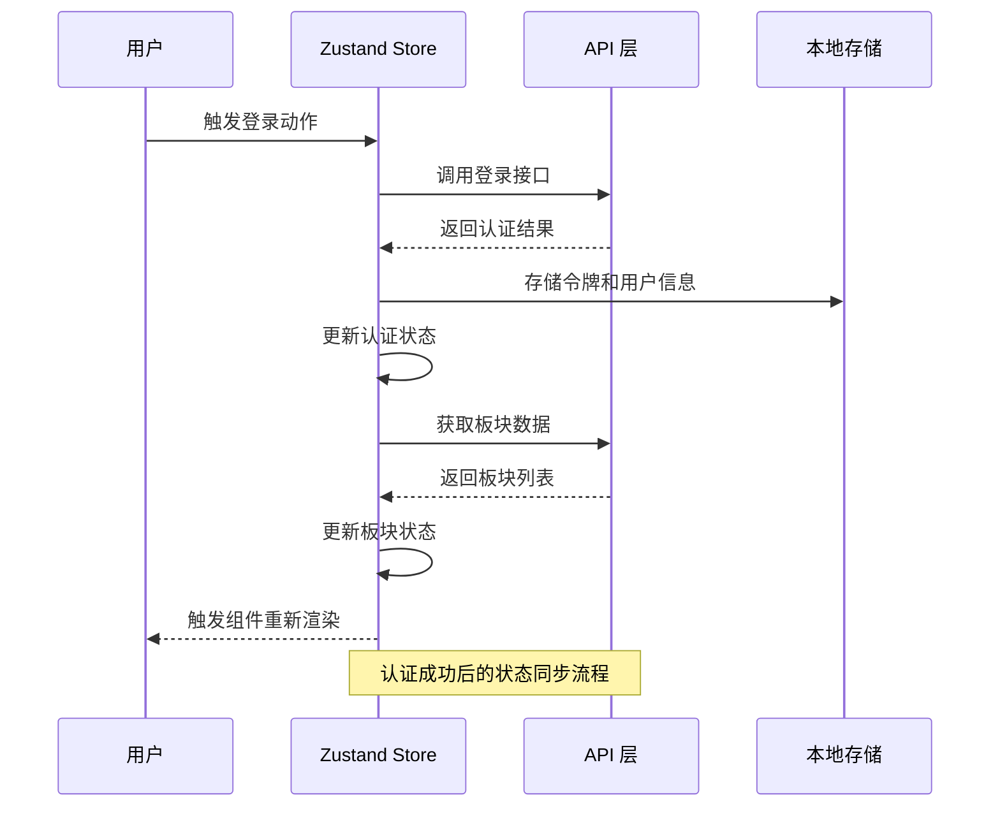

**图表来源**
- [useStore.ts](file://frontend/src/store/useStore.ts#L69-L103)
- [api.ts](file://frontend/src/lib/api.ts#L40-L50)

### 数据流架构

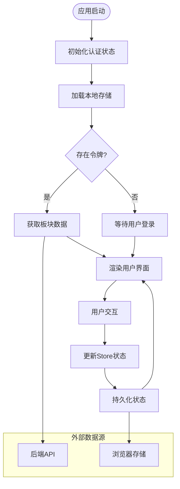

**图表来源**
- [useStore.ts](file://frontend/src/store/useStore.ts#L115-L133)
- [useStore.ts](file://frontend/src/store/useStore.ts#L171-L206)

## 详细组件分析

### 认证状态管理

认证状态管理是整个应用的核心，负责用户身份验证、令牌管理和会话生命周期。

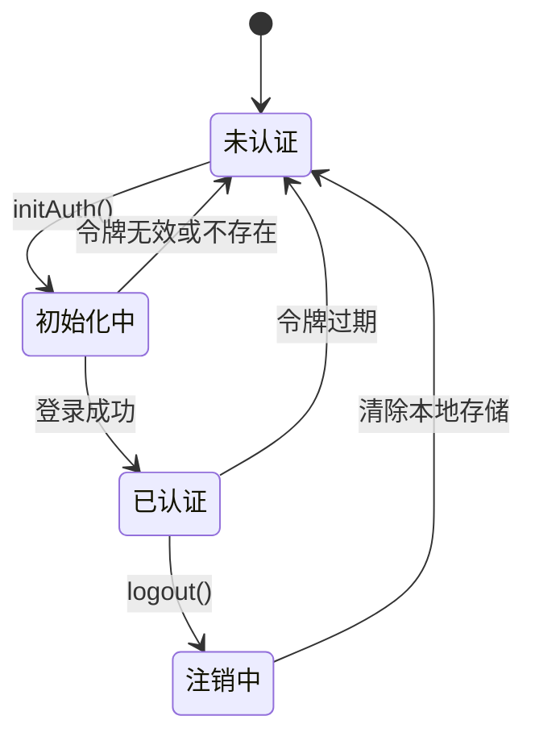

**图表来源**
- [useStore.ts](file://frontend/src/store/useStore.ts#L69-L133)

认证状态的关键特性包括：
- **令牌管理**：自动处理 JWT 令牌的存储、读取和验证
- **会话恢复**：应用重启后自动恢复用户会话
- **错误处理**：统一处理认证相关的异常情况
- **权限控制**：基于认证状态控制路由访问

**章节来源**
- [useStore.ts](file://frontend/src/store/useStore.ts#L69-L133)
- [AuthGuard.tsx](file://frontend/src/components/AuthGuard.tsx#L1-L40)

### 全局 UI 状态管理

UI 状态管理涵盖了用户界面的各种交互状态，包括导航、模态框和命令面板等。

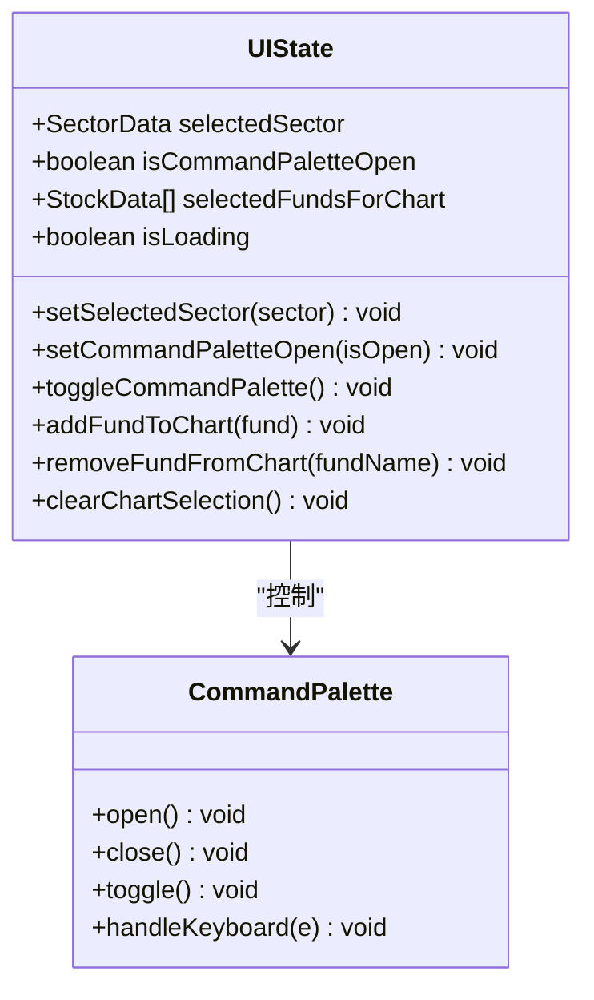

**图表来源**
- [useStore.ts](file://frontend/src/store/useStore.ts#L135-L162)
- [CommandPalette.tsx](file://frontend/src/components/CommandPalette.tsx#L26-L47)

UI 状态管理的特点：
- **响应式更新**：状态变化自动触发组件重新渲染
- **键盘快捷键**：支持 Cmd+K 快捷键打开命令面板
- **图表选择**：支持多基金对比图表的选择和管理
- **加载状态**：统一的加载指示器管理

**章节来源**
- [useStore.ts](file://frontend/src/store/useStore.ts#L135-L162)
- [CommandPalette.tsx](file://frontend/src/components/CommandPalette.tsx#L26-L91)

### 业务数据状态管理

业务数据状态管理负责处理股票和板块数据的获取、缓存和更新。

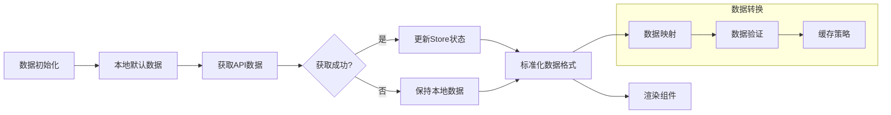

**图表来源**
- [useStore.ts](file://frontend/src/store/useStore.ts#L171-L253)
- [constants.ts](file://frontend/src/lib/constants.ts#L1-L96)

业务数据管理的关键功能：
- **数据获取**：异步获取板块和股票数据
- **数据转换**：将后端数据转换为前端可用格式
- **错误处理**：网络请求失败时的降级处理
- **数据缓存**：本地数据作为后备方案

**章节来源**
- [useStore.ts](file://frontend/src/store/useStore.ts#L171-L253)
- [constants.ts](file://frontend/src/lib/constants.ts#L1-L96)

### 收藏功能状态管理

收藏功能实现了用户对板块和股票的个性化管理，采用了乐观更新策略。

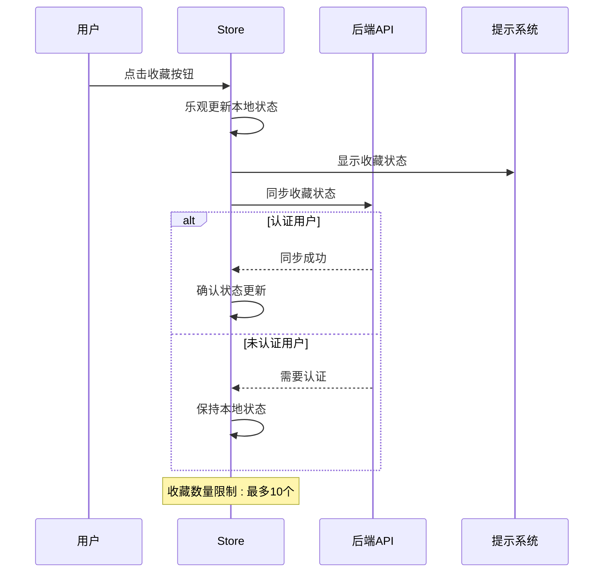

**图表来源**
- [useStore.ts](file://frontend/src/store/useStore.ts#L261-L302)

收藏功能的特殊处理：
- **乐观更新**：先更新本地状态，提升用户体验
- **数量限制**：最多收藏10个板块
- **同步机制**：在用户认证后与后端同步
- **错误容错**：后端同步失败不影响本地使用

**章节来源**
- [useStore.ts](file://frontend/src/store/useStore.ts#L261-L302)

## 依赖关系分析

### 组件依赖图

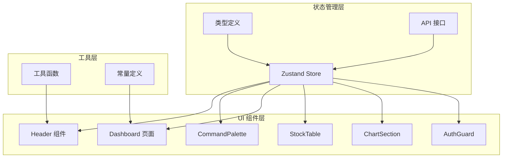

**图表来源**
- [useStore.ts](file://frontend/src/store/useStore.ts#L1-L304)
- [Header.tsx](file://frontend/src/components/Header.tsx#L1-L130)
- [page.tsx](file://frontend/src/app/page.tsx#L1-L271)

### 外部依赖分析

项目对外部库的依赖关系：

```mermaid
graph LR
subgraph "状态管理"
Zustand[zustand@5.0.9]
Sonner[sonner@2.0.7]
end
subgraph "UI 组件"
Radix[Radix UI]
Lucide[lucide-react]
Tailwind[tailwindcss]
end
subgraph "数据处理"
Axios[axios@1.13.2]
Charts[lightweight-charts@5.1.0]
end
Zustand --> Axios
Zustand --> Sonner
Header --> Radix
Header --> Lucide
Dashboard --> Charts
```

**图表来源**
- [package.json](file://frontend/package.json#L11-L30)

**章节来源**
- [package.json](file://frontend/package.json#L11-L30)

## 性能考虑

### 状态更新优化

项目在状态管理方面采用了多种性能优化策略：

1. **选择性订阅**：使用 `useStore(selector)` 只订阅需要的状态片段
2. **批量更新**：合理组织状态更新，避免不必要的重渲染
3. **记忆化计算**：使用 `useMemo` 缓存计算结果
4. **防抖处理**：对频繁的状态更新进行节流

### 内存管理

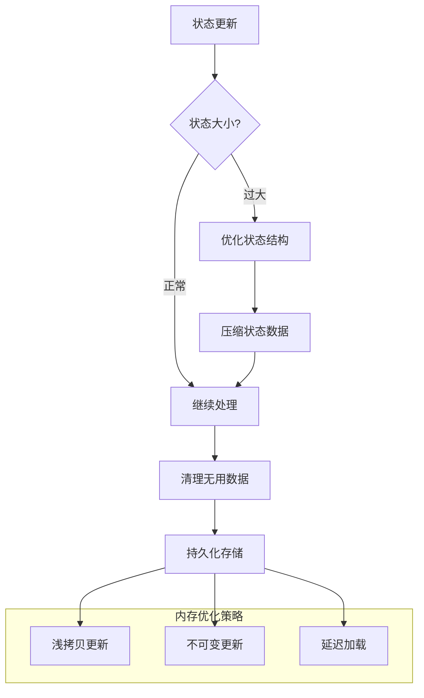

### 缓存策略

项目实现了多层次的缓存机制：

- **本地存储缓存**：使用 localStorage 缓存认证信息
- **状态缓存**：Store 中缓存获取的数据
- **组件缓存**：使用 React.memo 避免不必要的重渲染

**章节来源**
- [useStore.ts](file://frontend/src/store/useStore.ts#L1-L304)

## 故障排除指南

### 常见问题诊断

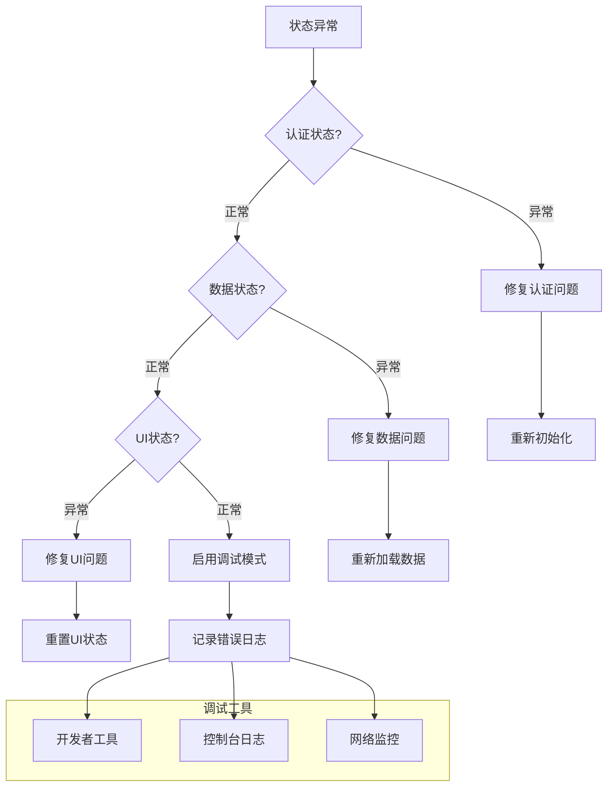

### 调试方法

1. **状态监控**：使用 React DevTools 观察状态变化
2. **网络调试**：监控 API 请求和响应
3. **本地存储检查**：验证令牌和用户信息的存储状态
4. **错误边界**：实现错误边界捕获组件错误

**章节来源**
- [useStore.ts](file://frontend/src/store/useStore.ts#L1-L304)

## 结论

FreeTrader 项目的状态管理方案展现了现代 React 应用的最佳实践。通过采用 Zustand，项目实现了：

- **简洁的 API**：最小化的样板代码，易于理解和维护
- **类型安全**：完整的 TypeScript 类型定义，提供编译时检查
- **性能优化**：合理的状态更新策略和内存管理
- **可扩展性**：模块化的 Store 设计，便于功能扩展
- **用户体验**：流畅的状态切换和响应式更新

该方案为类似金融应用的状态管理提供了优秀的参考模板，特别是在处理复杂数据流和用户交互方面表现突出。

## 附录

### Store 使用示例

以下是一些常见的 Store 使用模式：

1. **基础状态订阅**：
```typescript
const isAuthenticated = useStore((state) => state.isAuthenticated);
```

2. **动作函数调用**：
```typescript
const login = useStore((state) => state.login);
await login(username, password);
```

3. **组合状态访问**：
```typescript
const { sectors, selectedSector, setSelectedSector } = useStore((state) => ({
  sectors: state.sectors,
  selectedSector: state.selectedSector,
  setSelectedSector: state.setSelectedSector
}));
```

### 状态流转图

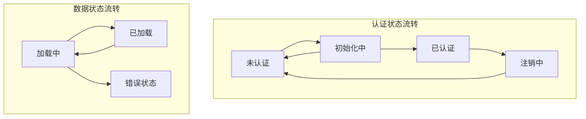