# 组件系统设计

<cite>
**本文引用的文件**
- [button.tsx](file://frontend/src/components/ui/button.tsx)
- [card.tsx](file://frontend/src/components/ui/card.tsx)
- [dialog.tsx](file://frontend/src/components/ui/dialog.tsx)
- [avatar.tsx](file://frontend/src/components/ui/avatar.tsx)
- [input.tsx](file://frontend/src/components/ui/input.tsx)
- [Header.tsx](file://frontend/src/components/Header.tsx)
- [Sidebar.tsx](file://frontend/src/components/Sidebar.tsx)
- [ChartSection.tsx](file://frontend/src/components/ChartSection.tsx)
- [StockTable.tsx](file://frontend/src/components/StockTable.tsx)
- [useStore.ts](file://frontend/src/store/useStore.ts)
- [layout.tsx](file://frontend/src/app/layout.tsx)
- [utils.ts](file://frontend/src/lib/utils.ts)
- [types.ts](file://frontend/src/lib/types.ts)
- [constants.ts](file://frontend/src/lib/constants.ts)
- [package.json](file://frontend/package.json)
</cite>

## 目录
1. [简介](#简介)
2. [项目结构](#项目结构)
3. [核心组件](#核心组件)
4. [架构总览](#架构总览)
5. [详细组件分析](#详细组件分析)
6. [依赖分析](#依赖分析)
7. [性能考量](#性能考量)
8. [故障排查指南](#故障排查指南)
9. [结论](#结论)
10. [附录](#附录)

## 简介
本文件面向 FreeTrader 前端组件系统，系统化梳理组件层次结构与设计原则，明确布局组件、业务组件与 UI 组件的职责边界与交互关系；深入解析自定义 UI 组件库（Button、Card、Dialog 等）的实现与使用方式；总结组件通信模式（Props 传递、事件处理、状态共享）与最佳实践（性能优化、可访问性），并提供可直接参考的使用示例与代码模板路径。

## 项目结构
前端采用 Next.js 应用程序，组件按“功能域 + UI 组件库”组织：
- 布局组件：位于 app 目录，负责全局布局与路由容器
- 业务组件：位于 components 目录，封装页面级或模块级业务逻辑
- UI 组件库：位于 components/ui 目录，提供可复用的基础 UI 组件
- 状态管理：通过 Zustand 的 useStore 管理全局状态与动作
- 工具与类型：lib 目录提供通用工具函数、类型定义与常量

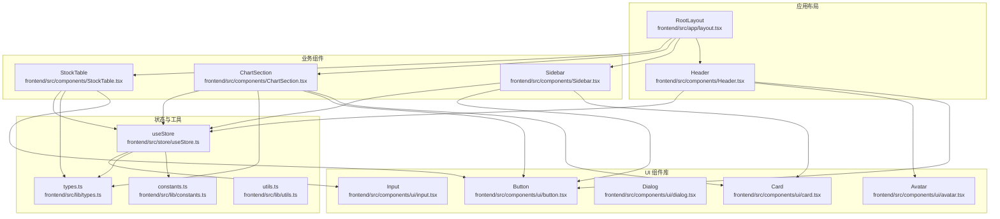

**图示来源**
- [layout.tsx](file://frontend/src/app/layout.tsx#L16-L35)
- [Header.tsx](file://frontend/src/components/Header.tsx#L12-L128)
- [Sidebar.tsx](file://frontend/src/components/Sidebar.tsx#L16-L117)
- [ChartSection.tsx](file://frontend/src/components/ChartSection.tsx#L14-L245)
- [StockTable.tsx](file://frontend/src/components/StockTable.tsx#L37-L111)
- [button.tsx](file://frontend/src/components/ui/button.tsx#L39-L60)
- [card.tsx](file://frontend/src/components/ui/card.tsx#L5-L92)
- [dialog.tsx](file://frontend/src/components/ui/dialog.tsx#L9-L143)
- [avatar.tsx](file://frontend/src/components/ui/avatar.tsx#L8-L53)
- [input.tsx](file://frontend/src/components/ui/input.tsx#L5-L19)
- [useStore.ts](file://frontend/src/store/useStore.ts#L24-L60)
- [types.ts](file://frontend/src/lib/types.ts#L1-L47)
- [constants.ts](file://frontend/src/lib/constants.ts#L1-L96)
- [utils.ts](file://frontend/src/lib/utils.ts#L4-L6)

**章节来源**
- [layout.tsx](file://frontend/src/app/layout.tsx#L16-L35)
- [package.json](file://frontend/package.json#L11-L31)

## 核心组件
- 布局组件
  - RootLayout：全局根布局，挂载 Header、子页面内容、全局客户端组件与通知
  - Header：导航栏与用户区，集成认证状态、命令面板触发、登出等
- 业务组件
  - Sidebar：板块内基金选择与对比建议，联动图表展示
  - ChartSection：基于 lightweight-charts 的可视化图表，支持时间范围切换
  - StockTable：板块内基金列表，支持收藏切换与排序
- UI 组件库
  - Button、Card、Dialog、Avatar、Input 等，提供一致的样式与行为约定

**章节来源**
- [layout.tsx](file://frontend/src/app/layout.tsx#L16-L35)
- [Header.tsx](file://frontend/src/components/Header.tsx#L12-L128)
- [Sidebar.tsx](file://frontend/src/components/Sidebar.tsx#L16-L117)
- [ChartSection.tsx](file://frontend/src/components/ChartSection.tsx#L14-L245)
- [StockTable.tsx](file://frontend/src/components/StockTable.tsx#L37-L111)
- [button.tsx](file://frontend/src/components/ui/button.tsx#L39-L60)
- [card.tsx](file://frontend/src/components/ui/card.tsx#L5-L92)
- [dialog.tsx](file://frontend/src/components/ui/dialog.tsx#L9-L143)
- [avatar.tsx](file://frontend/src/components/ui/avatar.tsx#L8-L53)
- [input.tsx](file://frontend/src/components/ui/input.tsx#L5-L19)

## 架构总览
组件系统遵循“分层解耦、单一职责”的设计原则：
- 布局层：负责页面骨架与全局行为（如 Header、RootLayout）
- 业务层：封装页面级逻辑（Sidebar、ChartSection、StockTable）
- UI 层：提供可复用、可变体的原子组件（Button、Card、Dialog 等）
- 状态层：Zustand Store 提供全局状态与动作，业务组件通过 hooks 访问
- 工具层：类型、常量、工具函数统一管理

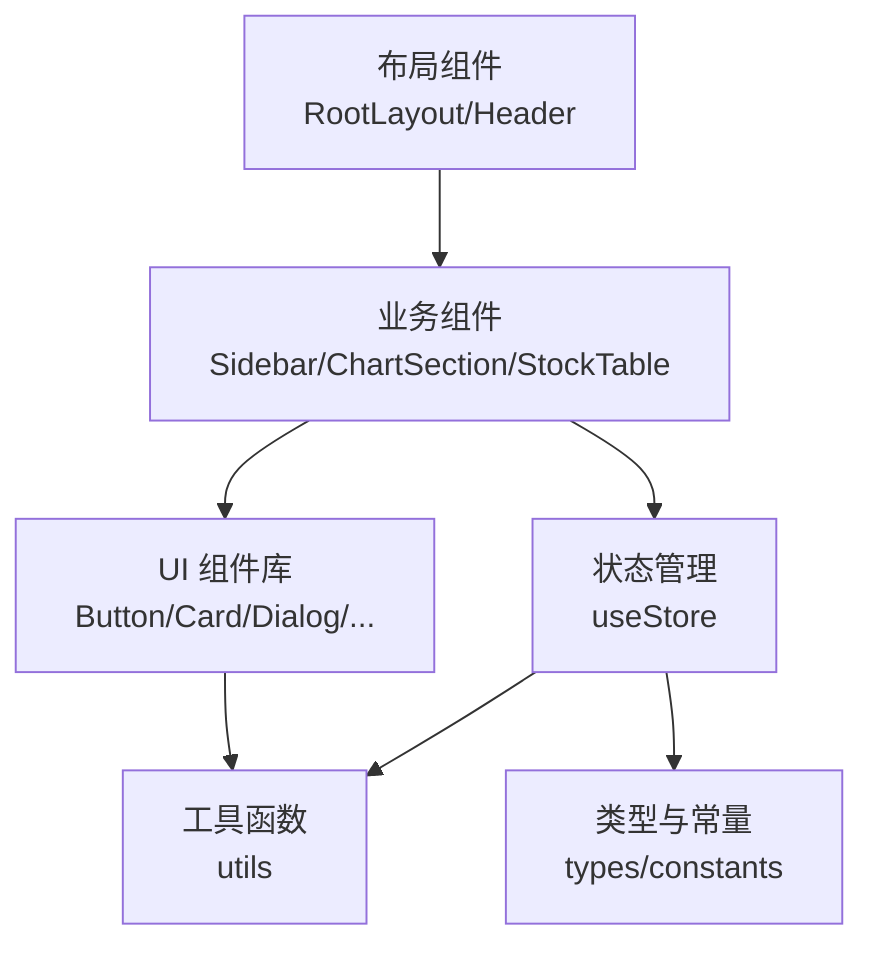

**图示来源**
- [Header.tsx](file://frontend/src/components/Header.tsx#L12-L128)
- [Sidebar.tsx](file://frontend/src/components/Sidebar.tsx#L16-L117)
- [ChartSection.tsx](file://frontend/src/components/ChartSection.tsx#L14-L245)
- [StockTable.tsx](file://frontend/src/components/StockTable.tsx#L37-L111)
- [button.tsx](file://frontend/src/components/ui/button.tsx#L39-L60)
- [card.tsx](file://frontend/src/components/ui/card.tsx#L5-L92)
- [dialog.tsx](file://frontend/src/components/ui/dialog.tsx#L9-L143)
- [useStore.ts](file://frontend/src/store/useStore.ts#L24-L60)
- [types.ts](file://frontend/src/lib/types.ts#L1-L47)
- [constants.ts](file://frontend/src/lib/constants.ts#L1-L96)
- [utils.ts](file://frontend/src/lib/utils.ts#L4-L6)

## 详细组件分析

### 布局组件
- RootLayout
  - 负责全局 HTML 结构、字体加载、全局样式与通知渲染
  - 将 Header、子页面内容、全局客户端组件与通知包裹在统一容器中
- Header
  - 读取认证状态与用户信息，动态渲染导航与用户区
  - 集成命令面板开关、登出流程与面包屑式导航

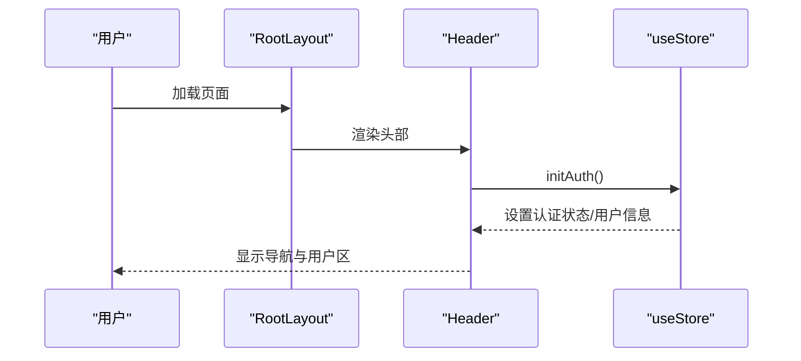

**图示来源**
- [layout.tsx](file://frontend/src/app/layout.tsx#L16-L35)
- [Header.tsx](file://frontend/src/components/Header.tsx#L12-L128)
- [useStore.ts](file://frontend/src/store/useStore.ts#L115-L133)

**章节来源**
- [layout.tsx](file://frontend/src/app/layout.tsx#L16-L35)
- [Header.tsx](file://frontend/src/components/Header.tsx#L12-L128)
- [useStore.ts](file://frontend/src/store/useStore.ts#L115-L133)

### 业务组件

#### Sidebar（板块侧边栏）
- 职责
  - 展示板块内可比较基金列表
  - 支持添加/移除基金至图表对比集合
  - 提供“推荐”区域与空状态提示
- 交互
  - 通过 useStore 访问 stocks、selectedFundsForChart 并调用 addFundToChart/removeFundFromChart
  - 限制最多 5 个基金，避免重复添加
- 设计要点
  - 使用 Card 作为容器，内部细分子区块（选择头、已选列表、推荐列表）
  - 列表滚动区域使用滚动容器，确保良好体验

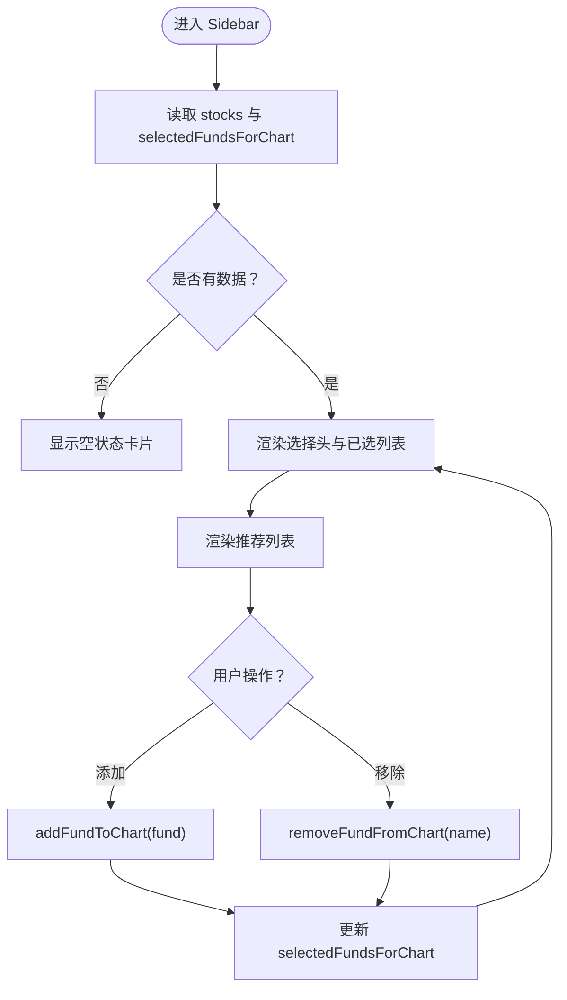

**图示来源**
- [Sidebar.tsx](file://frontend/src/components/Sidebar.tsx#L16-L117)
- [useStore.ts](file://frontend/src/store/useStore.ts#L150-L162)

**章节来源**
- [Sidebar.tsx](file://frontend/src/components/Sidebar.tsx#L16-L117)
- [useStore.ts](file://frontend/src/store/useStore.ts#L150-L162)

#### ChartSection（图表区域）
- 职责
  - 基于 lightweight-charts 渲染折线图
  - 支持多种时间范围（1D/1M/1Y/3Y/5Y）
  - 在无选中基金时展示板块整体趋势
- 数据流
  - 从 useStore 获取 selectedFundsForChart 与 selectedSector
  - 根据 activeRange 动态生成数据点序列
  - 使用随机游走模型生成更真实的曲线
- 性能
  - 监听窗口 resize，动态调整图表尺寸
  - 卸载时清理图表实例，避免内存泄漏

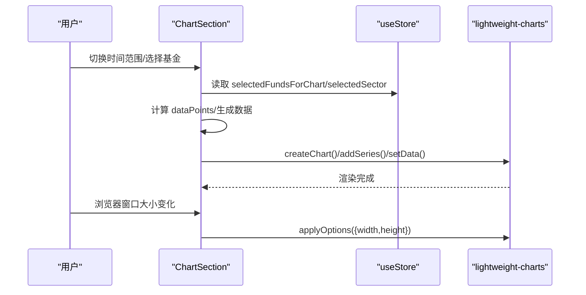

**图示来源**
- [ChartSection.tsx](file://frontend/src/components/ChartSection.tsx#L14-L174)
- [useStore.ts](file://frontend/src/store/useStore.ts#L19-L21)

**章节来源**
- [ChartSection.tsx](file://frontend/src/components/ChartSection.tsx#L14-L174)
- [useStore.ts](file://frontend/src/store/useStore.ts#L19-L21)

#### StockTable（股票表格）
- 职责
  - 展示板块内基金列表，支持收藏切换
  - 为每行生成稳定配色的头像占位符
- 交互
  - 点击收藏按钮触发 toggleStockFavorite
  - 行点击可扩展为跳转详情页（当前仅展示收藏切换）

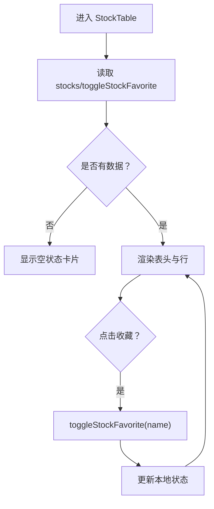

**图示来源**
- [StockTable.tsx](file://frontend/src/components/StockTable.tsx#L37-L111)
- [useStore.ts](file://frontend/src/store/useStore.ts#L255-L259)

**章节来源**
- [StockTable.tsx](file://frontend/src/components/StockTable.tsx#L37-L111)
- [useStore.ts](file://frontend/src/store/useStore.ts#L255-L259)

### UI 组件库

#### Button（按钮）
- 特性
  - 使用 class-variance-authority 定义变体与尺寸
  - 支持 asChild（Slot）以组合语义标签
  - 内置聚焦可见性与无效状态样式
- 变体与尺寸
  - 变体：default、destructive、outline、secondary、ghost、link
  - 尺寸：default、sm、lg、icon、icon-sm、icon-lg
- 使用建议
  - 优先使用语义标签（如 Link）配合 asChild 实现无障碍
  - 合理设置 size 与 variant 以匹配上下文

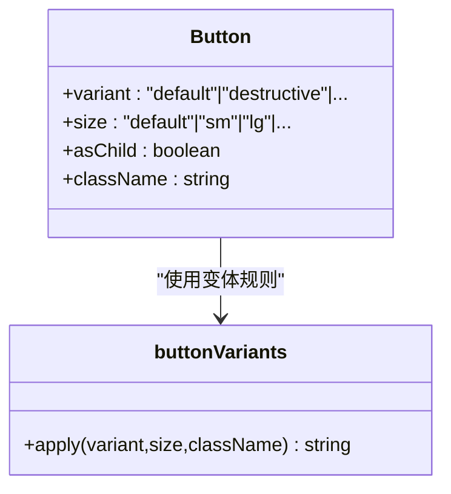

**图示来源**
- [button.tsx](file://frontend/src/components/ui/button.tsx#L7-L37)
- [button.tsx](file://frontend/src/components/ui/button.tsx#L39-L60)

**章节来源**
- [button.tsx](file://frontend/src/components/ui/button.tsx#L7-L37)
- [button.tsx](file://frontend/src/components/ui/button.tsx#L39-L60)

#### Card（卡片）
- 组成
  - Card、CardHeader、CardTitle、CardDescription、CardAction、CardContent、CardFooter
- 设计
  - 通过 data-slot 标记与 Tailwind 类组合，形成可组合的卡片结构
  - 支持网格布局与响应式断点

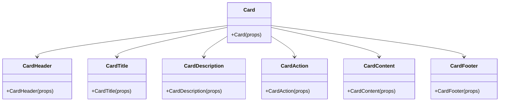

**图示来源**
- [card.tsx](file://frontend/src/components/ui/card.tsx#L5-L92)

**章节来源**
- [card.tsx](file://frontend/src/components/ui/card.tsx#L5-L92)

#### Dialog（对话框）
- 组成
  - Dialog、DialogTrigger、DialogPortal、DialogOverlay、DialogContent、DialogHeader、DialogFooter、DialogTitle、DialogDescription、DialogClose
- 行为
  - 基于 Radix UI 的可访问性原语
  - 支持关闭按钮显隐与动画过渡
- 使用建议
  - 为标题与描述提供语义标签，确保屏幕阅读器友好

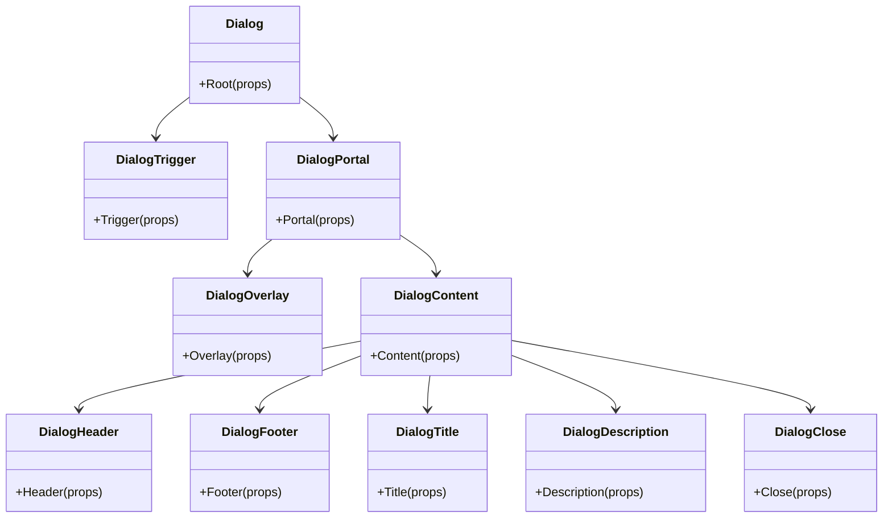

**图示来源**
- [dialog.tsx](file://frontend/src/components/ui/dialog.tsx#L9-L143)

**章节来源**
- [dialog.tsx](file://frontend/src/components/ui/dialog.tsx#L9-L143)

#### Avatar（头像）
- 组成
  - Avatar、AvatarImage、AvatarFallback
- 行为
  - 基于 Radix UI，支持占位符与图片回退

**章节来源**
- [avatar.tsx](file://frontend/src/components/ui/avatar.tsx#L8-L53)

#### Input（输入框）
- 行为
  - 统一的输入样式与聚焦/无效状态
  - 支持类型与无障碍属性透传

**章节来源**
- [input.tsx](file://frontend/src/components/ui/input.tsx#L5-L19)

### 组件通信模式
- Props 传递
  - 业务组件通过 props 接收 UI 组件（如 Button、Card）的变体与尺寸
  - UI 组件通过 className 与 data-* 属性暴露样式与可访问性标记
- 事件处理
  - Header 中的按钮事件（如登出、命令面板开关）通过回调触发
  - Sidebar/StockTable 中的点击事件通过 useStore 动作更新状态
- 状态共享
  - 全局状态由 useStore 管理，业务组件通过选择器读取与派发动作
  - ChartSection 与 Sidebar 通过共享状态实现跨组件联动

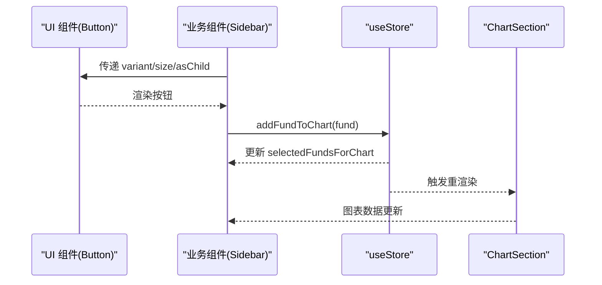

**图示来源**
- [button.tsx](file://frontend/src/components/ui/button.tsx#L39-L60)
- [Sidebar.tsx](file://frontend/src/components/Sidebar.tsx#L98-L105)
- [useStore.ts](file://frontend/src/store/useStore.ts#L152-L157)
- [ChartSection.tsx](file://frontend/src/components/ChartSection.tsx#L174-L174)

**章节来源**
- [button.tsx](file://frontend/src/components/ui/button.tsx#L39-L60)
- [Sidebar.tsx](file://frontend/src/components/Sidebar.tsx#L98-L105)
- [useStore.ts](file://frontend/src/store/useStore.ts#L152-L157)
- [ChartSection.tsx](file://frontend/src/components/ChartSection.tsx#L174-L174)

## 依赖分析
- 组件依赖
  - UI 组件依赖 Radix UI 原语与类名合并工具
  - 业务组件依赖 UI 组件与 Zustand Store
  - 布局组件依赖业务组件与全局客户端组件
- 外部依赖
  - lightweight-charts：图表渲染
  - sonner：全局通知
  - lucide-react：图标
  - tailwind-merge/clsx：样式合并

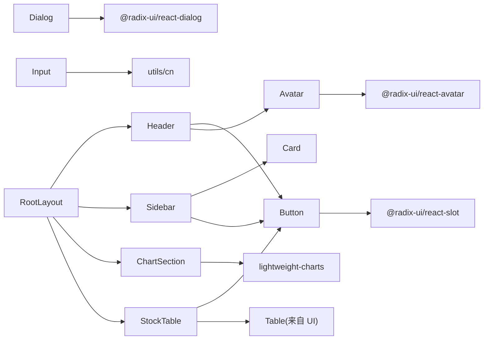

**图示来源**
- [button.tsx](file://frontend/src/components/ui/button.tsx#L1-L6)
- [dialog.tsx](file://frontend/src/components/ui/dialog.tsx#L3-L7)
- [avatar.tsx](file://frontend/src/components/ui/avatar.tsx#L3-L6)
- [input.tsx](file://frontend/src/components/ui/input.tsx#L3-L3)
- [ChartSection.tsx](file://frontend/src/components/ChartSection.tsx#L3-L3)
- [Header.tsx](file://frontend/src/components/Header.tsx#L6-L10)
- [Sidebar.tsx](file://frontend/src/components/Sidebar.tsx#L3-L4)
- [StockTable.tsx](file://frontend/src/components/StockTable.tsx#L9-L10)
- [layout.tsx](file://frontend/src/app/layout.tsx#L4-L7)
- [package.json](file://frontend/package.json#L11-L31)

**章节来源**
- [package.json](file://frontend/package.json#L11-L31)

## 性能考量
- 渲染优化
  - 使用 useMemo 缓存 ChartSection 的数据点计算，减少不必要的数据生成
  - 控制图表实例生命周期，在卸载时及时清理，避免内存泄漏
- 状态更新
  - useStore 中对数组的不可变更新策略，避免深层对象变更导致的不必要重渲染
  - 对收藏切换等高频操作采用乐观更新，提升交互流畅度
- 可访问性
  - UI 组件提供 data-slot 与 aria-* 属性，确保屏幕阅读器可用
  - Button/Dialog 等组件内置聚焦可见性与键盘可达性

**章节来源**
- [ChartSection.tsx](file://frontend/src/components/ChartSection.tsx#L23-L32)
- [ChartSection.tsx](file://frontend/src/components/ChartSection.tsx#L177-L184)
- [useStore.ts](file://frontend/src/store/useStore.ts#L255-L259)
- [button.tsx](file://frontend/src/components/ui/button.tsx#L7-L37)
- [dialog.tsx](file://frontend/src/components/ui/dialog.tsx#L33-L47)

## 故障排查指南
- 认证状态异常
  - 现象：Header 未显示用户区或导航
  - 排查：确认 initAuth 是否执行、localStorage 中 token 与 user 是否存在
- 图表空白或不更新
  - 现象：ChartSection 无数据或不随选择变化
  - 排查：检查 selectedFundsForChart 与 selectedSector 是否正确更新；确认时间范围与数据点计算
- 收藏状态不同步
  - 现象：收藏切换后未同步到服务端
  - 排查：确认已登录且 token 存在；查看 toggleSectorFavorite 的错误处理分支
- 样式冲突
  - 现象：组件样式错乱
  - 排查：确认 utils.cn 的合并顺序与 Tailwind 配置；避免覆盖 data-slot 样式

**章节来源**
- [Header.tsx](file://frontend/src/components/Header.tsx#L22-L24)
- [useStore.ts](file://frontend/src/store/useStore.ts#L115-L133)
- [ChartSection.tsx](file://frontend/src/components/ChartSection.tsx#L17-L21)
- [useStore.ts](file://frontend/src/store/useStore.ts#L261-L302)
- [utils.ts](file://frontend/src/lib/utils.ts#L4-L6)

## 结论
FreeTrader 组件系统通过清晰的层次划分与统一的 UI 组件库，实现了高内聚、低耦合的前端架构。借助 Zustand 的轻量状态管理与 Radix UI 的可访问性原语，系统在保证开发效率的同时兼顾了用户体验与可维护性。建议在后续迭代中持续完善类型约束、测试覆盖与文档示例，进一步提升组件复用性与团队协作效率。

## 附录

### 组件使用示例与模板路径
- 使用 Button
  - 基础按钮：[button.tsx](file://frontend/src/components/ui/button.tsx#L39-L60)
  - 变体与尺寸：[button.tsx](file://frontend/src/components/ui/button.tsx#L10-L36)
- 使用 Card
  - 卡片容器与子块：[card.tsx](file://frontend/src/components/ui/card.tsx#L5-L92)
- 使用 Dialog
  - 对话框根与内容：[dialog.tsx](file://frontend/src/components/ui/dialog.tsx#L9-L81)
- 使用 Avatar
  - 头像与占位符：[avatar.tsx](file://frontend/src/components/ui/avatar.tsx#L8-L53)
- 使用 Input
  - 输入框样式与状态：[input.tsx](file://frontend/src/components/ui/input.tsx#L5-L19)
- 在业务组件中使用
  - Header 中按钮与用户区：[Header.tsx](file://frontend/src/components/Header.tsx#L76-L124)
  - Sidebar 中添加/移除基金：[Sidebar.tsx](file://frontend/src/components/Sidebar.tsx#L98-L105)
  - ChartSection 中图表渲染与时间范围切换：[ChartSection.tsx](file://frontend/src/components/ChartSection.tsx#L186-L244)
  - StockTable 中收藏切换：[StockTable.tsx](file://frontend/src/components/StockTable.tsx#L84-L87)

### 设计原则与最佳实践
- 单一职责
  - 每个组件只负责一个明确的功能域，避免“上帝组件”
- 可复用性
  - UI 组件通过变体与尺寸参数化，业务组件通过 props 解耦
- 可维护性
  - 使用统一的类型与常量，集中管理样式工具函数
- 性能优化
  - 合理使用 useMemo/memo，避免不必要的重渲染
  - 控制副作用与资源释放，防止内存泄漏
- 可访问性
  - 为交互元素提供语义标签与键盘可达性，确保屏幕阅读器友好