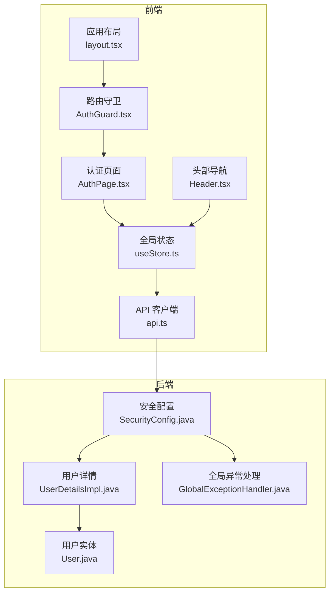
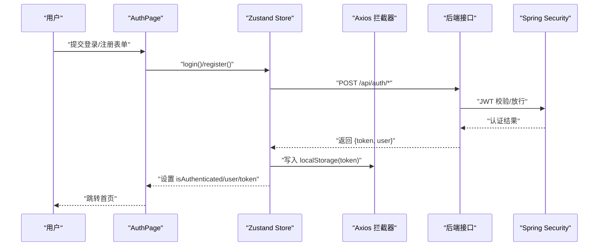
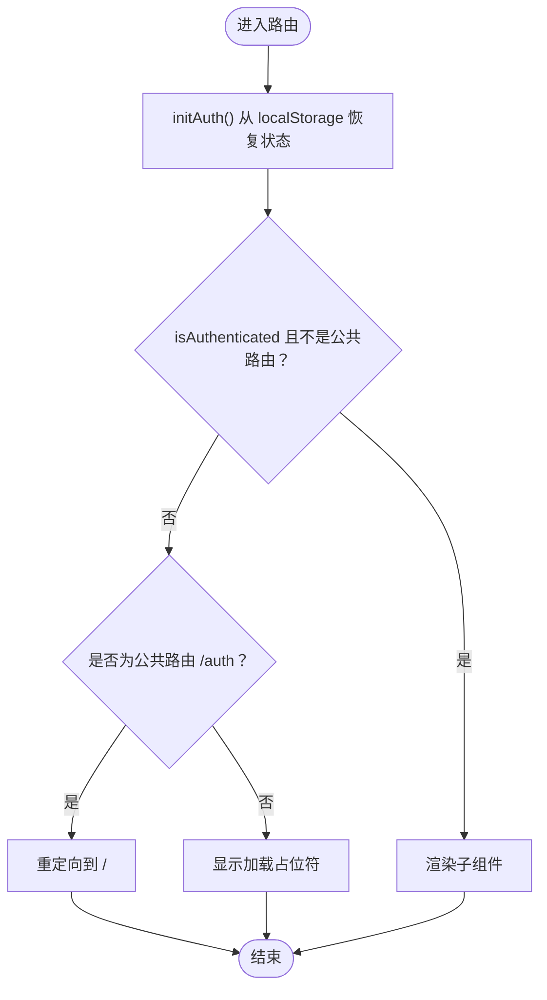
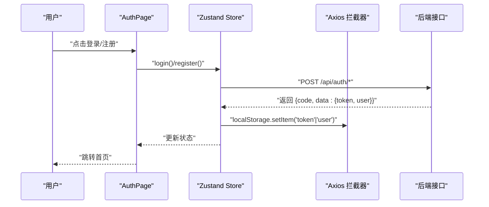
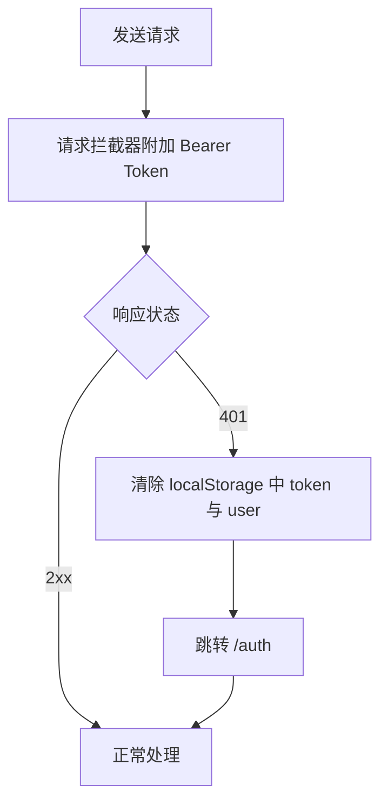
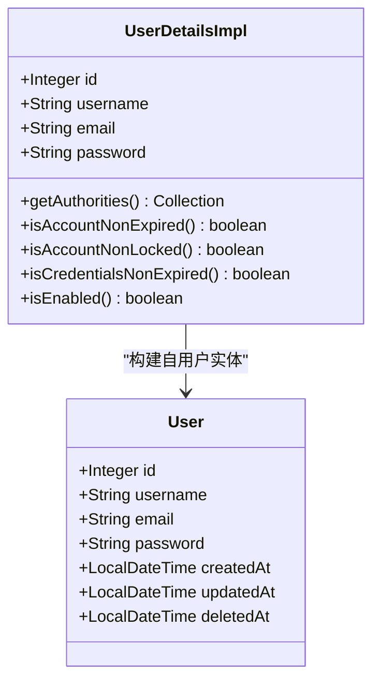
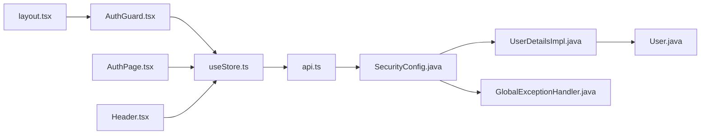

# 认证与权限控制

<cite>
**本文引用的文件**
- [frontend/src/components/AuthGuard.tsx](file://frontend/src/components/AuthGuard.tsx)
- [frontend/src/components/AuthPage.tsx](file://frontend/src/components/AuthPage.tsx)
- [frontend/src/lib/api.ts](file://frontend/src/lib/api.ts)
- [frontend/src/store/useStore.ts](file://frontend/src/store/useStore.ts)
- [frontend/src/app/layout.tsx](file://frontend/src/app/layout.tsx)
- [frontend/src/app/auth/page.tsx](file://frontend/src/app/auth/page.tsx)
- [frontend/src/components/Header.tsx](file://frontend/src/components/Header.tsx)
- [frontend/src/lib/constants.ts](file://frontend/src/lib/constants.ts)
- [frontend/src/lib/types.ts](file://frontend/src/lib/types.ts)
- [backend/src/main/java/com/freetrader/config/SecurityConfig.java](file://backend/src/main/java/com/freetrader/config/SecurityConfig.java)
- [backend/src/main/java/com/freetrader/security/UserDetailsImpl.java](file://backend/src/main/java/com/freetrader/security/UserDetailsImpl.java)
- [backend/src/main/java/com/freetrader/entity/User.java](file://backend/src/main/java/com/freetrader/entity/User.java)
- [backend/src/test/java/com/freetrader/service/TokenServiceTest.java](file://backend/src/test/java/com/freetrader/service/TokenServiceTest.java)
- [backend/src/test/java/com/freetrader/security/JwtUtilsTest.java](file://backend/src/test/java/com/freetrader/security/JwtUtilsTest.java)
- [backend/src/main/java/com/freetrader/exception/GlobalExceptionHandler.java](file://backend/src/main/java/com/freetrader/exception/GlobalExceptionHandler.java)
</cite>

## 目录
1. [简介](#简介)
2. [项目结构](#项目结构)
3. [核心组件](#核心组件)
4. [架构总览](#架构总览)
5. [组件详细分析](#组件详细分析)
6. [依赖关系分析](#依赖关系分析)
7. [性能考量](#性能考量)
8. [故障排查指南](#故障排查指南)
9. [结论](#结论)
10. [附录](#附录)

## 简介
本文件面向 FreeTrader 前端的认证与权限控制体系，系统性阐述前端认证流程、Token 管理与自动刷新机制、AuthGuard 路由保护与条件渲染、会话与本地存储策略、权限控制（基于角色的访问控制）以及错误处理与用户体验优化方案。文档同时提供认证流程图与代码示例路径，帮助开发者快速定位实现细节。

## 项目结构
FreeTrader 前后端分离，前端采用 Next.js + Zustand + Axios，后端采用 Spring Boot + JWT。认证与权限控制的关键位置如下：
- 前端认证页面与路由守卫：AuthPage、AuthGuard、layout.tsx
- 前端状态与 API：useStore、api.ts
- 后端安全配置与用户详情：SecurityConfig、UserDetailsImpl、User
- 后端异常处理：GlobalExceptionHandler

图表来源
- [frontend/src/app/layout.tsx](file://frontend/src/app/layout.tsx#L16-L35)
- [frontend/src/components/AuthGuard.tsx](file://frontend/src/components/AuthGuard.tsx#L11-L59)
- [frontend/src/components/AuthPage.tsx](file://frontend/src/components/AuthPage.tsx#L14-L321)
- [frontend/src/store/useStore.ts](file://frontend/src/store/useStore.ts#L62-L133)
- [frontend/src/lib/api.ts](file://frontend/src/lib/api.ts#L1-L89)
- [frontend/src/components/Header.tsx](file://frontend/src/components/Header.tsx#L12-L128)
- [backend/src/main/java/com/freetrader/config/SecurityConfig.java](file://backend/src/main/java/com/freetrader/config/SecurityConfig.java#L29-L46)
- [backend/src/main/java/com/freetrader/security/UserDetailsImpl.java](file://backend/src/main/java/com/freetrader/security/UserDetailsImpl.java#L13-L34)
- [backend/src/main/java/com/freetrader/entity/User.java](file://backend/src/main/java/com/freetrader/entity/User.java#L10-L28)
- [backend/src/main/java/com/freetrader/exception/GlobalExceptionHandler.java](file://backend/src/main/java/com/freetrader/exception/GlobalExceptionHandler.java#L59-L78)

章节来源
- [frontend/src/app/layout.tsx](file://frontend/src/app/layout.tsx#L16-L35)
- [frontend/src/components/AuthGuard.tsx](file://frontend/src/components/AuthGuard.tsx#L11-L59)
- [frontend/src/components/AuthPage.tsx](file://frontend/src/components/AuthPage.tsx#L14-L321)
- [frontend/src/store/useStore.ts](file://frontend/src/store/useStore.ts#L62-L133)
- [frontend/src/lib/api.ts](file://frontend/src/lib/api.ts#L1-L89)
- [frontend/src/components/Header.tsx](file://frontend/src/components/Header.tsx#L12-L128)
- [backend/src/main/java/com/freetrader/config/SecurityConfig.java](file://backend/src/main/java/com/freetrader/config/SecurityConfig.java#L29-L46)
- [backend/src/main/java/com/freetrader/security/UserDetailsImpl.java](file://backend/src/main/java/com/freetrader/security/UserDetailsImpl.java#L13-L34)
- [backend/src/main/java/com/freetrader/entity/User.java](file://backend/src/main/java/com/freetrader/entity/User.java#L10-L28)
- [backend/src/main/java/com/freetrader/exception/GlobalExceptionHandler.java](file://backend/src/main/java/com/freetrader/exception/GlobalExceptionHandler.java#L59-L78)

## 核心组件
- AuthGuard：在应用根布局中包裹子路由，负责登录状态检查、公共路由与受保护路由的分流、加载态与无权限时的占位渲染。
- AuthPage：提供登录/注册表单，调用 useStore 的 login/register，处理错误提示与跳转。
- useStore：集中管理认证状态（isAuthenticated、user、token）、初始化认证、登录/注册/登出逻辑、数据拉取与收藏同步。
- api.ts：Axios 实例封装，请求拦截器自动附加 Bearer Token，响应拦截器统一处理 401 未授权并清空本地存储与跳转登录页。
- Header：根据认证状态显示导航与用户入口；登出时清空本地存储并跳转登录页。
- SecurityConfig：后端安全配置，声明公开端点与全站认证策略，无状态会话。

章节来源
- [frontend/src/components/AuthGuard.tsx](file://frontend/src/components/AuthGuard.tsx#L11-L59)
- [frontend/src/components/AuthPage.tsx](file://frontend/src/components/AuthPage.tsx#L14-L321)
- [frontend/src/store/useStore.ts](file://frontend/src/store/useStore.ts#L62-L133)
- [frontend/src/lib/api.ts](file://frontend/src/lib/api.ts#L1-L89)
- [frontend/src/components/Header.tsx](file://frontend/src/components/Header.tsx#L12-L128)
- [backend/src/main/java/com/freetrader/config/SecurityConfig.java](file://backend/src/main/java/com/freetrader/config/SecurityConfig.java#L29-L46)

## 架构总览
前端通过 Axios 请求拦截器携带 Token，后端通过 SecurityFilterChain 对除公开端点外的所有请求进行认证。认证成功后，前端将用户信息与 Token 写入 localStorage 并更新 Zustand 状态；若后端返回 401，则前端清除本地存储并重定向至登录页。

图表来源
- [frontend/src/components/AuthPage.tsx](file://frontend/src/components/AuthPage.tsx#L38-L70)
- [frontend/src/store/useStore.ts](file://frontend/src/store/useStore.ts#L69-L103)
- [frontend/src/lib/api.ts](file://frontend/src/lib/api.ts#L13-L37)
- [backend/src/main/java/com/freetrader/config/SecurityConfig.java](file://backend/src/main/java/com/freetrader/config/SecurityConfig.java#L35-L43)

## 组件详细分析

### AuthGuard 路由守卫
- 公共路由白名单：/auth
- 初始化：首次渲染时调用 initAuth 从 localStorage 恢复认证状态
- 路由保护：
  - 未认证且访问非公共路由：重定向至 /auth
  - 已认证且访问 /auth：重定向至 /
  - 加载期间与无权限时显示加载占位符
- 条件渲染：仅当认证状态满足当前路由需求时才渲染子组件

图表来源
- [frontend/src/components/AuthGuard.tsx](file://frontend/src/components/AuthGuard.tsx#L18-L58)
- [frontend/src/store/useStore.ts](file://frontend/src/store/useStore.ts#L115-L133)

章节来源
- [frontend/src/components/AuthGuard.tsx](file://frontend/src/components/AuthGuard.tsx#L11-L59)
- [frontend/src/app/layout.tsx](file://frontend/src/app/layout.tsx#L26-L28)

### 认证页面与表单处理
- 登录/注册双标签页，表单字段与交互
- 登录：调用 store.login(username, password)，成功后跳转首页
- 注册：校验两次密码一致性，调用 store.register，成功后跳转首页
- 错误处理：捕获异常并展示错误消息

图表来源
- [frontend/src/components/AuthPage.tsx](file://frontend/src/components/AuthPage.tsx#L38-L70)
- [frontend/src/store/useStore.ts](file://frontend/src/store/useStore.ts#L69-L103)
- [frontend/src/lib/api.ts](file://frontend/src/lib/api.ts#L13-L37)

章节来源
- [frontend/src/components/AuthPage.tsx](file://frontend/src/components/AuthPage.tsx#L14-L321)
- [frontend/src/store/useStore.ts](file://frontend/src/store/useStore.ts#L69-L103)

### Token 管理与自动刷新机制
- 前端策略：
  - 请求拦截器：从 localStorage 读取 token 并附加 Authorization: Bearer
  - 响应拦截器：401 时清除 token 与 user，跳转 /auth
- 后端策略（测试覆盖）：
  - 刷新令牌：仅当传入的是有效且为刷新令牌且不在黑名单时，方可生成新的访问令牌
  - 登出：将刷新令牌加入黑名单，使旧令牌失效
  - 异常映射：认证失败映射为 401，访问拒绝映射为 403

图表来源
- [frontend/src/lib/api.ts](file://frontend/src/lib/api.ts#L13-L37)
- [frontend/src/store/useStore.ts](file://frontend/src/store/useStore.ts#L105-L113)
- [backend/src/test/java/com/freetrader/service/TokenServiceTest.java](file://backend/src/test/java/com/freetrader/service/TokenServiceTest.java#L42-L99)

章节来源
- [frontend/src/lib/api.ts](file://frontend/src/lib/api.ts#L1-L89)
- [frontend/src/store/useStore.ts](file://frontend/src/store/useStore.ts#L105-L113)
- [backend/src/test/java/com/freetrader/service/TokenServiceTest.java](file://backend/src/test/java/com/freetrader/service/TokenServiceTest.java#L42-L99)

### 用户会话管理与本地存储策略
- 存储键：
  - token：访问令牌
  - user：用户信息对象
- 初始化：应用启动时 AuthGuard/Header 调用 initAuth，从 localStorage 恢复状态
- 登出：移除上述键值，重置状态并跳转登录页
- 数据回退：store 中包含本地静态数据作为兜底，避免网络异常导致无数据

章节来源
- [frontend/src/store/useStore.ts](file://frontend/src/store/useStore.ts#L115-L133)
- [frontend/src/components/Header.tsx](file://frontend/src/components/Header.tsx#L26-L29)
- [frontend/src/lib/constants.ts](file://frontend/src/lib/constants.ts#L3-L96)

### 权限控制：基于角色的访问控制（RBAC）
- 角色定义：UserDetailsImpl 默认授予 ROLE_USER
- 授权规则：SecurityConfig 将 /api/auth/** 与 /api/sectors/** 设为公开，其余请求需认证
- 功能权限：前端通过 isAuthenticated 控制 UI 与路由访问；收藏等敏感操作在 store 中做乐观更新并在有 token 时异步同步

图表来源
- [backend/src/main/java/com/freetrader/security/UserDetailsImpl.java](file://backend/src/main/java/com/freetrader/security/UserDetailsImpl.java#L13-L34)
- [backend/src/main/java/com/freetrader/entity/User.java](file://backend/src/main/java/com/freetrader/entity/User.java#L10-L28)

章节来源
- [backend/src/main/java/com/freetrader/security/UserDetailsImpl.java](file://backend/src/main/java/com/freetrader/security/UserDetailsImpl.java#L13-L34)
- [backend/src/main/java/com/freetrader/config/SecurityConfig.java](file://backend/src/main/java/com/freetrader/config/SecurityConfig.java#L35-L39)
- [frontend/src/store/useStore.ts](file://frontend/src/store/useStore.ts#L294-L302)

## 依赖关系分析
- 组件耦合：
  - layout.tsx 依赖 AuthGuard
  - AuthGuard 依赖 useStore(initAuth) 与路由工具
  - AuthPage 依赖 useStore(login/register) 与 UI 组件
  - Header 依赖 useStore(initAuth/logout) 与路由
  - api.ts 依赖 localStorage 与 axios
- 外部依赖：
  - Axios 拦截器链路
  - Spring Security 过滤链与异常映射

图表来源
- [frontend/src/app/layout.tsx](file://frontend/src/app/layout.tsx#L26-L28)
- [frontend/src/components/AuthGuard.tsx](file://frontend/src/components/AuthGuard.tsx#L11-L16)
- [frontend/src/components/AuthPage.tsx](file://frontend/src/components/AuthPage.tsx#L12-L18)
- [frontend/src/components/Header.tsx](file://frontend/src/components/Header.tsx#L12-L20)
- [frontend/src/store/useStore.ts](file://frontend/src/store/useStore.ts#L5-L6)
- [frontend/src/lib/api.ts](file://frontend/src/lib/api.ts#L1-L11)
- [backend/src/main/java/com/freetrader/config/SecurityConfig.java](file://backend/src/main/java/com/freetrader/config/SecurityConfig.java#L29-L46)
- [backend/src/main/java/com/freetrader/security/UserDetailsImpl.java](file://backend/src/main/java/com/freetrader/security/UserDetailsImpl.java#L13-L34)
- [backend/src/main/java/com/freetrader/exception/GlobalExceptionHandler.java](file://backend/src/main/java/com/freetrader/exception/GlobalExceptionHandler.java#L59-L78)

章节来源
- [frontend/src/app/layout.tsx](file://frontend/src/app/layout.tsx#L16-L35)
- [frontend/src/components/AuthGuard.tsx](file://frontend/src/components/AuthGuard.tsx#L11-L59)
- [frontend/src/components/AuthPage.tsx](file://frontend/src/components/AuthPage.tsx#L14-L321)
- [frontend/src/components/Header.tsx](file://frontend/src/components/Header.tsx#L12-L128)
- [frontend/src/store/useStore.ts](file://frontend/src/store/useStore.ts#L62-L133)
- [frontend/src/lib/api.ts](file://frontend/src/lib/api.ts#L1-L89)
- [backend/src/main/java/com/freetrader/config/SecurityConfig.java](file://backend/src/main/java/com/freetrader/config/SecurityConfig.java#L29-L46)
- [backend/src/main/java/com/freetrader/exception/GlobalExceptionHandler.java](file://backend/src/main/java/com/freetrader/exception/GlobalExceptionHandler.java#L59-L78)

## 性能考量
- 状态持久化：localStorage 读写开销低，建议避免频繁序列化大对象；当前仅存储 token 与用户摘要，合理
- 请求拦截：每次请求附加 Authorization，建议在高并发场景下减少不必要的请求
- UI 渲染：AuthGuard 在加载与无权限时使用轻量级占位符，避免复杂组件渲染
- 数据回退：store 内置本地静态数据，网络异常时可快速恢复 UI，提升可用性

## 故障排查指南
- 登录后仍被重定向到登录页
  - 检查后端是否正确返回 token 与 user 结构
  - 确认前端 localStorage 是否写入成功
  - 参考：[frontend/src/store/useStore.ts](file://frontend/src/store/useStore.ts#L69-L103)、[frontend/src/lib/api.ts](file://frontend/src/lib/api.ts#L13-L37)
- 401 未授权频繁出现
  - 检查请求拦截器是否正确附加 Bearer Token
  - 确认后端 JWT 验证逻辑与过期策略
  - 参考：[frontend/src/lib/api.ts](file://frontend/src/lib/api.ts#L13-L37)、[backend/src/test/java/com/freetrader/security/JwtUtilsTest.java](file://backend/src/test/java/com/freetrader/security/JwtUtilsTest.java#L151-L179)
- 登出无效或仍可访问受保护资源
  - 确认前端是否清除 localStorage 并重置状态
  - 后端是否将刷新令牌加入黑名单
  - 参考：[frontend/src/store/useStore.ts](file://frontend/src/store/useStore.ts#L105-L113)、[backend/src/test/java/com/freetrader/service/TokenServiceTest.java](file://backend/src/test/java/com/freetrader/service/TokenServiceTest.java#L104-L158)
- 收藏功能无法同步
  - 确认 isAuthenticated 与 token 存在后再发起后端同步
  - 参考：[frontend/src/store/useStore.ts](file://frontend/src/store/useStore.ts#L294-L302)
- 全局 401/403 行为
  - 后端异常处理器映射认证失败为 401，访问拒绝为 403
  - 参考：[backend/src/main/java/com/freetrader/exception/GlobalExceptionHandler.java](file://backend/src/main/java/com/freetrader/exception/GlobalExceptionHandler.java#L59-L78)

章节来源
- [frontend/src/store/useStore.ts](file://frontend/src/store/useStore.ts#L69-L103)
- [frontend/src/lib/api.ts](file://frontend/src/lib/api.ts#L13-L37)
- [backend/src/test/java/com/freetrader/security/JwtUtilsTest.java](file://backend/src/test/java/com/freetrader/security/JwtUtilsTest.java#L151-L179)
- [backend/src/test/java/com/freetrader/service/TokenServiceTest.java](file://backend/src/test/java/com/freetrader/service/TokenServiceTest.java#L104-L158)
- [backend/src/main/java/com/freetrader/exception/GlobalExceptionHandler.java](file://backend/src/main/java/com/freetrader/exception/GlobalExceptionHandler.java#L59-L78)

## 结论
FreeTrader 前端采用“本地存储 + Zustand 状态 + Axios 拦截器”的认证模式，结合后端 Spring Security 的无状态认证策略，实现了简洁可靠的登录状态管理与路由保护。当前实现聚焦于用户认证与基础 RBAC（ROLE_USER），后续可在后端扩展更细粒度的功能权限与前端实现更丰富的条件渲染与权限指令。

## 附录
- 关键实现路径参考
  - 登录流程：[frontend/src/components/AuthPage.tsx](file://frontend/src/components/AuthPage.tsx#L38-L50)、[frontend/src/store/useStore.ts](file://frontend/src/store/useStore.ts#L69-L84)
  - 注册流程：[frontend/src/components/AuthPage.tsx](file://frontend/src/components/AuthPage.tsx#L52-L70)、[frontend/src/store/useStore.ts](file://frontend/src/store/useStore.ts#L87-L103)
  - 路由守卫：[frontend/src/components/AuthGuard.tsx](file://frontend/src/components/AuthGuard.tsx#L11-L59)
  - 会话初始化：[frontend/src/store/useStore.ts](file://frontend/src/store/useStore.ts#L115-L133)、[frontend/src/components/Header.tsx](file://frontend/src/components/Header.tsx#L21-L24)
  - Token 自动附加与 401 处理：[frontend/src/lib/api.ts](file://frontend/src/lib/api.ts#L13-L37)
  - 角色与授权：[backend/src/main/java/com/freetrader/security/UserDetailsImpl.java](file://backend/src/main/java/com/freetrader/security/UserDetailsImpl.java#L31-L34)、[backend/src/main/java/com/freetrader/config/SecurityConfig.java](file://backend/src/main/java/com/freetrader/config/SecurityConfig.java#L35-L39)
  - 刷新与登出（测试覆盖）：[backend/src/test/java/com/freetrader/service/TokenServiceTest.java](file://backend/src/test/java/com/freetrader/service/TokenServiceTest.java#L42-L158)