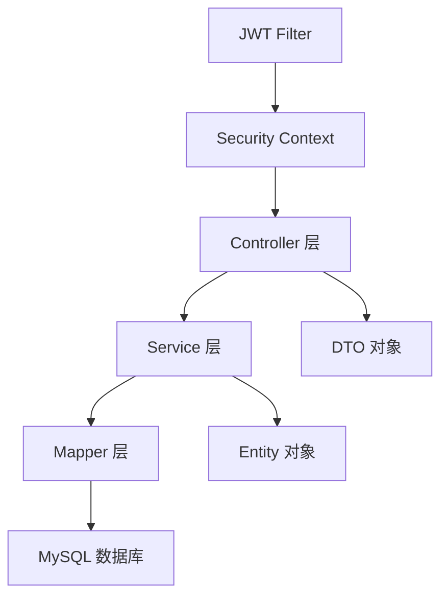
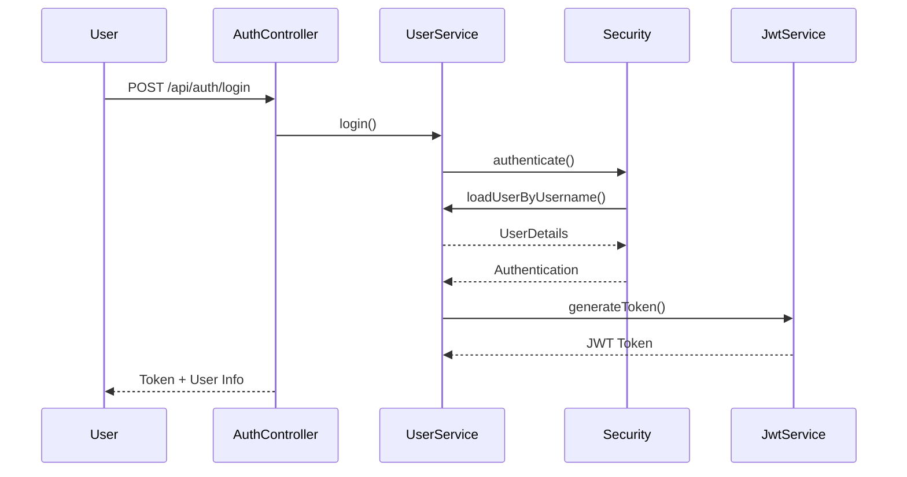

# FreeTrader 后端架构

> [!info] 技术概览
> 基于 [[Spring Boot 3.2.1]] + [[Java 17]] 的基金追踪应用后端，采用 RESTful API 设计模式。

## 技术栈

### 核心框架

| 技术 | 版本 | 用途 |
|------|------|------|
| Spring Boot | 3.2.1 | 应用框架 |
| Spring Security | 3.2.1 | 安全认证（JWT） |
| MyBatis-Plus | 3.5.5 | ORM框架 |
| MySQL | 8.0.36 | 数据库 |
| Java | 17 | 编程语言 |

### 依赖库

- **JWT** (jjwt 0.12.3) - 令牌认证
- **Lombok** - 减少样板代码
- **Validation** - 数据校验
- **MySQL Connector** - 数据库驱动

## 项目结构

```
backend/src/main/java/com/freetrader/
├── FreeTraderApplication.java    # 应用入口
├── config/                       # 配置层
│   ├── CorsConfig.java          # CORS跨域配置
│   ├── MyBatisPlusConfig.java   # MyBatis-Plus配置
│   ├── PasswordEncoderConfig.java # 密码加密配置
│   └── SecurityConfig.java      # Spring Security配置
├── controller/                   # 控制层
│   ├── AuthController.java      # 认证接口
│   ├── FavoriteController.java   # 收藏接口
│   └── SectorController.java    # 板块接口
├── dto/                         # 数据传输对象
│   ├── AuthResponse.java        # 认证响应
│   ├── LoginRequest.java        # 登录请求
│   ├── RegisterRequest.java     # 注册请求
│   ├── Result.java              # 统一响应格式
│   ├── SectorDTO.java           # 板块DTO
│   └── EtfDTO.java              # ETF DTO
├── entity/                      # 实体类
│   ├── User.java               # 用户实体
│   ├── UserCollection.java     # 用户收藏
│   ├── Category.java           # 分类
│   ├── Calendar.java           # 日历
│   ├── EtfInfo.java            # ETF信息
│   └── EtfNetAsset.java        # ETF净值
├── mapper/                      # 数据访问层
├── security/                    # 安全相关
│   ├── JwtAuthFilter.java      # JWT过滤器
│   └── JwtService.java         # JWT服务
└── service/                     # 业务逻辑层
    ├── UserService.java        # 用户服务
    ├── FavoriteService.java    # 收藏服务
    └── SectorService.java      # 板块服务
```

## 架构设计

### 分层架构



### 认证流程

> [!tip] JWT认证机制
> 使用无状态JWT令牌进行认证，前端在请求头中携带 `Authorization: Bearer <token>`



## API接口

### 认证接口 (`/api/auth`)

| 方法 | 路径 | 认证 | 说明 |
|------|------|------|------|
| POST | `/api/auth/login` | 无 | 用户登录 |
| POST | `/api/auth/register` | 无 | 用户注册 |

### 收藏接口 (`/api/favorites`)

| 方法 | 路径 | 认证 | 说明 |
|------|------|------|------|
| GET | `/api/favorites` | 需要 | 获取收藏列表 |
| POST | `/api/favorites/{cid}` | 需要 | 添加收藏 |
| DELETE | `/api/favorites/{cid}` | 需要 | 删除收藏 |
| POST | `/api/favorites/{cid}/toggle` | 需要 | 切换收藏状态 |

### 板块接口 (`/api/sectors`)

| 方法 | 路径 | 认证 | 说明 |
|------|------|------|------|
| GET | `/api/sectors` | 无 | 获取所有板块 |
| GET | `/api/sectors/{cid}` | 无 | 获取板块详情 |
| GET | `/api/sectors/{cid}/etfs` | 无 | 获取板块下ETF列表 |

## 数据模型

### 用户表 (user_info)

```yaml
字段:
  - id: Integer (主键，自增)
  - username: String (用户名)
  - email: String (邮箱)
  - password: String (加密密码)
  - created_at: LocalDateTime (创建时间)
  - updated_at: LocalDateTime (更新时间)
  - deleted_at: LocalDateTime (删除时间)
```

### 用户收藏表 (user_collection)

```yaml
字段:
  - collect_id: Integer (主键，自增)
  - user_id: Integer (用户ID)
  - cid: Integer (板块ID)
  - collect_time: LocalDateTime (收藏时间)
```

## 配置说明

### 数据库配置

需要配置 `application.yml`:

```yaml
spring:
  datasource:
    url: jdbc:mysql://localhost:3306/freetrader
    username: root
    password: your_password
    driver-class-name: com.mysql.cj.jdbc.Driver
```

### 安全配置

在 `SecurityConfig.java` 中配置:
- 禁用CSRF保护
- 允许CORS跨域
- 无状态会话管理
- JWT过滤器链

### Maven镜像

使用阿里云镜像加速依赖下载:

```xml
<repositories>
  <repository>
    <id>aliyun</id>
    <url>https://maven.aliyun.com/repository/public</url>
  </repository>
</repositories>
```

## 安全特性

> [!warning] 安全注意事项
> - 密码使用 BCrypt 加密存储
> - JWT Token 有过期时间
> - 敏感接口需要认证
- 未认证用户默认角色为 `anonymousUser`

## 扩展建议

- [ ] 添加请求日志记录
- [ ] 实现接口限流
- [ ] 添加单元测试
- [ ] 配置CORS白名单
- [ ] 实现角色权限控制

## 相关文档

- [[数据库初始化脚本]]
- [[API测试文档]]
- [[部署指南]]

%%
待办事项:
- 添加Swagger文档
- 实现缓存机制
- 优化SQL查询
- 添加监控日志
%%
