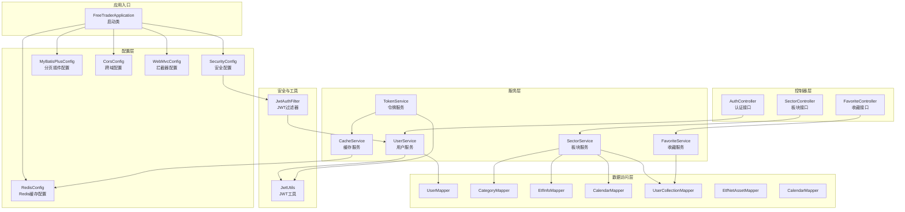
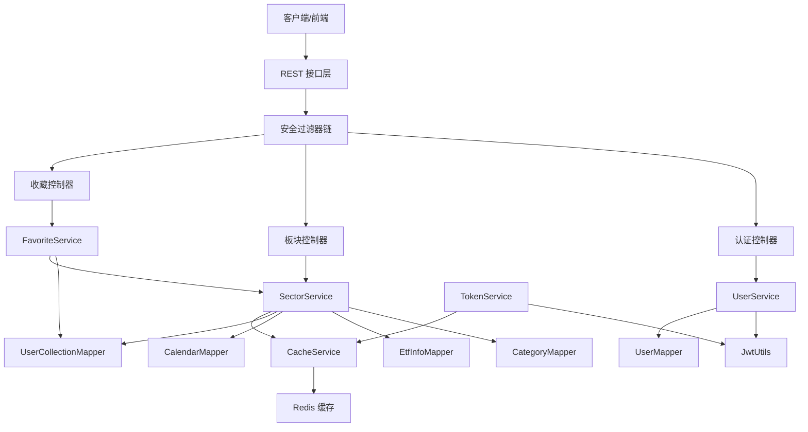
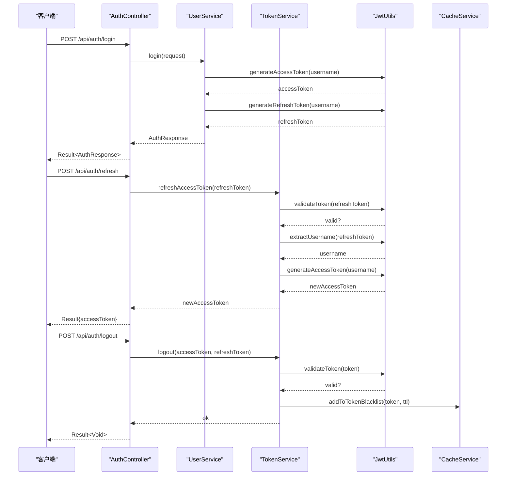
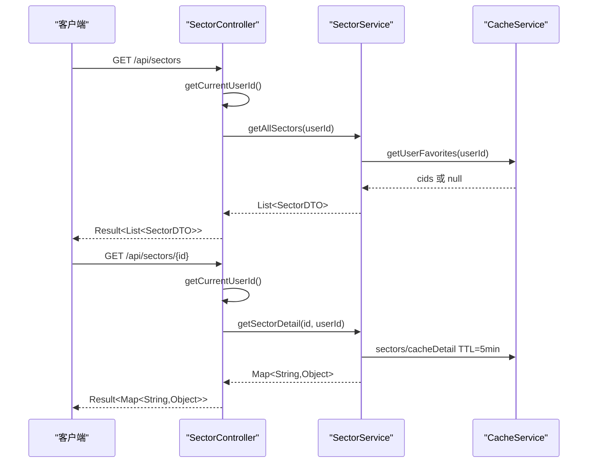
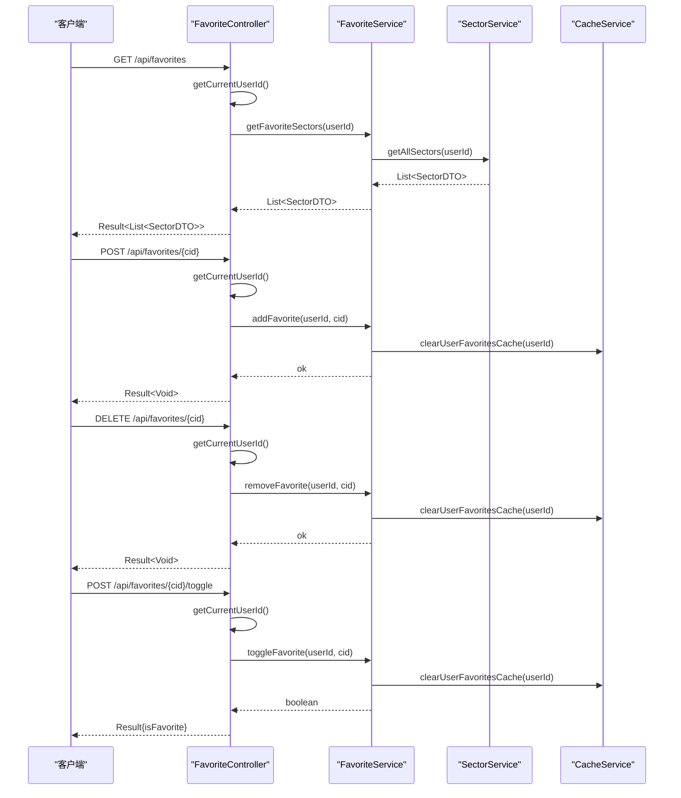
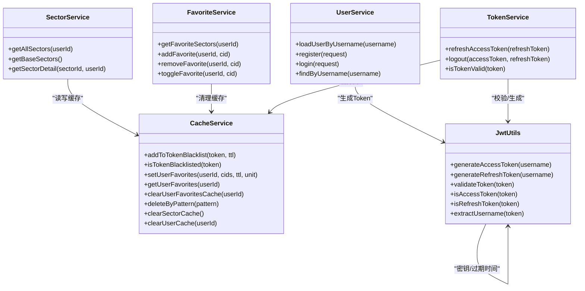
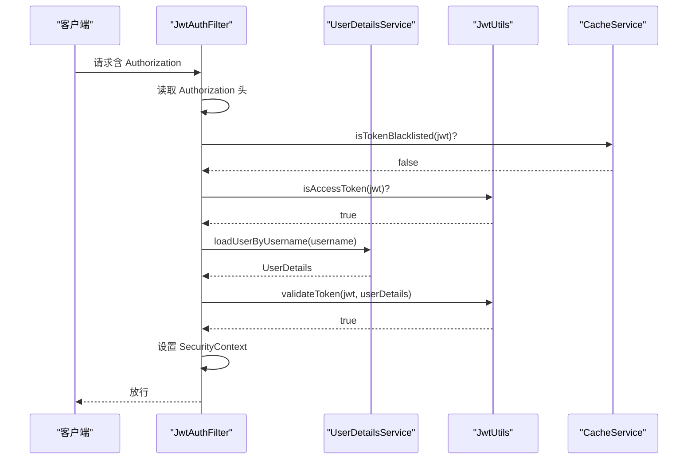
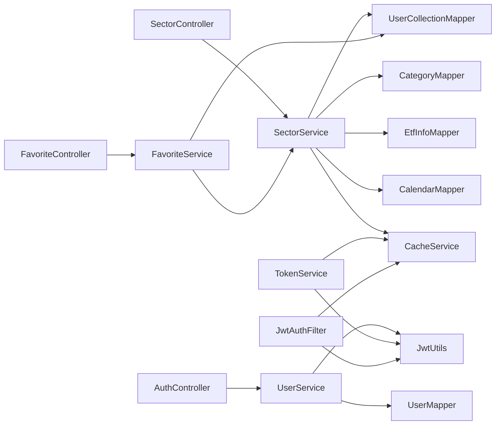

# 后端系统

<cite>
**本文引用的文件**
- [FreeTraderApplication.java](file://backend/src/main/java/com/freetrader/FreeTraderApplication.java)
- [pom.xml](file://backend/pom.xml)
- [application.yml](file://backend/src/main/resources/application.yml)
- [AuthController.java](file://backend/src/main/java/com/freetrader/controller/AuthController.java)
- [SectorController.java](file://backend/src/main/java/com/freetrader/controller/SectorController.java)
- [FavoriteController.java](file://backend/src/main/java/com/freetrader/controller/FavoriteController.java)
- [UserService.java](file://backend/src/main/java/com/freetrader/service/UserService.java)
- [SectorService.java](file://backend/src/main/java/com/freetrader/service/SectorService.java)
- [FavoriteService.java](file://backend/src/main/java/com/freetrader/service/FavoriteService.java)
- [TokenService.java](file://backend/src/main/java/com/freetrader/service/TokenService.java)
- [CacheService.java](file://backend/src/main/java/com/freetrader/service/CacheService.java)
- [SecurityConfig.java](file://backend/src/main/java/com/freetrader/config/SecurityConfig.java)
- [RedisConfig.java](file://backend/src/main/java/com/freetrader/config/RedisConfig.java)
- [MyBatisPlusConfig.java](file://backend/src/main/java/com/freetrader/config/MyBatisPlusConfig.java)
- [CorsConfig.java](file://backend/src/main/java/com/freetrader/config/CorsConfig.java)
- [WebMvcConfig.java](file://backend/src/main/java/com/freetrader/config/WebMvcConfig.java)
- [JwtAuthFilter.java](file://backend/src/main/java/com/freetrader/security/JwtAuthFilter.java)
- [JwtUtils.java](file://backend/src/main/java/com/freetrader/security/JwtUtils.java)
</cite>

## 目录
1. [简介](#简介)
2. [项目结构](#项目结构)
3. [核心组件](#核心组件)
4. [架构总览](#架构总览)
5. [详细组件分析](#详细组件分析)
6. [依赖关系分析](#依赖关系分析)
7. [性能考虑](#性能考虑)
8. [故障排查指南](#故障排查指南)
9. [结论](#结论)
10. [附录](#附录)

## 简介
本文件为 FreeTrader 后端系统的全面技术文档，基于 Spring Boot 技术栈构建，采用分层架构设计，覆盖控制器层、服务层、数据访问层与配置层。系统围绕用户认证、板块数据查询与收藏管理三大功能域展开，结合 JWT 安全机制、Redis 缓存与 MyBatis-Plus 数据持久化，提供高性能、可扩展的企业级后端能力。

## 项目结构
后端模块位于 backend 目录，采用标准 Spring Boot 结构：
- config：安全、缓存、数据库、跨域等配置类
- controller：REST 控制器，暴露认证、板块、收藏接口
- service：业务服务层，封装领域逻辑与缓存策略
- mapper：MyBatis-Plus 映射接口，定义数据访问契约
- entity：实体模型
- security：安全过滤器、JWT 工具与用户细节实现
- util：常量与工具
- exception：全局异常处理与业务异常定义
- dto：请求/响应传输对象
- interceptor：限流拦截器
- resources：应用配置与 OpenAPI 文档

图表来源
- [FreeTraderApplication.java](file://backend/src/main/java/com/freetrader/FreeTraderApplication.java#L1-L15)
- [SecurityConfig.java](file://backend/src/main/java/com/freetrader/config/SecurityConfig.java#L1-L61)
- [RedisConfig.java](file://backend/src/main/java/com/freetrader/config/RedisConfig.java#L1-L79)
- [MyBatisPlusConfig.java](file://backend/src/main/java/com/freetrader/config/MyBatisPlusConfig.java#L1-L19)
- [CorsConfig.java](file://backend/src/main/java/com/freetrader/config/CorsConfig.java#L1-L29)
- [WebMvcConfig.java](file://backend/src/main/java/com/freetrader/config/WebMvcConfig.java#L1-L26)
- [AuthController.java](file://backend/src/main/java/com/freetrader/controller/AuthController.java#L1-L72)
- [SectorController.java](file://backend/src/main/java/com/freetrader/controller/SectorController.java#L1-L63)
- [FavoriteController.java](file://backend/src/main/java/com/freetrader/controller/FavoriteController.java#L1-L90)
- [UserService.java](file://backend/src/main/java/com/freetrader/service/UserService.java#L1-L103)
- [SectorService.java](file://backend/src/main/java/com/freetrader/service/SectorService.java#L1-L253)
- [FavoriteService.java](file://backend/src/main/java/com/freetrader/service/FavoriteService.java#L1-L119)
- [TokenService.java](file://backend/src/main/java/com/freetrader/service/TokenService.java#L1-L64)
- [CacheService.java](file://backend/src/main/java/com/freetrader/service/CacheService.java#L1-L206)
- [JwtUtils.java](file://backend/src/main/java/com/freetrader/security/JwtUtils.java#L1-L194)
- [JwtAuthFilter.java](file://backend/src/main/java/com/freetrader/security/JwtAuthFilter.java#L1-L84)

章节来源
- [FreeTraderApplication.java](file://backend/src/main/java/com/freetrader/FreeTraderApplication.java#L1-L15)
- [pom.xml](file://backend/pom.xml#L1-L143)
- [application.yml](file://backend/src/main/resources/application.yml#L1-L102)

## 核心组件
- 启动类与自动配置
  - 启动类启用 Spring Boot 自动装配，并通过注解扫描 Mapper 包，简化 MyBatis-Plus 使用。
  - 依赖管理集中于 Maven POM，引入 Web、Security、Validation、Redis、MySQL、JWT、OpenAPI 等生态组件。
- 配置层
  - 安全配置：禁用 CSRF，配置无状态会话，注册自定义 JWT 过滤器与认证提供者。
  - Redis 配置：启用缓存注解，定制序列化策略与多命名空间缓存 TTL。
  - MyBatis-Plus 配置：注册分页插件，适配 MySQL。
  - 跨域配置：允许前端本地开发域名与必要请求头。
  - Web MVC 配置：注册限流拦截器，排除刷新 Token 接口。
- 控制器层
  - 认证控制器：登录、注册、刷新 Token、登出，集成限流注解。
  - 板块控制器：获取板块列表与详情，支持收藏状态标记。
  - 收藏控制器：获取收藏列表、添加/移除收藏、切换收藏状态，需携带 Bearer Token。
- 服务层
  - 用户服务：实现 UserDetailsService，负责注册与登录流程，生成 JWT。
  - 板块服务：聚合板块基础数据、计算涨跌幅与价格、生成趋势图数据；缓存板块基础与详情。
  - 收藏服务：处理收藏增删改查，维护用户收藏缓存一致性。
  - 令牌服务：校验刷新 Token、登出时加入黑名单、校验 Token 有效性。
  - 缓存服务：统一 Redis 操作，支持黑名单、用户收藏、批量删除与扫描。
- 安全与工具
  - JWT 工具：生成/解析/验证 Token，区分 Access/Refresh Token。
  - JWT 过滤器：从请求头提取 Token，校验黑名单与类型，注入认证上下文。

章节来源
- [SecurityConfig.java](file://backend/src/main/java/com/freetrader/config/SecurityConfig.java#L1-L61)
- [RedisConfig.java](file://backend/src/main/java/com/freetrader/config/RedisConfig.java#L1-L79)
- [MyBatisPlusConfig.java](file://backend/src/main/java/com/freetrader/config/MyBatisPlusConfig.java#L1-L19)
- [CorsConfig.java](file://backend/src/main/java/com/freetrader/config/CorsConfig.java#L1-L29)
- [WebMvcConfig.java](file://backend/src/main/java/com/freetrader/config/WebMvcConfig.java#L1-L26)
- [AuthController.java](file://backend/src/main/java/com/freetrader/controller/AuthController.java#L1-L72)
- [SectorController.java](file://backend/src/main/java/com/freetrader/controller/SectorController.java#L1-L63)
- [FavoriteController.java](file://backend/src/main/java/com/freetrader/controller/FavoriteController.java#L1-L90)
- [UserService.java](file://backend/src/main/java/com/freetrader/service/UserService.java#L1-L103)
- [SectorService.java](file://backend/src/main/java/com/freetrader/service/SectorService.java#L1-L253)
- [FavoriteService.java](file://backend/src/main/java/com/freetrader/service/FavoriteService.java#L1-L119)
- [TokenService.java](file://backend/src/main/java/com/freetrader/service/TokenService.java#L1-L64)
- [CacheService.java](file://backend/src/main/java/com/freetrader/service/CacheService.java#L1-L206)
- [JwtUtils.java](file://backend/src/main/java/com/freetrader/security/JwtUtils.java#L1-L194)
- [JwtAuthFilter.java](file://backend/src/main/java/com/freetrader/security/JwtAuthFilter.java#L1-L84)

## 架构总览
系统采用经典的三层架构与分层解耦设计：
- 表现层：REST 控制器负责请求路由与响应包装。
- 领域层：服务层封装业务规则、缓存策略与事务控制。
- 基础设施层：数据访问层通过 MyBatis-Plus 与 Redis 实现数据持久化与缓存。

图表来源
- [AuthController.java](file://backend/src/main/java/com/freetrader/controller/AuthController.java#L1-L72)
- [SectorController.java](file://backend/src/main/java/com/freetrader/controller/SectorController.java#L1-L63)
- [FavoriteController.java](file://backend/src/main/java/com/freetrader/controller/FavoriteController.java#L1-L90)
- [UserService.java](file://backend/src/main/java/com/freetrader/service/UserService.java#L1-L103)
- [SectorService.java](file://backend/src/main/java/com/freetrader/service/SectorService.java#L1-L253)
- [FavoriteService.java](file://backend/src/main/java/com/freetrader/service/FavoriteService.java#L1-L119)
- [TokenService.java](file://backend/src/main/java/com/freetrader/service/TokenService.java#L1-L64)
- [JwtUtils.java](file://backend/src/main/java/com/freetrader/security/JwtUtils.java#L1-L194)
- [CacheService.java](file://backend/src/main/java/com/freetrader/service/CacheService.java#L1-L206)

## 详细组件分析

### 认证控制器（AuthController）
职责与实现要点：
- 登录：接收用户名与密码，调用用户服务进行认证，返回包含 AccessToken 与 RefreshToken 的响应。
- 注册：校验用户名与邮箱唯一性，加密密码后入库，随后签发双 Token。
- 刷新 Token：校验 Refresh Token 有效性与类型，生成新的 AccessToken。
- 登出：将 AccessToken 与 RefreshToken 加入黑名单，使其立即失效。
- 限流：对登录与注册接口应用按 IP 的滑动窗口限流，防止暴力破解。

图表来源
- [AuthController.java](file://backend/src/main/java/com/freetrader/controller/AuthController.java#L1-L72)
- [UserService.java](file://backend/src/main/java/com/freetrader/service/UserService.java#L1-L103)
- [TokenService.java](file://backend/src/main/java/com/freetrader/service/TokenService.java#L1-L64)
- [JwtUtils.java](file://backend/src/main/java/com/freetrader/security/JwtUtils.java#L1-L194)
- [CacheService.java](file://backend/src/main/java/com/freetrader/service/CacheService.java#L1-L206)

章节来源
- [AuthController.java](file://backend/src/main/java/com/freetrader/controller/AuthController.java#L1-L72)
- [UserService.java](file://backend/src/main/java/com/freetrader/service/UserService.java#L1-L103)
- [TokenService.java](file://backend/src/main/java/com/freetrader/service/TokenService.java#L1-L64)

### 板块控制器（SectorController）
职责与实现要点：
- 获取所有板块：调用板块服务，传入当前用户 ID，标记收藏状态。
- 获取板块详情：查询板块下表现最佳的 ETF 列表，丰富展示字段，标记收藏状态。
- 安全上下文：从认证上下文中解析当前用户，若匿名则传空用户 ID。

图表来源
- [SectorController.java](file://backend/src/main/java/com/freetrader/controller/SectorController.java#L1-L63)
- [SectorService.java](file://backend/src/main/java/com/freetrader/service/SectorService.java#L1-L253)
- [CacheService.java](file://backend/src/main/java/com/freetrader/service/CacheService.java#L1-L206)

章节来源
- [SectorController.java](file://backend/src/main/java/com/freetrader/controller/SectorController.java#L1-L63)
- [SectorService.java](file://backend/src/main/java/com/freetrader/service/SectorService.java#L1-L253)

### 收藏控制器（FavoriteController）
职责与实现要点：
- 获取收藏列表：根据用户 ID 查询收藏板块集合，再与全量板块合并筛选。
- 添加收藏：检查重复收藏，插入记录并清理用户收藏缓存。
- 取消收藏：按用户与板块删除收藏，清理缓存。
- 切换收藏：根据是否存在收藏决定新增或删除，返回最新收藏状态。
- 安全上下文：要求 Bearer Token，解析当前用户，未登录抛业务异常。

图表来源
- [FavoriteController.java](file://backend/src/main/java/com/freetrader/controller/FavoriteController.java#L1-L90)
- [FavoriteService.java](file://backend/src/main/java/com/freetrader/service/FavoriteService.java#L1-L119)
- [SectorService.java](file://backend/src/main/java/com/freetrader/service/SectorService.java#L1-L253)
- [CacheService.java](file://backend/src/main/java/com/freetrader/service/CacheService.java#L1-L206)

章节来源
- [FavoriteController.java](file://backend/src/main/java/com/freetrader/controller/FavoriteController.java#L1-L90)
- [FavoriteService.java](file://backend/src/main/java/com/freetrader/service/FavoriteService.java#L1-L119)

### 服务层设计模式与业务逻辑
- 用户服务（UserService）
  - 实现 UserDetailsService，按用户名加载用户并构建 UserDetails。
  - 注册：校验唯一性、加密密码、入库并签发双 Token。
  - 登录：校验凭据、签发双 Token。
- 板块服务（SectorService）
  - 基础数据：按最近 N 个交易日区间查询板块涨跌幅，计算价格与市场估算值，生成趋势数据。
  - 详情数据：查询板块下表现最佳 ETF 列表，丰富展示字段。
  - 缓存策略：板块基础与详情分别缓存 5 分钟；用户收藏缓存 5 分钟。
- 收藏服务（FavoriteService）
  - 查询：先取用户收藏 ID 集合，再与全量板块比对。
  - 写入：事务内插入/删除收藏记录，写后清理用户收藏缓存。
  - 切换：根据存在性决定新增或删除。
- 令牌服务（TokenService）
  - 刷新：校验 Refresh Token 类型与黑名单，生成新 AccessToken。
  - 登出：将 Access/Refresh Token 加入黑名单，按过期时间设置 TTL。
  - 校验：组合 JWT 验证与黑名单检查。
- 缓存服务（CacheService）
  - 统一键前缀管理：Token 黑名单、用户信息、用户收藏、板块缓存。
  - 扫描删除：使用 SCAN 替代 KEYS，避免阻塞。
  - 批量清理：提供清除板块缓存与用户缓存的方法。

图表来源
- [UserService.java](file://backend/src/main/java/com/freetrader/service/UserService.java#L1-L103)
- [SectorService.java](file://backend/src/main/java/com/freetrader/service/SectorService.java#L1-L253)
- [FavoriteService.java](file://backend/src/main/java/com/freetrader/service/FavoriteService.java#L1-L119)
- [TokenService.java](file://backend/src/main/java/com/freetrader/service/TokenService.java#L1-L64)
- [CacheService.java](file://backend/src/main/java/com/freetrader/service/CacheService.java#L1-L206)
- [JwtUtils.java](file://backend/src/main/java/com/freetrader/security/JwtUtils.java#L1-L194)

章节来源
- [UserService.java](file://backend/src/main/java/com/freetrader/service/UserService.java#L1-L103)
- [SectorService.java](file://backend/src/main/java/com/freetrader/service/SectorService.java#L1-L253)
- [FavoriteService.java](file://backend/src/main/java/com/freetrader/service/FavoriteService.java#L1-L119)
- [TokenService.java](file://backend/src/main/java/com/freetrader/service/TokenService.java#L1-L64)
- [CacheService.java](file://backend/src/main/java/com/freetrader/service/CacheService.java#L1-L206)
- [JwtUtils.java](file://backend/src/main/java/com/freetrader/security/JwtUtils.java#L1-L194)

### 数据访问层（MyBatis-Plus 与 Mapper 设计）
- 配置
  - 分页插件：注册 MySQL 适配的分页内核，支持全局分页。
  - MyBatis-Plus：映射 XML 位置、驼峰映射、SQL 日志输出级别、逻辑删除字段配置。
- Mapper 接口
  - 用户：UserMapper（按用户名查询、计数等）
  - 板块：CategoryMapper（查询板块基础与涨跌幅）、EtfInfoMapper（查询板块下 ETF）
  - 日历：CalendarMapper（最近 N 个交易日）
  - 收藏：UserCollectionMapper（用户收藏 CRUD）
  - 净值：EtfNetAssetMapper（ETF 净值相关）
- 事务与约束
  - 注册、添加/删除收藏、切换收藏均使用事务保证一致性。
  - 逻辑删除字段 deletedAt 配置，避免物理删除。

章节来源
- [MyBatisPlusConfig.java](file://backend/src/main/java/com/freetrader/config/MyBatisPlusConfig.java#L1-L19)
- [application.yml](file://backend/src/main/resources/application.yml#L46-L59)
- [UserService.java](file://backend/src/main/java/com/freetrader/service/UserService.java#L1-L103)
- [FavoriteService.java](file://backend/src/main/java/com/freetrader/service/FavoriteService.java#L1-L119)
- [SectorService.java](file://backend/src/main/java/com/freetrader/service/SectorService.java#L1-L253)

### 安全配置与认证流程
- 安全配置
  - 禁用 CSRF，开启 CORS，无状态会话，放行认证与文档接口，其余请求需认证。
  - 注入自定义 JWT 过滤器与 Dao 认证提供者。
- JWT 过滤器
  - 从 Authorization 请求头提取 Token，校验黑名单与类型，解析用户名并注入认证上下文。
- 认证流程
  - 登录/注册成功后返回 AccessToken，后续请求携带 Bearer Token。
  - 刷新 Token 仅接受 Refresh Token，且不可在黑名单中。
  - 登出将 Access/Refresh Token 加入黑名单，按过期时间设置 TTL。

图表来源
- [SecurityConfig.java](file://backend/src/main/java/com/freetrader/config/SecurityConfig.java#L1-L61)
- [JwtAuthFilter.java](file://backend/src/main/java/com/freetrader/security/JwtAuthFilter.java#L1-L84)
- [JwtUtils.java](file://backend/src/main/java/com/freetrader/security/JwtUtils.java#L1-L194)
- [CacheService.java](file://backend/src/main/java/com/freetrader/service/CacheService.java#L1-L206)

章节来源
- [SecurityConfig.java](file://backend/src/main/java/com/freetrader/config/SecurityConfig.java#L1-L61)
- [JwtAuthFilter.java](file://backend/src/main/java/com/freetrader/security/JwtAuthFilter.java#L1-L84)
- [JwtUtils.java](file://backend/src/main/java/com/freetrader/security/JwtUtils.java#L1-L194)

### Redis 配置与缓存策略
- Redis 配置
  - 启用缓存注解，定制 JSON 序列化与时间模块。
  - 默认缓存 TTL 30 分钟，针对 sectors/sectorDetail/userInfo 设置更短 TTL。
- 缓存策略
  - Token 黑名单：以 Token 为键，TTL 为过期时间。
  - 用户收藏：以用户 ID 为键，TTL 5 分钟，写后清理。
  - 板块缓存：基础与详情缓存 5 分钟，写后可按前缀批量清理。
  - 扫描删除：使用 SCAN 替代 KEYS，避免阻塞。

章节来源
- [RedisConfig.java](file://backend/src/main/java/com/freetrader/config/RedisConfig.java#L1-L79)
- [CacheService.java](file://backend/src/main/java/com/freetrader/service/CacheService.java#L1-L206)

### 依赖注入与自动配置
- 组件扫描与装配
  - 启动类通过 @MapperScan 扫描 Mapper 接口，配合 MyBatis-Plus Starter 自动装配。
  - Spring Boot 自动装配 Web、Security、Validation、Redis、OpenAPI 等。
- 控制器与服务
  - 控制器通过构造器注入服务，服务通过构造器注入 Mapper 与工具类。
- 配置类
  - 安全、缓存、数据库、跨域、拦截器等配置类通过 @Configuration 与 @EnableCaching 等注解生效。

章节来源
- [FreeTraderApplication.java](file://backend/src/main/java/com/freetrader/FreeTraderApplication.java#L1-L15)
- [pom.xml](file://backend/pom.xml#L1-L143)
- [WebMvcConfig.java](file://backend/src/main/java/com/freetrader/config/WebMvcConfig.java#L1-L26)

## 依赖关系分析
- 组件耦合
  - 控制器依赖服务；服务依赖 Mapper 与工具；安全过滤器依赖 JWT 工具与缓存。
  - 板块服务与收藏服务共享用户收藏缓存，保持一致性。
- 外部依赖
  - MySQL：数据存储，MyBatis-Plus 提供 ORM 能力。
  - Redis：缓存与黑名单存储。
  - JWT：认证令牌生成与验证。
  - OpenAPI：在线接口文档。
- 循环依赖
  - 通过构造器注入避免循环依赖；服务间通过接口交互，降低耦合。

图表来源
- [AuthController.java](file://backend/src/main/java/com/freetrader/controller/AuthController.java#L1-L72)
- [SectorController.java](file://backend/src/main/java/com/freetrader/controller/SectorController.java#L1-L63)
- [FavoriteController.java](file://backend/src/main/java/com/freetrader/controller/FavoriteController.java#L1-L90)
- [UserService.java](file://backend/src/main/java/com/freetrader/service/UserService.java#L1-L103)
- [SectorService.java](file://backend/src/main/java/com/freetrader/service/SectorService.java#L1-L253)
- [FavoriteService.java](file://backend/src/main/java/com/freetrader/service/FavoriteService.java#L1-L119)
- [TokenService.java](file://backend/src/main/java/com/freetrader/service/TokenService.java#L1-L64)
- [JwtUtils.java](file://backend/src/main/java/com/freetrader/security/JwtUtils.java#L1-L194)
- [JwtAuthFilter.java](file://backend/src/main/java/com/freetrader/security/JwtAuthFilter.java#L1-L84)
- [CacheService.java](file://backend/src/main/java/com/freetrader/service/CacheService.java#L1-L206)

章节来源
- [pom.xml](file://backend/pom.xml#L43-L124)
- [application.yml](file://backend/src/main/resources/application.yml#L1-L102)

## 性能考虑
- 缓存优化
  - 板块基础与详情缓存 5 分钟，显著降低数据库压力。
  - 用户收藏缓存 5 分钟，写后清理，保证一致性与性能平衡。
  - Redis 使用 JSON 序列化与时间模块，提升复杂对象存储效率。
- 数据库优化
  - MyBatis-Plus 分页插件减少一次性查询量。
  - 逻辑删除避免物理删除带来的索引重建成本。
- 安全与网络
  - 无状态会话与 JWT 减少服务器端会话存储开销。
  - CORS 仅允许必要来源与头部，降低跨域风险与额外处理。
- 并发与限流
  - 登录/注册接口限流，防止暴力破解与资源滥用。
  - Redis SCAN 替代 KEYS，避免阻塞主进程。

## 故障排查指南
- 认证失败
  - 检查用户名/密码是否正确，确认用户未被逻辑删除。
  - 查看日志中“用户名或密码错误”的告警。
- Token 无效
  - 确认请求头 Authorization 格式为 Bearer Token。
  - 检查 Token 是否在黑名单中，或是否为 Access Token。
  - 校验密钥长度与过期时间配置。
- 收藏异常
  - 已收藏重复添加会触发业务异常，确认收藏状态后再操作。
  - 取消收藏不存在会触发业务异常，确认收藏记录存在。
- 缓存问题
  - 若缓存未生效，检查 Redis 连接与序列化配置。
  - 使用批量清理方法清除相关缓存键，如板块缓存或用户缓存。
- 接口文档
  - 通过 Swagger UI 访问在线文档，确认接口路径与参数。

章节来源
- [UserService.java](file://backend/src/main/java/com/freetrader/service/UserService.java#L1-L103)
- [TokenService.java](file://backend/src/main/java/com/freetrader/service/TokenService.java#L1-L64)
- [FavoriteService.java](file://backend/src/main/java/com/freetrader/service/FavoriteService.java#L1-L119)
- [CacheService.java](file://backend/src/main/java/com/freetrader/service/CacheService.java#L1-L206)
- [application.yml](file://backend/src/main/resources/application.yml#L92-L102)

## 结论
FreeTrader 后端系统以清晰的分层架构与完善的配置体系为基础，结合 JWT 认证、Redis 缓存与 MyBatis-Plus 数据访问，实现了高可用、高性能的金融板块数据服务。通过服务层的业务封装与缓存策略，系统在保证数据一致性的同时提升了响应速度。建议在生产环境中进一步强化密钥管理、监控告警与容量规划，持续优化缓存命中率与数据库查询性能。

## 附录
- 环境变量与配置项
  - 数据源：DB_URL、DB_USERNAME、DB_PASSWORD、DB_POOL_SIZE、DB_MIN_IDLE
  - Redis：REDIS_HOST、REDIS_PORT、REDIS_PASSWORD、REDIS_DATABASE
  - JWT：JWT_SECRET、JWT_ACCESS_EXPIRATION、JWT_REFRESH_EXPIRATION
  - 应用：APP_TRADING_DAYS、APP_TOP_FUNDS、SECTOR_CAP_MULTIPLIER、SECTOR_BASE_PRICE
  - 日志：LOG_LEVEL_ROOT、LOG_LEVEL_APP、LOG_PATH
  - Swagger：SWAGGER_ENABLED
- 开放 API
  - Swagger UI：/swagger-ui.html
  - API 文档：/v3/api-docs

章节来源
- [application.yml](file://backend/src/main/resources/application.yml#L1-L102)
- [pom.xml](file://backend/pom.xml#L1-L143)