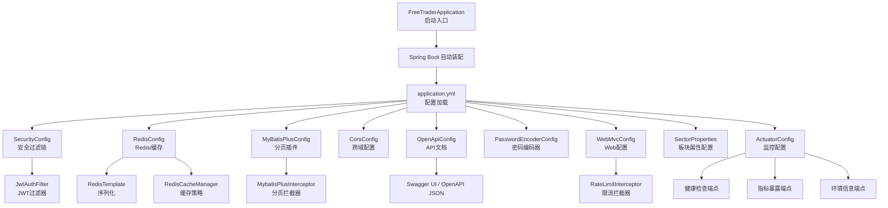
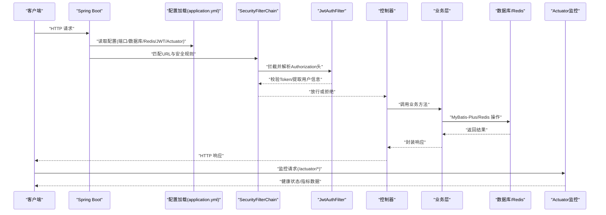
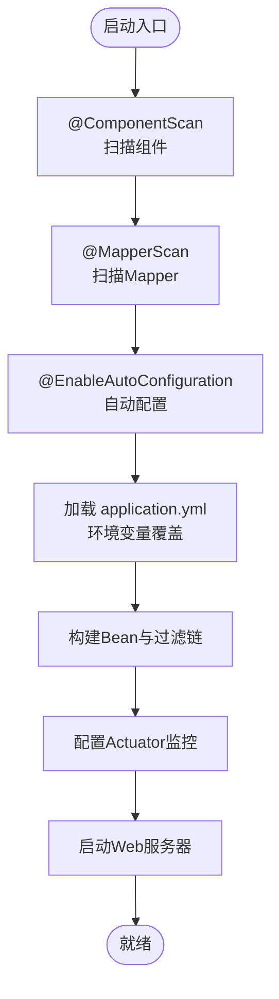
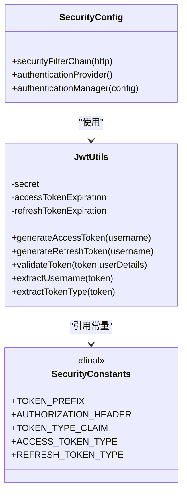
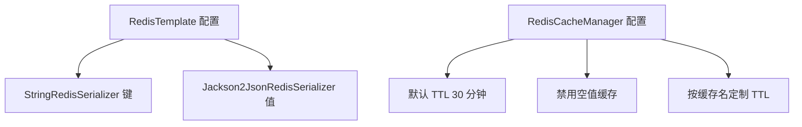
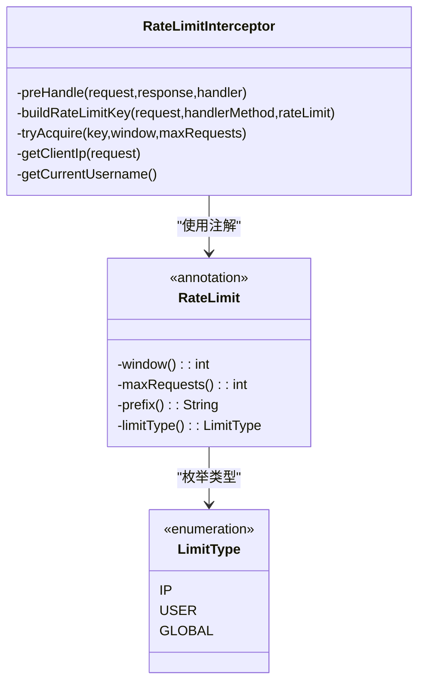
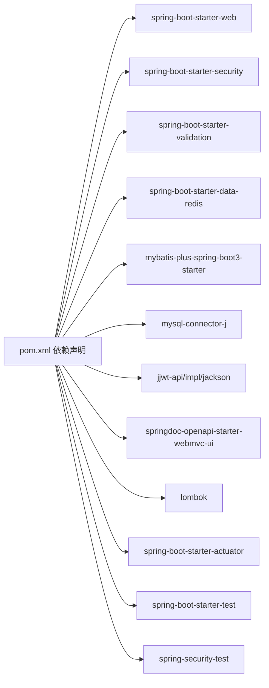

# 应用启动与配置

<cite>
**本文引用的文件**
- [FreeTraderApplication.java](file://backend/src/main/java/com/freetrader/FreeTraderApplication.java)
- [application.yml](file://backend/src/main/resources/application.yml)
- [pom.xml](file://backend/pom.xml)
- [SecurityConfig.java](file://backend/src/main/java/com/freetrader/config/SecurityConfig.java)
- [RedisConfig.java](file://backend/src/main/java/com/freetrader/config/RedisConfig.java)
- [MyBatisPlusConfig.java](file://backend/src/main/java/com/freetrader/config/MyBatisPlusConfig.java)
- [CorsConfig.java](file://backend/src/main/java/com/freetrader/config/CorsConfig.java)
- [WebMvcConfig.java](file://backend/src/main/java/com/freetrader/config/WebMvcConfig.java)
- [PasswordEncoderConfig.java](file://backend/src/main/java/com/freetrader/config/PasswordEncoderConfig.java)
- [OpenApiConfig.java](file://backend/src/main/java/com/freetrader/config/OpenApiConfig.java)
- [SectorProperties.java](file://backend/src/main/java/com/freetrader/config/SectorProperties.java)
- [JwtUtils.java](file://backend/src/main/java/com/freetrader/security/JwtUtils.java)
- [SecurityConstants.java](file://backend/src/main/java/com/freetrader/util/SecurityConstants.java)
- [RateLimitInterceptor.java](file://backend/src/main/java/com/freetrader/interceptor/RateLimitInterceptor.java)
- [RateLimit.java](file://backend/src/main/java/com/freetrader/annotation/RateLimit.java)
- [README.md](file://README.md)
</cite>

## 更新摘要
**变更内容**
- 新增 Spring Boot Actuator 监控配置章节，详细介绍健康检查、指标暴露和环境信息收集
- 更新依赖关系分析，明确 Actuator 监控组件的作用和配置
- 增强故障排查指南，添加 Actuator 相关问题的诊断方法
- 完善开发与生产环境差异建议，包含监控配置的最佳实践

## 目录
1. [简介](#简介)
2. [项目结构](#项目结构)
3. [核心组件](#核心组件)
4. [架构总览](#架构总览)
5. [详细组件分析](#详细组件分析)
6. [依赖关系分析](#依赖关系分析)
7. [性能考虑](#性能考虑)
8. [故障排查指南](#故障排查指南)
9. [结论](#结论)
10. [附录](#附录)

## 简介
本文件面向 FreeTrader Spring Boot 后端应用的启动与配置，系统性阐述应用启动流程、配置扫描机制、关键配置项（数据库、Redis、JWT、Actuator等）、Maven 依赖管理、开发与生产环境差异以及常见问题排查方案。目标是帮助开发者快速理解并正确部署应用，同时为运维人员提供可操作的配置参考。

**更新** 新增 Spring Boot Actuator 监控功能，提供健康检查、指标暴露和环境信息收集能力，显著提升生产部署的可观测性和监控能力。

## 项目结构
后端采用标准 Spring Boot 结构，主要模块如下：
- 启动入口：FreeTraderApplication
- 配置层：application.yml 及各配置类（Security、Redis、MyBatis-Plus、CORS、OpenAPI、密码编码器、Web MVC、板块属性等）
- 控制器层：AuthController、SectorController、FavoriteController
- 业务层：UserService、SectorService、FavoriteService、TokenService、CacheService
- 安全层：JwtAuthFilter、JwtUtils、UserDetailsImpl、SecurityConstants
- 数据访问层：Mapper 接口及 XML 映射
- DTO/实体：数据传输对象与持久化实体
- 异常处理：BusinessException、ErrorCode、GlobalExceptionHandler
- 拦截器：RateLimitInterceptor（限流）
- **监控层**：Spring Boot Actuator（健康检查、指标暴露、环境信息）

**图示来源**
- [FreeTraderApplication.java](file://backend/src/main/java/com/freetrader/FreeTraderApplication.java#L1-L15)
- [application.yml](file://backend/src/main/resources/application.yml#L1-L121)
- [SecurityConfig.java](file://backend/src/main/java/com/freetrader/config/SecurityConfig.java#L1-L61)
- [RedisConfig.java](file://backend/src/main/java/com/freetrader/config/RedisConfig.java#L1-L97)
- [MyBatisPlusConfig.java](file://backend/src/main/java/com/freetrader/config/MyBatisPlusConfig.java#L1-L19)
- [CorsConfig.java](file://backend/src/main/java/com/freetrader/config/CorsConfig.java#L1-L29)
- [OpenApiConfig.java](file://backend/src/main/java/com/freetrader/config/OpenApiConfig.java#L1-L42)
- [PasswordEncoderConfig.java](file://backend/src/main/java/com/freetrader/config/PasswordEncoderConfig.java#L1-L20)
- [WebMvcConfig.java](file://backend/src/main/java/com/freetrader/config/WebMvcConfig.java#L1-L26)
- [SectorProperties.java](file://backend/src/main/java/com/freetrader/config/SectorProperties.java#L1-L38)
- [RateLimitInterceptor.java](file://backend/src/main/java/com/freetrader/interceptor/RateLimitInterceptor.java#L1-L153)

**章节来源**
- [README.md](file://README.md#L28-L47)
- [FreeTraderApplication.java](file://backend/src/main/java/com/freetrader/FreeTraderApplication.java#L1-L15)

## 核心组件
- 启动入口与自动装配
  - 使用 @SpringBootApplication 注解启用自动配置与组件扫描，并通过 @MapperScan 指定 Mapper 扫描路径，确保 MyBatis-Plus 能发现接口。
  - 启动类通过 SpringApplication.run(...) 触发 Spring 容器初始化与 Web 服务器启动。
- 配置加载与 Profiles
  - application.yml 通过占位符支持环境变量覆盖，例如端口、数据库连接、Redis、JWT 密钥、日志级别等。
  - 默认激活 dev 环境，便于本地开发；生产环境建议显式设置 SPRING_PROFILES_ACTIVE。
- 安全与认证
  - 基于 Spring Security 的无状态认证，禁用 CSRF，允许跨域，对特定路径放行，其余请求需鉴权。
  - 使用 JWT 进行访问令牌与刷新令牌管理，支持 Token 黑名单（登出后失效）。
- 缓存与 Redis
  - 配置 RedisTemplate 与 RedisCacheManager，统一键值序列化策略，按缓存名设置不同 TTL。
- ORM 与分页
  - MyBatis-Plus 分页插件针对 MySQL，简化分页查询。
- API 文档
  - SpringDoc OpenAPI 提供 Swagger UI 与 OpenAPI JSON，支持安全方案配置。
- Web MVC 配置
  - 配置拦截器注册，支持限流功能。
- 板块属性配置
  - 通过 @ConfigurationProperties 注解配置板块计算常量，避免硬编码。
- **监控与可观测性**
  - **Spring Boot Actuator**：配置健康检查、指标暴露和环境信息收集，提供应用运行状态监控能力。

**更新** 新增监控与可观测性组件，通过 Actuator 提供完整的应用监控解决方案。

**章节来源**
- [FreeTraderApplication.java](file://backend/src/main/java/com/freetrader/FreeTraderApplication.java#L7-L8)
- [application.yml](file://backend/src/main/resources/application.yml#L1-L121)
- [SecurityConfig.java](file://backend/src/main/java/com/freetrader/config/SecurityConfig.java#L29-L46)
- [JwtUtils.java](file://backend/src/main/java/com/freetrader/security/JwtUtils.java#L25-L32)
- [RedisConfig.java](file://backend/src/main/java/com/freetrader/config/RedisConfig.java#L25-L45)
- [MyBatisPlusConfig.java](file://backend/src/main/java/com/freetrader/config/MyBatisPlusConfig.java#L12-L17)
- [OpenApiConfig.java](file://backend/src/main/java/com/freetrader/config/OpenApiConfig.java#L16-L40)
- [WebMvcConfig.java](file://backend/src/main/java/com/freetrader/config/WebMvcConfig.java#L19-L24)
- [SectorProperties.java](file://backend/src/main/java/com/freetrader/config/SectorProperties.java#L14-L37)

## 架构总览
下图展示了应用启动与请求处理的关键交互，包括新增的监控层：

**图示来源**
- [application.yml](file://backend/src/main/resources/application.yml#L108-L120)
- [SecurityConfig.java](file://backend/src/main/java/com/freetrader/config/SecurityConfig.java#L30-L46)
- [JwtUtils.java](file://backend/src/main/java/com/freetrader/security/JwtUtils.java#L100-L120)

## 详细组件分析

### 启动流程与 @SpringBootApplication
- @SpringBootApplication 组合注解包含：
  - @SpringBootConfiguration：标记配置类
  - @EnableAutoConfiguration：开启自动配置
  - @ComponentScan：扫描组件，默认扫描启动类所在包及其子包
  - @MapperScan("com.freetrader.mapper")：指定 MyBatis-Plus Mapper 扫描路径
- 启动类通过 SpringApplication.run(...) 初始化容器，加载 application.yml 并构建 Web 服务器（默认 Tomcat）。

**图示来源**
- [FreeTraderApplication.java](file://backend/src/main/java/com/freetrader/FreeTraderApplication.java#L7-L8)

**章节来源**
- [FreeTraderApplication.java](file://backend/src/main/java/com/freetrader/FreeTraderApplication.java#L1-L15)

### application.yml 关键配置详解
- 服务器与环境
  - server.port：监听端口，默认 8080，可通过 SERVER_PORT 覆盖
  - spring.profiles.active：当前激活的 Profile，默认 dev，可通过 SPRING_PROFILES_ACTIVE 覆盖
- 数据源与连接池
  - spring.datasource.url：MySQL 连接串，支持 SSL、时区、公钥检索等参数
  - spring.datasource.username/password：数据库凭据
  - spring.datasource.driver-class-name：驱动类
  - spring.datasource.hikari.*：连接池参数（最大池大小、最小空闲、超时等）
- Jackson 日期与时区
  - spring.jackson.date-format/time-zone：统一日期格式与时区
- Redis 配置
  - spring.data.redis.host/port/password/database：Redis 连接参数
  - spring.data.redis.timeout：连接超时
  - spring.data.redis.lettuce.pool.*：连接池参数
  - spring.cache.type=redis：启用 Redis 缓存
  - spring.cache.redis.*：缓存 TTL、空值处理
- MyBatis-Plus
  - mybatis-plus.mapper-locations：XML 映射文件位置
  - mybatis-plus.type-aliases-package：实体包
  - mybatis-plus.configuration.map-underscore-to-camel-case：下划线转驼峰
  - mybatis-plus.configuration.log-impl：SQL 日志实现（生产建议关闭）
  - mybatis-plus.global-config.db-config.*：主键策略、逻辑删除字段与值
- JWT 配置
  - jwt.secret：密钥（生产务必通过环境变量设置，且长度≥32 字节）
  - jwt.access-token-expiration：访问令牌过期时间（毫秒）
  - jwt.refresh-token-expiration：刷新令牌过期时间（毫秒）
- 应用配置
  - app.trading-days/top-funds：默认交易日数与展示数量
  - app.sector.*：板块估算参数（乘数、基础价格、趋势图配置等）
- 日志
  - logging.level.*：根日志级别、应用包、Spring Security/Web 等
  - logging.pattern.console/file：控制台与文件输出格式
  - logging.file.name/max-size/max-history：日志文件路径与滚动策略
- SpringDoc OpenAPI
  - springdoc.api-docs.path/enabled：OpenAPI 文档端点与开关
  - springdoc.swagger-ui.path/enabled/tags-sorter/operations-sorter：UI 界面与排序
- **监控配置（Actuator）**
  - **management.endpoints.web.exposure.include**：暴露的端点（health,info,metrics）
  - **management.endpoint.health.show-details**：授权显示健康检查详情
  - **management.info.env.enabled**：启用环境信息收集

**更新** 新增 Actuator 监控配置部分，详细说明健康检查、指标暴露和环境信息收集的配置选项。

**章节来源**
- [application.yml](file://backend/src/main/resources/application.yml#L1-L121)

### 安全配置与 JWT
- 安全过滤链
  - 禁用 CSRF，启用 CORS，对 /api/auth/**、/api/sectors/**、Swagger 路径放行，其余请求需认证
  - Session 策略设为 STATELESS，无状态认证
  - 使用 DaoAuthenticationProvider 与自定义 UserDetailsService、PasswordEncoder
- JWT 工具
  - 从配置读取密钥、过期时间
  - 生成 Access/Refresh Token，携带类型声明
  - 校验 Token 有效性与过期，区分 Access/Refresh 类型
- 常量
  - 定义 Bearer 前缀、Authorization 头名、Token 类型声明字段与标识

**图示来源**
- [SecurityConfig.java](file://backend/src/main/java/com/freetrader/config/SecurityConfig.java#L29-L59)
- [JwtUtils.java](file://backend/src/main/java/com/freetrader/security/JwtUtils.java#L25-L32)
- [SecurityConstants.java](file://backend/src/main/java/com/freetrader/util/SecurityConstants.java#L6-L41)

**章节来源**
- [SecurityConfig.java](file://backend/src/main/java/com/freetrader/config/SecurityConfig.java#L1-L61)
- [JwtUtils.java](file://backend/src/main/java/com/freetrader/security/JwtUtils.java#L1-L194)
- [SecurityConstants.java](file://backend/src/main/java/com/freetrader/util/SecurityConstants.java#L1-L42)

### Redis 配置与缓存策略
- RedisTemplate
  - 使用 StringRedisSerializer 作为键序列化
  - 使用 Jackson2JsonRedisSerializer 作为值序列化，支持 JavaTimeModule
- RedisCacheManager
  - 默认 TTL 30 分钟，禁用缓存空值
  - 针对 sectors、sectorDetail、userInfo 设置不同的 TTL（5/5/10 分钟）

**图示来源**
- [RedisConfig.java](file://backend/src/main/java/com/freetrader/config/RedisConfig.java#L46-L95)

**章节来源**
- [RedisConfig.java](file://backend/src/main/java/com/freetrader/config/RedisConfig.java#L1-L97)

### MyBatis-Plus 分页插件
- 在 MySQL 下启用分页内核拦截器，简化分页查询实现，减少重复代码。

**章节来源**
- [MyBatisPlusConfig.java](file://backend/src/main/java/com/freetrader/config/MyBatisPlusConfig.java#L1-L19)

### CORS 与 Web MVC 拦截器
- CORS
  - 允许本地前端 3000 端口，支持常用方法与头部，允许凭证，预检缓存 1 小时
- 拦截器
  - RateLimitInterceptor 对 /api/** 限流，排除 /api/auth/refresh

**章节来源**
- [CorsConfig.java](file://backend/src/main/java/com/freetrader/config/CorsConfig.java#L1-L29)
- [WebMvcConfig.java](file://backend/src/main/java/com/freetrader/config/WebMvcConfig.java#L1-L26)

### OpenAPI/Swagger 配置
- 提供 API 文档与 UI，配置安全方案（Bearer JWT），支持启用/禁用。

**章节来源**
- [OpenApiConfig.java](file://backend/src/main/java/com/freetrader/config/OpenApiConfig.java#L1-L42)

### Web MVC 配置
- 注册拦截器，支持限流功能，排除特定接口。

**章节来源**
- [WebMvcConfig.java](file://backend/src/main/java/com/freetrader/config/WebMvcConfig.java#L1-L26)

### 板块属性配置
- 通过 @ConfigurationProperties 注解配置板块计算常量
- 支持趋势图基准值、方向因子、数据点数量、波动范围等配置

**章节来源**
- [SectorProperties.java](file://backend/src/main/java/com/freetrader/config/SectorProperties.java#L1-L38)

### **监控配置（Actuator）**
- **健康检查端点**
  - 配置 management.endpoints.web.exposure.include: health,info,metrics
  - 通过 management.endpoint.health.show-details: when_authorized 控制详情显示策略
  - 提供应用运行状态、数据库连接、Redis 连接等健康检查
- **指标暴露端点**
  - 暴露 JVM 内存、垃圾回收、线程池、HTTP 请求等系统指标
  - 支持 Prometheus 格式指标导出，便于监控系统集成
- **环境信息端点**
  - 通过 management.info.env.enabled: true 启用环境信息收集
  - 提供应用配置、系统属性、环境变量等信息

**更新** 新增 Actuator 监控配置章节，详细说明监控端点的配置和使用方法。

**章节来源**
- [application.yml](file://backend/src/main/resources/application.yml#L108-L120)

### 密码编码器配置
- 单独的 PasswordEncoderConfig，避免与 SecurityConfig 循环依赖，使用 BCrypt。

**章节来源**
- [PasswordEncoderConfig.java](file://backend/src/main/java/com/freetrader/config/PasswordEncoderConfig.java#L1-L20)

### 限流拦截器
- 基于 Redis 实现滑动窗口限流
- 支持 IP、用户、全局三种限流类型
- 可通过 @RateLimit 注解配置限流参数

**图示来源**
- [RateLimitInterceptor.java](file://backend/src/main/java/com/freetrader/interceptor/RateLimitInterceptor.java#L27-L153)
- [RateLimit.java](file://backend/src/main/java/com/freetrader/annotation/RateLimit.java#L12-L48)

**章节来源**
- [RateLimitInterceptor.java](file://backend/src/main/java/com/freetrader/interceptor/RateLimitInterceptor.java#L1-L153)
- [RateLimit.java](file://backend/src/main/java/com/freetrader/annotation/RateLimit.java#L1-L49)

## 依赖关系分析
- 核心依赖
  - Spring Boot Starter Web、Security、Validation、Data Redis、Commons Pool2
  - MyBatis-Plus Spring Boot 3 Starter（3.5.5）
  - MySQL Connector/J（运行时）
  - jjwt API/Impl/Jackson（0.12.3）
  - SpringDoc OpenAPI UI（2.3.0）
  - Lombok（开发工具）
  - 测试 Starter 与 Spring Security Test
  - **Spring Boot Actuator（监控）**
- 版本与作用
  - Spring Boot 3.2.1：提供自动配置与 Web 基础能力
  - Java 17：语言版本
  - MyBatis-Plus 3.5.5：增强 ORM 能力（含分页）
  - Spring Security 6：安全框架（JWT）
  - Redis：缓存与 Token 黑名单
  - JWT（jjwt 0.12.3）：Token 认证
  - SpringDoc OpenAPI 2.3.0：API 文档
  - Lombok：简化实体与配置类代码
  - **Actuator：应用监控与健康检查**

**更新** 在依赖关系分析中新增 Actuator 监控组件，说明其在整体架构中的作用。

**图示来源**
- [pom.xml](file://backend/pom.xml#L45-L132)

**章节来源**
- [pom.xml](file://backend/pom.xml#L1-L151)
- [README.md](file://README.md#L17-L27)

## 性能考虑
- 连接池与超时
  - HikariCP 连接池参数（最大池大小、最小空闲、超时）需结合并发与数据库性能调优
- Redis 连接池
  - Lettuce 连接池参数（最大活跃、空闲、等待）影响高并发下的吞吐与延迟
- SQL 日志
  - 生产环境建议关闭 MyBatis SQL 日志，降低 I/O 与 CPU 开销
- 缓存 TTL
  - 不同业务场景设置差异化 TTL，平衡一致性与性能
- 分页
  - 合理使用分页插件，避免一次性加载大量数据
- 限流策略
  - 根据业务需求调整限流参数，避免误伤正常用户
- **监控开销**
  - **Actuator 指标收集**：生产环境建议合理配置指标暴露范围，避免过度监控影响性能

**更新** 新增监控开销考虑，提醒在生产环境中合理配置监控指标以避免性能影响。

[本节为通用指导，无需具体文件引用]

## 故障排查指南
- 启动失败（端口占用）
  - 现象：端口被占用导致启动失败
  - 解决：修改 server.port 或释放端口
  - 参考：[application.yml](file://backend/src/main/resources/application.yml#L1-L3)
- 数据库连接失败
  - 现象：无法连接 MySQL
  - 排查：确认 DB_URL、DB_USERNAME、DB_PASSWORD、驱动类名
  - 参考：[application.yml](file://backend/src/main/resources/application.yml#L8-L18)
- Redis 连接失败
  - 现象：缓存不可用或连接超时
  - 排查：确认 REDIS_HOST、REDIS_PORT、REDIS_PASSWORD、timeout
  - 参考：[application.yml](file://backend/src/main/resources/application.yml#L24-L38)
- JWT 密钥不安全或过短
  - 现象：生产环境提示密钥强度不足
  - 解决：设置安全的 JWT_SECRET（≥32 字节），通过环境变量注入
  - 参考：[application.yml](file://backend/src/main/resources/application.yml#L60-L66)，[JwtUtils.java](file://backend/src/main/java/com/freetrader/security/JwtUtils.java#L34-L48)
- CORS 跨域问题
  - 现象：前端 3000 端口访问 8080 端口报跨域错误
  - 解决：确认允许的源、方法、头部与凭证
  - 参考：[CorsConfig.java](file://backend/src/main/java/com/freetrader/config/CorsConfig.java#L16-L27)
- Swagger UI 不可用
  - 现象：访问 /swagger-ui.html 或 /v3/api-docs 返回 404
  - 排查：确认 springdoc.swagger-ui.enabled 与 api-docs.enabled
  - 参考：[application.yml](file://backend/src/main/resources/application.yml#L97-L107)
- 认证失败（Token 无效）
  - 现象：401 未授权
  - 排查：确认 Authorization 头格式（Bearer）、Token 类型、过期时间
  - 参考：[SecurityConstants.java](file://backend/src/main/java/com/freetrader/util/SecurityConstants.java#L18-L25)，[JwtUtils.java](file://backend/src/main/java/com/freetrader/security/JwtUtils.java#L138-L154)
- **监控端点访问失败**
  - **现象**：/actuator/health 等端点返回 404
  - **排查**：确认 management.endpoints.web.exposure.include 配置，检查 Actuator 依赖是否正确引入
  - **参考**：[application.yml](file://backend/src/main/resources/application.yml#L108-L120)，[pom.xml](file://backend/pom.xml#L68-L72)
- **监控指标异常**
  - **现象**：/actuator/metrics 返回 500 或指标缺失
  - **排查**：确认 Actuator 端点权限配置，检查 JVM 指标收集权限，验证监控系统的访问权限
  - **参考**：[application.yml](file://backend/src/main/resources/application.yml#L108-L120)
- 限流功能异常
  - 现象：限流不生效或误判
  - 排查：确认 Redis 连接、@RateLimit 注解配置、限流参数设置
  - 参考：[RateLimitInterceptor.java](file://backend/src/main/java/com/freetrader/interceptor/RateLimitInterceptor.java#L96-L114)，[RateLimit.java](file://backend/src/main/java/com/freetrader/annotation/RateLimit.java#L12-L48)

**更新** 新增 Actuator 监控相关故障排查内容，包括监控端点访问失败和指标异常的诊断方法。

**章节来源**
- [application.yml](file://backend/src/main/resources/application.yml#L1-L121)
- [CorsConfig.java](file://backend/src/main/java/com/freetrader/config/CorsConfig.java#L1-L29)
- [JwtUtils.java](file://backend/src/main/java/com/freetrader/security/JwtUtils.java#L1-L194)
- [SecurityConstants.java](file://backend/src/main/java/com/freetrader/util/SecurityConstants.java#L1-L42)
- [RateLimitInterceptor.java](file://backend/src/main/java/com/freetrader/interceptor/RateLimitInterceptor.java#L1-L153)
- [RateLimit.java](file://backend/src/main/java/com/freetrader/annotation/RateLimit.java#L1-L49)
- [pom.xml](file://backend/pom.xml#L68-L72)

## 结论
FreeTrader 后端基于 Spring Boot 3.2.1 与 Java 17 构建，采用 MyBatis-Plus、Spring Security、Redis 与 JWT 实现安全高效的后端服务。通过 application.yml 的灵活配置与环境变量覆盖，可在开发与生产环境中快速切换。新增的 OpenAPI 配置、Web MVC 配置、板块属性配置和限流功能进一步增强了应用的可维护性和用户体验。

**更新** 新增的 Spring Boot Actuator 监控功能显著提升了应用的可观测性和生产部署能力，通过健康检查、指标暴露和环境信息收集为运维监控提供了完整的技术支撑。建议在生产环境严格设置安全配置（如 JWT 密钥、SQL 日志、CORS 白名单），并根据业务负载调整连接池与缓存策略，同时合理配置监控指标以平衡监控效果与性能开销。

[本节为总结，无需具体文件引用]

## 附录

### 开发与生产环境差异建议
- 环境变量覆盖
  - 开发：SPRING_PROFILES_ACTIVE=dev，DB_URL/REDIS_* 等使用本地默认值
  - 生产：SPRING_PROFILES_ACTIVE=prod，DB_URL/REDIS_* 等通过环境变量注入
- 安全配置
  - 生产必须设置安全的 JWT_SECRET（≥32 字节），并启用 HTTPS
- 日志与监控
  - 生产开启文件日志与滚动策略，关闭 SQL 日志
  - **配置健康检查与指标暴露**：启用 Actuator 监控，合理配置监控端点权限
  - **监控系统集成**：配置 Prometheus、Grafana 等监控工具对接 Actuator 指标
- 缓存与数据库
  - 生产使用独立 Redis 与 MySQL 实例，合理设置连接池与 TTL
- API 文档
  - 生产环境可考虑禁用 Swagger UI，仅保留 API 文档端点
- 限流配置
  - 根据业务流量特征调整限流参数，避免过度限制
- **监控最佳实践**
  - **端点权限控制**：生产环境建议限制 Actuator 端点访问权限，仅允许内部网络访问
  - **指标选择优化**：根据监控需求选择必要的指标，避免暴露敏感信息
  - **健康检查配置**：自定义健康检查指示器，提供更准确的应用状态信息

**更新** 新增监控最佳实践建议，包括端点权限控制、指标选择优化和健康检查配置等内容。

**章节来源**
- [application.yml](file://backend/src/main/resources/application.yml#L1-L121)
- [README.md](file://README.md#L65-L117)