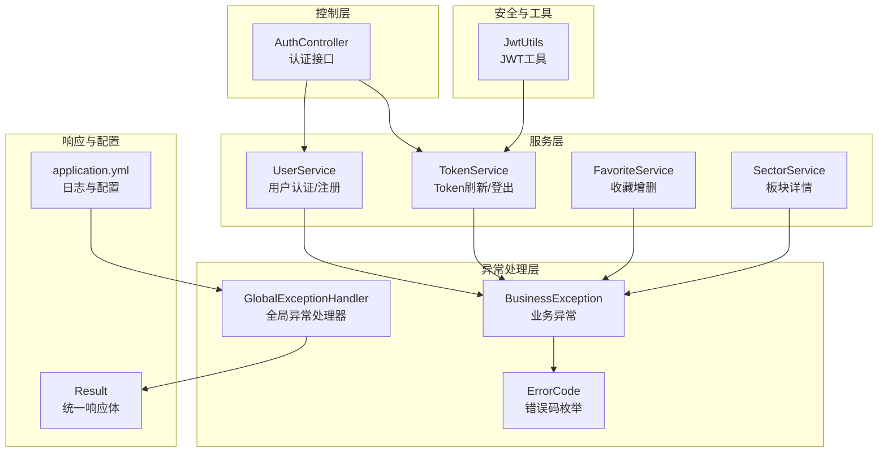
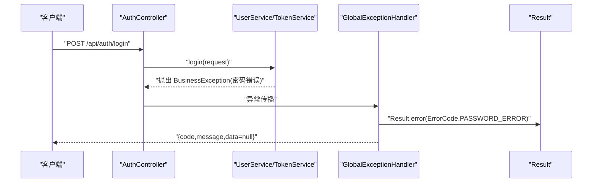
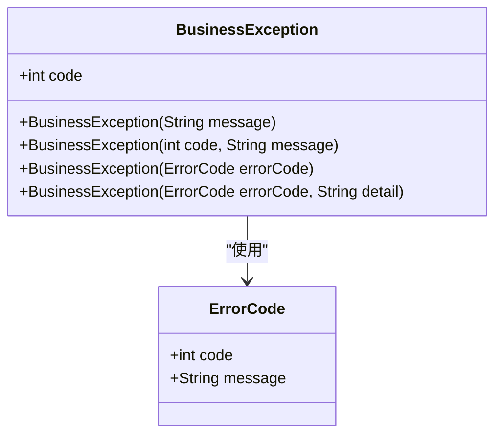
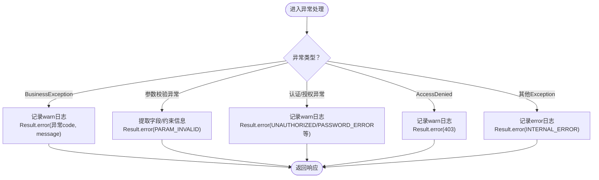
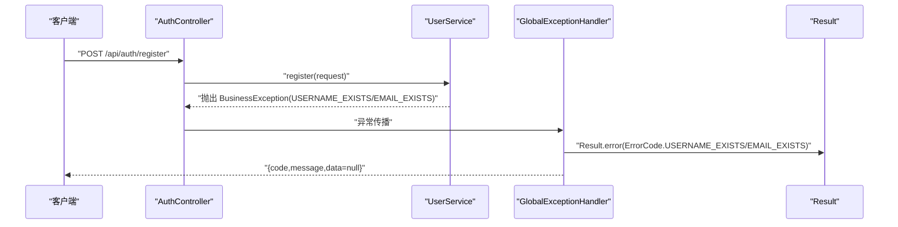
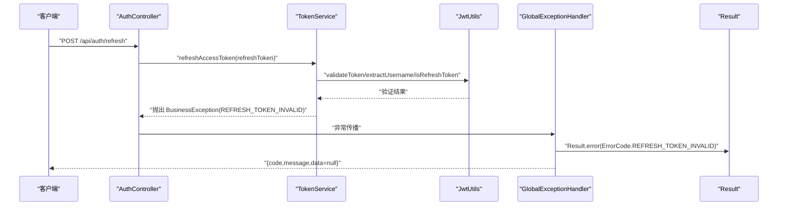
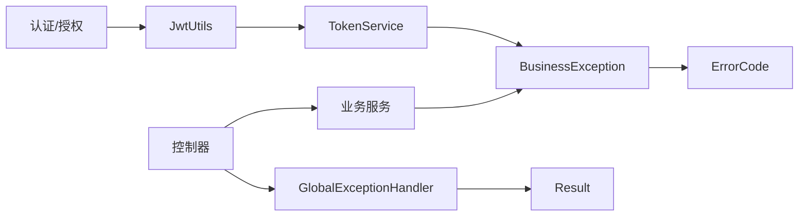

# 异常处理与错误管理

<cite>
**本文引用的文件**
- [BusinessException.java](file://backend/src/main/java/com/freetrader/exception/BusinessException.java)
- [ErrorCode.java](file://backend/src/main/java/com/freetrader/exception/ErrorCode.java)
- [GlobalExceptionHandler.java](file://backend/src/main/java/com/freetrader/exception/GlobalExceptionHandler.java)
- [Result.java](file://backend/src/main/java/com/freetrader/dto/Result.java)
- [UserService.java](file://backend/src/main/java/com/freetrader/service/UserService.java)
- [TokenService.java](file://backend/src/main/java/com/freetrader/service/TokenService.java)
- [FavoriteService.java](file://backend/src/main/java/com/freetrader/service/FavoriteService.java)
- [SectorService.java](file://backend/src/main/java/com/freetrader/service/SectorService.java)
- [AuthController.java](file://backend/src/main/java/com/freetrader/controller/AuthController.java)
- [JwtUtils.java](file://backend/src/main/java/com/freetrader/security/JwtUtils.java)
- [application.yml](file://backend/src/main/resources/application.yml)
- [UserServiceTest.java](file://backend/src/test/java/com/freetrader/service/UserServiceTest.java)
</cite>

## 更新摘要
**所做更改**
- 新增了完整的异常处理框架分析，包括三个核心组件的详细实现
- 更新了架构图以反映新的异常处理流程
- 增加了具体的异常处理示例和最佳实践
- 完善了错误码分类和使用场景说明
- 添加了参数校验异常和认证异常的处理机制

## 目录
1. [简介](#简介)
2. [项目结构](#项目结构)
3. [核心组件](#核心组件)
4. [架构总览](#架构总览)
5. [组件详解](#组件详解)
6. [依赖关系分析](#依赖关系分析)
7. [性能考量](#性能考量)
8. [故障排查指南](#故障排查指南)
9. [结论](#结论)
10. [附录](#附录)

## 简介
本文档全面阐述 FreeTrader 异常处理与错误管理框架的设计与实现。系统性介绍了异常处理体系的核心组件，包括业务异常 BusinessException 的定义与使用场景、错误码 ErrorCode 的设计与分类、全局异常处理器 GlobalExceptionHandler 的统一处理策略，以及最佳实践与调试技巧。该框架实现了统一的异常处理机制，涵盖业务异常、参数校验异常、认证异常、访问拒绝异常和系统异常的统一处理，显著提升了系统的可维护性与可观测性。

## 项目结构
异常处理相关代码主要分布在以下包与文件中：
- exception：业务异常、错误码、全局异常处理器
- dto：统一响应体 Result
- service：各业务层抛出 BusinessException 的具体实现
- controller：对外暴露的 API 接口
- security：JWT 工具类，参与认证/授权相关的异常判定
- resources：应用配置，包含日志级别等与异常可观测性相关的设置

**图表来源**
- [BusinessException.java](file://backend/src/main/java/com/freetrader/exception/BusinessException.java#L1-L30)
- [ErrorCode.java](file://backend/src/main/java/com/freetrader/exception/ErrorCode.java#L1-L35)
- [GlobalExceptionHandler.java](file://backend/src/main/java/com/freetrader/exception/GlobalExceptionHandler.java#L1-L87)
- [Result.java](file://backend/src/main/java/com/freetrader/dto/Result.java#L1-L31)
- [UserService.java](file://backend/src/main/java/com/freetrader/service/UserService.java#L1-L103)
- [TokenService.java](file://backend/src/main/java/com/freetrader/service/TokenService.java#L1-L64)
- [FavoriteService.java](file://backend/src/main/java/com/freetrader/service/FavoriteService.java#L1-L115)
- [SectorService.java](file://backend/src/main/java/com/freetrader/service/SectorService.java#L1-L212)
- [AuthController.java](file://backend/src/main/java/com/freetrader/controller/AuthController.java#L1-L72)
- [JwtUtils.java](file://backend/src/main/java/com/freetrader/security/JwtUtils.java#L1-L194)
- [application.yml](file://backend/src/main/resources/application.yml#L1-L121)

## 核心组件
- **业务异常 BusinessException**：封装业务错误码与消息，继承自运行时异常，便于在业务流程中快速中断并向上抛出。
- **错误码 ErrorCode**：集中定义各类错误码及其本地化消息，按领域分段（通用、认证、用户、业务），便于统一管理和扩展。
- **全局异常处理器 GlobalExceptionHandler**：基于 Spring MVC 的@RestControllerAdvice，对不同异常类型进行统一捕获与响应包装。
- **统一响应体 Result**：标准化接口返回结构，包含 code、message、data，简化前端消费与错误展示。

**章节来源**
- [BusinessException.java](file://backend/src/main/java/com/freetrader/exception/BusinessException.java#L6-L29)
- [ErrorCode.java](file://backend/src/main/java/com/freetrader/exception/ErrorCode.java#L8-L34)
- [GlobalExceptionHandler.java](file://backend/src/main/java/com/freetrader/exception/GlobalExceptionHandler.java#L16-L86)
- [Result.java](file://backend/src/main/java/com/freetrader/dto/Result.java#L10-L29)

## 架构总览
异常处理在系统中的流转路径如下：
- 业务层在检测到异常条件时抛出 BusinessException 或基于 ErrorCode 抛出带错误码的异常。
- 控制器层接收请求，调用服务层；若服务层抛出异常，由全局异常处理器统一拦截。
- 全局异常处理器根据异常类型选择对应处理逻辑，并通过 Result 封装统一响应体返回给客户端。
- 对于参数校验、认证/授权失败等 Spring/Web 层异常，也由处理器统一转换为标准错误响应。

**图表来源**
- [AuthController.java](file://backend/src/main/java/com/freetrader/controller/AuthController.java#L36-L38)
- [UserService.java](file://backend/src/main/java/com/freetrader/service/UserService.java#L79-L81)
- [GlobalExceptionHandler.java](file://backend/src/main/java/com/freetrader/exception/GlobalExceptionHandler.java#L20-L24)
- [Result.java](file://backend/src/main/java/com/freetrader/dto/Result.java#L23-L29)

## 组件详解

### 业务异常 BusinessException
BusinessException 是异常处理框架的核心组件，提供了灵活的异常构造方式和统一的错误码管理。

- **设计要点**
  - 支持多种构造方式：纯消息、显式错误码+消息、ErrorCode 枚举、带细节的 ErrorCode。
  - 通过 @Getter 注解暴露 code 字段，便于全局处理器读取并写入响应。
  - 继承自 RuntimeException，确保异常可以在业务层自由抛出而不强制声明。

- **使用场景**
  - 用户名/邮箱重复、密码错误、Token 无效/过期、板块不存在、收藏已存在/未收藏等。
  - 业务逻辑验证失败时的快速中断。

- **性能与复杂度**
  - O(1) 异常创建与传播；无额外 IO 开销。
  - 通过枚举错误码避免字符串拼接，提升性能。

- **注意事项**
  - 优先使用 ErrorCode 构造，确保错误码与消息的一致性与可维护性。
  - 对于需要详细描述的异常，使用带 detail 参数的构造函数。

**图表来源**
- [BusinessException.java](file://backend/src/main/java/com/freetrader/exception/BusinessException.java#L6-L29)
- [ErrorCode.java](file://backend/src/main/java/com/freetrader/exception/ErrorCode.java#L8-L34)

**章节来源**
- [BusinessException.java](file://backend/src/main/java/com/freetrader/exception/BusinessException.java#L6-L29)

### 错误码 ErrorCode
ErrorCode 采用枚举设计，提供了清晰的错误码分类和国际化支持。

- **设计原则**
  - **分类清晰**：通用(1xxx)、认证(2xxx)、用户(3xxx)、业务(4xxx)。
  - **国际化预留**：当前以中文消息为主，便于扩展为多语言资源文件。
  - **可扩展**：新增错误码遵循分段规则，避免冲突。
  - **不可变性**：使用 @RequiredArgsConstructor 确保错误码的不可变性。

- **错误码分类与使用位置**
  - **通用错误 (1xxx)**：INTERNAL_ERROR(1000)、PARAM_INVALID(1001)
  - **认证错误 (2xxx)**：UNAUTHORIZED(2001)、TOKEN_INVALID(2002)、TOKEN_EXPIRED(2003)、REFRESH_TOKEN_INVALID(2004)、USER_NOT_LOGIN(2005)
  - **用户错误 (3xxx)**：USER_NOT_FOUND(3001)、USERNAME_EXISTS(3002)、EMAIL_EXISTS(3003)、PASSWORD_ERROR(3004)
  - **业务错误 (4xxx)**：SECTOR_NOT_FOUND(4001)、FAVORITE_EXISTS(4002)、FAVORITE_NOT_FOUND(4003)

**章节来源**
- [ErrorCode.java](file://backend/src/main/java/com/freetrader/exception/ErrorCode.java#L8-L34)

### 全局异常处理器 GlobalExceptionHandler
GlobalExceptionHandler 是异常处理框架的中枢，负责统一捕获和处理各种异常类型。

- **职责与覆盖范围**
  - **业务异常处理**：捕获 BusinessException 并返回对应错误码与消息。
  - **参数校验异常**：捕获 MethodArgumentNotValidException、BindException、ConstraintViolationException 并统一映射为参数校验错误码。
  - **认证/授权异常**：捕获 AuthenticationException、BadCredentialsException 并返回相应错误码。
  - **访问拒绝异常**：捕获 AccessDeniedException 并返回 403 错误。
  - **系统异常处理**：捕获通用 Exception 并返回内部错误码。

- **响应格式**
  - 使用 Result.error(code, message) 统一输出，保证前后端一致的错误契约。
  - 所有响应都包含标准化的 code、message、data 结构。

- **日志记录**
  - 对业务异常记录 warn 日志，便于问题追踪。
  - 对参数校验失败、认证失败、访问拒绝记录 warn 日志。
  - 对系统异常记录 error 日志，便于问题定位。

**图表来源**
- [GlobalExceptionHandler.java](file://backend/src/main/java/com/freetrader/exception/GlobalExceptionHandler.java#L20-L85)
- [Result.java](file://backend/src/main/java/com/freetrader/dto/Result.java#L23-L29)

**章节来源**
- [GlobalExceptionHandler.java](file://backend/src/main/java/com/freetrader/exception/GlobalExceptionHandler.java#L16-L86)
- [Result.java](file://backend/src/main/java/com/freetrader/dto/Result.java#L10-L29)

### 统一响应体 Result
Result 提供了标准化的 API 响应格式，确保前后端交互的一致性。

- **结构**
  - **code**：整数错误码或成功码 200。
  - **message**：人类可读的消息。
  - **data**：泛型数据体，错误时通常为 null。

- **方法**
  - **success(data)/success()**：构造成功响应。
  - **error(message)/error(code, message)**：构造错误响应。

- **作用**
  - 规范化接口返回，降低前端解析成本，提升一致性。
  - 统一错误处理，便于前端统一处理各种错误场景。

**章节来源**
- [Result.java](file://backend/src/main/java/com/freetrader/dto/Result.java#L10-L29)

### 业务层异常使用示例

#### 用户注册与登录（UserService）
UserService 展现了异常处理的最佳实践，通过 BusinessException 实现业务逻辑的异常管理。

- **注册流程**：当用户名或邮箱已存在时，抛出带对应错误码的 BusinessException。
- **登录流程**：当用户不存在或密码不匹配时，抛出带错误码的 BusinessException。
- **控制器处理**：AuthController 直接返回 Result.success，异常由全局处理器接管。

**图表来源**
- [UserService.java](file://backend/src/main/java/com/freetrader/service/UserService.java#L45-L51)
- [UserService.java](file://backend/src/main/java/com/freetrader/service/UserService.java#L79-L81)
- [AuthController.java](file://backend/src/main/java/com/freetrader/controller/AuthController.java#L48-L50)
- [GlobalExceptionHandler.java](file://backend/src/main/java/com/freetrader/exception/GlobalExceptionHandler.java#L20-L24)

**章节来源**
- [UserService.java](file://backend/src/main/java/com/freetrader/service/UserService.java#L42-L96)
- [AuthController.java](file://backend/src/main/java/com/freetrader/controller/AuthController.java#L28-L51)

#### Token 刷新（TokenService + JwtUtils）
TokenService 展示了复杂业务逻辑中的异常处理模式。

- **验证流程**：当刷新 Token 无效、类型不符或已被加入黑名单时，抛出 BusinessException(REFRESH_TOKEN_INVALID)。
- **工具支持**：JwtUtils 提供 Token 验证与类型判断，为业务层提供基础能力。

**图表来源**
- [TokenService.java](file://backend/src/main/java/com/freetrader/service/TokenService.java#L18-L32)
- [JwtUtils.java](file://backend/src/main/java/com/freetrader/security/JwtUtils.java#L138-L178)
- [GlobalExceptionHandler.java](file://backend/src/main/java/com/freetrader/exception/GlobalExceptionHandler.java#L20-L24)

**章节来源**
- [TokenService.java](file://backend/src/main/java/com/freetrader/service/TokenService.java#L18-L39)
- [JwtUtils.java](file://backend/src/main/java/com/freetrader/security/JwtUtils.java#L138-L178)

#### 收藏与板块详情（FavoriteService / SectorService）
这两个服务展示了不同业务场景下的异常处理策略。

- **收藏服务**：重复收藏抛出 FAVORITE_EXISTS，取消收藏时未找到抛出 FAVORITE_NOT_FOUND。
- **板块服务**：板块不存在时抛出 SECTOR_NOT_FOUND。

**章节来源**
- [FavoriteService.java](file://backend/src/main/java/com/freetrader/service/FavoriteService.java#L47-L85)
- [SectorService.java](file://backend/src/main/java/com/freetrader/service/SectorService.java#L171-L178)

## 依赖关系分析
异常处理框架展现了良好的模块化设计和低耦合特性。

- **低耦合高内聚**
  - BusinessException 与 ErrorCode 解耦，通过构造函数组合，便于扩展与替换。
  - GlobalExceptionHandler 仅依赖 Result 与异常类型，不直接依赖业务实现，职责单一。
  - 各业务服务独立抛出异常，不依赖异常处理逻辑。

- **关键依赖链**
  - 业务层 -> BusinessException/ErrorCode -> 全局异常处理器 -> Result -> 客户端。
  - 认证/授权层依赖 JwtUtils，为业务层提供 Token 验证与类型判断。
  - 控制器层通过 @RestControllerAdvice 自动应用异常处理。

- **潜在风险**
  - 若新增错误码未同步更新 ErrorCode，可能导致全局处理器无法正确识别。
  - 参数校验异常的字段映射可能需要根据前端需求调整。
  - 异常日志级别需要合理配置以平衡可观测性和性能。

**图表来源**
- [BusinessException.java](file://backend/src/main/java/com/freetrader/exception/BusinessException.java#L6-L29)
- [ErrorCode.java](file://backend/src/main/java/com/freetrader/exception/ErrorCode.java#L8-L34)
- [GlobalExceptionHandler.java](file://backend/src/main/java/com/freetrader/exception/GlobalExceptionHandler.java#L16-L86)
- [Result.java](file://backend/src/main/java/com/freetrader/dto/Result.java#L10-L29)
- [JwtUtils.java](file://backend/src/main/java/com/freetrader/security/JwtUtils.java#L138-L178)
- [TokenService.java](file://backend/src/main/java/com/freetrader/service/TokenService.java#L18-L39)

**章节来源**
- [BusinessException.java](file://backend/src/main/java/com/freetrader/exception/BusinessException.java#L6-L29)
- [GlobalExceptionHandler.java](file://backend/src/main/java/com/freetrader/exception/GlobalExceptionHandler.java#L16-L86)
- [JwtUtils.java](file://backend/src/main/java/com/freetrader/security/JwtUtils.java#L138-L178)

## 性能考量
异常处理框架在性能方面采用了多项优化措施：

- **异常路径的开销控制**
  - 异常栈捕获与日志记录会带来一定 CPU 与 I/O 开销，应在高频异常场景下关注日志级别与采样策略。
  - 使用 @Slf4j 注解减少日志对象创建开销。
  - 通过枚举错误码避免字符串比较开销。

- **响应封装优化**
  - Result 的序列化开销极低，建议保持统一结构，避免频繁变更响应格式。
  - 使用泛型确保编译时类型安全，减少运行时类型检查。

- **缓存与降级策略**
  - 对于认证/授权失败的热点场景，可在网关或服务层增加限流与熔断，减少异常风暴。
  - 使用 Spring Cache 减少重复的业务逻辑执行。

- **内存管理**
  - BusinessException 使用 final 字段确保内存布局优化。
  - ErrorCode 作为枚举实例，避免重复创建。

## 故障排查指南
提供系统化的故障排查流程和调试技巧：

- **常见问题定位步骤**
  - **查看日志级别**：确认 application.yml 中 logging.level.* 配置，确保异常日志可见。
  - **区分异常类型**：根据响应 code 判断是业务异常、参数校验异常还是系统异常。
  - **参数校验失败**：查看字段名与默认消息，必要时在全局处理器中增强字段映射。
  - **认证/授权失败**：核对 Token 类型、有效期与黑名单状态。

- **调试技巧**
  - 在开发环境适当提高日志级别，观察 warn/error 级别日志。
  - 对关键业务点（如登录、注册、Token 刷新）增加单元测试，覆盖异常分支。
  - 使用 Swagger/OpenAPI 文档验证接口行为与错误响应。
  - 通过单元测试验证异常处理逻辑的正确性。

- **监控与告警**
  - 配置适当的日志级别，避免生产环境产生过多异常日志。
  - 监控异常发生频率，及时发现系统问题。
  - 设置异常告警阈值，确保问题能够及时发现。

**章节来源**
- [application.yml](file://backend/src/main/resources/application.yml#L77-L91)
- [GlobalExceptionHandler.java](file://backend/src/main/java/com/freetrader/exception/GlobalExceptionHandler.java#L26-L85)

## 结论
FreeTrader 的异常处理体系通过 BusinessException + ErrorCode + GlobalExceptionHandler + Result 形成完整的闭环，实现了错误码的集中管理、异常的统一处理与响应的标准化输出。该框架具有以下优势：

- **统一性**：所有异常都通过统一的处理器进行处理，确保响应格式一致。
- **可维护性**：错误码集中管理，便于维护和扩展。
- **可观测性**：详细的日志记录和错误码映射，便于问题定位。
- **灵活性**：支持多种异常类型和自定义错误信息。

建议在后续迭代中进一步完善：
- 国际化支持的扩展
- 参数校验的前端友好提示
- 更详细的异常分类和错误码扩展
- 性能监控和告警机制的完善

## 附录

### 错误码一览（按领域分组）
- **通用错误 (1xxx)**
  - 内部错误：1000
  - 参数校验失败：1001
- **认证错误 (2xxx)**
  - 未授权访问：2001
  - Token无效：2002
  - Token已过期：2003
  - 刷新Token无效：2004
  - 用户未登录：2005
- **用户错误 (3xxx)**
  - 用户不存在：3001
  - 用户名已存在：3002
  - 邮箱已被注册：3003
  - 密码错误：3004
- **业务错误 (4xxx)**
  - 板块不存在：4001
  - 已收藏该板块：4002
  - 未收藏该板块：4003

### 异常处理最佳实践
- **异常分类**：明确区分业务异常、系统异常和参数异常
- **错误信息**：提供清晰、简洁的错误描述
- **客户端友好**：确保错误信息对最终用户友好
- **安全性**：避免泄露敏感的系统信息
- **可追踪性**：保留足够的上下文信息便于问题定位

### 常见异常场景处理示例
- **参数校验异常**：使用 Bean Validation 注解，统一处理验证失败
- **认证异常**：区分凭据错误和权限不足的不同处理
- **业务异常**：使用 ErrorCode 枚举确保错误码的一致性
- **系统异常**：捕获未知异常并返回通用错误码

**章节来源**
- [ErrorCode.java](file://backend/src/main/java/com/freetrader/exception/ErrorCode.java#L8-L34)
- [GlobalExceptionHandler.java](file://backend/src/main/java/com/freetrader/exception/GlobalExceptionHandler.java#L26-L85)
- [UserServiceTest.java](file://backend/src/test/java/com/freetrader/service/UserServiceTest.java#L87-L122)