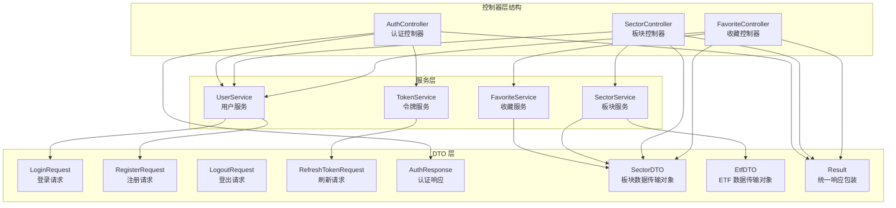
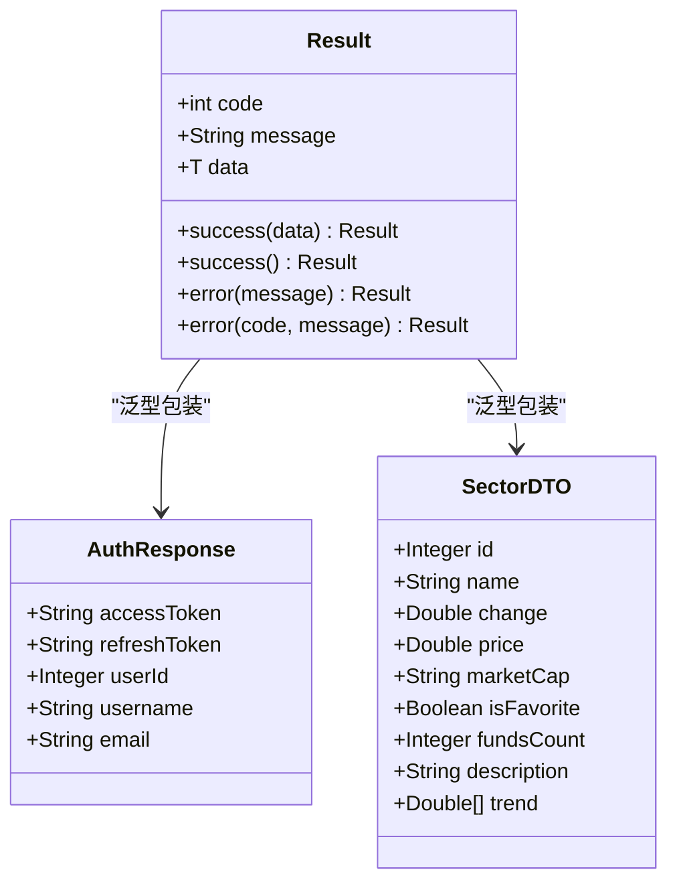
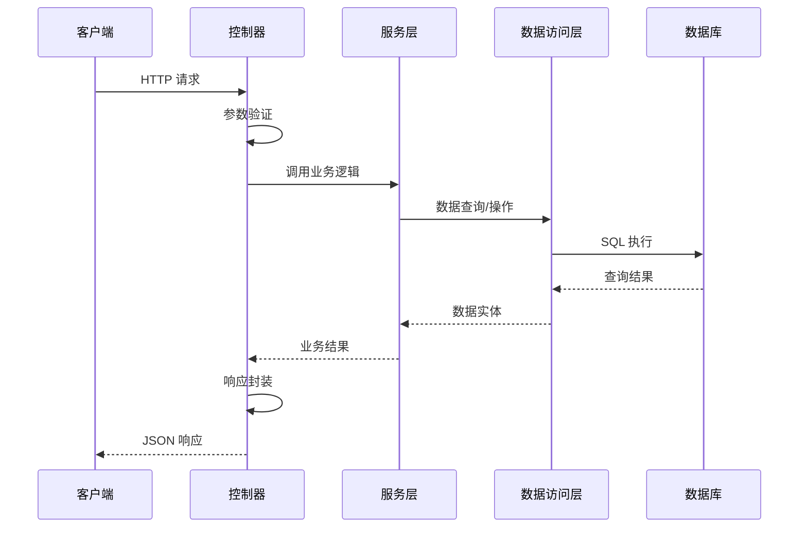
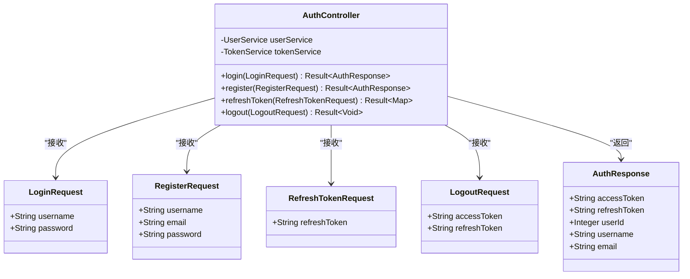
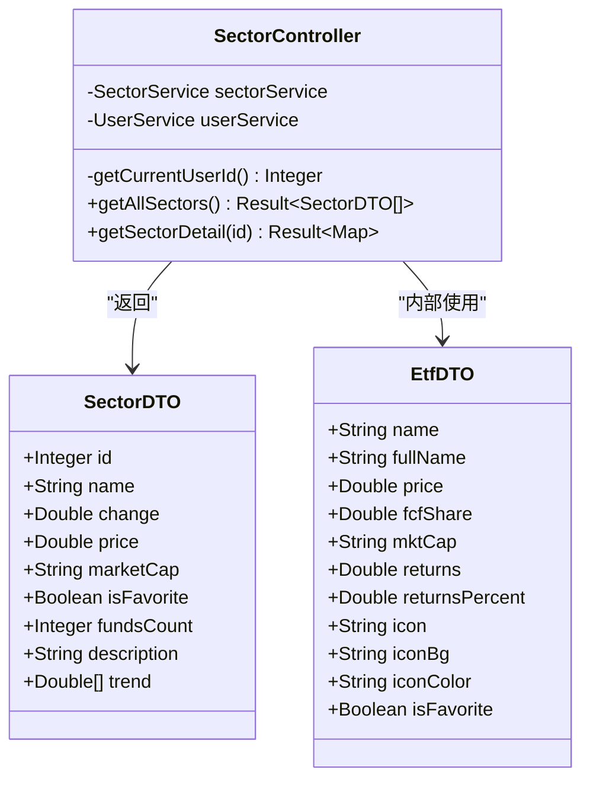
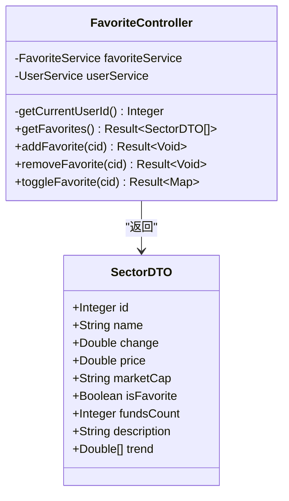
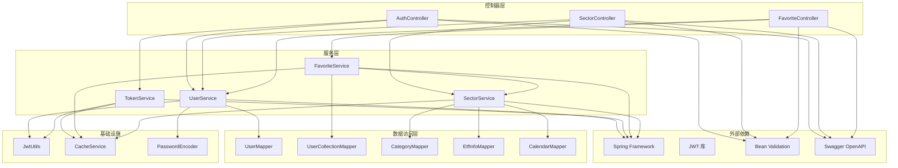

# 控制器层设计

<cite>
**本文档引用的文件**
- [AuthController.java](file://backend/src/main/java/com/freetrader/controller/AuthController.java)
- [SectorController.java](file://backend/src/main/java/com/freetrader/controller/SectorController.java)
- [FavoriteController.java](file://backend/src/main/java/com/freetrader/controller/FavoriteController.java)
- [LoginRequest.java](file://backend/src/main/java/com/freetrader/dto/LoginRequest.java)
- [RegisterRequest.java](file://backend/src/main/java/com/freetrader/dto/RegisterRequest.java)
- [LogoutRequest.java](file://backend/src/main/java/com/freetrader/dto/LogoutRequest.java)
- [RefreshTokenRequest.java](file://backend/src/main/java/com/freetrader/dto/RefreshTokenRequest.java)
- [AuthResponse.java](file://backend/src/main/java/com/freetrader/dto/AuthResponse.java)
- [SectorDTO.java](file://backend/src/main/java/com/freetrader/dto/SectorDTO.java)
- [EtfDTO.java](file://backend/src/main/java/com/freetrader/dto/EtfDTO.java)
- [Result.java](file://backend/src/main/java/com/freetrader/dto/Result.java)
- [UserService.java](file://backend/src/main/java/com/freetrader/service/UserService.java)
- [TokenService.java](file://backend/src/main/java/com/freetrader/service/TokenService.java)
- [FavoriteService.java](file://backend/src/main/java/com/freetrader/service/FavoriteService.java)
- [SectorService.java](file://backend/src/main/java/com/freetrader/service/SectorService.java)
</cite>

## 目录
1. [简介](#简介)
2. [项目结构](#项目结构)
3. [核心组件](#核心组件)
4. [架构概览](#架构概览)
5. [详细组件分析](#详细组件分析)
6. [依赖关系分析](#依赖关系分析)
7. [性能考虑](#性能考虑)
8. [故障排除指南](#故障排除指南)
9. [结论](#结论)

## 简介

FreeTrader 的控制器层采用经典的 MVC 架构模式，位于应用程序的前端入口层，负责处理 HTTP 请求、验证输入参数、调用业务服务层并返回标准化的响应结果。控制器层通过 Spring Boot 的@RestController 注解提供 RESTful API 接口，结合 Swagger OpenAPI 注解提供完整的 API 文档。

控制器层的核心职责包括：
- 接收和验证客户端请求
- 身份认证和授权检查
- 调用相应的业务服务处理业务逻辑
- 统一响应格式化和错误处理
- 实施速率限制和安全防护

## 项目结构

控制器层位于 `backend/src/main/java/com/freetrader/controller/` 目录下，包含三个核心控制器：

**图表来源**
- [AuthController.java](file://backend/src/main/java/com/freetrader/controller/AuthController.java#L19-L71)
- [SectorController.java](file://backend/src/main/java/com/freetrader/controller/SectorController.java#L22-L62)
- [FavoriteController.java](file://backend/src/main/java/com/freetrader/controller/FavoriteController.java#L25-L89)

**章节来源**
- [AuthController.java](file://backend/src/main/java/com/freetrader/controller/AuthController.java#L1-L72)
- [SectorController.java](file://backend/src/main/java/com/freetrader/controller/SectorController.java#L1-L63)
- [FavoriteController.java](file://backend/src/main/java/com/freetrader/controller/FavoriteController.java#L1-L90)

## 核心组件

### 控制器层架构设计

控制器层采用分层架构设计，每个控制器专注于特定的业务领域：

1. **认证控制器 (AuthController)**：处理用户身份认证相关操作
2. **板块控制器 (SectorController)**：管理 ETF 板块数据查询和分析
3. **收藏控制器 (FavoriteController)**：维护用户收藏夹功能

### 统一响应机制

所有控制器接口都遵循统一的响应格式，通过 `Result<T>` 包装类确保一致的 API 输出：

**图表来源**
- [Result.java](file://backend/src/main/java/com/freetrader/dto/Result.java#L10-L30)
- [AuthResponse.java](file://backend/src/main/java/com/freetrader/dto/AuthResponse.java#L12-L18)
- [SectorDTO.java](file://backend/src/main/java/com/freetrader/dto/SectorDTO.java#L12-L22)

**章节来源**
- [Result.java](file://backend/src/main/java/com/freetrader/dto/Result.java#L1-L31)
- [AuthResponse.java](file://backend/src/main/java/com/freetrader/dto/AuthResponse.java#L1-L19)
- [SectorDTO.java](file://backend/src/main/java/com/freetrader/dto/SectorDTO.java#L1-L23)

## 架构概览

控制器层与服务层之间的交互流程体现了清晰的分层架构：

**图表来源**
- [AuthController.java](file://backend/src/main/java/com/freetrader/controller/AuthController.java#L35-L39)
- [UserService.java](file://backend/src/main/java/com/freetrader/service/UserService.java#L42-L71)
- [SectorController.java](file://backend/src/main/java/com/freetrader/controller/SectorController.java#L44-L47)

## 详细组件分析

### 认证控制器 (AuthController)

认证控制器是用户身份管理的核心入口，提供完整的认证生命周期管理：

#### 核心接口设计

**图表来源**
- [AuthController.java](file://backend/src/main/java/com/freetrader/controller/AuthController.java#L23-L71)
- [LoginRequest.java](file://backend/src/main/java/com/freetrader/dto/LoginRequest.java#L7-L14)
- [RegisterRequest.java](file://backend/src/main/java/com/freetrader/dto/RegisterRequest.java#L9-L22)
- [RefreshTokenRequest.java](file://backend/src/main/java/com/freetrader/dto/RefreshTokenRequest.java#L7-L10)
- [LogoutRequest.java](file://backend/src/main/java/com/freetrader/dto/LogoutRequest.java#L6-L9)
- [AuthResponse.java](file://backend/src/main/java/com/freetrader/dto/AuthResponse.java#L12-L18)

#### 登录接口 (POST /api/auth/login)

**请求参数**：
- `username`: 用户名，必填，字符串类型
- `password`: 密码，必填，字符串类型

**响应格式**：
- `code`: 200 表示成功
- `message`: "success"
- `data.accessToken`: JWT 访问令牌
- `data.refreshToken`: JWT 刷新令牌
- `data.userId`: 用户标识
- `data.username`: 用户名
- `data.email`: 用户邮箱

**错误处理**：
- 401 错误：用户名或密码错误
- 429 错误：超过速率限制（IP 限流）

#### 注册接口 (POST /api/auth/register)

**请求参数**：
- `username`: 用户名，3-50字符，必填
- `email`: 邮箱地址，有效格式，必填  
- `password`: 密码，6-100字符，必填

**响应格式**：
- 返回与登录相同的认证响应结构

**错误处理**：
- 400 错误：用户名已存在或邮箱已存在

#### Token 刷新接口 (POST /api/auth/refresh)

**请求参数**：
- `refreshToken`: 刷新令牌，必填

**响应格式**：
- `data.accessToken`: 新的访问令牌

**错误处理**：
- 401 错误：刷新令牌无效或已过期

#### 登出接口 (POST /api/auth/logout)

**请求参数**：
- `accessToken`: 当前访问令牌
- `refreshToken`: 当前刷新令牌

**响应格式**：
- 成功响应

**错误处理**：
- 无特定错误码，失败时返回通用错误

**章节来源**
- [AuthController.java](file://backend/src/main/java/com/freetrader/controller/AuthController.java#L28-L70)
- [LoginRequest.java](file://backend/src/main/java/com/freetrader/dto/LoginRequest.java#L1-L15)
- [RegisterRequest.java](file://backend/src/main/java/com/freetrader/dto/RegisterRequest.java#L1-L23)
- [RefreshTokenRequest.java](file://backend/src/main/java/com/freetrader/dto/RefreshTokenRequest.java#L1-L11)
- [LogoutRequest.java](file://backend/src/main/java/com/freetrader/dto/LogoutRequest.java#L1-L10)
- [AuthResponse.java](file://backend/src/main/java/com/freetrader/dto/AuthResponse.java#L1-L19)

### 板块控制器 (SectorController)

板块控制器负责 ETF 板块数据的查询和分析，提供完整的板块信息管理功能：

#### 核心接口设计

**图表来源**
- [SectorController.java](file://backend/src/main/java/com/freetrader/controller/SectorController.java#L26-L62)
- [SectorDTO.java](file://backend/src/main/java/com/freetrader/dto/SectorDTO.java#L12-L22)
- [EtfDTO.java](file://backend/src/main/java/com/freetrader/dto/EtfDTO.java#L10-L22)

#### 获取所有板块接口 (GET /api/sectors)

**功能描述**：获取所有 ETF 板块列表，包含平均涨跌幅、走势等信息

**响应格式**：
- `data`: SectorDTO 对象数组
- 每个 SectorDTO 包含：
  - `id`: 板块标识
  - `name`: 板块名称
  - `change`: 平均涨跌幅百分比
  - `price`: 最新净值价格
  - `marketCap`: 估算市值
  - `isFavorite`: 是否已收藏
  - `fundsCount`: 基金数量
  - `description`: 板块描述
  - `trend`: 走势数据（用于图表显示）

**错误处理**：
- 200 成功：获取成功

#### 获取板块详情接口 (GET /api/sectors/{id})

**路径参数**：
- `id`: 板块ID，整数类型

**响应格式**：
- `data`: 包含以下字段的对象
  - `id`: 板块标识
  - `name`: 板块名称
  - `description`: 板块描述
  - `fundsCount`: 基金数量
  - `isFavorite`: 是否已收藏
  - `funds`: 表现最好的 ETF 列表（EtfDTO 数组）

**错误处理**：
- 404 错误：板块不存在

**章节来源**
- [SectorController.java](file://backend/src/main/java/com/freetrader/controller/SectorController.java#L41-L61)
- [SectorDTO.java](file://backend/src/main/java/com/freetrader/dto/SectorDTO.java#L1-L23)
- [EtfDTO.java](file://backend/src/main/java/com/freetrader/dto/EtfDTO.java#L1-L23)

### 收藏控制器 (FavoriteController)

收藏控制器管理用户对板块的收藏功能，提供完整的收藏生命周期管理：

#### 核心接口设计

**图表来源**
- [FavoriteController.java](file://backend/src/main/java/com/freetrader/controller/FavoriteController.java#L30-L89)
- [SectorDTO.java](file://backend/src/main/java/com/freetrader/dto/SectorDTO.java#L12-L22)

#### 获取收藏列表接口 (GET /api/favorites)

**功能描述**：获取当前用户收藏的所有板块

**响应格式**：
- `data`: SectorDTO 对象数组，包含用户收藏的板块信息

**错误处理**：
- 401 错误：用户未登录

#### 添加收藏接口 (POST /api/favorites/{cid})

**路径参数**：
- `cid`: 板块ID，整数类型

**响应格式**：
- 成功响应

**错误处理**：
- 400 错误：已收藏该板块
- 401 错误：用户未登录

#### 取消收藏接口 (DELETE /api/favorites/{cid})

**路径参数**：
- `cid`: 板块ID，整数类型

**响应格式**：
- 成功响应

**错误处理**：
- 400 错误：未收藏该板块
- 401 错误：用户未登录

#### 切换收藏状态接口 (POST /api/favorites/{cid}/toggle)

**路径参数**：
- `cid`: 板块ID，整数类型

**响应格式**：
- `data.isFavorite`: 当前收藏状态（布尔值）

**错误处理**：
- 401 错误：用户未登录

**章节来源**
- [FavoriteController.java](file://backend/src/main/java/com/freetrader/controller/FavoriteController.java#L45-L88)
- [SectorDTO.java](file://backend/src/main/java/com/freetrader/dto/SectorDTO.java#L1-L23)

## 依赖关系分析

控制器层的依赖关系体现了清晰的分层架构和关注点分离：

**图表来源**
- [AuthController.java](file://backend/src/main/java/com/freetrader/controller/AuthController.java#L25-L26)
- [SectorController.java](file://backend/src/main/java/com/freetrader/controller/SectorController.java#L28-L29)
- [FavoriteController.java](file://backend/src/main/java/com/freetrader/controller/FavoriteController.java#L32-L33)

### 关键依赖关系说明

1. **认证依赖链**：AuthController → UserService → JwtUtils → CacheService
2. **板块依赖链**：SectorController → SectorService → CategoryMapper/EtfInfoMapper
3. **收藏依赖链**：FavoriteController → FavoriteService → UserCollectionMapper

**章节来源**
- [UserService.java](file://backend/src/main/java/com/freetrader/service/UserService.java#L27-L29)
- [TokenService.java](file://backend/src/main/java/com/freetrader/service/TokenService.java#L15-L16)
- [FavoriteService.java](file://backend/src/main/java/com/freetrader/service/FavoriteService.java#L27-L29)
- [SectorService.java](file://backend/src/main/java/com/freetrader/service/SectorService.java#L32-L36)

## 性能考虑

### 缓存策略

控制器层通过服务层实现了多层次的缓存策略：

1. **用户收藏缓存**：用户收藏列表缓存 5 分钟
2. **板块基础数据缓存**：板块基础数据使用 Spring Cache 注解缓存
3. **Redis 集成**：通过 CacheService 统一管理缓存操作

### 速率限制

认证接口实施了基于 IP 的速率限制：
- 登录接口：每 60 秒最多 5 次请求
- 注册接口：每 60 秒最多 3 次请求

### 异步处理

对于耗时的操作，建议在服务层实现异步处理以提高响应性能。

## 故障排除指南

### 常见错误诊断

1. **认证相关错误**
   - 401 未授权：检查 JWT 令牌有效性
   - 429 请求过多：检查速率限制配置

2. **数据访问错误**
   - 404 未找到：确认资源 ID 是否正确
   - 500 服务器错误：检查数据库连接和查询语句

3. **业务逻辑错误**
   - 400 参数错误：检查 DTO 验证规则
   - 业务异常：查看具体错误码定义

### 调试建议

1. **启用详细日志**：检查服务层的日志输出
2. **API 测试**：使用 Swagger UI 验证接口行为
3. **缓存检查**：确认缓存配置和数据一致性

**章节来源**
- [UserService.java](file://backend/src/main/java/com/freetrader/service/UserService.java#L79-L82)
- [TokenService.java](file://backend/src/main/java/com/freetrader/service/TokenService.java#L19-L32)
- [FavoriteService.java](file://backend/src/main/java/com/freetrader/service/FavoriteService.java#L54-L80)

## 结论

FreeTrader 控制器层设计充分体现了现代 Web 应用的最佳实践：

1. **清晰的分层架构**：控制器、服务、数据访问层职责明确
2. **统一的响应格式**：通过 Result 包装类确保 API 一致性
3. **完善的错误处理**：针对不同场景提供准确的错误信息
4. **安全性考虑**：集成 JWT 认证、速率限制和权限控制
5. **性能优化**：多级缓存策略和合理的数据访问模式

该设计为后续功能扩展提供了良好的基础，同时保持了代码的可维护性和可测试性。建议在后续开发中继续完善监控指标、日志记录和异常处理机制。