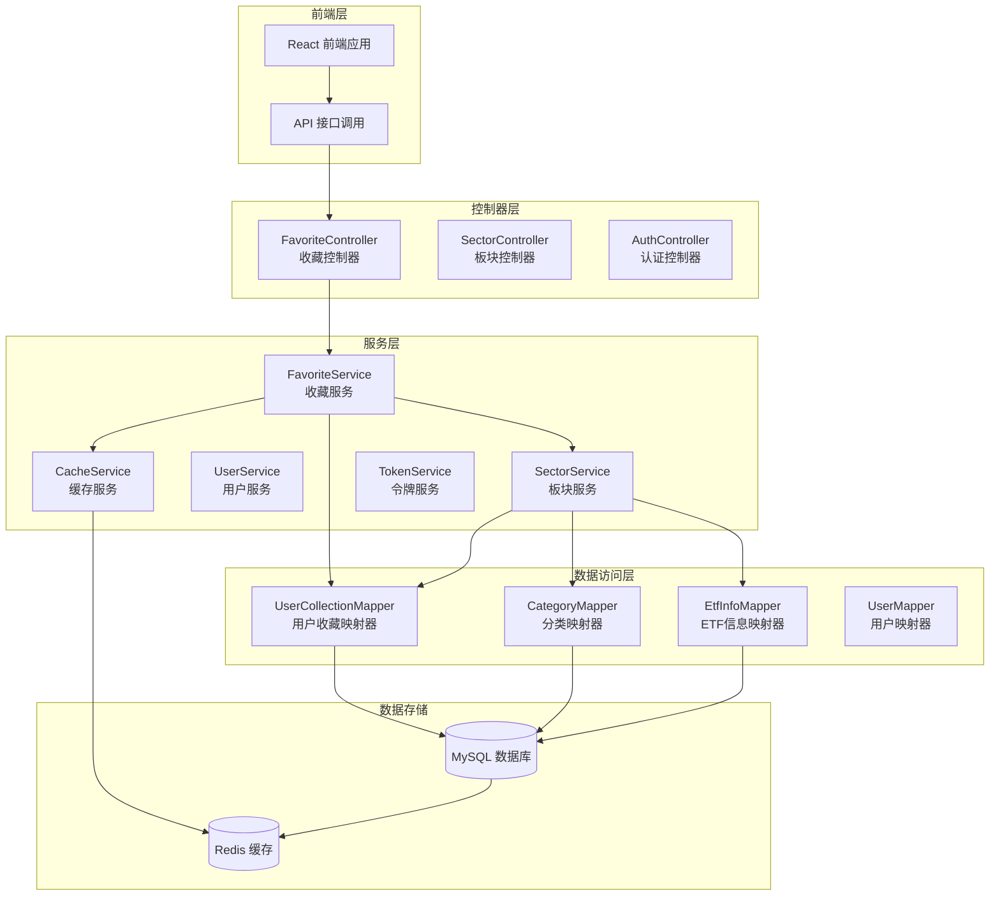
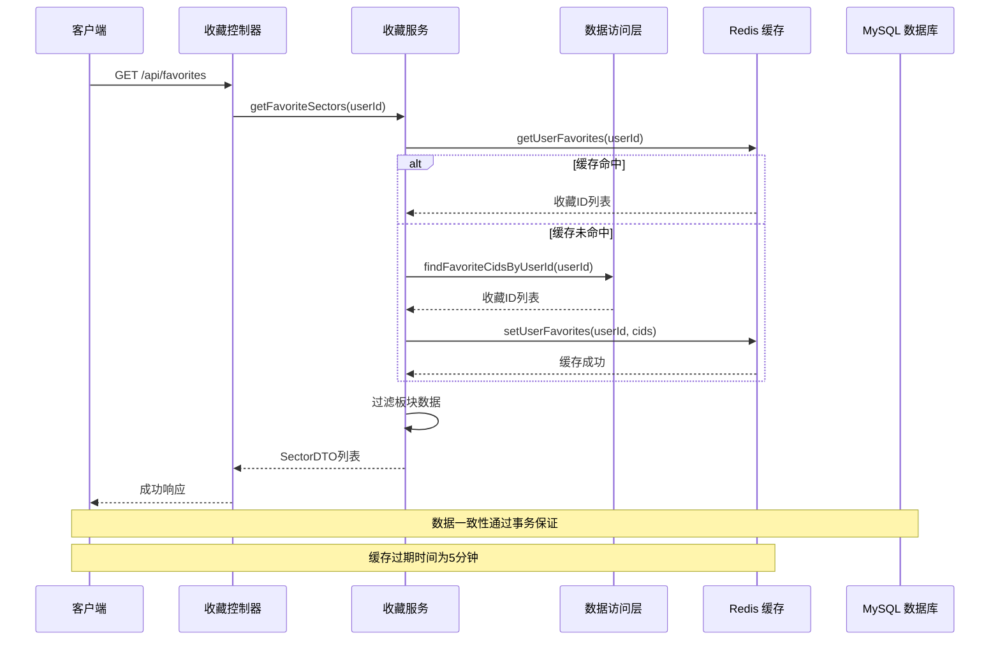
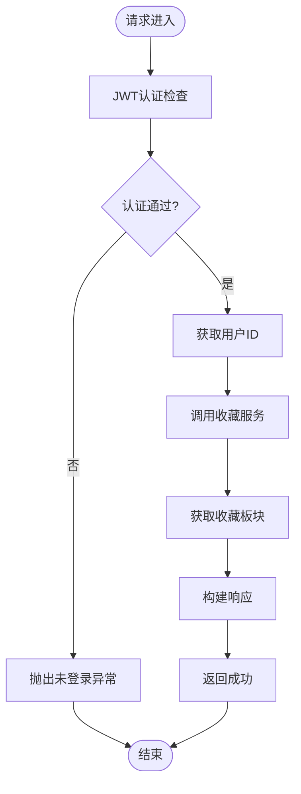
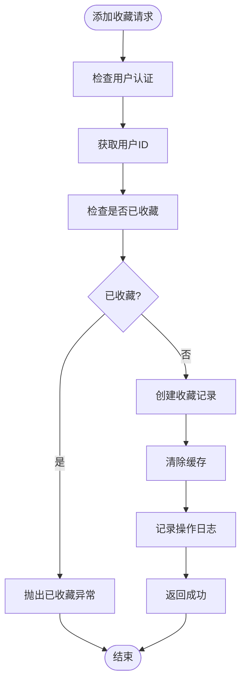
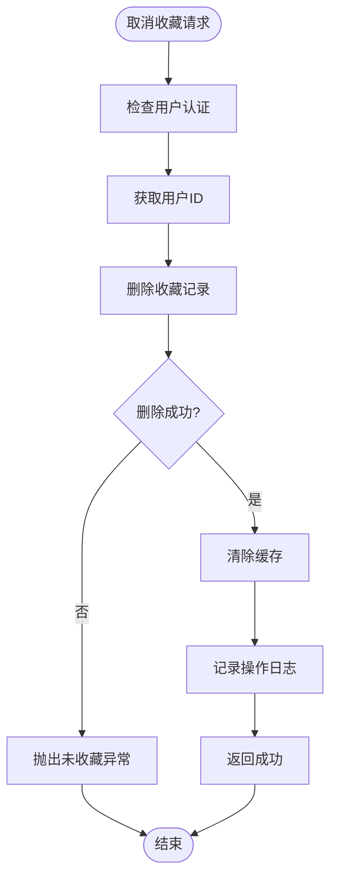
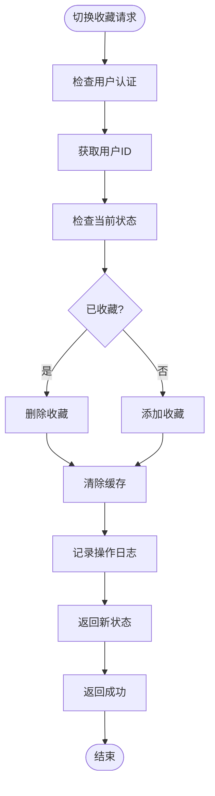
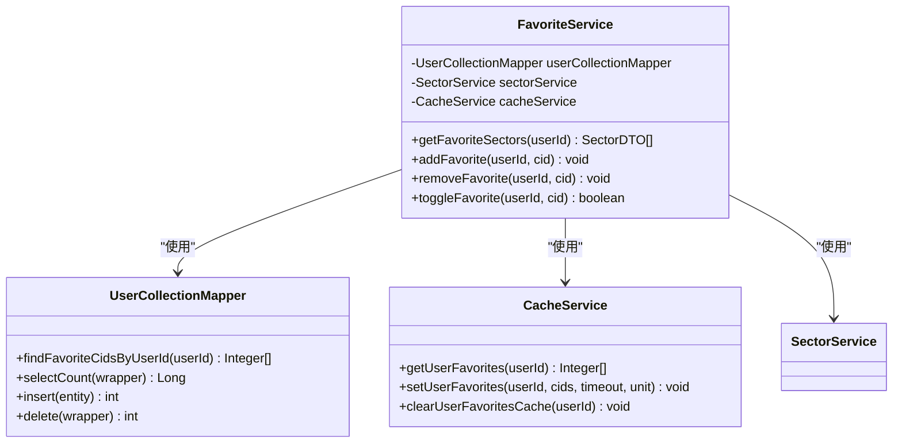
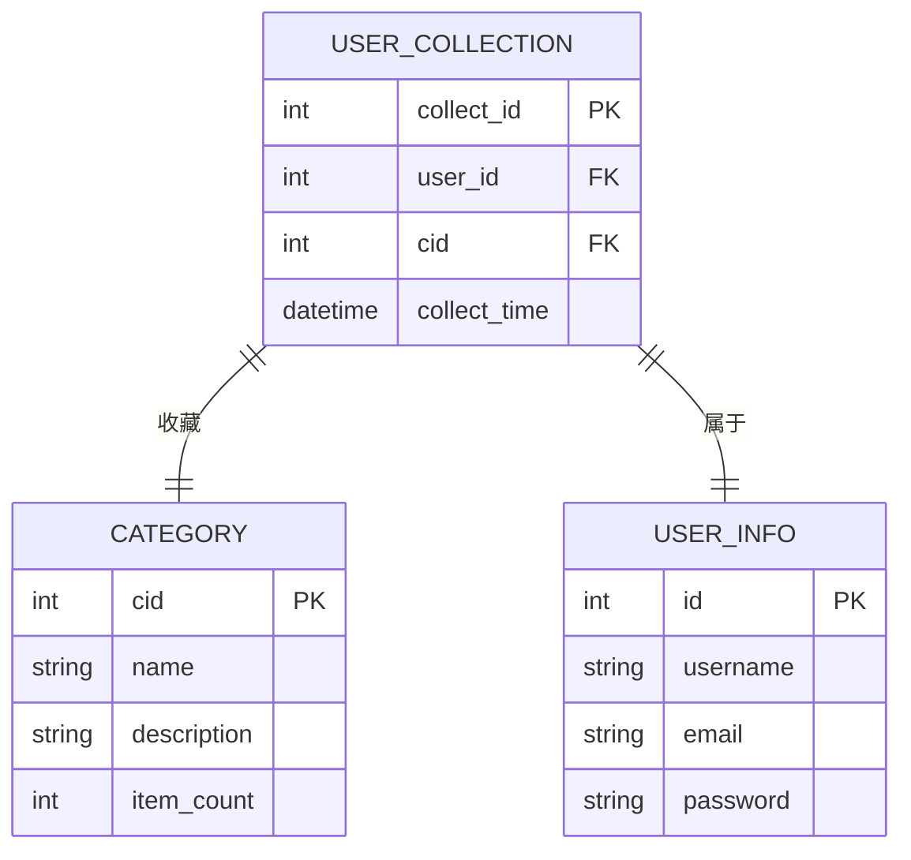
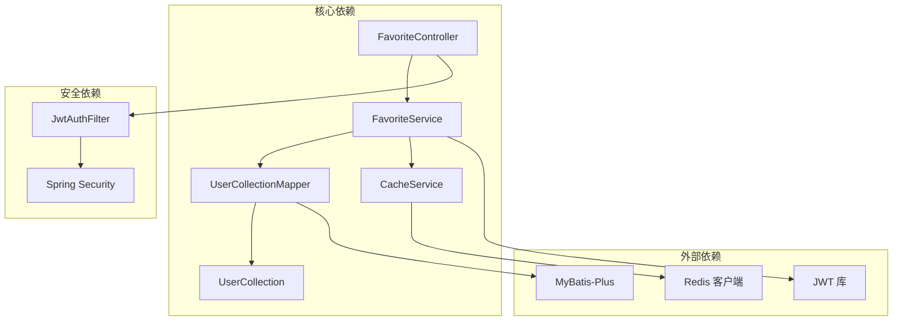

# 收藏控制器

<cite>
**本文档引用的文件**
- [FavoriteController.java](file://backend/src/main/java/com/freetrader/controller/FavoriteController.java)
- [FavoriteService.java](file://backend/src/main/java/com/freetrader/service/FavoriteService.java)
- [UserCollectionMapper.java](file://backend/src/main/java/com/freetrader/mapper/UserCollectionMapper.java)
- [UserCollection.java](file://backend/src/main/java/com/freetrader/entity/UserCollection.java)
- [SectorService.java](file://backend/src/main/java/com/freetrader/service/SectorService.java)
- [CacheService.java](file://backend/src/main/java/com/freetrader/service/CacheService.java)
- [application.yml](file://backend/src/main/resources/application.yml)
- [user_collection.sql](file://sql/user_collection.sql)
- [BusinessException.java](file://backend/src/main/java/com/freetrader/exception/BusinessException.java)
- [ErrorCode.java](file://backend/src/main/java/com/freetrader/exception/ErrorCode.java)
- [JwtAuthFilter.java](file://backend/src/main/java/com/freetrader/security/JwtAuthFilter.java)
- [Result.java](file://backend/src/main/java/com/freetrader/dto/Result.java)
- [page.tsx](file://frontend/src/app/favorites/page.tsx)
- [api.ts](file://frontend/src/lib/api.ts)
</cite>

## 目录
1. [简介](#简介)
2. [项目结构](#项目结构)
3. [核心组件](#核心组件)
4. [架构概览](#架构概览)
5. [详细组件分析](#详细组件分析)
6. [依赖关系分析](#依赖关系分析)
7. [性能考虑](#性能考虑)
8. [故障排除指南](#故障排除指南)
9. [结论](#结论)

## 简介

FreeTrader 收藏控制器是用户板块收藏管理的核心组件，负责实现用户对板块的收藏、取消收藏和收藏列表查询功能。该控制器基于 Spring Boot 构建，采用分层架构设计，结合 Redis 缓存和 JWT 安全认证机制，提供了高性能、可扩展的收藏管理服务。

本控制器支持以下核心功能：
- 收藏列表查询：获取当前用户收藏的所有板块
- 添加收藏：收藏指定板块
- 取消收藏：取消收藏指定板块  
- 切换收藏状态：智能切换收藏状态（已收藏则取消，未收藏则添加）
- 批量操作：通过切换功能实现批量收藏状态管理

## 项目结构

收藏控制器位于后端项目的控制器层，采用标准的三层架构模式：

**图表来源**
- [FavoriteController.java](file://backend/src/main/java/com/freetrader/controller/FavoriteController.java#L25-L29)
- [FavoriteService.java](file://backend/src/main/java/com/freetrader/service/FavoriteService.java#L22-L25)
- [UserCollectionMapper.java](file://backend/src/main/java/com/freetrader/mapper/UserCollectionMapper.java#L11-L12)

**章节来源**
- [FavoriteController.java](file://backend/src/main/java/com/freetrader/controller/FavoriteController.java#L1-L90)
- [application.yml](file://backend/src/main/resources/application.yml#L1-L102)

## 核心组件

### 收藏控制器 (FavoriteController)

收藏控制器是收藏功能的入口点，提供 RESTful API 接口。该控制器继承了 Spring MVC 的注解特性，实现了完整的收藏管理功能。

主要特性：
- **安全认证**：基于 JWT Bearer Token 的安全认证
- **RESTful 设计**：遵循 RESTful API 设计原则
- **响应封装**：统一的响应格式封装
- **异常处理**：完善的异常处理机制

### 收藏服务 (FavoriteService)

收藏服务是业务逻辑的核心实现，负责具体的收藏操作和数据一致性保证。

关键功能：
- **事务管理**：确保收藏操作的原子性
- **数据验证**：防止重复收藏和无效操作
- **缓存同步**：维护用户收藏数据的一致性
- **日志记录**：详细的操作日志记录

### 数据模型 (UserCollection)

用户收藏实体类定义了收藏数据的存储结构，采用 MyBatis-Plus 注解进行 ORM 映射。

**章节来源**
- [FavoriteController.java](file://backend/src/main/java/com/freetrader/controller/FavoriteController.java#L30-L89)
- [FavoriteService.java](file://backend/src/main/java/com/freetrader/service/FavoriteService.java#L22-L119)
- [UserCollection.java](file://backend/src/main/java/com/freetrader/entity/UserCollection.java#L10-L22)

## 架构概览

收藏系统的整体架构采用了分层设计和缓存优化策略：

**图表来源**
- [FavoriteController.java](file://backend/src/main/java/com/freetrader/controller/FavoriteController.java#L45-L52)
- [FavoriteService.java](file://backend/src/main/java/com/freetrader/service/FavoriteService.java#L34-L41)
- [SectorService.java](file://backend/src/main/java/com/freetrader/service/SectorService.java#L81-L104)

## 详细组件分析

### 收藏控制器实现

收藏控制器提供了四个核心接口，每个接口都经过精心设计以确保用户体验和系统稳定性。

#### 获取收藏列表接口

**图表来源**
- [FavoriteController.java](file://backend/src/main/java/com/freetrader/controller/FavoriteController.java#L35-L52)

#### 添加收藏接口

添加收藏操作包含了完整的数据验证和错误处理机制：

**图表来源**
- [FavoriteController.java](file://backend/src/main/java/com/freetrader/controller/FavoriteController.java#L59-L65)
- [FavoriteService.java](file://backend/src/main/java/com/freetrader/service/FavoriteService.java#L46-L66)

#### 取消收藏接口

取消收藏操作与添加收藏形成完整的对立操作：

**图表来源**
- [FavoriteController.java](file://backend/src/main/java/com/freetrader/controller/FavoriteController.java#L72-L78)
- [FavoriteService.java](file://backend/src/main/java/com/freetrader/service/FavoriteService.java#L71-L85)

#### 切换收藏状态接口

切换收藏状态是收藏功能的核心特性，实现了智能的状态管理：

**图表来源**
- [FavoriteController.java](file://backend/src/main/java/com/freetrader/controller/FavoriteController.java#L82-L88)
- [FavoriteService.java](file://backend/src/main/java/com/freetrader/service/FavoriteService.java#L91-L117)

### 收藏服务实现

收藏服务是业务逻辑的核心，负责处理复杂的业务规则和数据一致性保证。

#### 数据一致性保证

收藏服务通过事务管理确保数据操作的原子性和一致性：

**图表来源**
- [FavoriteService.java](file://backend/src/main/java/com/freetrader/service/FavoriteService.java#L22-L29)
- [UserCollectionMapper.java](file://backend/src/main/java/com/freetrader/mapper/UserCollectionMapper.java#L11-L18)
- [CacheService.java](file://backend/src/main/java/com/freetrader/service/CacheService.java#L103-L139)

#### 查询优化策略

收藏服务采用了多层缓存策略来优化查询性能：

**章节来源**
- [FavoriteService.java](file://backend/src/main/java/com/freetrader/service/FavoriteService.java#L31-L41)
- [SectorService.java](file://backend/src/main/java/com/freetrader/service/SectorService.java#L78-L104)
- [CacheService.java](file://backend/src/main/java/com/freetrader/service/CacheService.java#L103-L139)

### 数据存储结构

收藏数据的存储结构经过精心设计，确保了数据的完整性和查询效率：

**图表来源**
- [user_collection.sql](file://sql/user_collection.sql#L24-L34)
- [UserCollection.java](file://backend/src/main/java/com/freetrader/entity/UserCollection.java#L10-L22)

**章节来源**
- [user_collection.sql](file://sql/user_collection.sql#L20-L37)
- [UserCollection.java](file://backend/src/main/java/com/freetrader/entity/UserCollection.java#L10-L22)

## 依赖关系分析

收藏系统各组件之间的依赖关系清晰明确，形成了稳定的分层架构：

**图表来源**
- [FavoriteController.java](file://backend/src/main/java/com/freetrader/controller/FavoriteController.java#L1-L25)
- [FavoriteService.java](file://backend/src/main/java/com/freetrader/service/FavoriteService.java#L1-L17)
- [JwtAuthFilter.java](file://backend/src/main/java/com/freetrader/security/JwtAuthFilter.java#L25-L30)

### 权限控制和安全验证

收藏控制器采用了多层次的安全防护机制：

1. **JWT 认证**：所有接口都需要有效的 JWT Bearer Token
2. **匿名用户检查**：防止匿名用户访问受保护资源
3. **Token 黑名单**：支持 Token 撤销和失效处理
4. **异常处理**：统一的业务异常处理机制

**章节来源**
- [FavoriteController.java](file://backend/src/main/java/com/freetrader/controller/FavoriteController.java#L25-L43)
- [JwtAuthFilter.java](file://backend/src/main/java/com/freetrader/security/JwtAuthFilter.java#L31-L82)
- [BusinessException.java](file://backend/src/main/java/com/freetrader/exception/BusinessException.java#L6-L28)

## 性能考虑

收藏系统在设计时充分考虑了性能优化，采用了多种策略来提升系统响应速度和吞吐量：

### 缓存策略

系统采用了两层缓存架构：

1. **用户收藏缓存**：缓存用户收藏的板块 ID 列表，过期时间为 5 分钟
2. **板块基础数据缓存**：缓存板块基础数据，减少数据库查询压力

### 查询优化

1. **索引优化**：在 `user_id` 和 `cid` 组合上建立了唯一索引
2. **批量查询**：支持批量获取用户收藏状态
3. **延迟加载**：只在需要时才加载完整的板块数据

### 事务管理

所有收藏操作都在事务中执行，确保数据一致性：

- 添加收藏：插入记录 + 清除缓存
- 取消收藏：删除记录 + 清除缓存  
- 切换状态：根据状态决定添加或删除

**章节来源**
- [SectorService.java](file://backend/src/main/java/com/freetrader/service/SectorService.java#L52-L53)
- [CacheService.java](file://backend/src/main/java/com/freetrader/service/CacheService.java#L103-L139)
- [FavoriteService.java](file://backend/src/main/java/com/freetrader/service/FavoriteService.java#L46-L117)

## 故障排除指南

### 常见问题及解决方案

#### 1. 用户未登录错误

**问题描述**：访问收藏接口时报用户未登录错误

**可能原因**：
- 未携带有效的 JWT Token
- Token 已过期或被撤销
- 用户名与 Token 不匹配

**解决方案**：
- 确保前端正确设置 Authorization 头
- 检查 Token 的有效期和签名
- 验证用户登录状态

#### 2. 收藏重复错误

**问题描述**：尝试重复收藏同一板块时报错

**可能原因**：
- 数据库唯一约束触发
- 并发操作导致的数据竞争

**解决方案**：
- 在前端显示友好的错误提示
- 实现重试机制处理并发冲突
- 检查数据库索引状态

#### 3. 缓存不同步问题

**问题描述**：收藏状态显示不一致

**可能原因**：
- 缓存清理不及时
- 缓存过期时间设置不当
- 多实例部署导致缓存不一致

**解决方案**：
- 确保每次收藏操作都清理相关缓存
- 调整缓存过期时间
- 考虑使用分布式缓存

#### 4. 性能问题

**问题描述**：收藏列表加载缓慢

**可能原因**：
- 数据库查询性能不足
- 缓存命中率低
- 前端渲染性能问题

**解决方案**：
- 优化数据库索引和查询
- 提高缓存命中率
- 实现前端虚拟滚动

**章节来源**
- [ErrorCode.java](file://backend/src/main/java/com/freetrader/exception/ErrorCode.java#L28-L30)
- [BusinessException.java](file://backend/src/main/java/com/freetrader/exception/BusinessException.java#L6-L28)
- [CacheService.java](file://backend/src/main/java/com/freetrader/service/CacheService.java#L133-L139)

## 结论

FreeTrader 收藏控制器是一个设计精良、功能完备的收藏管理系统。通过采用分层架构、多层缓存策略和严格的事务管理，该系统在保证数据一致性的同时，提供了优秀的性能表现和用户体验。

### 主要优势

1. **架构清晰**：采用标准的三层架构，职责分离明确
2. **性能优秀**：多层缓存策略显著提升了系统响应速度
3. **安全可靠**：完善的 JWT 认证和异常处理机制
4. **扩展性强**：模块化设计便于功能扩展和维护

### 技术亮点

- **智能缓存管理**：自动化的缓存清理和更新机制
- **事务一致性**：确保收藏操作的原子性和一致性
- **错误处理**：完善的异常处理和用户反馈机制
- **性能优化**：多维度的性能优化策略

### 改进建议

1. **监控告警**：增加详细的性能监控和告警机制
2. **测试覆盖**：提高单元测试和集成测试覆盖率
3. **文档完善**：补充更详细的 API 文档和使用指南
4. **国际化**：支持多语言错误消息和界面

该收藏控制器为 FreeTrader 平台提供了坚实的功能基础，为用户提供了流畅的收藏体验，同时为系统的进一步发展奠定了良好的技术基础。