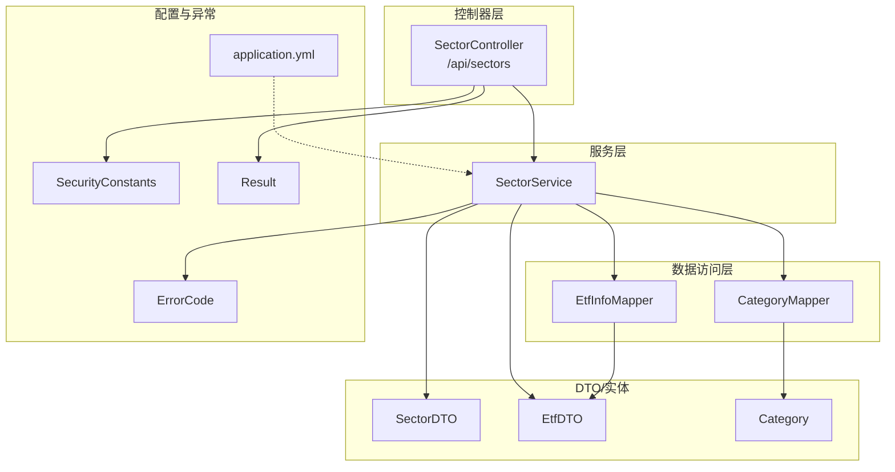
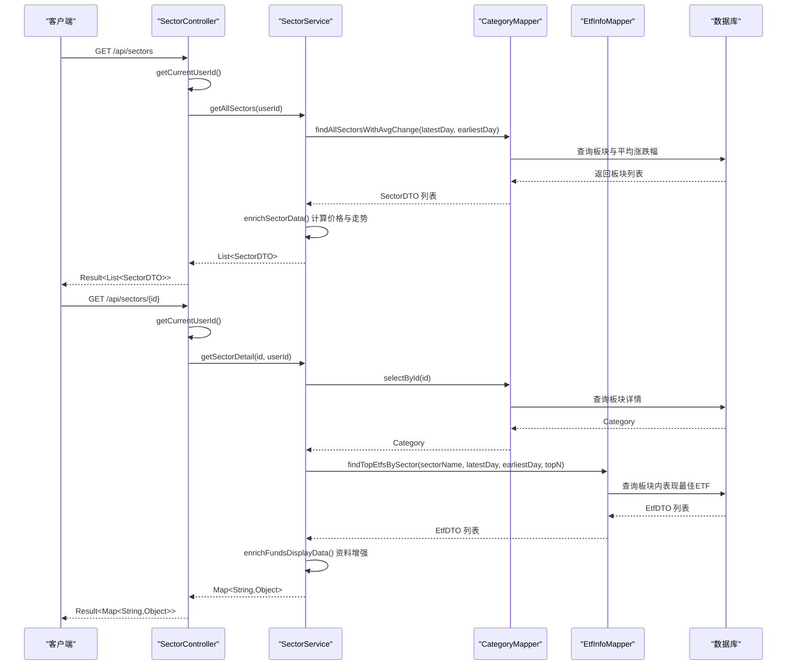
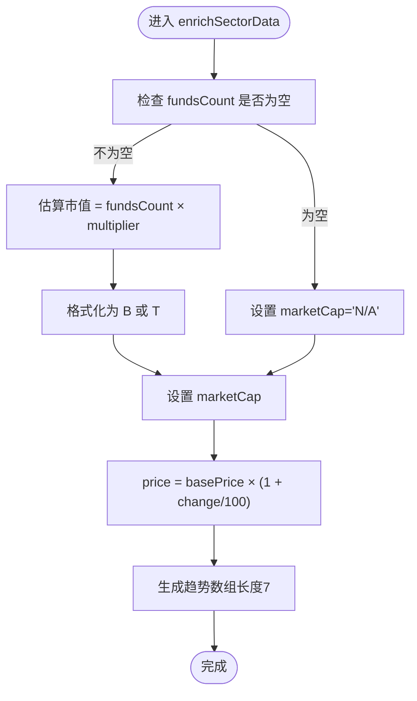
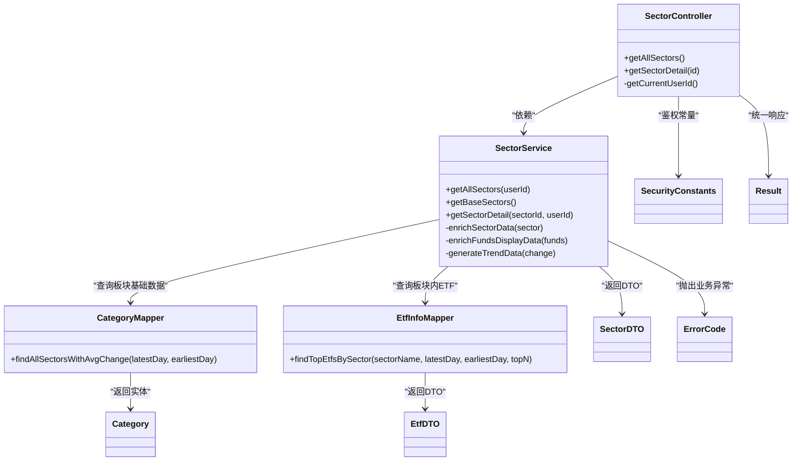

# 板块控制器

<cite>
**本文引用的文件**
- [SectorController.java](file://backend/src/main/java/com/freetrader/controller/SectorController.java)
- [SectorService.java](file://backend/src/main/java/com/freetrader/service/SectorService.java)
- [SectorDTO.java](file://backend/src/main/java/com/freetrader/dto/SectorDTO.java)
- [EtfDTO.java](file://backend/src/main/java/com/freetrader/dto/EtfDTO.java)
- [CategoryMapper.java](file://backend/src/main/java/com/freetrader/mapper/CategoryMapper.java)
- [EtfInfoMapper.java](file://backend/src/main/java/com/freetrader/mapper/EtfInfoMapper.java)
- [Category.java](file://backend/src/main/java/com/freetrader/entity/Category.java)
- [application.yml](file://backend/src/main/resources/application.yml)
- [ErrorCode.java](file://backend/src/main/java/com/freetrader/exception/ErrorCode.java)
- [SecurityConstants.java](file://backend/src/main/java/com/freetrader/util/SecurityConstants.java)
- [Result.java](file://backend/src/main/java/com/freetrader/dto/Result.java)
</cite>

## 目录
1. [简介](#简介)
2. [项目结构](#项目结构)
3. [核心组件](#核心组件)
4. [架构总览](#架构总览)
5. [详细组件分析](#详细组件分析)
6. [依赖关系分析](#依赖关系分析)
7. [性能考虑](#性能考虑)
8. [故障排查指南](#故障排查指南)
9. [结论](#结论)
10. [附录](#附录)

## 简介
本文件为 FreeTrader 板块控制器的技术文档，聚焦于 SectorController 的实现与接口设计，涵盖：
- 板块数据查询与排序、筛选、分页策略
- 板块详情获取与 ETF 基金信息查询
- SectorDTO 与 EtfDTO 的字段定义与业务含义
- 板块数据的计算逻辑（净值变化、涨跌幅、走势等）
- 接口调用示例与数据格式说明

## 项目结构
后端采用 Spring Boot + MyBatis-Plus 架构，板块相关模块位于以下路径：
- 控制器层：controller/SectorController.java
- 服务层：service/SectorService.java
- DTO 层：dto/SectorDTO.java、dto/EtfDTO.java、dto/Result.java
- 数据访问层：mapper/CategoryMapper.java、mapper/EtfInfoMapper.java
- 实体层：entity/Category.java
- 配置：resources/application.yml
- 异常与常量：exception/ErrorCode.java、util/SecurityConstants.java

图表来源
- [SectorController.java](file://backend/src/main/java/com/freetrader/controller/SectorController.java#L22-L62)
- [SectorService.java](file://backend/src/main/java/com/freetrader/service/SectorService.java#L27-L252)
- [CategoryMapper.java](file://backend/src/main/java/com/freetrader/mapper/CategoryMapper.java#L12-L47)
- [EtfInfoMapper.java](file://backend/src/main/java/com/freetrader/mapper/EtfInfoMapper.java#L12-L52)
- [SectorDTO.java](file://backend/src/main/java/com/freetrader/dto/SectorDTO.java#L9-L22)
- [EtfDTO.java](file://backend/src/main/java/com/freetrader/dto/EtfDTO.java#L7-L22)
- [application.yml](file://backend/src/main/resources/application.yml#L67-L76)
- [ErrorCode.java](file://backend/src/main/java/com/freetrader/exception/ErrorCode.java#L8-L31)
- [SecurityConstants.java](file://backend/src/main/java/com/freetrader/util/SecurityConstants.java#L6-L41)
- [Result.java](file://backend/src/main/java/com/freetrader/dto/Result.java#L7-L30)

章节来源
- [SectorController.java](file://backend/src/main/java/com/freetrader/controller/SectorController.java#L1-L63)
- [application.yml](file://backend/src/main/resources/application.yml#L67-L76)

## 核心组件
- SectorController：提供板块列表与详情的 REST 接口，负责鉴权与结果封装。
- SectorService：核心业务逻辑，负责板块数据聚合、计算、缓存与展示增强。
- DTO：SectorDTO（板块聚合数据）、EtfDTO（ETF 基金展示数据）。
- Mapper：CategoryMapper（板块基础数据与平均涨跌幅计算）、EtfInfoMapper（板块内表现最佳 ETF 查询）。
- 配置：应用参数（交易日天数、展示数量、估算市值倍数、基准价等）。

章节来源
- [SectorController.java](file://backend/src/main/java/com/freetrader/controller/SectorController.java#L22-L62)
- [SectorService.java](file://backend/src/main/java/com/freetrader/service/SectorService.java#L27-L252)
- [SectorDTO.java](file://backend/src/main/java/com/freetrader/dto/SectorDTO.java#L9-L22)
- [EtfDTO.java](file://backend/src/main/java/com/freetrader/dto/EtfDTO.java#L7-L22)
- [CategoryMapper.java](file://backend/src/main/java/com/freetrader/mapper/CategoryMapper.java#L12-L47)
- [EtfInfoMapper.java](file://backend/src/main/java/com/freetrader/mapper/EtfInfoMapper.java#L12-L52)
- [application.yml](file://backend/src/main/resources/application.yml#L67-L76)

## 架构总览
板块控制器遵循典型的 MVC 分层架构，结合缓存与数据库查询，实现高性能的数据展示。

图表来源
- [SectorController.java](file://backend/src/main/java/com/freetrader/controller/SectorController.java#L41-L61)
- [SectorService.java](file://backend/src/main/java/com/freetrader/service/SectorService.java#L109-L212)
- [CategoryMapper.java](file://backend/src/main/java/com/freetrader/mapper/CategoryMapper.java#L19-L46)
- [EtfInfoMapper.java](file://backend/src/main/java/com/freetrader/mapper/EtfInfoMapper.java#L18-L51)

## 详细组件分析

### SectorController 接口设计
- 基础路径：/api/sectors
- 认证：基于 Spring Security，从上下文提取当前用户，匿名用户将无法获取收藏状态。
- 返回包装：统一使用 Result<T> 封装响应。

接口一览
- GET /api/sectors
  - 功能：获取所有板块列表，包含平均涨跌幅、最新净值、估算市值、收藏状态、ETF 数量、描述与走势。
  - 参数：无
  - 返回：Result<List<SectorDTO>>
- GET /api/sectors/{id}
  - 功能：获取指定板块的详细信息，包含板块基本信息、收藏状态以及该板块内表现最好的 ETF 列表。
  - 路径参数：id（板块ID）
  - 返回：Result<Map<String,Object>>，其中包含 id、name、description、fundsCount、isFavorite、funds（List<EtfDTO>）

鉴权与收藏状态
- 当前用户通过 SecurityContextHolder 获取，若非匿名用户则查询其收藏的板块集合，并在板块列表中填充 isFavorite 字段；详情页同样根据 userId 判断 isFavorite。

章节来源
- [SectorController.java](file://backend/src/main/java/com/freetrader/controller/SectorController.java#L22-L62)
- [SecurityConstants.java](file://backend/src/main/java/com/freetrader/util/SecurityConstants.java#L6-L41)
- [Result.java](file://backend/src/main/java/com/freetrader/dto/Result.java#L7-L30)

### SectorService 业务逻辑
- 交易日范围计算：根据配置的 trading-days 计算最近 N 个有效交易日区间，若无法获取交易日，则回退到自然日。
- 板块基础数据：通过 CategoryMapper 查询板块列表，并计算平均涨跌幅（按 ETF 净值变化加权）。
- 数据增强：
  - 估算市值：基于 fundsCount × estimated-cap-multiplier，并格式化为 B 或 T 单位。
  - 最新净值：基于 base-price 与平均涨跌幅计算。
  - 走势数据：生成长度为 7 的随机波动序列，用于前端 Sparkline 展示。
- 板块详情：
  - 查询板块基本信息（名称、描述、ETF 数量），并判断收藏状态。
  - 查询板块内表现最佳 ETF 列表（按涨跌幅降序取前 N），并进行展示增强（图标、背景色、收藏状态占位等）。
- 缓存策略：
  - 板块基础数据：@Cacheable("sectors")，键为固定字符串，TLL 取自 Redis 配置。
  - 板块详情：@Cacheable("sectorDetail")，键为板块ID。
  - 用户收藏：缓存用户收藏的板块ID集合，TTL 默认 5 分钟。

配置项
- trading-days：默认 7 天
- top-funds：默认 10 只
- sector.estimated-cap-multiplier：默认 50
- sector.base-price：默认 1000.0

章节来源
- [SectorService.java](file://backend/src/main/java/com/freetrader/service/SectorService.java#L38-L48)
- [SectorService.java](file://backend/src/main/java/com/freetrader/service/SectorService.java#L64-L76)
- [SectorService.java](file://backend/src/main/java/com/freetrader/service/SectorService.java#L109-L141)
- [SectorService.java](file://backend/src/main/java/com/freetrader/service/SectorService.java#L146-L165)
- [SectorService.java](file://backend/src/main/java/com/freetrader/service/SectorService.java#L170-L212)
- [SectorService.java](file://backend/src/main/java/com/freetrader/service/SectorService.java#L217-L234)
- [SectorService.java](file://backend/src/main/java/com/freetrader/service/SectorService.java#L239-L251)
- [application.yml](file://backend/src/main/resources/application.yml#L67-L76)

### DTO 字段定义与业务含义

#### SectorDTO（板块聚合数据）
- id：板块ID
- name：板块名称
- change：平均涨跌幅（百分比）
- price：最新净值（基于 base-price 与 change 计算）
- marketCap：估算市值（格式化字符串，单位为 B 或 T）
- isFavorite：当前用户是否收藏
- fundsCount：ETF 数量
- description：板块描述
- trend：走势数组（长度 7，用于 Sparkline）

章节来源
- [SectorDTO.java](file://backend/src/main/java/com/freetrader/dto/SectorDTO.java#L9-L22)
- [SectorService.java](file://backend/src/main/java/com/freetrader/service/SectorService.java#L146-L165)

#### EtfDTO（ETF 基金展示数据）
- name：代码（ths_code）
- fullName：中文名称（chinese_name）
- price：最新净值（net_asset_value）
- fcfShare：占位字段（预留）
- mktCap：占位字段（市值）
- returns：涨跌额（latest - earliest）
- returnsPercent：涨跌幅（百分比）
- icon：图标字符（取自中文名称首字或代码首字母）
- iconBg：背景色类名（循环使用预设颜色）
- iconColor：文字颜色类名（占位）
- isFavorite：当前用户是否收藏（占位）

章节来源
- [EtfDTO.java](file://backend/src/main/java/com/freetrader/dto/EtfDTO.java#L7-L22)
- [SectorService.java](file://backend/src/main/java/com/freetrader/service/SectorService.java#L217-L234)

### 数据库查询与计算逻辑

#### 板块基础数据查询（CategoryMapper）
- 查询条件：仅统计状态为启用的板块
- 计算逻辑：对每个板块，按 ETF 维度计算净值变化率（latest - earliest）/ earliest × 100，并取平均值
- 排序：按 sort_order 降序

章节来源
- [CategoryMapper.java](file://backend/src/main/java/com/freetrader/mapper/CategoryMapper.java#L19-L46)

#### 板块内最佳 ETF 查询（EtfInfoMapper）
- 查询条件：按 sector 名称过滤
- 计算逻辑：涨跌额与涨跌幅均按 latest 与 earliest 计算
- 排序：按 returnsPercent 降序
- 限制：取前 N（默认 10）

章节来源
- [EtfInfoMapper.java](file://backend/src/main/java/com/freetrader/mapper/EtfInfoMapper.java#L18-L51)

#### 计算流程图（板块数据增强）

图表来源
- [SectorService.java](file://backend/src/main/java/com/freetrader/service/SectorService.java#L146-L165)
- [SectorService.java](file://backend/src/main/java/com/freetrader/service/SectorService.java#L239-L251)

### 接口调用示例与数据格式

- 获取所有板块
  - 请求：GET /api/sectors
  - 成功响应：Result<List<SectorDTO>>
  - 示例字段（节选）：id、name、change、price、marketCap、isFavorite、fundsCount、description、trend

- 获取板块详情
  - 请求：GET /api/sectors/{id}
  - 成功响应：Result<Map<String,Object>>
  - 示例字段（节选）：
    - id、name、description、fundsCount、isFavorite
    - funds：List<EtfDTO>，包含 name、fullName、price、returns、returnsPercent、icon、iconBg、iconColor、isFavorite

- 错误响应
  - 板块不存在：返回错误码 4001，消息“板块不存在”
  - 通用错误：返回错误码 500，消息“系统内部错误”

章节来源
- [SectorController.java](file://backend/src/main/java/com/freetrader/controller/SectorController.java#L41-L61)
- [ErrorCode.java](file://backend/src/main/java/com/freetrader/exception/ErrorCode.java#L28-L30)
- [Result.java](file://backend/src/main/java/com/freetrader/dto/Result.java#L15-L29)

## 依赖关系分析

图表来源
- [SectorController.java](file://backend/src/main/java/com/freetrader/controller/SectorController.java#L22-L62)
- [SectorService.java](file://backend/src/main/java/com/freetrader/service/SectorService.java#L27-L252)
- [CategoryMapper.java](file://backend/src/main/java/com/freetrader/mapper/CategoryMapper.java#L12-L47)
- [EtfInfoMapper.java](file://backend/src/main/java/com/freetrader/mapper/EtfInfoMapper.java#L12-L52)
- [SectorDTO.java](file://backend/src/main/java/com/freetrader/dto/SectorDTO.java#L9-L22)
- [EtfDTO.java](file://backend/src/main/java/com/freetrader/dto/EtfDTO.java#L7-L22)
- [ErrorCode.java](file://backend/src/main/java/com/freetrader/exception/ErrorCode.java#L8-L31)
- [SecurityConstants.java](file://backend/src/main/java/com/freetrader/util/SecurityConstants.java#L6-L41)
- [Result.java](file://backend/src/main/java/com/freetrader/dto/Result.java#L7-L30)

## 性能考虑
- 缓存策略
  - 板块基础数据：@Cacheable("sectors")，键为固定字符串，适合高频读取场景。
  - 板块详情：@Cacheable("sectorDetail")，键为板块ID，避免重复查询。
  - 用户收藏：缓存用户收藏的板块ID集合，TTL 默认 5 分钟，平衡实时性与性能。
- 数据库查询优化
  - 使用 JOIN 与聚合函数一次性计算平均涨跌幅，减少多次往返。
  - 限定返回字段，避免不必要的列传输。
- 前端展示优化
  - 走势数据为固定长度数组，便于前端渲染，且为本地生成，降低数据库压力。

章节来源
- [SectorService.java](file://backend/src/main/java/com/freetrader/service/SectorService.java#L124-L141)
- [SectorService.java](file://backend/src/main/java/com/freetrader/service/SectorService.java#L170-L212)
- [SectorService.java](file://backend/src/main/java/com/freetrader/service/SectorService.java#L81-L104)
- [application.yml](file://backend/src/main/resources/application.yml#L40-L44)

## 故障排查指南
- 板块不存在
  - 现象：调用板块详情接口返回“板块不存在”错误。
  - 原因：数据库中不存在对应ID的板块。
  - 处理：确认板块ID正确，或检查分类表状态与数据完整性。
- 交易日计算异常
  - 现象：板块平均涨跌幅为 0 或异常。
  - 原因：CalendarMapper 无法获取有效交易日，回退到自然日。
  - 处理：检查交易日历表数据与日期格式。
- 收藏状态不更新
  - 现象：isFavorite 字段未随用户收藏变化而更新。
  - 原因：用户收藏缓存未及时失效或未正确写入。
  - 处理：确认 CacheService 的用户收藏缓存逻辑，必要时调整 TTL。
- ETF 展示异常
  - 现象：图标、颜色或收藏状态显示异常。
  - 原因：富化逻辑依赖中文名称首字，若为空则回退到代码首字母。
  - 处理：确保 ETF 中文名称字段有效，或完善富化逻辑。

章节来源
- [SectorService.java](file://backend/src/main/java/com/freetrader/service/SectorService.java#L175-L178)
- [SectorService.java](file://backend/src/main/java/com/freetrader/service/SectorService.java#L64-L76)
- [SectorService.java](file://backend/src/main/java/com/freetrader/service/SectorService.java#L81-L104)
- [SectorService.java](file://backend/src/main/java/com/freetrader/service/SectorService.java#L217-L234)

## 结论
SectorController 通过清晰的分层设计与缓存策略，实现了高效、可扩展的板块数据查询与展示。SectorDTO 与 EtfDTO 的字段设计兼顾了前端渲染需求与业务语义，配合 SectorService 的计算与富化逻辑，提供了完整的板块数据体验。建议在生产环境中合理配置缓存与交易日参数，并持续监控数据库查询性能与缓存命中率。

## 附录

### 查询参数与配置项
- 查询参数
  - 无显式查询参数：板块列表与详情接口均不支持额外查询参数。
- 配置项（application.yml）
  - app.trading-days：默认 7，用于计算平均涨跌幅的交易日窗口
  - app.top-funds：默认 10，板块详情中展示的最佳 ETF 数量
  - app.sector.estimated-cap-multiplier：默认 50，估算市值的倍数
  - app.sector.base-price：默认 1000.0，板块净值计算的基准价

章节来源
- [application.yml](file://backend/src/main/resources/application.yml#L67-L76)