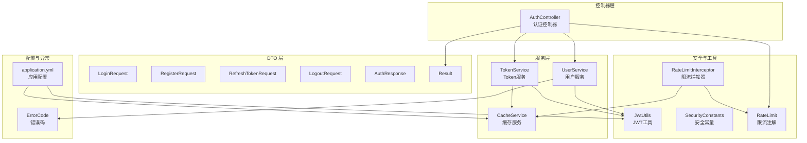
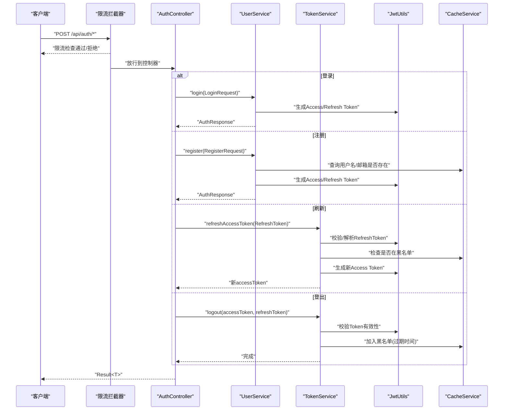
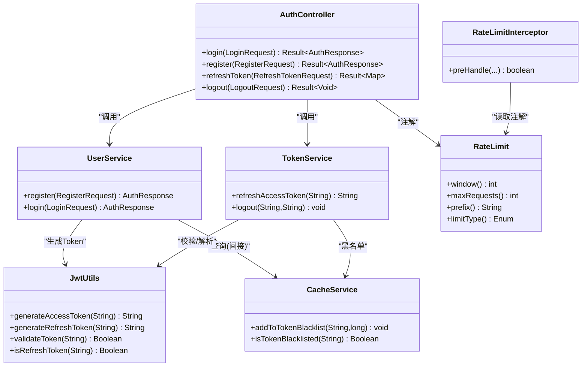

# 认证控制器

<cite>
**本文引用的文件**
- [AuthController.java](file://backend/src/main/java/com/freetrader/controller/AuthController.java)
- [RateLimit.java](file://backend/src/main/java/com/freetrader/annotation/RateLimit.java)
- [RateLimitInterceptor.java](file://backend/src/main/java/com/freetrader/interceptor/RateLimitInterceptor.java)
- [LoginRequest.java](file://backend/src/main/java/com/freetrader/dto/LoginRequest.java)
- [RegisterRequest.java](file://backend/src/main/java/com/freetrader/dto/RegisterRequest.java)
- [RefreshTokenRequest.java](file://backend/src/main/java/com/freetrader/dto/RefreshTokenRequest.java)
- [LogoutRequest.java](file://backend/src/main/java/com/freetrader/dto/LogoutRequest.java)
- [AuthResponse.java](file://backend/src/main/java/com/freetrader/dto/AuthResponse.java)
- [Result.java](file://backend/src/main/java/com/freetrader/dto/Result.java)
- [UserService.java](file://backend/src/main/java/com/freetrader/service/UserService.java)
- [TokenService.java](file://backend/src/main/java/com/freetrader/service/TokenService.java)
- [JwtUtils.java](file://backend/src/main/java/com/freetrader/security/JwtUtils.java)
- [CacheService.java](file://backend/src/main/java/com/freetrader/service/CacheService.java)
- [ErrorCode.java](file://backend/src/main/java/com/freetrader/exception/ErrorCode.java)
- [SecurityConstants.java](file://backend/src/main/java/com/freetrader/util/SecurityConstants.java)
- [application.yml](file://backend/src/main/resources/application.yml)
</cite>

## 目录
1. [简介](#简介)
2. [项目结构](#项目结构)
3. [核心组件](#核心组件)
4. [架构总览](#架构总览)
5. [详细组件分析](#详细组件分析)
6. [依赖关系分析](#依赖关系分析)
7. [性能与限流特性](#性能与限流特性)
8. [故障排查指南](#故障排查指南)
9. [结论](#结论)
10. [附录：API 使用示例与最佳实践](#附录api-使用示例与最佳实践)

## 简介
本文件为 FreeTrader 认证控制器的技术文档，聚焦 AuthController 的实现与设计，覆盖用户登录、注册、Token 刷新、登出等核心接口。文档详细说明各接口的请求参数、响应格式、HTTP 状态码与错误处理机制；解释速率限制注解与拦截器的实现与配置；分析认证流程中的安全要点（密码加密、Token 管理、会话控制）；并提供完整的 API 使用示例与最佳实践。

## 项目结构
认证相关代码主要位于后端模块的 controller、dto、service、security、annotation、interceptor、exception、util、resources 等包中，采用按职责分层组织，便于维护与扩展。

图表来源
- [AuthController.java](file://backend/src/main/java/com/freetrader/controller/AuthController.java#L1-L72)
- [UserService.java](file://backend/src/main/java/com/freetrader/service/UserService.java#L1-L103)
- [TokenService.java](file://backend/src/main/java/com/freetrader/service/TokenService.java#L1-L64)
- [JwtUtils.java](file://backend/src/main/java/com/freetrader/security/JwtUtils.java#L1-L194)
- [CacheService.java](file://backend/src/main/java/com/freetrader/service/CacheService.java#L1-L206)
- [RateLimit.java](file://backend/src/main/java/com/freetrader/annotation/RateLimit.java#L1-L49)
- [RateLimitInterceptor.java](file://backend/src/main/java/com/freetrader/interceptor/RateLimitInterceptor.java#L1-L153)
- [application.yml](file://backend/src/main/resources/application.yml#L1-L102)

章节来源
- [AuthController.java](file://backend/src/main/java/com/freetrader/controller/AuthController.java#L1-L72)
- [application.yml](file://backend/src/main/resources/application.yml#L1-L102)

## 核心组件
- 认证控制器 AuthController：暴露 /api/auth 下的登录、注册、刷新、登出接口，负责参数校验、调用服务层并封装统一响应。
- 用户服务 UserService：实现用户注册与登录逻辑，集成密码编码器与 JWT 工具生成访问与刷新 Token。
- Token 服务 TokenService：负责刷新访问 Token 与登出时将 Token 加入黑名单。
- JWT 工具 JwtUtils：提供 Token 生成、解析、验证、类型判断与过期时间获取。
- 缓存服务 CacheService：基于 Redis 的统一缓存操作，包含 Token 黑名单存储。
- 限流注解与拦截器：RateLimit 注解与 RateLimitInterceptor 实现基于 Redis 的滑动窗口限流。
- 统一结果包装 Result：统一响应结构 code/message/data。
- 错误码 ErrorCode：集中定义业务与认证相关错误码。

章节来源
- [AuthController.java](file://backend/src/main/java/com/freetrader/controller/AuthController.java#L1-L72)
- [UserService.java](file://backend/src/main/java/com/freetrader/service/UserService.java#L1-L103)
- [TokenService.java](file://backend/src/main/java/com/freetrader/service/TokenService.java#L1-L64)
- [JwtUtils.java](file://backend/src/main/java/com/freetrader/security/JwtUtils.java#L1-L194)
- [CacheService.java](file://backend/src/main/java/com/freetrader/service/CacheService.java#L1-L206)
- [RateLimit.java](file://backend/src/main/java/com/freetrader/annotation/RateLimit.java#L1-L49)
- [RateLimitInterceptor.java](file://backend/src/main/java/com/freetrader/interceptor/RateLimitInterceptor.java#L1-L153)
- [Result.java](file://backend/src/main/java/com/freetrader/dto/Result.java#L1-L31)
- [ErrorCode.java](file://backend/src/main/java/com/freetrader/exception/ErrorCode.java#L1-L35)

## 架构总览
认证流程围绕 AuthController 展开，请求经由限流拦截器与控制器，再调用服务层完成业务处理，并通过 JWT 工具与缓存服务完成 Token 生命周期管理。

图表来源
- [AuthController.java](file://backend/src/main/java/com/freetrader/controller/AuthController.java#L28-L70)
- [UserService.java](file://backend/src/main/java/com/freetrader/service/UserService.java#L41-L96)
- [TokenService.java](file://backend/src/main/java/com/freetrader/service/TokenService.java#L18-L55)
- [JwtUtils.java](file://backend/src/main/java/com/freetrader/security/JwtUtils.java#L100-L133)
- [CacheService.java](file://backend/src/main/java/com/freetrader/service/CacheService.java#L89-L101)

## 详细组件分析

### 认证控制器 AuthController
- 路径：/api/auth
- 登录 /api/auth/login
  - 方法：POST
  - 请求体：LoginRequest（用户名、密码）
  - 响应体：Result<AuthResponse>
  - 状态码：200 成功；401 失败
  - 限流：@RateLimit(window=60, maxRequests=5, prefix="login", limitType=IP)
- 注册 /api/auth/register
  - 方法：POST
  - 请求体：RegisterRequest（用户名、邮箱、密码）
  - 响应体：Result<AuthResponse>
  - 状态码：200 成功；400 参数/业务错误
  - 限流：@RateLimit(window=60, maxRequests=3, prefix="register", limitType=IP)
- 刷新 /api/auth/refresh
  - 方法：POST
  - 请求体：RefreshTokenRequest（refreshToken）
  - 响应体：Result<Map<String,String>>（包含 accessToken）
  - 状态码：200 成功；401 失败
- 登出 /api/auth/logout
  - 方法：POST
  - 请求体：LogoutRequest（accessToken 可选、refreshToken 可选）
  - 响应体：Result<Void>
  - 状态码：200 成功

章节来源
- [AuthController.java](file://backend/src/main/java/com/freetrader/controller/AuthController.java#L28-L70)
- [LoginRequest.java](file://backend/src/main/java/com/freetrader/dto/LoginRequest.java#L1-L15)
- [RegisterRequest.java](file://backend/src/main/java/com/freetrader/dto/RegisterRequest.java#L1-L23)
- [RefreshTokenRequest.java](file://backend/src/main/java/com/freetrader/dto/RefreshTokenRequest.java#L1-L11)
- [LogoutRequest.java](file://backend/src/main/java/com/freetrader/dto/LogoutRequest.java#L1-L10)
- [AuthResponse.java](file://backend/src/main/java/com/freetrader/dto/AuthResponse.java#L1-L19)
- [Result.java](file://backend/src/main/java/com/freetrader/dto/Result.java#L1-L31)

### 用户服务 UserService
- 用户名加载：实现 UserDetailsService，按用户名查询未软删用户并构建 UserDetailsImpl。
- 注册流程：
  - 校验用户名与邮箱唯一性
  - 密码编码后入库
  - 生成 Access/Refresh Token 并封装 AuthResponse
- 登录流程：
  - 查询用户并校验密码
  - 生成 Access/Refresh Token 并封装 AuthResponse
- 异常：用户名或邮箱已存在、密码错误等业务异常

章节来源
- [UserService.java](file://backend/src/main/java/com/freetrader/service/UserService.java#L31-L96)
- [ErrorCode.java](file://backend/src/main/java/com/freetrader/exception/ErrorCode.java#L21-L30)

### Token 服务 TokenService
- 刷新访问 Token：
  - 校验 Refresh Token 有效性与类型
  - 检查是否在黑名单
  - 生成新的 Access Token
- 登出：
  - 对有效且传入的 Access/Refresh Token 分别加入黑名单（以过期时间为 TTL）
- 有效性检查：结合 JWT 校验与黑名单检查

章节来源
- [TokenService.java](file://backend/src/main/java/com/freetrader/service/TokenService.java#L18-L55)
- [JwtUtils.java](file://backend/src/main/java/com/freetrader/security/JwtUtils.java#L146-L178)
- [CacheService.java](file://backend/src/main/java/com/freetrader/service/CacheService.java#L89-L101)

### JWT 工具 JwtUtils
- 生成 Access/Refresh Token：携带类型声明，设置签发时间与过期时间
- 解析与验证：提取用户名、过期时间、Token 类型；校验签名与过期
- 过期时间：分别从配置读取 Access/Refresh 过期时间

章节来源
- [JwtUtils.java](file://backend/src/main/java/com/freetrader/security/JwtUtils.java#L100-L133)
- [JwtUtils.java](file://backend/src/main/java/com/freetrader/security/JwtUtils.java#L146-L178)
- [application.yml](file://backend/src/main/resources/application.yml#L60-L66)

### 限流注解与拦截器
- 注解 RateLimit：
  - window：时间窗口（秒）
  - maxRequests：窗口内最大请求数
  - prefix：限流 key 前缀
  - limitType：限流类型（IP/USER/GLOBAL）
- 拦截器 RateLimitInterceptor：
  - 基于 Redis 实现滑动窗口计数器
  - 支持按 IP、登录用户名、全局三种维度限流
  - Redis 异常时放行，避免影响正常服务
  - 触发限流返回 429 与统一错误响应

章节来源
- [RateLimit.java](file://backend/src/main/java/com/freetrader/annotation/RateLimit.java#L1-L49)
- [RateLimitInterceptor.java](file://backend/src/main/java/com/freetrader/interceptor/RateLimitInterceptor.java#L35-L114)

### 统一响应与错误码
- Result<T>：统一返回结构 code/message/data，提供 success/error 工厂方法
- ErrorCode：集中定义认证与业务错误码，便于前端与日志识别

章节来源
- [Result.java](file://backend/src/main/java/com/freetrader/dto/Result.java#L1-L31)
- [ErrorCode.java](file://backend/src/main/java/com/freetrader/exception/ErrorCode.java#L1-L35)

## 依赖关系分析
- 控制器依赖服务层与限流注解；服务层依赖 JWT 工具与缓存服务；拦截器依赖 RedisTemplate 与 ObjectMapper。
- 认证流程中，控制器仅负责编排与封装，核心逻辑在服务层与安全工具中实现，保持高内聚低耦合。

图表来源
- [AuthController.java](file://backend/src/main/java/com/freetrader/controller/AuthController.java#L23-L70)
- [UserService.java](file://backend/src/main/java/com/freetrader/service/UserService.java#L25-L96)
- [TokenService.java](file://backend/src/main/java/com/freetrader/service/TokenService.java#L13-L55)
- [JwtUtils.java](file://backend/src/main/java/com/freetrader/security/JwtUtils.java#L23-L194)
- [CacheService.java](file://backend/src/main/java/com/freetrader/service/CacheService.java#L25-L101)
- [RateLimit.java](file://backend/src/main/java/com/freetrader/annotation/RateLimit.java#L12-L47)
- [RateLimitInterceptor.java](file://backend/src/main/java/com/freetrader/interceptor/RateLimitInterceptor.java#L27-L62)

## 性能与限流特性
- 限流策略：滑动窗口计数器，基于 Redis 的原子自增与过期时间控制，具备良好的抗突发能力。
- 限流维度：支持按 IP、按登录用户、全局限流，满足不同场景需求。
- Redis 异常降级：当 Redis 异常时拦截器放行，保证系统可用性。
- Token 黑名单：登出与刷新失败均写入黑名单，结合过期时间实现短期与长期控制。

章节来源
- [RateLimitInterceptor.java](file://backend/src/main/java/com/freetrader/interceptor/RateLimitInterceptor.java#L96-L114)
- [CacheService.java](file://backend/src/main/java/com/freetrader/service/CacheService.java#L89-L101)
- [TokenService.java](file://backend/src/main/java/com/freetrader/service/TokenService.java#L41-L55)

## 故障排查指南
- 登录失败（401）：检查用户名/密码是否正确；确认密码编码器配置与数据库存储一致。
- 注册失败（400）：检查用户名/邮箱唯一性；确认请求体字段符合校验规则。
- 刷新失败（401）：确认传入的是 Refresh Token；检查 Token 是否过期或已在黑名单。
- 限流触发（429）：查看限流配置与维度；确认是否命中 IP 或用户维度；检查 Redis 连接状态。
- Token 校验失败：确认密钥配置与签名算法；检查过期时间与类型声明。

章节来源
- [ErrorCode.java](file://backend/src/main/java/com/freetrader/exception/ErrorCode.java#L14-L30)
- [RateLimitInterceptor.java](file://backend/src/main/java/com/freetrader/interceptor/RateLimitInterceptor.java#L35-L62)
- [JwtUtils.java](file://backend/src/main/java/com/freetrader/security/JwtUtils.java#L146-L178)

## 结论
AuthController 通过清晰的接口划分与统一的响应封装，配合 UserService、TokenService、JwtUtils 与 CacheService，实现了完整的认证与会话生命周期管理。结合 RateLimit 注解与拦截器，系统具备良好的安全边界与可运维性。生产部署需重点关注密钥安全、Redis 可用性与限流策略的合理配置。

## 附录：API 使用示例与最佳实践

### API 接口清单
- 登录
  - 方法：POST
  - 路径：/api/auth/login
  - 请求体：LoginRequest（username, password）
  - 响应：Result<AuthResponse>（accessToken, refreshToken, userId, username, email）
  - 状态码：200/401
- 注册
  - 方法：POST
  - 路径：/api/auth/register
  - 请求体：RegisterRequest（username, email, password）
  - 响应：Result<AuthResponse>
  - 状态码：200/400
- 刷新
  - 方法：POST
  - 路径：/api/auth/refresh
  - 请求体：RefreshTokenRequest（refreshToken）
  - 响应：Result<{ "accessToken": "..." }>
  - 状态码：200/401
- 登出
  - 方法：POST
  - 路径：/api/auth/logout
  - 请求体：LogoutRequest（accessToken 可选, refreshToken 可选）
  - 响应：Result<Void>
  - 状态码：200

最佳实践
- 客户端应始终使用 HTTPS，确保 Token 传输安全。
- 登录成功后，客户端应妥善保存 Refresh Token，并在本地安全存储 Access Token。
- 登出时应同时提交 Access/Refresh Token，以便服务端将其加入黑名单。
- 前端应在刷新 Token 失败时提示用户重新登录。
- 限流配置应根据业务流量与安全策略动态调整，避免误伤正常用户。

章节来源
- [AuthController.java](file://backend/src/main/java/com/freetrader/controller/AuthController.java#L28-L70)
- [LoginRequest.java](file://backend/src/main/java/com/freetrader/dto/LoginRequest.java#L1-L15)
- [RegisterRequest.java](file://backend/src/main/java/com/freetrader/dto/RegisterRequest.java#L1-L23)
- [RefreshTokenRequest.java](file://backend/src/main/java/com/freetrader/dto/RefreshTokenRequest.java#L1-L11)
- [LogoutRequest.java](file://backend/src/main/java/com/freetrader/dto/LogoutRequest.java#L1-L10)
- [AuthResponse.java](file://backend/src/main/java/com/freetrader/dto/AuthResponse.java#L1-L19)
- [Result.java](file://backend/src/main/java/com/freetrader/dto/Result.java#L1-L31)