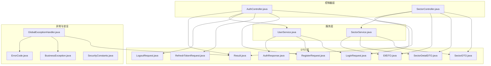
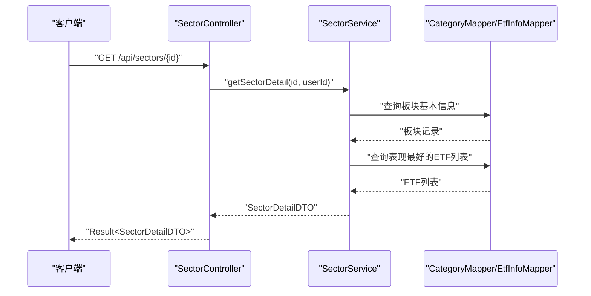
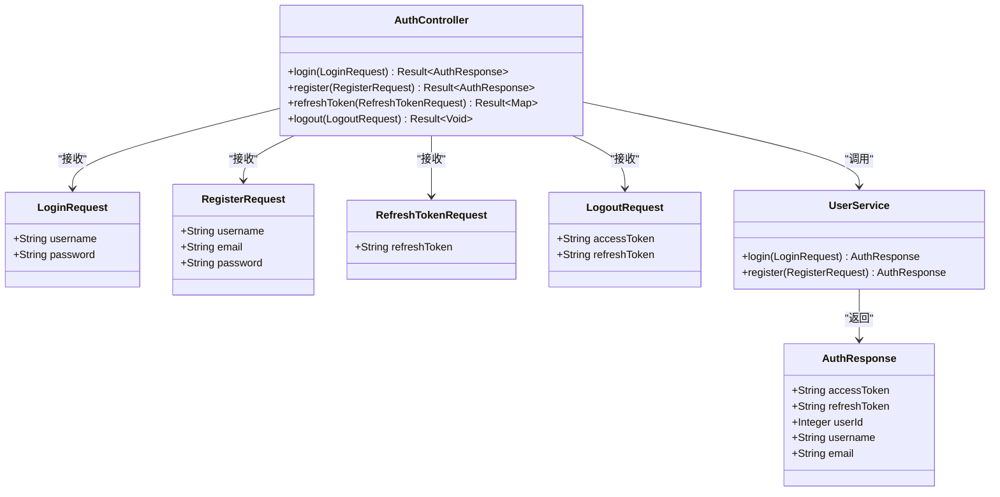
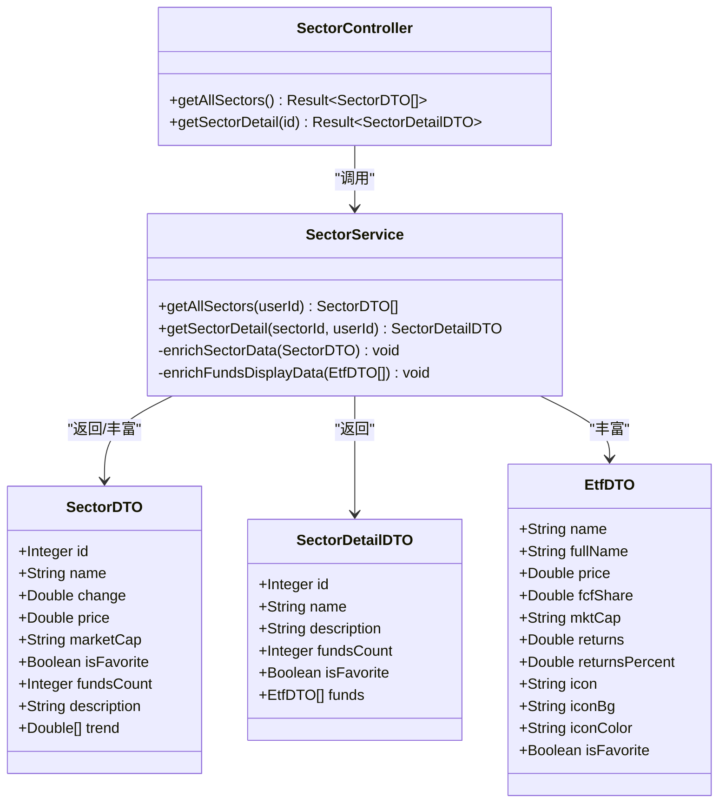
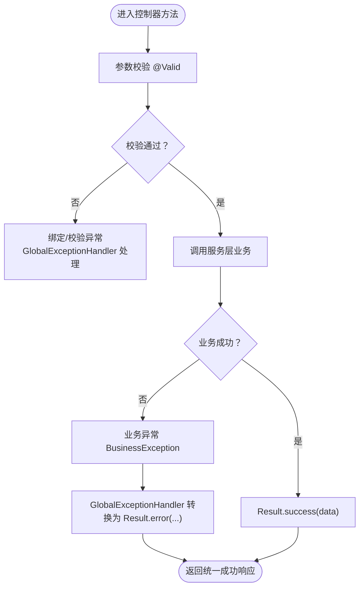
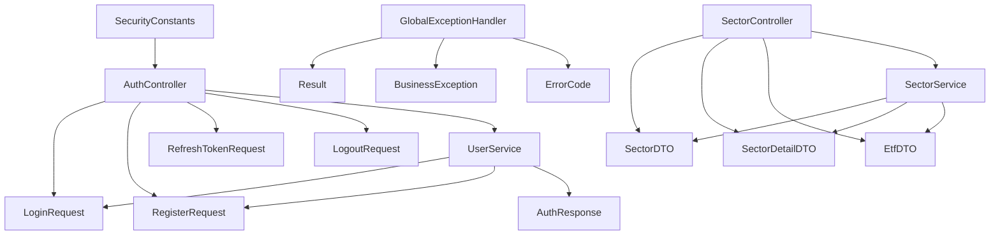

# 数据传输对象与验证

<cite>
**本文引用的文件**
- [LoginRequest.java](file://backend/src/main/java/com/freetrader/dto/LoginRequest.java)
- [RegisterRequest.java](file://backend/src/main/java/com/freetrader/dto/RegisterRequest.java)
- [AuthResponse.java](file://backend/src/main/java/com/freetrader/dto/AuthResponse.java)
- [SectorDTO.java](file://backend/src/main/java/com/freetrader/dto/SectorDTO.java)
- [SectorDetailDTO.java](file://backend/src/main/java/com/freetrader/dto/SectorDetailDTO.java)
- [EtfDTO.java](file://backend/src/main/java/com/freetrader/dto/EtfDTO.java)
- [Result.java](file://backend/src/main/java/com/freetrader/dto/Result.java)
- [LogoutRequest.java](file://backend/src/main/java/com/freetrader/dto/LogoutRequest.java)
- [RefreshTokenRequest.java](file://backend/src/main/java/com/freetrader/dto/RefreshTokenRequest.java)
- [AuthController.java](file://backend/src/main/java/com/freetrader/controller/AuthController.java)
- [SectorController.java](file://backend/src/main/java/com/freetrader/controller/SectorController.java)
- [UserService.java](file://backend/src/main/java/com/freetrader/service/UserService.java)
- [SectorService.java](file://backend/src/main/java/com/freetrader/service/SectorService.java)
- [GlobalExceptionHandler.java](file://backend/src/main/java/com/freetrader/exception/GlobalExceptionHandler.java)
- [BusinessException.java](file://backend/src/main/java/com/freetrader/exception/BusinessException.java)
- [ErrorCode.java](file://backend/src/main/java/com/freetrader/exception/ErrorCode.java)
- [SecurityConstants.java](file://backend/src/main/java/com/freetrader/util/SecurityConstants.java)
</cite>

## 更新摘要
**变更内容**
- 新增 SectorDetailDTO 类替代 Map 结构，提供类型安全的数据传输对象
- 更新板块详情 API 接口，使用新的 SectorDetailDTO 替代 Map<String, Object>
- 改善 API 契约清晰度，增强代码可读性和维护性
- SectorController 和 SectorService 中相应更新以支持新的 DTO 结构

## 目录
1. [简介](#简介)
2. [项目结构](#项目结构)
3. [核心组件](#核心组件)
4. [架构总览](#架构总览)
5. [详细组件分析](#详细组件分析)
6. [依赖关系分析](#依赖关系分析)
7. [性能考量](#性能考量)
8. [故障排查指南](#故障排查指南)
9. [结论](#结论)
10. [附录](#附录)

## 简介
本文件聚焦 FreeTrader 后端的数据传输对象（DTO）与验证体系，系统性阐述以下内容：
- DTO 模式的设计目的与使用场景
- 认证相关 DTO：登录请求、注册请求、认证响应的字段与验证规则
- 板块与 ETF 相关 DTO 的设计思路与用途
- 统一结果包装 Result 的实现与使用方式
- 数据验证最佳实践：Bean Validation 注解与全局异常处理
- 请求/响应示例与错误处理机制

## 项目结构
后端采用分层架构，DTO 放置于 dto 包中，控制器位于 controller 包，业务逻辑位于 service 包，异常处理位于 exception 包，安全常量位于 util 包。

**图表来源**
- [AuthController.java](file://backend/src/main/java/com/freetrader/controller/AuthController.java#L1-L72)
- [SectorController.java](file://backend/src/main/java/com/freetrader/controller/SectorController.java#L1-L60)
- [UserService.java](file://backend/src/main/java/com/freetrader/service/UserService.java#L1-L103)
- [SectorService.java](file://backend/src/main/java/com/freetrader/service/SectorService.java#L1-L212)
- [GlobalExceptionHandler.java](file://backend/src/main/java/com/freetrader/exception/GlobalExceptionHandler.java#L1-L87)

**章节来源**
- [AuthController.java](file://backend/src/main/java/com/freetrader/controller/AuthController.java#L1-L72)
- [SectorController.java](file://backend/src/main/java/com/freetrader/controller/SectorController.java#L1-L60)

## 核心组件
本节对关键 DTO 与通用结果包装进行深入解析。

- 登录请求 DTO（LoginRequest）
  - 字段：用户名、密码
  - 验证：均需非空
  - 用途：接收登录请求体，配合认证服务完成登录流程

- 注册请求 DTO（RegisterRequest）
  - 字段：用户名、邮箱、密码
  - 验证：用户名长度限制、邮箱格式、密码长度限制；均需非空
  - 用途：接收注册请求体，配合用户服务完成注册与登录

- 认证响应 DTO（AuthResponse）
  - 字段：访问令牌、刷新令牌、用户标识、用户名、邮箱
  - 用途：统一返回认证结果，供前端存储与后续鉴权使用

- 板块数据传输对象（SectorDTO）
  - 字段：板块标识、名称、平均涨跌幅、最新净值、估算市值、是否收藏、基金数量、描述、历史走势
  - 用途：承载板块聚合数据，支持前端展示与收藏状态

- **新增** 板块详情数据传输对象（SectorDetailDTO）
  - 字段：板块标识、名称、描述、基金数量、是否收藏、表现最好的ETF列表
  - 用途：承载板块详细信息，替代 Map 结构提供类型安全的数据传输

- ETF 数据传输对象（EtfDTO）
  - 字段：名称（同义代码）、中文名称、净值、现金流指标占位、市值占位、涨跌额、涨跌幅、图标字符、背景色、文字色、是否收藏
  - 用途：承载 ETF 展示数据，支持前端卡片与图标渲染

- 统一结果包装（Result）
  - 字段：状态码、消息、数据
  - 方法：success(data)、success()、error(message)、error(code, message)
  - 用途：统一 API 响应格式，简化控制器返回

**章节来源**
- [LoginRequest.java](file://backend/src/main/java/com/freetrader/dto/LoginRequest.java#L1-L15)
- [RegisterRequest.java](file://backend/src/main/java/com/freetrader/dto/RegisterRequest.java#L1-L23)
- [AuthResponse.java](file://backend/src/main/java/com/freetrader/dto/AuthResponse.java#L1-L19)
- [SectorDTO.java](file://backend/src/main/java/com/freetrader/dto/SectorDTO.java#L1-L22)
- [SectorDetailDTO.java](file://backend/src/main/java/com/freetrader/dto/SectorDetailDTO.java#L1-L38)
- [EtfDTO.java](file://backend/src/main/java/com/freetrader/dto/EtfDTO.java#L1-L23)
- [Result.java](file://backend/src/main/java/com/freetrader/dto/Result.java#L1-L31)

## 架构总览
FreeTrader 的数据流以 DTO 为中心，控制器负责接收请求并调用服务层，服务层执行业务逻辑并返回 DTO，最终由控制器封装为统一的 Result 响应。异常处理通过全局异常处理器拦截各类异常并转换为统一错误响应。

**图表来源**
- [SectorController.java](file://backend/src/main/java/com/freetrader/controller/SectorController.java#L52-L58)
- [SectorService.java](file://backend/src/main/java/com/freetrader/service/SectorService.java#L152-L190)

## 详细组件分析

### 认证相关 DTO 与控制器交互
- LoginRequest 与 RegisterRequest 通过控制器方法参数上的 @Valid 进行 Bean Validation 校验
- AuthController 将校验后的请求交给 UserService 执行业务逻辑，并以 Result.success() 返回统一格式
- RefreshTokenRequest 仅包含刷新令牌字段，要求非空
- LogoutRequest 包含访问令牌与刷新令牌，用于登出时将令牌加入黑名单

**图表来源**
- [AuthController.java](file://backend/src/main/java/com/freetrader/controller/AuthController.java#L35-L70)
- [UserService.java](file://backend/src/main/java/com/freetrader/service/UserService.java#L41-L96)
- [LoginRequest.java](file://backend/src/main/java/com/freetrader/dto/LoginRequest.java#L1-L15)
- [RegisterRequest.java](file://backend/src/main/java/com/freetrader/dto/RegisterRequest.java#L1-L23)
- [RefreshTokenRequest.java](file://backend/src/main/java/com/freetrader/dto/RefreshTokenRequest.java#L1-L11)
- [LogoutRequest.java](file://backend/src/main/java/com/freetrader/dto/LogoutRequest.java#L1-L10)
- [AuthResponse.java](file://backend/src/main/java/com/freetrader/dto/AuthResponse.java#L1-L19)

**章节来源**
- [AuthController.java](file://backend/src/main/java/com/freetrader/controller/AuthController.java#L28-L70)
- [UserService.java](file://backend/src/main/java/com/freetrader/service/UserService.java#L41-L96)

### 板块与 ETF DTO 设计
- SectorDTO 聚合板块统计信息，包含平均涨跌幅、最新净值、估算市值、是否收藏、基金数量、描述与历史走势
- **新增** SectorDetailDTO 聚合板块详细信息，包含板块标识、名称、描述、基金数量、是否收藏以及表现最好的ETF列表，替代之前的 Map 结构
- EtfDTO 聚合 ETF 展示信息，包含名称、中文名、净值、涨跌幅、图标与颜色配置、是否收藏
- SectorService 在获取板块详情时，会返回 SectorDetailDTO 对象，其中包含丰富的 ETF 展示数据列表
- SectorService 在获取板块列表时计算估算市值与走势

**图表来源**
- [SectorDTO.java](file://backend/src/main/java/com/freetrader/dto/SectorDTO.java#L1-L22)
- [SectorDetailDTO.java](file://backend/src/main/java/com/freetrader/dto/SectorDetailDTO.java#L1-L38)
- [EtfDTO.java](file://backend/src/main/java/com/freetrader/dto/EtfDTO.java#L1-L23)
- [SectorController.java](file://backend/src/main/java/com/freetrader/controller/SectorController.java#L41-L58)
- [SectorService.java](file://backend/src/main/java/com/freetrader/service/SectorService.java#L91-L190)

**章节来源**
- [SectorDTO.java](file://backend/src/main/java/com/freetrader/dto/SectorDTO.java#L1-L22)
- [SectorDetailDTO.java](file://backend/src/main/java/com/freetrader/dto/SectorDetailDTO.java#L1-L38)
- [EtfDTO.java](file://backend/src/main/java/com/freetrader/dto/EtfDTO.java#L1-L23)
- [SectorController.java](file://backend/src/main/java/com/freetrader/controller/SectorController.java#L41-L58)
- [SectorService.java](file://backend/src/main/java/com/freetrader/service/SectorService.java#L91-L190)

### 统一结果包装 Result
- Result<T> 提供静态工厂方法，统一构造成功与错误响应
- 控制器通过 Result.success()/Result.error() 返回标准结构
- 全局异常处理器将各类异常转换为统一错误响应

**图表来源**
- [Result.java](file://backend/src/main/java/com/freetrader/dto/Result.java#L15-L29)
- [GlobalExceptionHandler.java](file://backend/src/main/java/com/freetrader/exception/GlobalExceptionHandler.java#L26-L85)

**章节来源**
- [Result.java](file://backend/src/main/java/com/freetrader/dto/Result.java#L1-L31)
- [GlobalExceptionHandler.java](file://backend/src/main/java/com/freetrader/exception/GlobalExceptionHandler.java#L1-L87)

## 依赖关系分析
- 控制器依赖 DTO 与服务层；服务层依赖实体与 Mapper、工具类（如 JwtUtils）
- 全局异常处理器依赖 Result、ErrorCode 与各类运行时异常类型
- 安全常量用于统一鉴权头与令牌前缀

**图表来源**
- [AuthController.java](file://backend/src/main/java/com/freetrader/controller/AuthController.java#L1-L72)
- [SectorController.java](file://backend/src/main/java/com/freetrader/controller/SectorController.java#L1-L60)
- [UserService.java](file://backend/src/main/java/com/freetrader/service/UserService.java#L1-L103)
- [SectorService.java](file://backend/src/main/java/com/freetrader/service/SectorService.java#L1-L212)
- [GlobalExceptionHandler.java](file://backend/src/main/java/com/freetrader/exception/GlobalExceptionHandler.java#L1-L87)
- [SecurityConstants.java](file://backend/src/main/java/com/freetrader/util/SecurityConstants.java#L1-L42)

**章节来源**
- [AuthController.java](file://backend/src/main/java/com/freetrader/controller/AuthController.java#L1-L72)
- [SectorController.java](file://backend/src/main/java/com/freetrader/controller/SectorController.java#L1-L60)
- [UserService.java](file://backend/src/main/java/com/freetrader/service/UserService.java#L1-L103)
- [SectorService.java](file://backend/src/main/java/com/freetrader/service/SectorService.java#L1-L212)
- [GlobalExceptionHandler.java](file://backend/src/main/java/com/freetrader/exception/GlobalExceptionHandler.java#L1-L87)
- [SecurityConstants.java](file://backend/src/main/java/com/freetrader/util/SecurityConstants.java#L1-L42)

## 性能考量
- SectorService 对板块基础数据与板块详情使用缓存注解，减少数据库访问与重复计算
- 用户收藏集合读取先走缓存，缓存未命中再查询数据库并写回缓存
- 生成走势数据采用随机扰动与固定步长，保证前端图表稳定性

**章节来源**
- [SectorService.java](file://backend/src/main/java/com/freetrader/service/SectorService.java#L74-L86)
- [SectorService.java](file://backend/src/main/java/com/freetrader/service/SectorService.java#L106-L123)
- [SectorService.java](file://backend/src/main/java/com/freetrader/service/SectorService.java#L152-L190)

## 故障排查指南
- 参数校验失败：当请求体不符合 Bean Validation 规则时，全局异常处理器捕获并返回统一错误响应
- 认证失败：凭证错误或认证异常会被映射为未授权错误
- 业务异常：业务层抛出 BusinessException，携带预定义错误码与消息
- 通用异常：未覆盖的异常将返回内部错误

建议排查步骤：
- 检查请求体是否符合 DTO 字段与验证注解要求
- 确认令牌格式与类型（访问令牌/刷新令牌）
- 查看控制器与服务层日志定位具体异常位置
- 使用统一错误响应中的状态码与消息快速定位问题

**章节来源**
- [GlobalExceptionHandler.java](file://backend/src/main/java/com/freetrader/exception/GlobalExceptionHandler.java#L26-L85)
- [BusinessException.java](file://backend/src/main/java/com/freetrader/exception/BusinessException.java#L1-L30)
- [ErrorCode.java](file://backend/src/main/java/com/freetrader/exception/ErrorCode.java#L1-L35)

## 结论
本项目通过清晰的 DTO 分层、严格的 Bean Validation 校验与统一的 Result 响应包装，实现了前后端一致的契约与良好的可维护性。结合全局异常处理与缓存策略，整体具备较好的扩展性与性能表现。新增的 SectorDetailDTO 类进一步提升了 API 的类型安全性与契约清晰度，改善了代码的可读性和维护性。

## 附录

### DTO 字段与验证规则摘要
- LoginRequest
  - username：非空
  - password：非空
- RegisterRequest
  - username：非空，长度 3-50
  - email：非空，邮箱格式
  - password：非空，长度 6-100
- RefreshTokenRequest
  - refreshToken：非空
- LogoutRequest
  - accessToken：可选
  - refreshToken：可选

**章节来源**
- [LoginRequest.java](file://backend/src/main/java/com/freetrader/dto/LoginRequest.java#L9-L13)
- [RegisterRequest.java](file://backend/src/main/java/com/freetrader/dto/RegisterRequest.java#L11-L21)
- [RefreshTokenRequest.java](file://backend/src/main/java/com/freetrader/dto/RefreshTokenRequest.java#L8-L9)
- [LogoutRequest.java](file://backend/src/main/java/com/freetrader/dto/LogoutRequest.java#L7-L8)

### 请求/响应示例（路径参考）
- 登录
  - 请求：POST /api/auth/login
  - 请求体：LoginRequest
  - 成功响应：Result<AuthResponse>
  - 参考路径：[AuthController.login](file://backend/src/main/java/com/freetrader/controller/AuthController.java#L35-L39)
- 注册
  - 请求：POST /api/auth/register
  - 请求体：RegisterRequest
  - 成功响应：Result<AuthResponse>
  - 参考路径：[AuthController.register](file://backend/src/main/java/com/freetrader/controller/AuthController.java#L47-L51)
- 刷新令牌
  - 请求：POST /api/auth/refresh
  - 请求体：RefreshTokenRequest
  - 成功响应：Result<Map<String,String>>
  - 参考路径：[AuthController.refreshToken](file://backend/src/main/java/com/freetrader/controller/AuthController.java#L58-L62)
- 登出
  - 请求：POST /api/auth/logout
  - 请求体：LogoutRequest
  - 成功响应：Result<Void>
  - 参考路径：[AuthController.logout](file://backend/src/main/java/com/freetrader/controller/AuthController.java#L66-L70)
- 获取板块列表
  - 请求：GET /api/sectors
  - 成功响应：Result<List<SectorDTO>>
  - 参考路径：[SectorController.getAllSectors](file://backend/src/main/java/com/freetrader/controller/SectorController.java#L41-L45)
- **更新** 获取板块详情
  - 请求：GET /api/sectors/{id}
  - 成功响应：Result<SectorDetailDTO>
  - 响应数据结构：包含板块基本信息和表现最好的ETF列表
  - 参考路径：[SectorController.getSectorDetail](file://backend/src/main/java/com/freetrader/controller/SectorController.java#L52-L58)

**章节来源**
- [SectorController.java](file://backend/src/main/java/com/freetrader/controller/SectorController.java#L41-L58)
- [SectorService.java](file://backend/src/main/java/com/freetrader/service/SectorService.java#L152-L190)