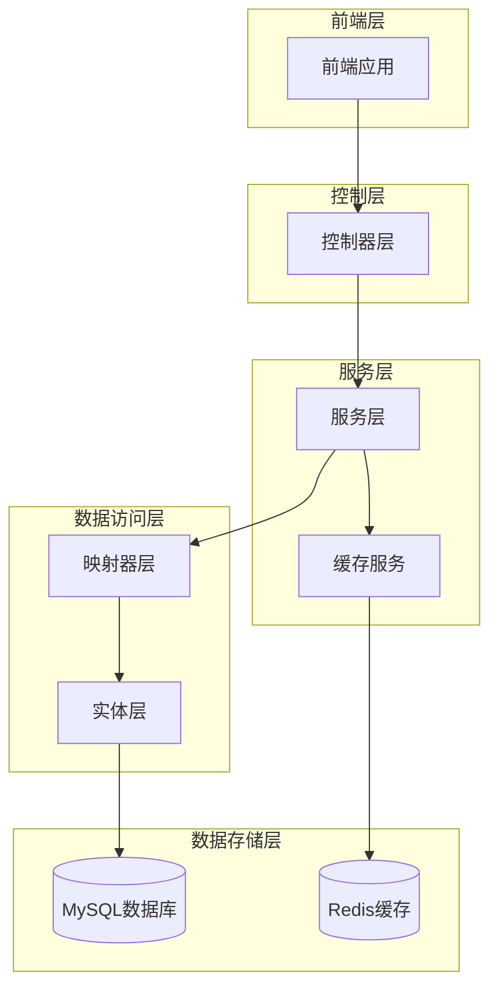
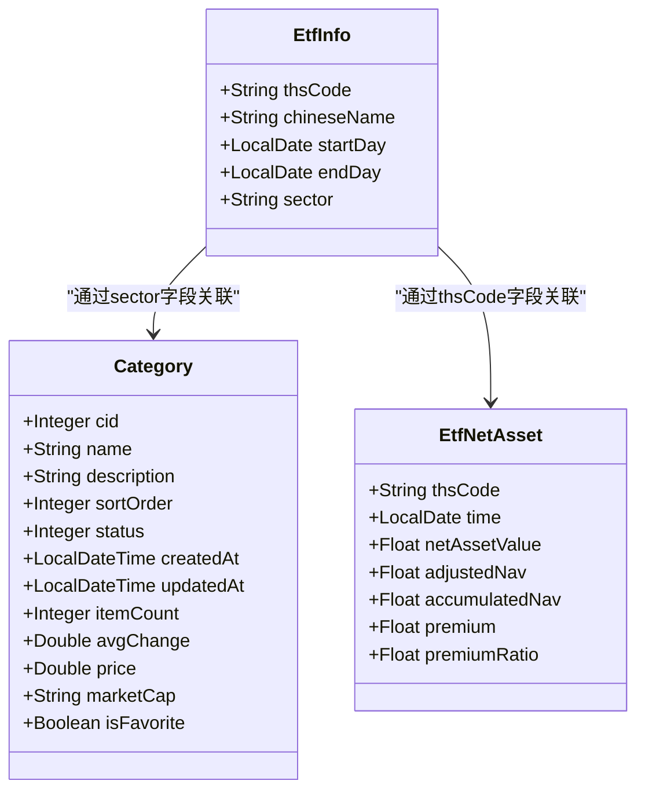
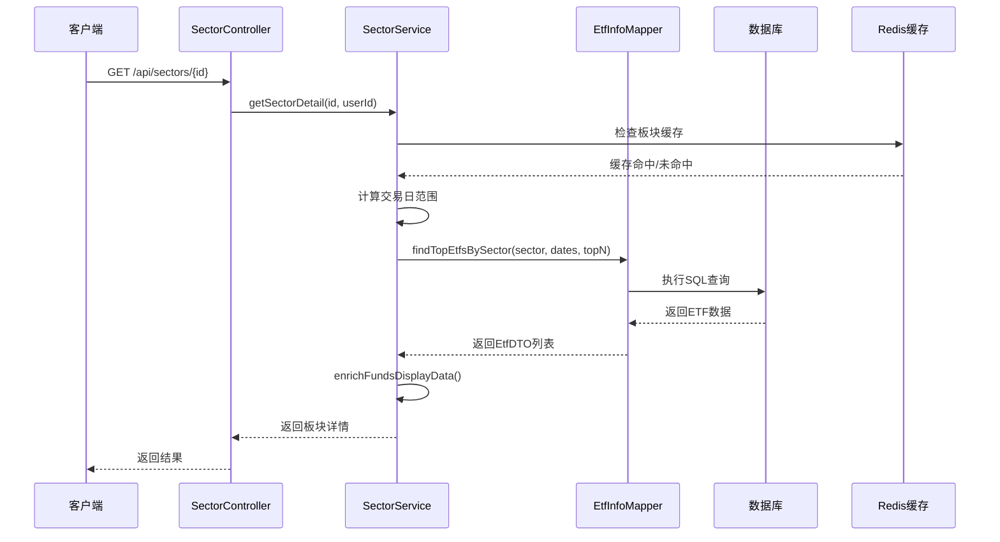
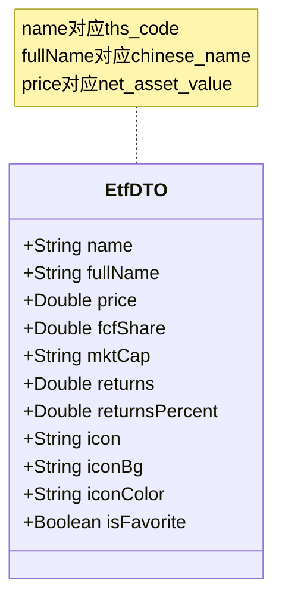
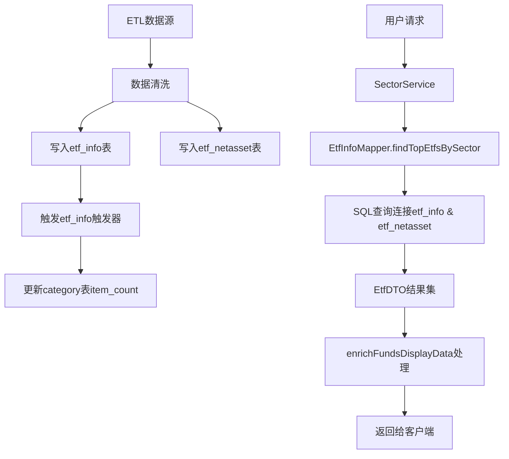
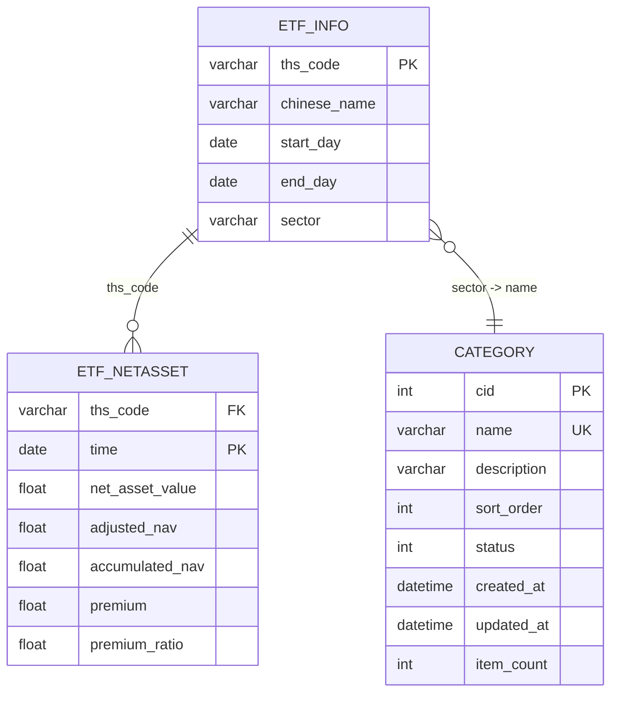
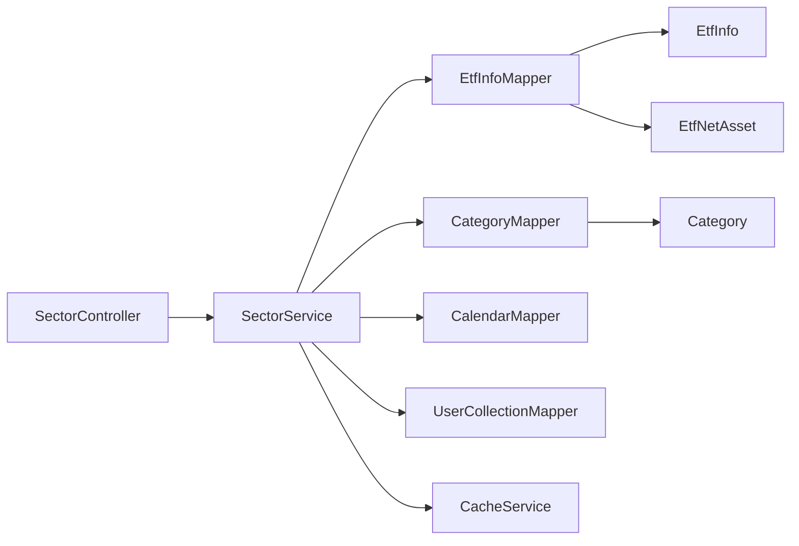

# ETF信息实体模型

<cite>
**本文档引用的文件**
- [EtfInfo.java](file://backend/src/main/java/com/freetrader/entity/EtfInfo.java)
- [EtfNetAsset.java](file://backend/src/main/java/com/freetrader/entity/EtfNetAsset.java)
- [Category.java](file://backend/src/main/java/com/freetrader/entity/Category.java)
- [EtfInfoMapper.java](file://backend/src/main/java/com/freetrader/mapper/EtfInfoMapper.java)
- [SectorService.java](file://backend/src/main/java/com/freetrader/service/SectorService.java)
- [SectorController.java](file://backend/src/main/java/com/freetrader/controller/SectorController.java)
- [EtfDTO.java](file://backend/src/main/java/com/freetrader/dto/EtfDTO.java)
- [etf_info.sql](file://sql/etf_info.sql)
- [etf_netasset.sql](file://sql/etf_netasset.sql)
- [application.yml](file://backend/src/main/resources/application.yml)
</cite>

## 目录
1. [引言](#引言)
2. [项目结构概述](#项目结构概述)
3. [核心实体模型](#核心实体模型)
4. [架构概览](#架构概览)
5. [详细组件分析](#详细组件分析)
6. [依赖关系分析](#依赖关系分析)
7. [性能考虑](#性能考虑)
8. [故障排除指南](#故障排除指南)
9. [结论](#结论)

## 引言

本文档为ETF信息实体(EtfInfo)创建了全面的数据模型文档。该系统是一个基于Spring Boot的ETF数据管理系统，提供了ETF基本信息管理、净值数据查询、板块分类统计等功能。本文档深入解释了ETF信息实体的字段定义、金融数据含义、业务规则和数据验证要求，并展示了ETF实体与板块实体、净值实体的关联关系和数据流转过程。

## 项目结构概述

FreeTrader项目采用标准的分层架构设计，主要包含以下层次：

**图表来源**
- [SectorController.java](file://backend/src/main/java/com/freetrader/controller/SectorController.java#L22-L63)
- [SectorService.java](file://backend/src/main/java/com/freetrader/service/SectorService.java#L30-L253)

**章节来源**
- [SectorController.java](file://backend/src/main/java/com/freetrader/controller/SectorController.java#L1-L63)
- [SectorService.java](file://backend/src/main/java/com/freetrader/service/SectorService.java#L1-L253)

## 核心实体模型

### ETF信息实体(EtfInfo)

ETF信息实体是系统的核心数据模型，用于存储ETF的基本信息。该实体通过MyBatis-Plus注解映射到数据库表。

**图表来源**
- [EtfInfo.java](file://backend/src/main/java/com/freetrader/entity/EtfInfo.java#L11-L23)
- [EtfNetAsset.java](file://backend/src/main/java/com/freetrader/entity/EtfNetAsset.java#L10-L25)
- [Category.java](file://backend/src/main/java/com/freetrader/entity/Category.java#L13-L44)

### 数据库表结构

ETF信息表(etf_info)和ETF净值表(etf_netasset)的完整结构如下：

| 表名 | 字段名 | 类型 | 约束 | 描述 |
|------|--------|------|------|------|
| etf_info | ths_code | varchar(32) | PK | ETF代码(Thomson Reuters代码) |
| etf_info | chinese_name | varchar(64) | NULL | 中文名称 |
| etf_info | start_day | date | NULL | 成立日期 |
| etf_info | end_day | date | NULL | 终止日期 |
| etf_info | sector | varchar(32) | NULL | 所属板块 |
| etf_netasset | ths_code | varchar(32) | PK, FK | ETF代码 |
| etf_netasset | time | date | PK | 日期 |
| etf_netasset | net_asset_value | float | NULL | 单位净值 |
| etf_netasset | adjusted_nav | float | NULL | 复权单位净值 |
| etf_netasset | accumulated_nav | float | NULL | 累计单位净值 |
| etf_netasset | premium | float | NULL | 贴水 |
| etf_netasset | premium_ratio | float | NULL | 贴水率 |

**章节来源**
- [etf_info.sql](file://sql/etf_info.sql#L24-L33)
- [etf_netasset.sql](file://sql/etf_netasset.sql#L24-L34)

## 架构概览

系统采用分层架构，实现了清晰的关注点分离：

**图表来源**
- [SectorController.java](file://backend/src/main/java/com/freetrader/controller/SectorController.java#L55-L61)
- [SectorService.java](file://backend/src/main/java/com/freetrader/service/SectorService.java#L170-L212)
- [EtfInfoMapper.java](file://backend/src/main/java/com/freetrader/mapper/EtfInfoMapper.java#L18-L51)

**章节来源**
- [SectorController.java](file://backend/src/main/java/com/freetrader/controller/SectorController.java#L1-L63)
- [SectorService.java](file://backend/src/main/java/com/freetrader/service/SectorService.java#L1-L253)

## 详细组件分析

### ETF信息实体字段详解

#### 标识字段设计

**ths_code (ETF代码)**
- 数据类型: String (varchar(32))
- 主键约束: 是
- 唯一性: 是
- 设计考量: 采用Thomson Reuters标准代码，确保全球唯一性和标准化
- 业务含义: ETF的国际标准代码标识符

**chinese_name (中文名称)**
- 数据类型: String (varchar(64))
- 约束: NULL
- 设计考量: 支持可选的中文显示名称
- 业务含义: ETF的中文全称，便于国内用户识别

#### 基本属性字段

**start_day (成立日期)**
- 数据类型: LocalDate
- 约束: NULL
- 设计考量: 可能为空表示未知或特殊状态
- 业务含义: ETF产品正式运作的起始日期

**end_day (终止日期)**
- 数据类型: LocalDate
- 约束: NULL
- 设计考量: 支持ETF到期或终止的情况
- 业务含义: ETF产品生命周期结束的日期

**sector (所属板块)**
- 数据类型: String (varchar(32))
- 约束: NULL
- 设计考量: 与category表建立外键关系
- 业务含义: ETF所属的行业板块分类

#### 业务规则和数据验证

1. **唯一性约束**: ths_code必须唯一，确保每个ETF的全球唯一标识
2. **板块关联**: sector字段与category表的name字段关联，实现板块分类管理
3. **日期有效性**: start_day应早于或等于end_day，如果end_day不为空
4. **字符长度限制**: 代码长度不超过32字符，中文名称不超过64字符

**章节来源**
- [EtfInfo.java](file://backend/src/main/java/com/freetrader/entity/EtfInfo.java#L13-L22)
- [etf_info.sql](file://sql/etf_info.sql#L25-L29)

### ETF净值实体字段详解

ETF净值实体存储ETF的历史净值数据，支持复权计算和贴水分析：

| 字段名 | 类型 | 约束 | 描述 | 业务含义 |
|--------|------|------|------|----------|
| thsCode | String | PK, FK | ETF代码 | 关联ETF信息 |
| time | LocalDate | PK | 日期 | 净值记录的时间点 |
| netAssetValue | Float | NULL | 单位净值 | 基础净值数据 |
| adjustedNav | Float | NULL | 复权单位净值 | 考虑分红再投资后的净值 |
| accumulatedNav | Float | NULL | 累计单位净值 | 自成立以来的累计收益 |
| premium | Float | NULL | 贴水 | 二级市场价格与净值的差额 |
| premiumRatio | Float | NULL | 贴水率 | 贴水占净值的百分比 |

**章节来源**
- [EtfNetAsset.java](file://backend/src/main/java/com/freetrader/entity/EtfNetAsset.java#L12-L24)
- [etf_netasset.sql](file://sql/etf_netasset.sql#L27-L31)

### ETF DTO模型

ETF DTO用于API响应传输，包含计算后的展示数据：

**图表来源**
- [EtfDTO.java](file://backend/src/main/java/com/freetrader/dto/EtfDTO.java#L10-L22)

**章节来源**
- [EtfDTO.java](file://backend/src/main/java/com/freetrader/dto/EtfDTO.java#L1-L23)

### 数据流转流程

ETF数据在系统中的流转过程如下：

**图表来源**
- [etf_info.sql](file://sql/etf_info.sql#L38-L105)
- [EtfInfoMapper.java](file://backend/src/main/java/com/freetrader/mapper/EtfInfoMapper.java#L18-L51)
- [SectorService.java](file://backend/src/main/java/com/freetrader/service/SectorService.java#L217-L234)

**章节来源**
- [etf_info.sql](file://sql/etf_info.sql#L36-L105)
- [EtfInfoMapper.java](file://backend/src/main/java/com/freetrader/mapper/EtfInfoMapper.java#L15-L51)

## 依赖关系分析

### 实体间关系图

**图表来源**
- [EtfInfo.java](file://backend/src/main/java/com/freetrader/entity/EtfInfo.java#L13-L22)
- [EtfNetAsset.java](file://backend/src/main/java/com/freetrader/entity/EtfNetAsset.java#L12-L18)
- [Category.java](file://backend/src/main/java/com/freetrader/entity/Category.java#L15-L18)

### 服务层依赖关系

**图表来源**
- [SectorController.java](file://backend/src/main/java/com/freetrader/controller/SectorController.java#L28-L29)
- [SectorService.java](file://backend/src/main/java/com/freetrader/service/SectorService.java#L32-L36)

**章节来源**
- [SectorService.java](file://backend/src/main/java/com/freetrader/service/SectorService.java#L30-L36)

## 性能考虑

### 缓存策略

系统实现了多层次的缓存机制来优化性能：

1. **Redis缓存**: 使用Redis作为分布式缓存，配置TTL为5分钟
2. **方法级缓存**: 使用`@Cacheable`注解缓存板块基础数据和详情
3. **用户收藏缓存**: 专门缓存用户的收藏板块ID，减少数据库查询

### 查询优化

1. **索引设计**: 
   - etf_info表: 主键(thm_code)，索引(idx_etf_id, idx_etf_category)
   - etf_netasset表: 复合主键(thm_code, time)，索引(idx_etf_time)

2. **SQL优化**: 
   - 使用LEFT JOIN连接净值表，避免数据丢失
   - 使用COALESCE函数处理NULL值
   - 使用LIMIT限制返回结果数量

### 配置参数

系统通过配置文件提供灵活的性能调优参数：

| 参数名 | 默认值 | 描述 |
|--------|--------|------|
| app.trading-days | 7 | 默认交易日天数 |
| app.top-funds | 10 | 板块详情中显示的ETF数量 |
| app.sector.estimated-cap-multiplier | 50 | 市值估算倍数 |
| app.sector.base-price | 1000.0 | 板块基础价格 |
| spring.cache.redis.time-to-live | 300000 | 缓存过期时间(毫秒) |

**章节来源**
- [application.yml](file://backend/src/main/resources/application.yml#L68-L75)
- [application.yml](file://backend/src/main/resources/application.yml#L40-L44)

## 故障排除指南

### 常见问题及解决方案

1. **板块不存在错误**
   - 错误码: SECTOR_NOT_FOUND
   - 解决方案: 验证板块ID的有效性，检查category表数据完整性

2. **ETF数据缺失**
   - 现象: ETF净值数据为空
   - 原因: 数据导入延迟或ETL流程异常
   - 解决方案: 检查etf_netasset表数据，确认交易日历

3. **缓存失效问题**
   - 现象: 缓存数据陈旧
   - 解决方案: 检查Redis连接配置，调整缓存TTL参数

### 监控指标

1. **数据库性能**: 监控SQL执行时间和慢查询
2. **缓存命中率**: 监控Redis缓存命中情况
3. **API响应时间**: 监控关键接口的响应性能

**章节来源**
- [SectorService.java](file://backend/src/main/java/com/freetrader/service/SectorService.java#L175-L178)

## 结论

ETF信息实体模型设计合理，实现了以下目标：

1. **数据完整性**: 通过严格的约束和触发器确保数据一致性
2. **扩展性**: 支持ETF基本信息、净值数据、板块分类的统一管理
3. **性能优化**: 多层次缓存和索引设计提升查询性能
4. **业务灵活性**: 支持不同的交易日计算周期和展示配置

该模型为ETF数据管理提供了坚实的基础，支持复杂的金融数据分析和展示需求。通过合理的架构设计和性能优化，能够满足大规模ETF数据的实时查询和分析需求。